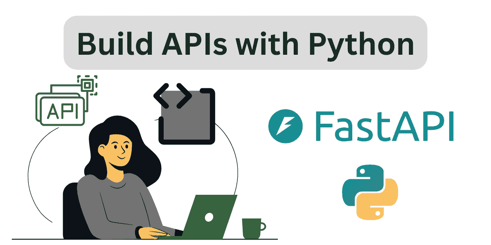
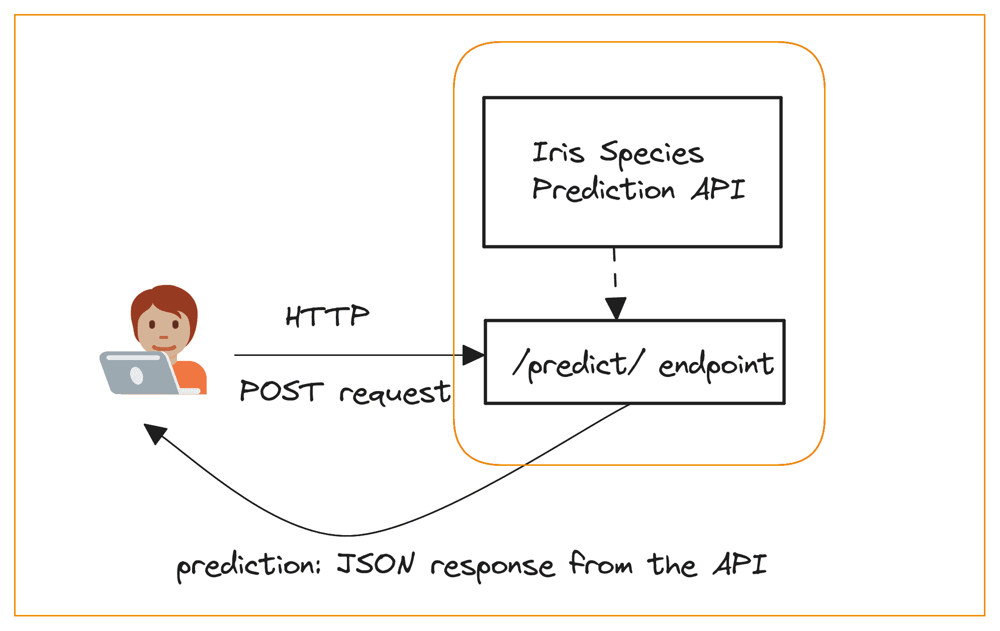
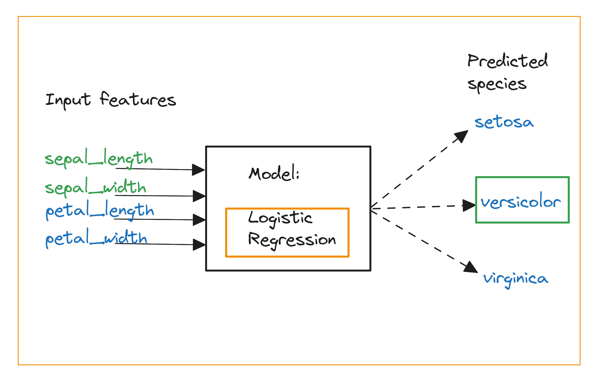
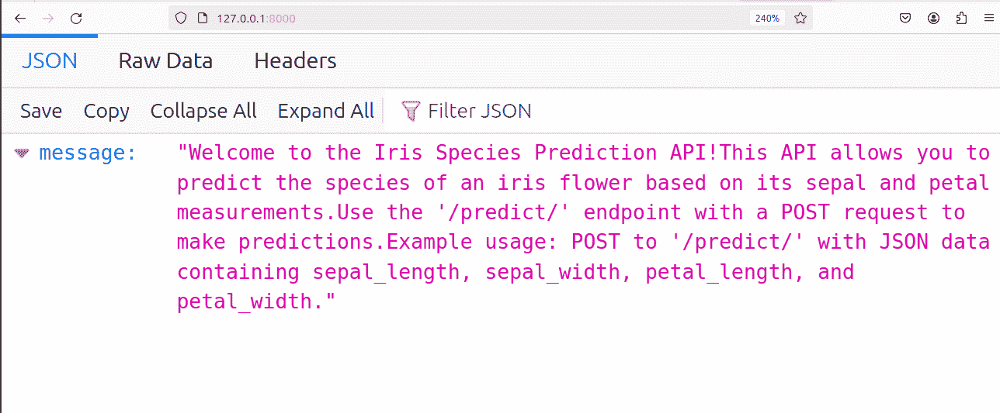

# FastAPI 教程：用 Python 在几分钟内构建 API

> 原文：[`www.kdnuggets.com/fastapi-tutorial-build-apis-with-python-in-minutes`](https://www.kdnuggets.com/fastapi-tutorial-build-apis-with-python-in-minutes)



图片来源：作者

FastAPI 是一个流行的用于构建 Python API 的 Web 框架。它非常简单易学，并受到开发者的喜爱。

* * *

## 我们的前三大课程推荐

 1\. [谷歌网络安全证书](https://www.kdnuggets.com/google-cybersecurity) - 快速开启网络安全职业生涯

 2\. [谷歌数据分析专业证书](https://www.kdnuggets.com/google-data-analytics) - 提升你的数据分析技能

 3\. [谷歌 IT 支持专业证书](https://www.kdnuggets.com/google-itsupport) - 支持你的组织的 IT 工作

* * *

FastAPI 利用了 Python 的类型提示，并基于 Pydantic。这使得定义数据模型和请求/响应模式变得简单。框架会自动根据这些模式验证请求数据，从而减少潜在错误。它还原生支持异步端点，使得构建能够高效处理 I/O 绑定操作的高性能 API 更为简便。

本教程将教你如何使用 FastAPI 构建你的第一个 API。从设置开发环境到为一个简单的机器学习应用构建 API，本教程将带你完成所有步骤：定义数据模型、API 端点、处理请求等。通过本教程，你将对如何使用 FastAPI 快速高效地构建 API 有一个良好的理解。那么，让我们开始吧。

## 第一步：设置环境

FastAPI 需要 Python 3.7 或更高版本。所以请确保你安装了最新版本的 Python。在项目目录中，创建并激活一个专门的虚拟环境：

```py
$ python3 -m venv v1
$ source v1/bin/activate 
```

上述激活虚拟环境的命令适用于 Linux 或 MacOS。如果你是 Windows 用户，[查看文档](https://docs.python.org/3/library/venv.html)来创建和激活虚拟环境。

接下来，安装所需的包。你可以使用 pip 安装 FastAPI 和 uvicorn：

```py
$ pip3 install fastapi uvicorn 
```

这将安装 FastAPI 及所有必需的依赖项以及 uvicorn，这是一种我们将用来运行和测试构建的 API 的服务器。由于我们将使用 scikit-learn 构建一个简单的机器学习模型，也请在你的项目环境中安装它：

```py
$ pip3 install scikit-learn
```

安装完成后，我们可以开始编码了！你可以在[GitHub](https://github.com/balapriyac/data-science-tutorials/tree/main/fastapi)上找到代码。

## 第 2 步：创建一个 FastAPI 应用

在项目目录中创建一个 main.py 文件。第一步是像下面这样创建一个 FastAPI 应用实例：

```py
# Create a FastAPI app
# Root endpoint returns the app description

from fastapi import FastAPI

app = FastAPI() 
```

Iris 数据集是你在开始数据科学时使用的玩具数据集之一。它包含 150 条数据记录，4 个特征和一个目标标签（鸢尾花的种类）。为了简单起见，让我们创建一个 API 来预测鸢尾花的种类。

在接下来的步骤中，我们将构建一个逻辑回归模型并创建一个用于预测的 API 端点。完成模型构建和`/predict/` API 端点定义后，你应该能够向 API 发送包含输入特征的 POST 请求，并接收到预测的种类作为响应。



Iris 预测 API | 作者提供的图片

为了更有帮助，我们还定义一个根端点，它返回我们正在构建的应用的描述。为此，我们定义`get_app_description`函数，并使用`@app`装饰器创建根端点，如下所示：

```py
# Define a function to return a description of the app
def get_app_description():
	return (
    	"Welcome to the Iris Species Prediction API!"
    	"This API allows you to predict the species of an iris flower based on its sepal and petal measurements."
    	"Use the '/predict/' endpoint with a POST request to make predictions."
    	"Example usage: POST to '/predict/' with JSON data containing sepal_length, sepal_width, petal_length, and petal_width."
	)

# Define the root endpoint to return the app description
@app.get("/")
async def root():
	return {"message": get_app_description()} 
```

向根端点发送 GET 请求会返回描述信息。

## 第 3 步：构建逻辑回归分类器

到目前为止，我们已经实例化了一个 FastAPI 应用，并定义了根端点。现在是时候进行以下操作：

+   构建一个机器学习模型。我们将使用逻辑回归分类器。如果你想了解更多关于逻辑回归的知识，请阅读[《构建预测模型：Python 中的逻辑回归》](https://www.kdnuggets.com/building-predictive-models-logistic-regression-in-python)。

+   定义一个预测函数，该函数接收输入特征，并使用机器学习模型来预测种类（setosa、versicolor 或 virginica）。



逻辑回归分类器 | 作者提供的图片

我们从 scikit-learn 中构建了一个简单的逻辑回归分类器，并定义了如图所示的`predict_species`函数：

```py
# Build a logistic regression classifier
from sklearn.datasets import load_iris
from sklearn.linear_model import LogisticRegression

# Load the Iris dataset
iris = load_iris()
X, y = iris.data, iris.target

# Train a logistic regression model
model = LogisticRegression()
model.fit(X, y)

# Define a function to predict the species
def predict_species(sepal_length, sepal_width, petal_length, petal_width):
	features = [[sepal_length, sepal_width, petal_length, petal_width]]
	prediction = model.predict(features)
	return iris.target_names[prediction[0]] 
```

## 第 4 步：定义 Pydantic 模型以输入数据

接下来，我们应该对 POST 请求中发送的数据进行建模。这里的输入特征是花萼和花瓣的长度及宽度——都是浮点值。为了建模，我们创建了一个继承自 Pydantic `BaseModel`类的`IrisData`类，如下所示：

```py
# Define the Pydantic model for your input data
from pydantic import BaseModel

class IrisData(BaseModel):
	sepal_length: float
	sepal_width: float
	petal_length: float
	petal_width: float 
```

如果你需要一个关于使用 Pydantic 进行数据建模和验证的快速教程，请阅读[《Pydantic 教程：Python 中的数据验证变得超级简单》](https://www.kdnuggets.com/pydantic-tutorial-data-validation-in-python-made-simple)。

## 第 5 步：创建 API 端点

现在我们已经构建了分类器，并定义好了`predict_species`函数，我们可以为预测创建 API 端点。如前所述，我们可以使用`@app`装饰器来定义接受 POST 请求并返回预测种类的`/predict/`端点：

```py
# Create API endpoint
@app.post("/predict/")
async def predict_species_api(iris_data: IrisData):
	species = predict_species(iris_data.sepal_length, iris_data.sepal_width, iris_data.petal_length, iris_data.petal_width)
	return {"species": species} 
```

现在是运行应用的时候了！

## 第 6 步：运行应用

你可以使用以下命令运行应用：

```py
$ uvicorn main:app --reload
```

这里`main`是模块的名称，`app`是 FastAPI 实例。`--reload`标志确保如果源代码有任何更改，应用会重新加载。

运行命令后，你应该会看到类似的 INFO 消息：

```py
INFO: 	Will watch for changes in these directories: ['/home/balapriya/fastapi-tutorial']
INFO: 	Uvicorn running on http://127.0.0.1:8000 (Press CTRL+C to quit)
INFO: 	Started reloader process [11243] using WatchFiles
INFO: 	Started server process [11245]
INFO: 	Waiting for application startup.
INFO: 	Application startup complete.
…
… 
```

如果你访问“http://127.0.0.1:8000”（本地主机），你应该能看到应用程序描述：



应用程序运行在本地主机

## 步骤 7：测试 API

现在，你可以向 `/predict/` 端点发送 POST 请求，提供有效的萼片和花瓣测量值，并获取预测的物种。你可以使用类似 cURL 的命令行工具。以下是一个示例：

```py
curl -X 'POST' \
  'http://localhost:8000/predict/' \
  -H 'Content-Type: application/json' \
  -d '{
  "sepal_length": 5.1,
  "sepal_width": 3.5,
  "petal_length": 1.4,
  "petal_width": 0.2
}' 
```

对于此示例请求，预期的输出是：

```py
{"species":"setosa"}
```

## 总结

在本教程中，我们详细讲解了如何使用 FastAPI 构建一个简单分类模型的 API。我们涵盖了请求中使用的输入数据建模、定义 API 端点、运行应用程序以及查询 API 的步骤。

作为练习，拿一个现有的机器学习模型，并使用 FastAPI 在其上构建一个 API。祝编程愉快！

**[](https://twitter.com/balawc27)**[Bala Priya C](https://www.kdnuggets.com/wp-content/uploads/bala-priya-author-image-update-230821.jpg)**** 是来自印度的开发者和技术作家。她喜欢在数学、编程、数据科学和内容创作的交叉点工作。她的兴趣和专长领域包括 DevOps、数据科学和自然语言处理。她喜欢阅读、写作、编程和咖啡！目前，她正致力于通过编写教程、操作指南、评论文章等来学习并与开发者社区分享知识。Bala 还创建了引人入胜的资源概述和编码教程。

### 更多相关主题

+   [在 5 分钟内使用 Python 构建网页抓取器](https://www.kdnuggets.com/2022/02/build-web-scraper-python-5-minutes.html)

+   [在 5 分钟内使用 Python 构建文本转语音转换器](https://www.kdnuggets.com/2022/09/build-texttospeech-converter-python-5-minutes.html)

+   [在 5 分钟内构建机器学习网页应用](https://www.kdnuggets.com/2022/03/build-machine-learning-web-app-5-minutes.html)

+   [使用 Hugging Face 和 Gradio 在 5 分钟内构建 AI 聊天机器人](https://www.kdnuggets.com/2023/06/build-ai-chatbot-5-minutes-hugging-face-gradio.html)

+   [KDnuggets 新闻 2022 年 3 月 9 日：5 分钟内构建机器学习网页应用](https://www.kdnuggets.com/2022/n10.html)

+   [OpenAI 的新 ChatGPT 和 Whisper API](https://www.kdnuggets.com/2023/03/new-chatgpt-whisper-apis-openai.html)
