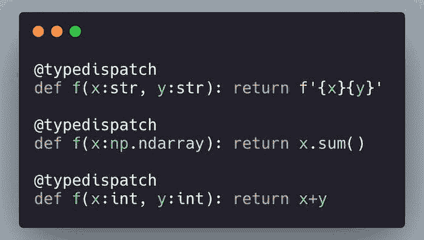

# fastcore: 一款被低估的 Python 库

> 原文：[`www.kdnuggets.com/2020/10/fastcore-underrated-python-library.html`](https://www.kdnuggets.com/2020/10/fastcore-underrated-python-library.html)

评论

**由 [Hamel Husain](https://hamel.dev/) 撰写，GitHub 的首席机器学习工程师**



* * *

## 我们的前三个课程推荐

 1\. [Google 网络安全证书](https://www.kdnuggets.com/google-cybersecurity) - 快速进入网络安全职业生涯。

 2\. [Google 数据分析专业证书](https://www.kdnuggets.com/google-data-analytics) - 提升你的数据分析技能

 3\. [Google IT 支持专业证书](https://www.kdnuggets.com/google-itsupport) - 支持你所在组织的 IT

* * *

### 背景

*最近我开始了一段提高 Python 技能的旅程：我想学习高级模式、习语和技术。我从阅读关于高级 Python 的书籍开始，但信息似乎没有在没有实际应用的情况下记住。我还希望在学习过程中能够向专家提问——这是一个很难找到的安排！这时我想到：如果我能找到一个有相当先进 Python 代码的开源项目，并为其编写文档和测试，会怎么样？我打赌这样做会迫使我深入学习所有内容，而且维护者会欣赏我的工作，并愿意回答我的问题。*

*这正是我在过去一个月所做的！我很高兴地报告，这已经成为我经历过的最有效的学习体验。我发现编写文档迫使我不仅深入理解代码的功能，还要理解 *代码为何以这种方式工作的*，以及在编写测试时探索边界情况。最重要的是，当我遇到困难时，我能够提问，维护者愿意花额外的时间，因为他们知道他们的指导服务于使他们的代码更易于访问！事实证明，我选择的库，[fastcore](https://fastcore.fast.ai/) 是我遇到过的一些最迷人的 Python 代码，因为它的目的和目标非常独特。*

对于新手，[fastcore](https://fastcore.fast.ai/) 是一个许多 [fast.ai](https://github.com/fastai) 项目构建在其上的库。最重要的是，[fastcore](https://fastcore.fast.ai/) 扩展了 Python 编程语言，致力于消除样板代码并为常见任务添加有用功能。在这篇博客文章中，我将重点介绍 fastcore 提供的一些我最喜欢的工具，而不是分享我对 Python 的学习。我的目标是引起你对这个库的兴趣，并希望激励你在完成阅读后查看文档以了解更多！

### 为什么 fastcore 很有趣

*1.  **在不离开 Python 的情况下接触其他语言的思想：** 我一直听说学习其他语言对成为更好的程序员有好处。从实用的角度来看，我发现很难学习其他语言，因为我在工作中无法使用它们。fastcore 扩展了 Python，包含了如 Julia、Ruby 和 Haskell 等语言中的模式。现在我理解了这些工具，我有动力去学习其他语言。*

1.  **你获得了一套新的实用工具**：fastcore 包含了可以帮助你编写更简洁且富有表现力的代码的工具，或许还能解决新的问题。

1.  **了解更多关于 Python 编程语言的信息：** 由于 fastcore 扩展了 Python 编程语言，过程中会暴露出许多高级概念。对有动力的人来说，这是一个了解 Python 内部工作原理的好方法。

### 对 fastcore 进行快速浏览

*这里有一些使用 fastcore 立即引起我注意的功能。*

### 使 **kwargs 透明

*每当我看到一个函数有参数****kwargs**时，我都会有些不安。这是因为这意味着 API 是模糊的，我必须阅读源代码才能弄清楚有效的参数是什么。请看下面的例子：*

```py
def baz(a, b=2, c =3, d=4): return a + b + c

def foo(c, a, **kwargs):
    return c + baz(a, **kwargs)

inspect.signature(foo) 
```

```py
<Signature (c, a, **kwargs)>
```

如果不读源代码，我可能很难知道 `foo` 还接受额外的参数 `b` 和 `d`。我们可以通过 `delegates` 来解决这个问题：

```py
def baz(a, b=2, c =3, d=4): return a + b + c

@delegates(baz) # this decorator will pass down keyword arguments from baz
def foo(c, a, **kwargs):
    return c + baz(a, **kwargs)

inspect.signature(foo) 
```

```py
<Signature (c, a, b=2, d=4)>
```

你可以自定义这个装饰器的行为。例如，你可以在传递参数的同时保留 `**kwargs`，从而实现双赢：

```py
@delegates(baz, keep=True)
def foo(c, a, **kwargs):
    return c + baz(a, **kwargs)

inspect.signature(foo) 
```

```py
<Signature (c, a, b=2, d=4, **kwargs)>
```

你也可以排除参数。例如，我们从委托中排除参数 `d`：

```py
def basefoo(a, b=2, c =3, d=4): pass

@delegates(basefoo, but= ['d']) # exclude `d`
def foo(c, a, **kwargs): pass

inspect.signature(foo) 
```

```py
<Signature (c, a, b=2)>
```

你也可以在类之间委托：

```py
class BaseFoo:
    def __init__(self, e, c=2): pass

@delegates()# since no argument was passsed here we delegate to the superclass
class Foo(BaseFoo):
    def __init__(self, a, b=1, **kwargs): super().__init__(**kwargs)

inspect.signature(Foo) 
```

```py
<Signature (a, b=1, c=2)>
```

欲了解更多信息，请阅读[委托文档](https://fastcore.fast.ai/foundation.html#delegates)。

### 避免在设置实例属性时出现样板代码

*你是否曾经想过是否可以避免在`__init__`中设置属性时的样板代码？*

```py
class Test:
    def __init__(self, a, b ,c): 
        self.a, self.b, self.c = a, b, c 
```

哎呀！这真是痛苦。看看所有重复的变量名。当定义类时，我真的需要这样重复吗？不再需要了！请查看[store_attr](https://fastcore.fast.ai/utils.html#store_attr)：

```py
class Test:
    def __init__(self, a, b, c): 
        store_attr()

t = Test(5,4,3)
assert t.b == 4 
```

你也可以排除某些属性：

```py
class Test:
    def __init__(self, a, b, c): 
        store_attr(but=['c'])

t = Test(5,4,3)
assert t.b == 4
assert not hasattr(t, 'c') 
```

还有很多其他方法可以自定义和使用`store_attr`，比我在这里提到的要多。查看[文档](https://fastcore.fast.ai/utils.html#store_attr)以获取更多细节。

附言：你可能会认为 Python 的[数据类](https://docs.python.org/3/library/dataclasses.html)也可以避免这种样板代码。虽然在某些情况下是这样，但`store_attr`更为灵活。^([1](https://fastpages.fast.ai/fastcore/#fn-1))

1. 例如，store_attr 不依赖于继承，这意味着你在使用自己的类时不会被多重继承困住。此外，与数据类不同，store_attr 不要求 Python 3.7 或更高版本。此外，你可以在对象生命周期中的任何时间点和类中的任何位置使用 store_attr，以自定义变量存储的行为和时机。[↩](https://fastpages.fast.ai/fastcore/#fnref-1)

### 避免子类化样板代码

*我讨厌 Python 中与子类化相关的`__super__().__init__()`样板代码。例如：

```py
class ParentClass:
    def __init__(self): self.some_attr = 'hello'

class ChildClass(ParentClass):
    def __init__(self):
        super().__init__()

cc = ChildClass()
assert cc.some_attr == 'hello' # only accessible b/c you used super 
```

我们可以通过使用元类[PrePostInitMeta](https://fastcore.fast.ai/foundation.html#PrePostInitMeta)来避免这种样板代码。我们定义了一个名为`NewParent`的新类，它是`ParentClass`的一个包装器：

```py
class NewParent(ParentClass, metaclass=PrePostInitMeta):
    def __pre_init__(self, *args, **kwargs): super().__init__()

class ChildClass(NewParent):
    def __init__(self):pass

sc = ChildClass()
assert sc.some_attr == 'hello' 
```

### 类型调度

*类型调度，或[多重调度](https://en.wikipedia.org/wiki/Multiple_dispatch#Julia)，允许你根据接收到的输入类型改变函数的行为。这是一些编程语言（如 Julia）的一个突出特性。例如，这是一个[概念示例](https://en.wikipedia.org/wiki/Multiple_dispatch#Julia)，展示了多重调度在 Julia 中的工作原理，根据 x 和 y 的输入类型返回不同的值：

```py
collide_with(x::Asteroid, y::Asteroid) = ... 
# deal with asteroid hitting asteroid

collide_with(x::Asteroid, y::Spaceship) = ... 
# deal with asteroid hitting spaceship

collide_with(x::Spaceship, y::Asteroid) = ... 
# deal with spaceship hitting asteroid

collide_with(x::Spaceship, y::Spaceship) = ... 
# deal with spaceship hitting spaceship 
```

类型调度在数据科学中尤其有用，你可以允许不同的输入类型（即 Numpy 数组和 Pandas 数据帧）传递给处理数据的函数。类型调度允许你为执行类似任务的函数提供一个通用 API。

不幸的是，Python 默认不支持这一功能。幸运的是，有[@typedispatch](https://fastcore.fast.ai/dispatch.html#typedispatch-Decorator)装饰器可以帮助解决这个问题。这个装饰器依赖于类型提示来将输入路由到正确的函数版本：

```py
@typedispatch
def f(x:str, y:str): return f'{x}{y}'

@typedispatch
def f(x:np.ndarray): return x.sum()

@typedispatch
def f(x:int, y:int): return x+y 
```

下面是一个演示函数`f`的类型调度的示例：

```py
f('Hello ', 'World!') 
```

```py
'Hello World!'
```

```py
f(2,3) 
```

```py
5
```

```py
f(np.array([5,5,5,5])) 
```

```py
20
```

这个功能有一些限制，还有其他使用这种功能的方法，[你可以在这里阅读](https://fastcore.fast.ai/dispatch.html)。在学习类型调度的过程中，我还发现了一个名为[multipledispatch](https://github.com/mrocklin/multipledispatch)的 Python 库，由[Mathhew Rocklin](https://github.com/mrocklin)（Dask 的创建者）制作。

在使用这个功能后，我现在有动力学习像 Julia 这样的语言，以发现我可能错过了哪些其他范式。

### functools.partial 的更好版本

*`functools.partial` 是一个很棒的工具，它通过创建其他函数的函数来设置默认值。以这个过滤列表只包含值 >= `val` 的函数为例：*

```py
test_input = [1,2,3,4,5,6]
def f(arr, val): 
    "Filter a list to remove any values that are less than val."
    return [x for x in arr if x >= val]

f(test_input, 3) 
```

```py
[3, 4, 5, 6]
```

你可以使用 `partial` 创建一个新函数，将默认值设置为 5：

```py
filter5 = partial(f, val=5)
filter5(test_input) 
```

```py
[5, 6]
```

`partial` 的一个问题是它会删除原始文档字符串并用通用文档字符串替换：

```py
filter5.__doc__ 
```

```py
'partial(func, *args, **keywords) - new function with partial application\n    of the given arguments and keywords.\n'
```

[fastcore.utils.partialler](https://fastcore.fast.ai/utils.html#partialler) 解决了这个问题，并确保文档字符串被保留，使得新的 API 透明：

```py
filter5 = partialler(f, val=5)
filter5.__doc__ 
```

```py
'Filter a list to remove any values that are less than val.'
```

### 函数的组合

*在函数式编程语言中，广泛使用的一种技术是函数组合，通过将一系列函数链在一起以实现某种结果。这在应用各种数据转换时特别有用。考虑一个玩具示例，其中我有三个函数：（1）移除列表中小于 5 的元素（来自之前的部分）（2）将 2 添加到每个数字（3）将所有数字相加：*

```py
def add(arr, val): return [x + val for x in arr]
def arrsum(arr): return sum(arr)

# See the previous section on partialler
add2 = partialler(add, val=2)

transform = compose(filter5, add2, arrsum)
transform([1,2,3,4,5,6]) 
```

```py
15
```

但这为什么有用？你可能会想，我可以用以下方式实现相同的功能：

```py
arrsum(add2(filter5([1,2,3,4,5,6]))) 
```

你没有错！然而，组合为你提供了一个方便的接口，以防你想做以下事情：

```py
def fit(x, transforms:list):
    "fit a model after performing transformations"
    x = compose(*transforms)(x)
    y = [np.mean(x)] * len(x) # its a dumb model.  Don't judge me
    return y

# filters out elements < 5, adds 2, then predicts the mean
fit(x=[1,2,3,4,5,6], transforms=[filter5, add2]) 
```

```py
[7.5, 7.5]
```

欲了解更多关于 `compose` 的信息，请阅读 [文档](https://fastcore.fast.ai/utils.html#compose)。

### 更有用的 `__repr__`

*在 python 中，`__repr__` 帮助你获取有关对象的信息以进行日志记录和调试。以下是当你定义一个新类时默认得到的内容。（注意：我们使用了之前讨论过的`store_attr`）*

```py
class Test:
    def __init__(self, a, b=2, c=3): store_attr() # `store_attr` was discussed previously

Test(1) 
```

```py
<__main__.Test at 0x7ffcd766cee0>
```

我们可以使用 [basic_repr](https://fastcore.fast.ai/utils.html#basic_repr) 快速提供一个更合理的默认值：

```py
class Test:
    def __init__(self, a, b=2, c=3): store_attr() 
    __repr__ = basic_repr('a,b,c')

Test(2) 
```

```py
Test(a=2, b=2, c=3)
```

### 使用装饰器的猴子补丁

*使用装饰器进行[猴子补丁](https://www.geeksforgeeks.org/monkey-patching-in-python-dynamic-behavior/)是很方便的，尤其是在你想修补你导入的外部库时。我们可以使用来自`fastcore.foundation`的[装饰器 @patch](https://fastcore.fast.ai/foundation.html#patch)以及类型提示：*

```py
class MyClass(int): pass  

@patch
def func(self:MyClass, a): return self+a

mc = MyClass(3) 
```

现在，`MyClass` 有一个名为 `func` 的额外方法：

```py
mc.func(10) 
```

```py
13
```

还不信服吗？我将在下一节中向你展示这种修补的另一个例子。

### 更好的 pathlib.Path

*当你看到[pathlib.path](https://fastcore.fast.ai/utils.html#Extensions-to-Pathlib.Path)的[这些扩展](https://fastcore.fast.ai/utils.html#Extensions-to-Pathlib.Path)时，你不会再使用普通的 pathlib 了！pathlib 添加了许多额外的方法，例如：*

+   `Path.readlines`：等同于 `with open('somefile', 'r') as f: f.readlines()`

+   `Path.read`：等同于 `with open('somefile', 'r') as f: f.read()`

+   `Path.save`：将文件保存为 pickle

+   `Path.load`：加载 pickle 文件

+   `Path.ls`：以列表形式显示路径的内容。

+   等等。

[更多信息请阅读这里](https://fastcore.fast.ai/utils.html#Extensions-to-Pathlib.Path)。这是 `ls` 的演示：

```py
from fastcore.utils import *
from pathlib import Path
p = Path('.')
p.ls() # you don't get this with vanilla Pathlib.Path!! 
```

```py
(#7) [Path('2020-09-01-fastcore.ipynb'),Path('README.md'),Path('fastcore_imgs'),Path('2020-02-20-test.ipynb'),Path('.ipynb_checkpoints'),Path('2020-02-21-introducing-fastpages.ipynb'),Path('my_icons')]
```

等等！这到底是怎么回事？我们刚刚导入了`pathlib.Path` - 为什么我们会得到这个新功能？这是因为我们导入了`fastcore.utils`模块，该模块通过之前讨论的`@patch`装饰器修补了这个模块。为了说明`@patch`装饰器的用处，我现在将向`Path`添加另一个方法：

```py
@patch
def fun(self:Path): return "This is fun!"

p.fun() 
```

```py
'This is fun!'
```

这很神奇，对吧？我知道！这就是我写它的原因！

### 创建 lambda 的一种更简洁的方法

*`Self`，用大写 S，是创建调用对象方法的 lambda 的一种更简洁的方式。例如，让我们创建一个 lambda 来计算 Numpy 数组的和：*

```py
arr=np.array([5,4,3,2,1])
f = lambda a: a.sum()
assert f(arr) == 15 
```

你可以以相同的方式使用`Self`：

```py
f = Self.sum()
assert f(arr) == 15 
```

让我们创建一个 lambda 来进行 Pandas 数据框的分组和最大值计算：

```py
import pandas as pd
df=pd.DataFrame({'Some Column': ['a', 'a', 'b', 'b', ], 
                 'Another Column': [5, 7, 50, 70]})

f = Self.groupby('Some Column').mean()
f(df) 
```

|  | 另一列 |
| --- | --- |
| 一些列 |  |
| --- | --- |
| a | 6 |
| b | 60 |

阅读更多关于`Self`的内容，请查看[文档](https://fastcore.fast.ai/utils.html#Self-(with-an-uppercase-S))。

### 笔记本函数

*这些方法简单却实用，并允许你知道代码是否在 Jupyter Notebook、Colab 或 Ipython Shell 中执行：*

```py
from fastcore.imports import in_notebook, in_colab, in_ipython
in_notebook(), in_colab(), in_ipython() 
```

```py
(True, False, True)
```

如果你在代码中显示某些类型的可视化、进度条或动画，可能会根据环境修改或切换，这非常有用。

### 替代列表的完美选择

*你可能对 Python 的`list`很满意。这种情况有时候你并不知道自己需要更好的列表，直到有人向你展示了一个。介绍`L`，一个像列表的对象，具有许多额外的好处。*

我可以用`L` 来描述最好的方式就是假装`list`和`numpy`有一个漂亮的宝宝：

定义一个列表（查看显示列表长度的漂亮`__repr__`！）

```py
L(1,2,3) 
```

```py
(#3) [1,2,3]
```

打乱一个列表：

```py
p = L.range(20).shuffle()
p 
```

```py
(#20) [8,7,5,12,14,16,2,15,19,6...]
```

索引到一个列表：

```py
p[2,4,6] 
```

```py
(#3) [5,14,2]
```

`L` 有合理的默认值，例如向列表中添加一个元素：

```py
1 + L(2,3,4) 
```

```py
(#4) [1,2,3,4]
```

`L` 还有更多内容可供探索。阅读[文档](https://fastcore.fast.ai/foundation.html#Class-L-Methods)以了解更多。

### 但等等 … 还有更多！

**

我还想展示更多关于 fastcore 的内容，但这些内容不可能合理地适合一篇博客文章。以下是一些我在这篇博客中没有演示的最喜欢的东西：

### 工具

*[工具](https://fastcore.fast.ai/utils.html) 部分包含许多快捷方式，用于执行常见任务或提供额外的接口，超出标准 Python 提供的功能。*

+   [mk_class](https://fastcore.fast.ai/utils.html#mk_class)：快速向类添加一堆属性

+   [wrap_class](https://fastcore.fast.ai/utils.html#wrap_class)：使用简单的装饰器向类添加新方法

+   [groupby](https://fastcore.fast.ai/utils.html#groupby)：类似于 Scala 的 groupby

+   [merge](https://fastcore.fast.ai/utils.html#merge)：合并字典

+   [fasttuple](https://fastcore.fast.ai/utils.html#fastuple)：增强版元组

+   [Infinite Lists](https://fastcore.fast.ai/utils.html#Infinite-Lists)：用于填充和测试

+   [chunked](https://fastcore.fast.ai/utils.html#chunked)：用于批处理和组织事物

### 多进程

*[多进程部分](http://fastcore.fast.ai/utils.html#Multiprocessing) 通过提供如以下特性扩展了 Python 的多进程库：*

+   进度条

+   能够暂停以减轻与外部服务的竞争条件

+   在每个工作线程中批量处理事物，例如：如果你需要在块中执行一个向量化操作

### 函数式编程

*[函数式编程部分](http://fastcore.fast.ai/utils.html#Functions-on-Functions) 是我最喜欢的库部分。*

+   [maps](https://fastcore.fast.ai/utils.html#maps)：一个同时组合函数的映射

+   [mapped](https://fastcore.fast.ai/utils.html#mapped)：一个更强大的 `map`

+   [using_attr](https://fastcore.fast.ai/utils.html#using_attr)：组合一个操作属性的函数

### 转换

*[转换](https://fastcore.fast.ai/transform.html) 是一个用于创建数据转换及相关管道的工具集合。这些转换工具建立在本文讨论的许多构建块之上。*

### 进一步阅读

***需要注意的是，你应该先阅读 [文档主页](https://fastcore.fast.ai/) ，然后阅读 [测试](https://fastcore.fast.ai/) 部分，以便全面理解文档。**

+   [fastcore 文档网站](https://fastcore.fast.ai/)。

+   [fastcore GitHub 仓库](https://github.com/fastai/fastcore)。

+   关于 [委派](https://www.fast.ai/2019/08/06/delegation/) 的博文。

### 不好意思打广告：fastpages

*这篇博文完全是在 Jupyter Notebook 中编写的，GitHub 自动将其转换为博文！听起来有趣吗？ [查看 fastpages](https://github.com/fastai/fastpages)。*

**个人简介：[Hamel Husain](https://hamel.dev/)** 是 GitHub 的高级机器学习工程师。

[原创](https://fastpages.fast.ai/fastcore/)。经许可转载。

**相关：**

+   数据科学遇上 Devops：使用 Jupyter、Git 和 Kubernetes 的 MLOps

+   如何使用机器学习在 GitHub 上自动化任务以获取乐趣和利润

+   自动化机器学习——加速数据科学家生产力的范式转变

### 进一步阅读

+   [使用管道编写干净的 Python 代码](https://www.kdnuggets.com/2021/12/write-clean-python-code-pipes.html)

+   [建立一个强大的数据团队](https://www.kdnuggets.com/2021/12/build-solid-data-team.html)

+   [是什么让 Python 成为初创企业理想的编程语言](https://www.kdnuggets.com/2021/12/makes-python-ideal-programming-language-startups.html)

+   [每个数据科学家都应该知道的三个 R 库（即使你使用 Python）](https://www.kdnuggets.com/2021/12/three-r-libraries-every-data-scientist-know-even-python.html)

+   [停止学习数据科学以寻找目标，并通过寻找目标来…](https://www.kdnuggets.com/2021/12/stop-learning-data-science-find-purpose.html)

+   [一个 90 亿美元的人工智能失败，进行了审查](https://www.kdnuggets.com/2021/12/9b-ai-failure-examined.html)
