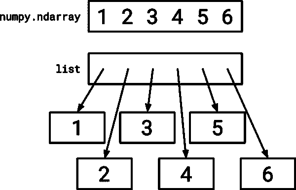
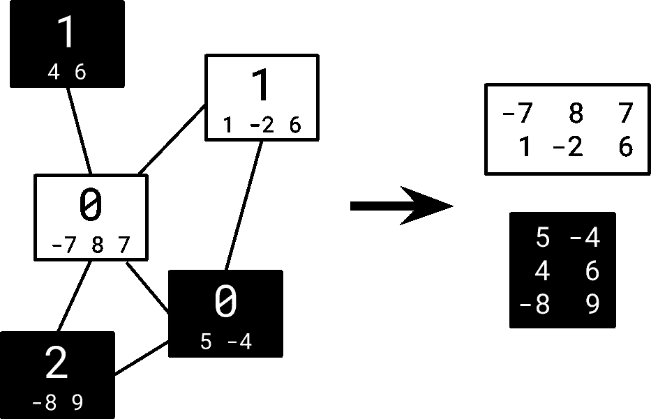
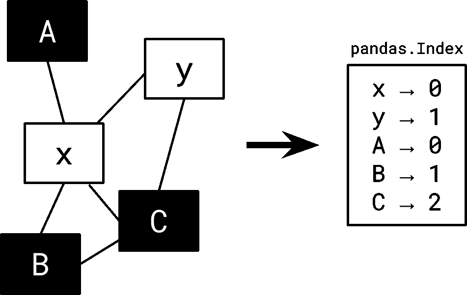

# 使用 NumPy 和 Pandas 在更大图上的更快机器学习

> 原文：[`www.kdnuggets.com/2020/05/faster-machine-learning-larger-graphs-numpy-pandas.html`](https://www.kdnuggets.com/2020/05/faster-machine-learning-larger-graphs-numpy-pandas.html)

评论

**作者：[Huon Wilson](https://www.linkedin.com/in/huon-wilson/)，CSIRO Data61**

图片来源：[Hassan Amra](https://unsplash.com/@hassan02?utm_source=unsplash&utm_medium=referral&utm_content=creditCopyText) 于 [Unsplash](https://unsplash.com/s/photos/cheetah?utm_source=unsplash&utm_medium=referral&utm_content=creditCopyText)

本周，[StellarGraph 发布了一个新版本](https://medium.com/stellargraph/stellargraph-1-0-taking-graph-machine-learning-to-a-new-level-2bd6a04fbc77)的开源图机器学习库。最令人兴奋的特性之一是 [StellarGraph 1.0](https://github.com/stellargraph/stellargraph/releases/) 引入了一种新的图数据结构——使用 NumPy 和 Pandas 构建——这使得内存使用显著降低，构建时间也大大缩短。

想象一下，[一个来自 Reddit 的图](http://snap.stanford.edu/graphsage/)，拥有超过 20 万个节点和 1100 万条边，使用之前版本的库的图数据结构时需要近 7GB 的内存，构建时间也长达 2.5 分钟。

在新 StellarGraph 类的最小形式中，相同的 Reddit 图现在大约使用 174MB 的内存。这甚至不是经典的‘内存与时间’平衡：新形式的构建时间仅为 0.9 秒。

即，新版 StellarGraph 类在存储上比旧版 StellarGraph **小 40 倍**，构建速度则比旧版**快数百倍**。

在本文中，我们将探讨如何通过仔细关注*对图机器学习最有效的方案*——在这种情况下，将 StellarGraph 的图数据结构从基于 NetworkX 替换为基于 NumPy 和 Pandas 的结构——从而在 StellarGraph 类中实现显著的性能提升。

### 更高一层

StellarGraph 库是一个开源、用户友好的图机器学习库。一个 [图](https://en.wikipedia.org/wiki/Graph_(discrete_mathematics)) 是一组节点及其之间的边，其中边表示节点之间的某种连接或关系。

库中的核心抽象是 [StellarGraph 类](https://stellargraph.readthedocs.io/en/stable/api.html#stellargraph.StellarGraph)，这是一个图数据结构，用于管理所有关于图或图组的信息，以用于机器学习。

以前版本的 StellarGraph 类依赖于 [NetworkX](https://networkx.github.io/)，因为其便捷灵活的 API 和使用嵌套字典构建的特性，允许快速有效地开发许多图机器学习算法。

然而，这种灵活性意味着它没有针对图机器学习进行优化：NetworkX 的权衡与机器学习所需的最佳权衡不同，其中最显著的是存储图所需的内存量。

因此，在 1.0 版本之前的更新中，基于 NetworkX 的图数据结构被用一个基于 NumPy 和 Pandas 的新数据结构所替代。

### 它是如何工作的？

新的 StellarGraph 类有三个关键部分：

+   高效的边存储

+   保持节点特征以便快速索引

+   支持任意节点 ID。

### 高效的边存储

新的 StellarGraph 类使用 NumPy 数组存储大部分数据。

*NumPy 数组可以由单一块内存组成，值内联存储。Python 列表存储指向其他 Python 对象的指针，每个指针都有额外的元数据开销，大大增加了与 NumPy 相比的成本。*

这些数组 [将数据连续存储在内存中](https://docs.scipy.org/doc/numpy-1.13.0/reference/arrays.ndarray.html#internal-memory-layout-of-an-ndarray)，以至于一个四字节整数的数组（如 *numpy.int32* 类型）每个元素仅需四个字节。这与同样整数的 Python 列表不同，后者每个元素需要十倍的内存，即每个元素 43 个字节。

图的边在概念上是源节点 ID 和目标节点 ID 的对，表示两个节点之间的连接。在新的 StellarGraph 类中，边被存储为 NumPy 数组，其中包含源节点和目标节点，采用[“结构化数组”](https://en.wikipedia.org/wiki/AoS_and_SoA)的样式。

这解释了 Reddit 图形内存使用减少的一个重要原因。边信息可以在内存中连续存储，不会有 Python 对象的开销。通过本地使用 NumPy，我们还可以轻松利用由[SciPy 库](https://www.scipy.org/)提供的高效的 [稀疏矩阵](https://docs.scipy.org/doc/scipy/reference/sparse.html) 和 [图算法](https://docs.scipy.org/doc/scipy/reference/sparse.csgraph.html)。

### 保持节点特征以便快速索引

NumPy 数组也用于节点特征。StellarGraph 针对机器学习进行了优化，这通常意味着处理“特征”向量或编码每个实体信息的数字列表。任何 StellarGraph 图形可以有多种类型的节点，每种类型的每个节点都有不同数量的特征。

*左侧的图有两种节点类型；“白色背景”和“黑色背景”，每种类型还有一些特征向量。这些被转换为右侧的 2D NumPy 数组，匹配节点的顺序。*

新的 StellarGraph 类通过为每种节点类型拥有一个大型矩形 2D NumPy 数组来存储节点特征：对于特定的节点类型，数组的第一行表示该类型第一个节点的特征，第二行表示第二个节点的特征，以此类推。

这种编码方式非常节省内存，因为数字特征可以全部布局而不会有来自 Python 对象的开销，就像边缘一样。它也很快，因为关于数组中给定位置节点特征的查询可以通过从数组中切片来回答，这在 NumPy 库中是通过原生 C 代码实现的。

### 对任意节点 ID 的支持

查询这个数据结构需要一些技巧。它在存储方面非常出色，但实际上获取节点的特征需要知道它的位置；无论它是该类型的第一个、第二个还是第几百个节点。

一种方法是要求所有节点 ID 都是从 0 开始的顺序整数，因此所有具有三个节点的图的 ID 为 0、1、2。然而，这使得该库在实际数据集中（其中 ID 可能是 [UUIDs](https://en.wikipedia.org/wiki/Universally_unique_identifier)、随机值或其他非平凡编码）使用起来困难。在异构图中，情况变得更加复杂，因为有多种节点类型。

*节点可以使用任何 ID 值进行键控，通过使用 pandas.Index 作为到数字 ID 或 ilocs 的转换层。这些 ilocs 然后可以在上述 NumPy 数组中使用。*

因此，新 StellarGraph 类的关键部分是使用 [pandas.Index](https://pandas.pydata.org/pandas-docs/stable/reference/api/pandas.Index.html) 类型在方便的和传统的节点 ID 之间提供转换，以便任何节点 ID 值都可以使用，类的用户无需考虑自己进行转换或管理。

Pandas Index 类型被用作高效的时间和内存字典，将 ID 映射到顺序整数（StellarGraph 和 Pandas 都称之为“ilocs”，即整数位置）。它利用了 Pandas 优化的 C 和 [Cython](https://cython.org/) 原生代码。

这些 ilocs 用作上述边缘存储的一部分。ilocs 是小整数，因此 NumPy 数组的连续布局确保我们的边缘始终高效存储。许多 StellarGraph 的算法直接使用这些 ilocs，因此不会因为“花哨”的 ID 而产生额外开销。

*这里还有一些额外的细节。例如，节点实际上在索引中是全局编号的，而不是按类型编号，因此上述图中的 A → 2，B → 3，…，但大多数这些细节对用户是隐藏的。*

### 总结来说 —

StellarGraph 易于安装和使用，因为它建立在巨人的肩膀上。通过使用 NumPy 和 Pandas，我们获得了优化的本地代码的大部分好处，而不必自己编写底层代码——这需要仔细优化，并且可能导致严重的内存损坏错误——也无需担心为每个平台精心分发。

新版 StellarGraph 类在 1.0 版本中通过仔细选择移动部件和专注于*仅所需*的图机器学习，使用 NumPy 和 Pandas 来减少内存使用和提高速度。基于现有库为我们提供了本地代码的好处而没有问题。

要开始使用图机器学习与新版 StellarGraph 类，首先在 [StellarGraph 库](https://github.com/stellargraph/stellargraph)中*pip install stellargraph*，然后使用*StellarGraph(nodes, edges)* 创建一个新的优化图对象。可以查看 [所有细节的演示](https://stellargraph.readthedocs.io/en/v1.0.0/demos/basics/loading-pandas.html)。

*这项工作涉及了来自*[*Andrew Docherty*](https://github.com/adocherty)*、*[*Geoff Jarrad*](https://github.com/geoffj-d61)*、*[*Huon Wilson*](https://github.com/huonw)* 以及 *[*Kieran Ricardo*](https://github.com/kieranricardo)* 的重要贡献、研究和代码。我们正在基于这个优化基础进行更多改进，这些改进应该会进一步提升内存使用和速度，例如*[*#718*](https://github.com/stellargraph/stellargraph/issues/718)*。*

*这项工作得到 CSIRO Data61 的支持，这是澳大利亚领先的数字研究网络。*

**简介： [Huon Wilson](https://www.linkedin.com/in/huon-wilson/)** 是一名软件工程师，具有扎实的数学和统计学背景，拥有在编译器等低级系统编程领域的丰富经验，精通 C++、C 以及更为独特的 Rust 等语言。在更高层面，他有 R 和 Python 中的数值编程经验，以及大多数语言范式和许多其他软件工程领域的经验。

[原文](https://medium.com/stellargraph/faster-machine-learning-on-larger-graphs-how-numpy-and-pandas-slashed-memory-and-time-in-79b6c63870ef) 已获授权转载。

**相关：**

+   图神经网络模型校准以获得可信预测

+   可扩展图机器学习：我们能攀登的高山？

+   图神经网络与用户体验：一段未曾探索的恋情

* * *

## 我们的前三个课程推荐

 1\. [谷歌网络安全证书](https://www.kdnuggets.com/google-cybersecurity) - 快速开启网络安全职业生涯。

 2\. [Google 数据分析专业证书](https://www.kdnuggets.com/google-data-analytics) - 提升你的数据分析技能

 3\. [Google IT 支持专业证书](https://www.kdnuggets.com/google-itsupport) - 支持你组织的 IT 需求

* * *

### 了解更多相关话题

+   [数据可视化中的 SQL：如何为图表和图形准备数据](https://www.kdnuggets.com/sql-for-data-visualization-how-to-prepare-data-for-charts-and-graphs)

+   [超越管道：图表作为 Scikit-Learn 的元估计器](https://www.kdnuggets.com/2022/09/graphs-scikitlearn-metaestimators.html)

+   [图表：理解数据的自然方式](https://www.kdnuggets.com/2022/10/manning-graphs-natural-way-understand-data.html)

+   [通过参与比赛将机器学习的学习速度提高 4 倍](https://www.kdnuggets.com/2022/01/learn-machine-learning-4x-faster-participating-competitions.html)

+   [7 种方法让 ChatGPT 帮助你更快更好地编程](https://www.kdnuggets.com/2023/06/7-ways-chatgpt-makes-code-better-faster.html)

+   [如何优化 SQL 查询以加快数据检索速度](https://www.kdnuggets.com/2023/06/optimize-sql-queries-faster-data-retrieval.html)
