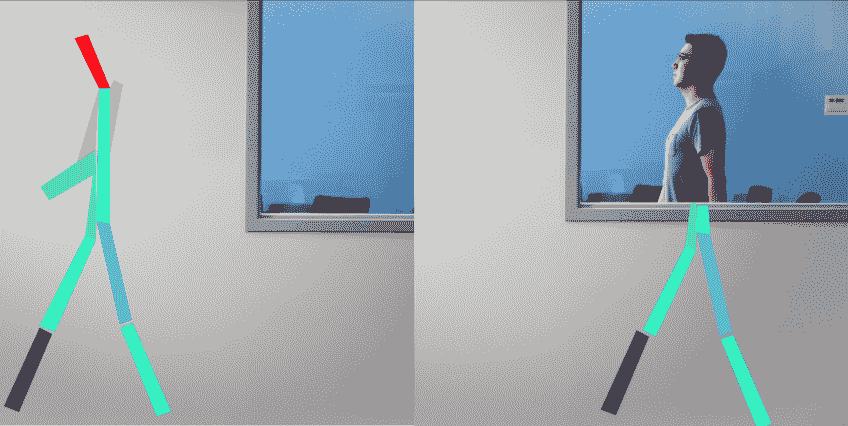
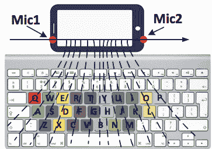
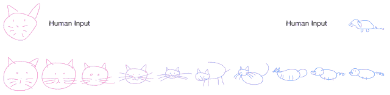
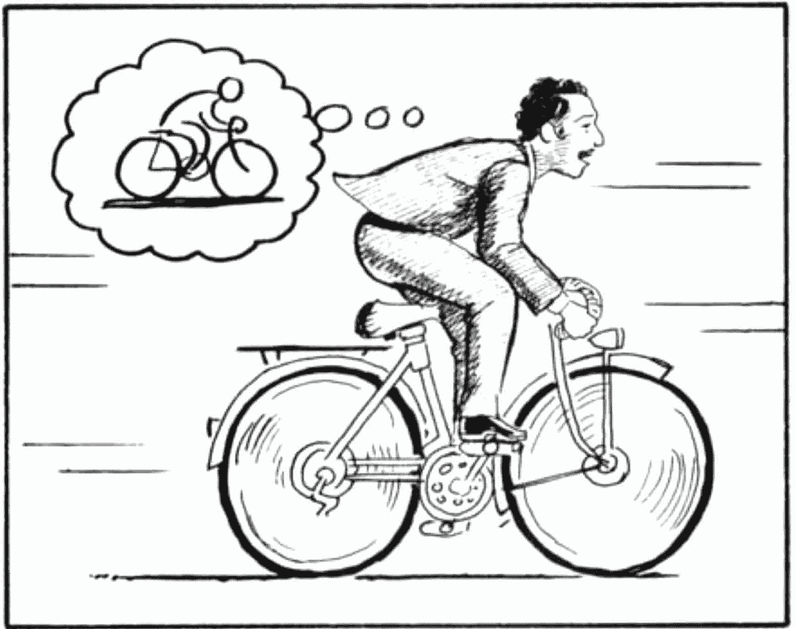

# 我最喜欢的令人震惊的机器学习/人工智能突破

> 原文：[`www.kdnuggets.com/2019/03/favorite-ml-ai-breakthroughs.html`](https://www.kdnuggets.com/2019/03/favorite-ml-ai-breakthroughs.html)

 评论

**由 [Jerry Chi](https://www.linkedin.com/in/jerrychi/)，SmartNews 数据科学经理**。

与其他领域相比，机器学习/人工智能如今似乎有着更高频率的超级有趣的发展。那些让你说“哇”甚至“多么美好的时代！”（正如 [Two Minute Papers](https://www.youtube.com/channel/UCbfYPyITQ-7l4upoX8nvctg) 的创作者常说）

* * *

## 我们的前三大课程推荐

 1\. [谷歌网络安全证书](https://www.kdnuggets.com/google-cybersecurity) - 快速开启网络安全职业生涯

 2\. [谷歌数据分析专业证书](https://www.kdnuggets.com/google-data-analytics) - 提升你的数据分析技能

 3\. [谷歌 IT 支持专业证书](https://www.kdnuggets.com/google-itsupport) - 支持你的组织在 IT 方面

* * *

免责声明：我并没有使用“令人震惊”或“突破”的严格定义；这只是一个随意的列表……我可能会使用不那么严格的术语来使这篇文章更易读

### 从看似无用的信息中获得惊人准确的估算

#### 透墙人体姿态估计

[麻省理工学院研究人员的网站/视频，2018](http://rfpose.csail.mit.edu/)

我们可以仅通过 Wifi 信号的扰动准确估计墙另一边的人是站着、坐着还是走动。

#### 从视频中测量材料的物理属性

[文章/视频由麻省理工学院研究人员提供，2015](http://news.mit.edu/2015/visual-microphone-identifies-structural-defects-0521)

研究人员首次在 2014 年 [演示](http://news.mit.edu/2014/algorithm-recovers-speech-from-vibrations-0804)了他们可以从视频（没有音频）中的薯片袋的振动中重现人类的声音。这一部分没有使用机器学习。在 2015 年，他们使用机器学习展示了你可以仅从视频中（在某些情况下，仅通过空气的普通流动引起的振动就足够）估计材料的刚度、弹性、单位面积重量等。

#### 从键盘旁边的智能手机中估计按键次数

[论文，2015](https://www.sigmobile.org/mobicom/2015/papers/p142-liuA.pdf)

研究人员展示了使用一个放置在键盘旁边的普通智能手机录音，能够以**94%准确率**估计每个按键。与之前使用多个麦克风环绕键盘的监督深度学习方法不同，这篇论文实际上使用了一种相对简单的机器学习技术（K-means 聚类）和**无监督**学习。

### 生成模型

#### 逼真的面孔生成、风格混合和插值

[论文](https://arxiv.org/abs/1812.04948)/[视频](https://www.youtube.com/watch?v=kSLJriaOumA) 由 NVIDIA 研究人员提供，2018 年

研究人员将一种新架构与大量 GPU 结合，创造出了极其逼真的人工面孔，这些面孔是其他面孔之间的插值或一种面孔“风格”应用到另一面孔上的结果。这项工作建立在生成对抗网络（GANs）之前的研究基础上。GANs 于 2014 年发明，自那时以来研究爆炸性增长。GANs 的基本概念是两个神经网络相互对抗（例如，一个将图像分类为“真实”或“虚假”，另一个神经网络生成图像以试图“欺骗”第一个神经网络，将虚假图像错误地分类为真实……因此第二个神经网络是第一个的“对手”）。

一般来说，有很多关于对抗性机器学习的[惊人研究](https://github.com/yenchenlin/awesome-adversarial-machine-learning)，这种研究已经有十多年历史了。它对网络安全等领域有许多令人不安的影响。但我离题了。

#### 教授机器绘画

[Google Brain 的博客文章，2017 年](https://ai.googleblog.com/2017/04/teaching-machines-to-draw.html)

两幅图像之间的插值

我的熟人[David Ha at Google Brain](https://twitter.com/hardmaru)使用生成对抗递归神经网络（RNN）制作了基于矢量的图形（我把这看作是自动化的 Adobe Illustrator）。

#### 将优秀的舞蹈动作转移到舞蹈水平差的人身上

[网站](https://carolineec.github.io/everybody_dance_now/)/[视频](https://www.youtube.com/watch?v=PCBTZh41Ris) 由 UC Berkeley 研究人员提供，2018 年

想象一下“自动调音器”用于舞蹈。通过姿态估计和生成对抗训练，研究人员能够制作任何真实人物（“目标”人物）舞蹈的虚假视频，并且舞技非常高超。所需的输入仅有：

+   一段优秀舞者跳舞的短视频

+   目标人物跳舞的几分钟视频（通常舞技很差，因为大多数人舞蹈不好）

我还看到 NVIDIA 的 CEO Jensen Huang 展示了一段（使用此技术制作的）他像迈克尔·杰克逊一样跳舞的视频。我很高兴我参加了 GPU 技术大会，哈哈。

### 强化学习

#### 世界模型 — AI 在自己的梦境中学习

[谷歌大脑网站，2018](https://worldmodels.github.io/)

人类实际上并不真正知道或考虑我们生活的世界的所有细节。我们的行为是基于我们脑中的世界抽象。例如，如果我骑自行车，我不会考虑自行车的齿轮/螺母/螺栓；我只是对车轮、座位和把手的大致位置以及如何与它们互动有一个粗略的感知。为什么不对人工智能采用类似的方法呢？

这种“世界模型”方法（再次由 David Ha 等人创建）允许“代理”（例如控制赛车游戏中汽车的人工智能）创建一个世界/环境的生成模型，这是实际环境的简化/抽象。因此，你可以把世界模型看作是存在于人工智能脑中的一个梦境。然后，人工智能可以在这个“梦境”中通过强化学习进行训练，以实现更好的表现。因此，这种方法实际上是将生成式机器学习与强化学习结合在一起。通过这样做，研究人员在某些视频游戏任务中达到了最先进的性能。

[更新 2019/2/15] 基于上述“世界模型”方法，谷歌刚刚公布了[PlaNet：深度规划网络用于强化学习](http://ai.googleblog.com/2019/02/introducing-planet-deep-planning.html)，其数据效率比以往方法提高了 5000%。

#### AlphaStar——击败顶级职业选手的 Starcraft II 人工智能

[博客文章](https://deepmind.com/blog/alphastar-mastering-real-time-strategy-game-starcraft-ii/)，[DeepMind（谷歌）制作的电子竞技视频](https://www.youtube.com/watch?v=cUTMhmVh1qs)，2019 年

我们距离[李世石与 DeepMind 的 AlphaGo 之间的历史围棋比赛](https://en.wikipedia.org/wiki/AlphaGo_versus_Lee_Sedol)已经过去很远，那只是三年前的 2016 年（看看[Netflix 纪录片](https://www.netflix.com/jp-en/title/80190844)，让一些人感动落泪）。那时，AlphaZero 在 2017 年在围棋方面超越了 AlphaGo（并在国际象棋、将棋等方面超越了任何其他算法），尽管没有使用任何来自人类比赛的训练数据。但 2019 年的 AlphaStar 则更加**惊人**。

自 1998 年以来作为一个 StarCraft 粉丝，我能体会到“……需要平衡短期和长期目标，并适应意外情况……带来了巨大的挑战。”这是一个真正困难且复杂的游戏，需要在多个层面上理解才能玩得好。对 Starcraft 算法的研究自 2009 年以来一直在进行。

AlphaStar 实质上使用了监督学习（来自人类比赛）和强化学习（对抗自我）相结合的方法来实现其结果。

### 人类训练机器人

#### 用单个人类演示来教导机器任务

[NVIDIA 研究人员的文章](https://news.developer.nvidia.com/new-ai-technique-helps-robots-work-alongside-humans/) / [视频](https://www.youtube.com/watch?time_continue=1&v=B7ZT5oSnRys)，2018 年

我能想到三种典型的方法来教机器人做某件事，但这些方法都需要大量时间/劳动：

+   手动编程每种情况的机器人关节旋转等

+   让机器人多次尝试任务（强化学习）

+   向机器人演示任务很多次

通常，深度学习的一大批评是，生产使计算机表现良好的数百万个示例（数据）是非常昂贵的。但越来越多的方法可以避免依赖这种昂贵的数据。

研究人员找到了一个方法，让机器人手臂能够成功执行一个任务（例如“拾起块状物并将其堆叠成以下顺序：红色块、蓝色块、橙色块”），基于**单一**视频中的**单一**人类演示（一个真实的人的手移动这些块），即使视频是从不同的角度拍摄的。这个算法实际上生成了一个人类可读的任务描述，这对故障排除非常有帮助。该算法依赖于姿态估计的对象检测、合成训练数据生成和模拟到现实的迁移。

### 无监督机器翻译

[Facebook AI Research 的博客文章，2018 年](https://code.fb.com/ai-research/unsupervised-machine-translation-a-novel-approach-to-provide-fast-accurate-translations-for-more-languages/)

通常，你需要大量翻译文档的训练数据集（例如，联合国会议的专业翻译）才能很好地进行机器翻译（即**监督**学习）。当然，许多主题和语言对没有高质量、充足的训练数据。在这篇论文中，研究人员展示了使用**无监督**学习（即不使用翻译数据，仅使用每种语言中无关的文本语料库）是可能达到最先进的**监督**学习方法的翻译质量。哇。

基本思想是，在任何语言中，某些词汇/概念往往会紧密出现（例如“毛茸茸的”和“猫”）。他们描述这个现象为“不同语言中的词嵌入共享类似的邻域结构。” 我的意思是，好的，我明白这个概念，但令人惊叹的是，使用这种方法他们能够在没有翻译数据集的情况下达到如此高的翻译质量。

### 结束

我希望这篇文章让你对机器学习/人工智能的发展更加兴奋，即使你之前已经很兴奋。也许我会在一年后写另一篇类似的文章。请随时在这里留下任何想法/评论，或通过电子邮件联系我，地址是 jerrychi123 [at] gmail.com。

这是多么美好的时代啊！ =D

**个人简介**： [Jerry Chi](https://www.linkedin.com/in/jerrychi/) 在数据科学、机器学习、数据工程和数字行业战略方面有丰富经验。

[原文](https://blog.usejournal.com/my-favorite-mind-blowing-ml-ai-breakthroughs-e7b4f3637e3d)。经许可转载。

**资源：**

+   [在线和基于网络：分析、数据挖掘、数据科学、机器学习教育](https://www.kdnuggets.com/education/online.html)

+   [分析、数据科学、数据挖掘和机器学习的软件](https://www.kdnuggets.com/software/index.html)

**相关内容：**

+   [以低成本获取标注数据来训练你的模型](https://www.kdnuggets.com/2019/02/labeled-data-train-models.html)

+   [你的机器学习代码可能很糟糕的四个原因](https://www.kdnuggets.com/2019/02/4-reasons-machine-learning-code-probably-bad.html)

+   [使用 NumPy 和图像分类实现人工神经网络](https://www.kdnuggets.com/2019/02/artificial-neural-network-implementation-using-numpy-and-image-classification.html)

### 更多相关内容

+   [停止学习数据科学以寻找目标，并寻找目标以……](https://www.kdnuggets.com/2021/12/stop-learning-data-science-find-purpose.html)

+   [学习数据科学统计的顶级资源](https://www.kdnuggets.com/2021/12/springboard-top-resources-learn-data-science-statistics.html)

+   [一项 90 亿美元的人工智能失败案例分析](https://www.kdnuggets.com/2021/12/9b-ai-failure-examined.html)

+   [成功的数据科学家的五个特征](https://www.kdnuggets.com/2021/12/5-characteristics-successful-data-scientist.html)

+   [是什么让 Python 成为初创公司理想的编程语言](https://www.kdnuggets.com/2021/12/makes-python-ideal-programming-language-startups.html)

+   [每个数据科学家都应该了解的三个 R 库（即使你使用 Python）](https://www.kdnuggets.com/2021/12/three-r-libraries-every-data-scientist-know-even-python.html)
