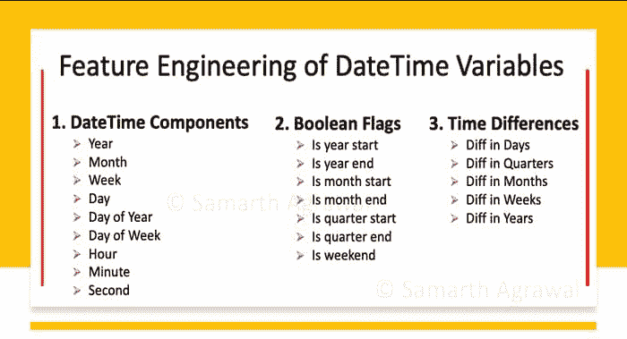
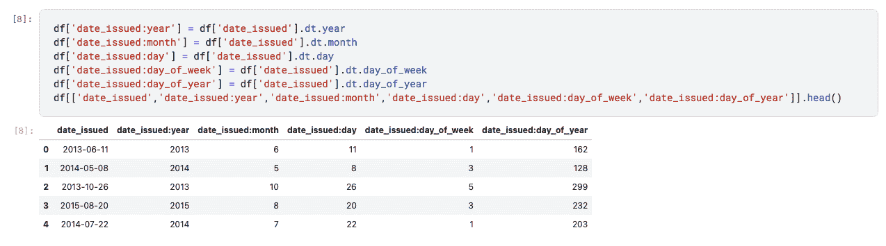
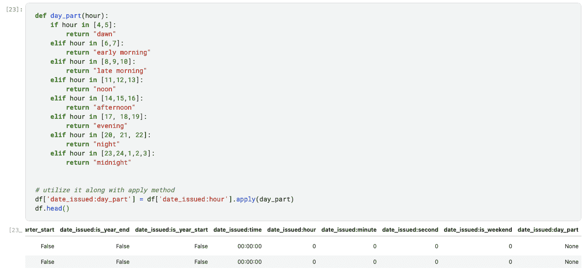
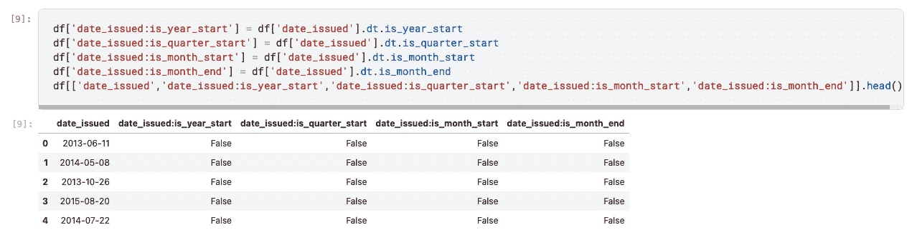
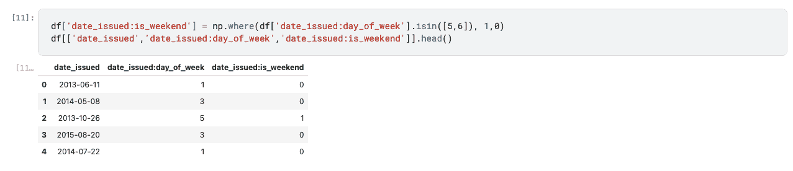
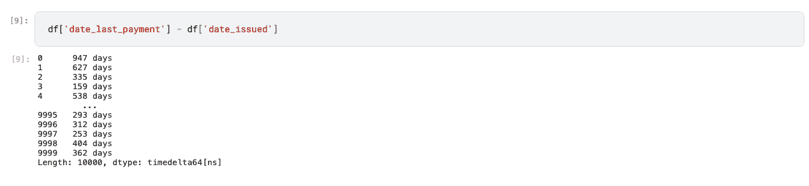
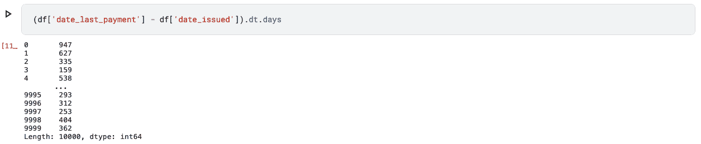
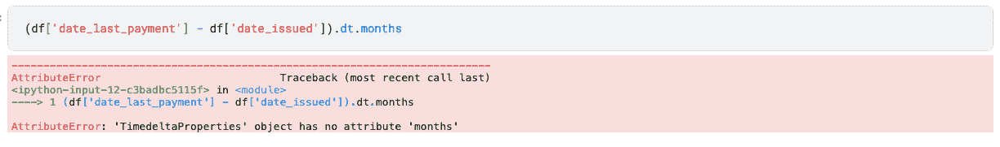
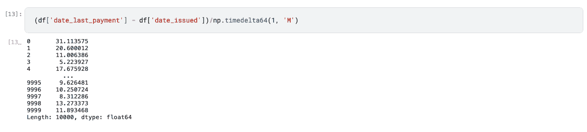
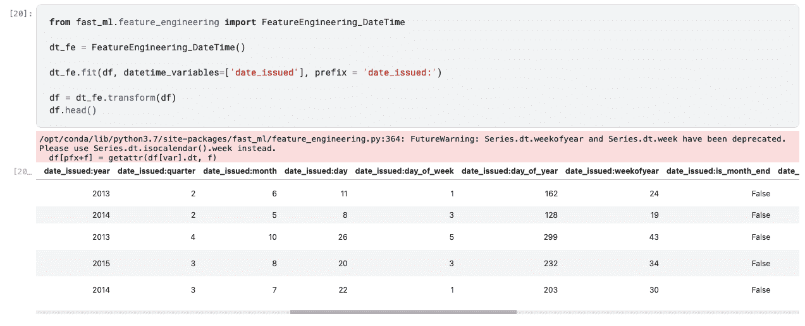

# 日期时间变量的特征工程用于数据科学和机器学习

> 原文：[`www.kdnuggets.com/2021/04/feature-engineering-datetime-variables-data-science-machine-learning.html`](https://www.kdnuggets.com/2021/04/feature-engineering-datetime-variables-data-science-machine-learning.html)

评论

**作者 [Samarth Agrawal](https://www.linkedin.com/in/samarth-agrawal-2501/)，丰田数据科学家**



日期时间变量的特征工程。图像由作者提供。

### 介绍

* * *

## 我们的前三名课程推荐

 1\. [谷歌网络安全证书](https://www.kdnuggets.com/google-cybersecurity) - 快速进入网络安全职业轨道

 2\. [谷歌数据分析专业证书](https://www.kdnuggets.com/google-data-analytics) - 提升你的数据分析水平

 3\. [谷歌 IT 支持专业证书](https://www.kdnuggets.com/google-itsupport) - 支持你的组织的 IT 需求

* * *

日期时间字段需要[特征工程](https://www.kdnuggets.com/2018/12/feature-engineering-explained.html)来将它们从数据转变为可供机器学习模型使用的有洞察力的信息。本文分为 3 部分和一个额外的奖励部分，我们将使用内置的 pandas 和 NumPy 函数以及我们的函数来提取有用的特征。

+   第一部分 — 提取日期/时间组件

+   第二部分 — 创建布尔标志

+   第三部分 — 计算日期/时间差异

+   奖励 — 使用`fast_ml`两行代码进行特征工程

### 背景

每当我处理与电子商务相关的数据时，数据集总是以某种方式包含日期时间列。

+   用户注册日期时间

+   用户登录日期时间

+   交易日期时间

+   争议交易日期时间

+   …以及更多

起初，这个日期字段只给我们一个时间线上的特定点。但这些日期时间字段是潜在的数据宝藏。如果“正确使用”，这些字段非常强大，能够揭示模式。

作为数据科学家，你的工作是提供洞察，为此，你需要提出正确的问题。例如：

+   **问题 1** — 你通常在什么时候看到最多的购物车被创建？

+   **问题 2** — 你通常在什么时候看到最多的购物车被放弃？

+   **问题 3** — 你看到最多的欺诈交易发生在什么时候？

+   **问题 4** — 什么时候用户订阅最多？

+   **问题 5** — 某些物品最常在什么时候购买？

+   **问题 6** — 用户在注册后多少天/小时内进行第一次订单？

+   **问题 7** — 客户在多少天不活动后不会再返回你的网站？

+   …等等

现在，为了回答这些问题，你需要回到数据中去工程化这些日期时间字段。然后就可以发现大量的模式。

本文的**第一部分**将提供特征工程步骤，以回答类似于第 1、2 和 3 问题的问题

+   **答案 1** — 什么时候您看到最多的购物车被创建？***每月的第一周***

+   **答案 2** — 您什么时候看到最多的购物车被遗弃？***星期三-下午***

+   **答案 3** — 什么时候您看到最多的欺诈交易？***星期五-深夜***

本文的**第二部分**将提供特征工程步骤，以回答类似于第 4 和第 5 问题的问题

+   **答案 4** — 什么时候最多用户订阅？***在年初***

+   **答案 5** — 某些物品最常在何时购买？***在月初***

本文的**第三部分**将提供特征工程步骤，以回答类似于第 6 和第 7 问题的问题

+   **答案 6** — 注册后经过多少天/小时用户会下第一个订单？***在 2 小时内***

+   **答案 7** — 在经过多少天的不活动后，客户会永远不再访问您的网站？***经过 14 天的不活动***

我使用了一个电子商务数据的例子，在这个例子中，我个人发现了许多用例，但提取信息的范围并不限于此。我们将在本文中看到，通过提出正确的问题，即进行正确的特征工程，如何学到的一些行为在各种问题的多个行业中证明了其有用性。

### 开始吧

### 加载数据集

```py
import pandas as pddf = pd.read_csv('/kaggle/input/loan-data/loan.csv', 
                 parse_dates = ['date_issued', 'date_last_payment'])
```

Pandas 提供了一种非常简单但功能强大的方法来处理与 DateTime 相关的变量，通过将其解析为日期。您可以将所有与日期时间相关的变量作为列表传递给参数 `parse_dates`。

假设您一开始不知道 DateTime 变量，并且在调查数据后发现一些变量是日期时间。因此，pandas 提供了另一个有用的函数 `to_datetime` 来将数据类型转换为 DateTime，而不是重新加载数据。

```py
df['date_issued'] = pd.to_datetime(df['date_issued'], 
                                   errors = 'coerce')
```

### 第一部分。提取日期/时间组件

如上例所示，我们可以从给定的日期时间变量中提取日期时间部分的组件（`year`，`quarter`，`month`，`day`，`day_of_week`，`day_of_year`，`week_of_year`，`time`，`hour`，`minute`，`second`，`day_part`）。下面的列表提供了使用 pandas 内置函数可以提取的多个这样的组件。

### 语法：

我们可以使用 `.dt` 访问器提取所有这些组件。[在这里阅读有关日期访问器的更多信息](https://pandas.pydata.org/pandas-docs/stable/user_guide/basics.html#basics-dt-accessors)



从日期时间变量 issued_date 中提取的组件。图片由作者提供

下面是图像中显示的代码。所有其他组件也可以以类似的方式提取

```py
#1
df[‘date_issued:year’] = df[‘date_issued’].dt.year#2
df[‘date_issued:month’] = df[‘date_issued’].dt.month#3
df[‘date_issued:day_of_week’] = df[‘date_issued’].dt.day_of_week#4
df[‘date_issued:week_of_year’] = df[‘date_issued’].dt.week_of_year#5
df[‘date_issued:hour’] = df[‘date_issued’].dt.hour
```

**注意：**

+   对于星期一：`day_of_week = 0`，

+   星期二：`day_of_week=1`，

+   …

+   星期天：`day_of_week=6`

### 创建日部分：

```py
#day_part function
def day_part(hour):
    if hour in [4,5]:
        return "dawn"
    elif hour in [6,7]:
        return "early morning"
    elif hour in [8,9,10]:
        return "late morning"
    elif hour in [11,12,13]:
        return "noon"
    elif hour in [14,15,16]:
        return "afternoon"
    elif hour in [17, 18,19]:
        return "evening"
    elif hour in [20, 21, 22]:
        return "night"
    elif hour in [23,24,1,2,3]:
        return "midnight"

#Run function with apply method
df['date_issued:day_part'] = df['date_issued:hour'].apply(day_part)df.head()
```



为日期时间变量 issued_date 创建日部分。图片由作者提供

### 第二部分。创建布尔标志

如上例所示，我们可以从给定的日期时间变量中提取许多布尔标志（`is_month_start`、`is_month_end`、`is_quarter_start`、`is_quarter_end`、`is_year_start`、`is_year_end`、`is_weekend`）。下面的列表提供了几种可以使用 pandas 内置函数提取的组件，以及通过创建一些我们自己的函数来实现。

### 语法：

再次，我们可以使用 `.dt` 访问器提取许多布尔标志。



从 datetime 变量 issued_date 中提取的布尔标志。图像由作者提供。

```py
#1
df['date_issued:is_year_start'] = df['date_issued'].dt.is_year_start#2
df['date_issued:is_quarter_start'] = df['date_issued'].dt.is_quarter_start#3
df['date_issued:is_month_start'] = df['date_issued'].dt.is_month_start#4
df['date_issued:is_month_end'] = df['date_issued'].dt.is_month_end
```

### 创建周末标志：



为 datetime 变量 issued_date 创建周末标志。图像由作者提供。

如果我们查看日历，会看到 2013 年 10 月 26 日是一个星期六——周末。

```py
df['date_issued:is_weekend'] = np.where(df['date_issued:day_of_week'].isin([5,6]), 1,0)
```

### 第三部分：计算日期/时间差异

你提出的问题/分析通常会相对于另一个参考点。例如，

1.  用户在注册后多少天/小时内下了第一个订单？*registration_date & first_order_date*

1.  客户的投诉在多少天/小时内得到解决？*complain_date & resolution_date*

1.  从今天起，客户最近一次从你的网站上订购是什么时候？*today & last_order_date*

1.  …等

在我们的示例数据集中，我们有两个列 date_last_payment 和 date_issued。让我们看看当我们仅仅计算这两个列的差异时会发生什么。



在 pandas 中计算时间差异。图像由作者提供。

Pandas 默认提供以‘天’为单位的差异。注意 `dtype: timedelta64[ns]`。

从 numpy 文档：

> “因为 NumPy 在其核心没有物理量系统，timedelta64 数据类型被创建来补充 datetime64”

现在，如果我们只想要数字部分而不是整个字符串 `947 days`，我们可以使用 .dt 访问器做到这一点。



使用 .dt 访问器在 pandas 中计算时间差异。图像由作者提供。

不幸的是，我们不能以类似的方式获取月份。



使用 .dt 访问器在 pandas 中计算时间差异是不具扩展性的。图像由作者提供。

在这里，NumPy 的 `timedelta64` 非常有用。

### 语法：

为了获取发放贷款日期和最后支付日期之间的月份数，我们将编写如下代码：



使用 NumPy timedelta64 在 pandas 中计算时间差异。图像由作者提供。

```py
(df['date_last_payment'] - df['date_issued'])/np.timedelta64(1, 'M')
```

timedelta64 可以接受以下参数来计算两个日期之间的差异：

+   ‘D’ → 代表天数

+   ‘W’ → 代表周

+   ‘M’ → 代表月份

+   ‘Y’ → 代表年份

+   ‘h’ → 代表小时

### 额外提示！

你可以使用 fast_ml 创建所有这些日期时间特征

首先，安装 `fast_ml` 包

```py
!pip install fast_ml — upgrade
```

然后，从 `feature_engineering` 模块导入工程日期时间特征的方法

```py
from fast_ml.feature_engineering import FeatureEngineering_DateTime
```

现在，这与 sklearn 的其他变换器、预处理器的工作方式完全相同。

+   实例化

+   适配

+   转换

```py
#Instantiate
dt_fe = FeatureEngineering_DateTime()#Fit
dt_fe.fit(df, datetime_variables=['date_issued'], 
          prefix = 'date_issued:')#Transform
df = dt_fe.transform(df)
df.head()
```



使用 Fast_ml 进行日期时间变量的特征工程。图片来源：作者。

屏幕截图中并未显示所有列。让我们只查看数据集的列。

```py
df.columns---Output---
Index(['customer_id', 'disbursed_amount', 'interest', 'market', 'employment', 'time_employed', 'householder', 'income', 'date_issued', 'target', 'loan_purpose', 'number_open_accounts', 'date_last_payment', 'number_credit_lines_12',(Notice from here ------->)
'date_issued:year', 'date_issued:quarter', 'date_issued:month', 'date_issued:day', 'date_issued:day_of_week', 'date_issued:day_of_year', 'date_issued:weekofyear', 'date_issued:is_month_end', 'date_issued:is_month_start', 'date_issued:is_quarter_end', 'date_issued:is_quarter_start', 'date_issued:is_year_end', 'date_issued:is_year_start', 'date_issued:time', 'date_issued:hour', 'date_issued:minute', 'date_issued:second', 'date_issued:is_weekend', 'date_issued:day_part'],
dtype='object')
```

### 感谢阅读！！

+   如果你喜欢这个，*请在 medium 上关注我* [follow me on medium](https://samarthagrawal86.medium.com/)。

+   你的点赞是我写作的巨大鼓励，并帮助我写得更好。

+   有兴趣合作吗？让我们在 [Linkedin](https://www.linkedin.com/in/samarth-agrawal-2501/) 上联系。

+   请随时写下你的想法/建议/反馈。

+   [Kaggle 链接](https://www.kaggle.com/nextbigwhat/feature-engineering-datetime-variables)

+   [Fast_ml 链接](https://pypi.org/project/fast-ml/)

Notebook 可以在以下位置获得，包含完整功能的代码：

[**日期时间变量的特征工程**](https://www.kdnuggets.com/2023/06/rapids-cudf-leverage-gpu-feature-engineering.html)

探索并运行 Kaggle Notebooks 中的机器学习代码 | 使用数据来自 loan_data](https://www.kaggle.com/nextbigwhat/feature-engineering-of-datetime-variables?scriptVersionId=61041780)

**简介：[Samarth Agrawal](https://www.linkedin.com/in/samarth-agrawal-2501/)** 是丰田的数据科学家，同时也是数据科学从业者和传播者。

[原文](https://samarthagrawal86.medium.com/feature-engineering-of-datetime-variables-for-data-science-machine-learning-45e611c632ad)。已获许可重新发布。

**相关：**

+   使用 fast.ai 进行快速特征工程

+   数值数据的特征工程

+   数据科学 101：归一化、标准化与正则化

### 相关主题

+   [特征存储峰会 2022：关于特征工程的免费会议](https://www.kdnuggets.com/2022/10/hopsworks-feature-store-summit-2022-free-conference-feature-engineering.html)

+   [机器学习中特征工程的实用方法](https://www.kdnuggets.com/2023/07/practical-approach-feature-engineering-machine-learning.html)

+   [构建一个可处理的多变量特征工程管道](https://www.kdnuggets.com/2022/03/building-tractable-feature-engineering-pipeline-multivariate-time-series.html)

+   [使用 RAPIDS cuDF 利用 GPU 进行特征工程](https://www.kdnuggets.com/2023/06/rapids-cudf-leverage-gpu-feature-engineering.html)

+   [特征工程入门](https://www.kdnuggets.com/feature-engineering-for-beginners)

+   [机器学习中的替代特征选择方法](https://www.kdnuggets.com/2021/12/alternative-feature-selection-methods-machine-learning.html)
