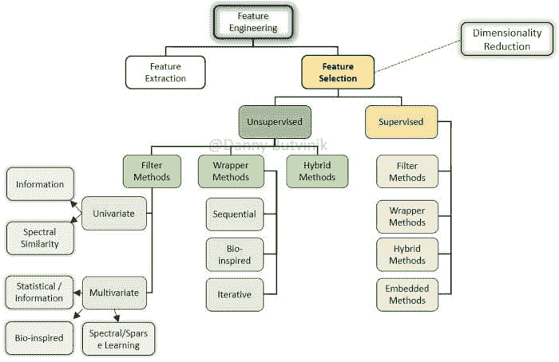
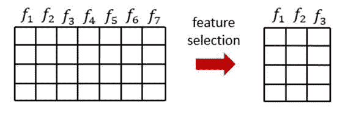
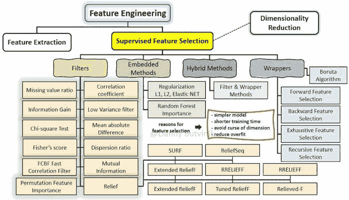
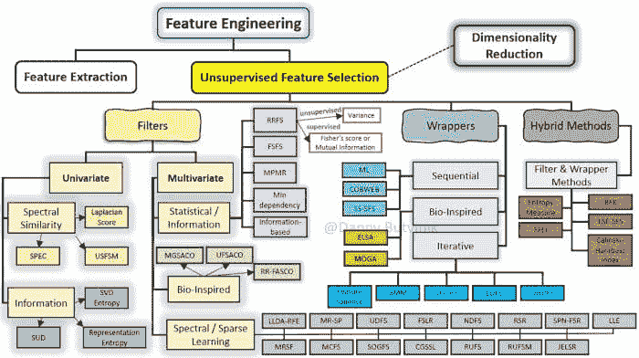
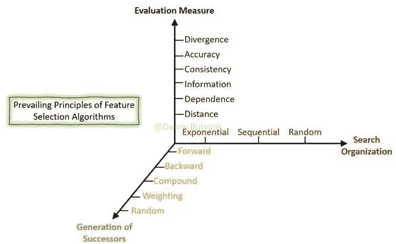

# 特征选择 – 你想知道的一切

> 原文：[`www.kdnuggets.com/2021/06/feature-selection-overview.html`](https://www.kdnuggets.com/2021/06/feature-selection-overview.html)

评论

**作者 [Danny Butvinik](https://www.linkedin.com/in/danny-butvinik-5a6357212/)，NICE Actimize 的首席数据科学家**

* * *

## 我们的前三个课程推荐

 1\. [Google 网络安全证书](https://www.kdnuggets.com/google-cybersecurity) - 快速进入网络安全职业生涯。

 2\. [Google 数据分析专业证书](https://www.kdnuggets.com/google-data-analytics) - 提升你的数据分析水平

 3\. [Google IT 支持专业证书](https://www.kdnuggets.com/google-itsupport) - 在 IT 方面支持你的组织

* * *

*来源：TnT 木工。*

特征选择作为一种降维技术，旨在通过去除无关、冗余或噪声特征，从原始特征中选择一个相关特征的小子集。特征选择通常可以带来更好的学习性能、更高的学习准确性、更低的计算成本和更好的模型可解释性。本文重点介绍了特征选择过程，并提供了从数据和算法角度对特征选择类型、方法和技术的全面结构化概述。

*图 1：特征选择的高级分类。*

这篇文章考虑了特征选择过程。这个问题很重要，因为数据集中大量的特征数量， comparable to 或高于样本数量，会导致模型过拟合，从而在验证数据集上结果不佳。此外，从具有许多特征的数据集中构建模型计算上更为繁重。

强相关特征对于最优特征子集始终是必要的，它不能被移除而不影响原始条件目标分布。

> **特征选择的目的是最大化相关性并最小化冗余。**

特征选择方法可以用于数据预处理，以实现高效的数据减少。这对于找到准确的数据模型非常有用。由于对最优特征子集进行穷举搜索在大多数情况下不可行，因此文献中提出了许多搜索策略。特征选择的通常应用包括分类、聚类和回归任务。

### 什么是特征选择

所有机器学习工作流都依赖于特征工程，其中包括特征提取和特征选择，这些是现代机器学习管道的基本构建块。尽管特征提取和特征选择过程有一些重叠，但这些术语通常被错误地等同起来。特征提取是利用领域知识从原始数据中提取新的变量，使机器学习算法能够正常工作。特征选择过程则基于选择最一致、最相关和不冗余的特征。

特征选择技术的目标包括：

+   简化模型，使研究人员/用户更容易解释

+   更短的训练时间

+   避免维度诅咒

+   通过减少过拟合（正式地说，是减少方差）来增强泛化能力

由于研究人员可以使用大量已开发的分析方法，数据集大小缩减现在变得更加重要，同时平均数据集的大小在特征和样本数量上都在不断增长。

*图 2：表格数据中特征选择和数据大小缩减的说明。*

### 什么使一些特征表示优于其他表示？

不论特征表示的技术方法如何，有一个共同的问题困扰着大多数机器学习工作流中的数据科学家：是什么使一些特征表示优于其他表示？

这可能是一个疯狂的问题，因为现代机器学习问题使用了数十万甚至百万个特征，而这些特征对于领域专家来说几乎无法解释。

虽然对我们目标问题没有简单的答案，但我们可以遵循一些通用原则。一般来说，特征表示中有三个关键的期望属性：

+   潜在因子的解缠

+   易于建模

+   与正则化策略配合良好

从根本上讲，良好的表示包括与观察数据的潜在原因相对应的特征。更具体地说，本论文将表示的质量与不同特征和方向对应于潜在数据集中不同原因的结构相关联，以便表示能够将一种原因与另一种原因区分开来。

另一个良好表示的领先指标是建模的简洁性。对于给定的机器学习问题/数据集，我们可以找到许多将潜在因子分开的表示，但这些表示可能非常难以建模。

### 有监督特征选择方法

有监督的特征选择方法根据与学习模型的交互分为四类，如过滤器、包装器、混合方法和嵌入方法。

*图 3：有监督特征选择方法和技术的扩展分类。*

**过滤方法**

在过滤方法中，特征是基于统计测量选择的。它独立于学习算法，并且需要较少的计算时间。信息增益、卡方检验、费舍尔得分、相关系数和方差阈值是一些用于了解特征重要性的统计测量方法。

过滤方法使用选择的度量来识别无关的属性，并从模型中过滤掉冗余的列。它提供了隔离选定度量以丰富模型的选项。列按照特征分数的计算结果进行排名。

**包裹方法**

包裹方法将特征集的选择视为一个搜索问题，其中不同的组合被准备、评估，并与其他组合进行比较。使用预测模型来评估特征组合，并分配模型性能分数。

包裹方法的性能依赖于分类器。最佳特征子集是基于分类器的结果选择的。

**混合方法**

创建混合特征选择方法的过程取决于你选择的组合方式。主要的优先事项是选择你要使用的方法，然后按照这些方法的流程进行。这里的思路是首先使用这些排名方法生成特征排名列表，然后使用该列表中的前 *k* 个特征来执行包裹方法。通过这种方式，我们可以使用这些基于过滤的排名方法来减少数据集的特征空间，从而提高包裹方法的时间复杂度。

**嵌入方法**

在嵌入技术中，特征选择算法作为学习算法的一部分进行集成。最典型的嵌入技术是决策树算法。决策树算法在树生长过程的每个递归步骤中选择一个特征，并将样本集划分为更小的子集。

### 无监督特征选择方法

由于可用标签的稀缺，无监督特征选择（UFS）方法在高维数据分析中被广泛采用。然而，大多数现有的 UFS 方法主要关注于特征在维持数据结构中的重要性，而忽略了特征之间的冗余。此外，确定合适的特征数量也是一个挑战。

无监督特征选择方法根据与学习模型的交互被分类为四种类型，如过滤、包裹和混合方法。

*图 4：无监督特征选择方法和技术的扩展分类。*

**过滤方法**

基于筛选方法的无监督特征选择方法可以分为单变量和多变量两类。单变量方法，即基于排名的无监督特征选择方法，使用某些标准来评估每个特征，以获得特征的有序排名列表，然后根据这个顺序选择最终的特征子集。这些方法可以有效地识别和去除不相关的特征，但由于不考虑特征间可能的依赖关系，它们无法去除冗余特征。另一方面，多变量筛选方法联合评估特征的相关性，而不是逐一评估。多变量方法可以处理冗余和不相关的特征。因此，在许多情况下，使用多变量方法选择的特征子集所达到的学习算法准确性优于使用单变量方法的准确性。

**包装方法论**

基于包装方法的无监督特征选择方法可以分为三个大类。

根据特征搜索策略：顺序、受生物启发的和迭代的。在顺序方法论中，特征是逐步添加或移除的。基于顺序搜索的方法容易实现且快速。

另一方面，生物启发的方法论试图在搜索过程中引入随机性，旨在逃避局部最优。

迭代方法将无监督特征选择问题视为估计问题，从而避免了组合搜索。

包装方法通过特定的聚类算法的结果来评估特征子集。根据这种方法开发的技术的特点是寻找能改善所使用的聚类算法结果的特征子集。然而，包装方法的主要缺点是通常具有较高的计算成本，并且限于与特定的聚类算法一起使用。

**混合方法论**

混合方法试图利用筛选和包装两种方法的优点，试图在效率（计算工作量）和有效性（使用所选特征时在相关目标任务中的质量）之间取得良好的平衡。

为了利用筛选和包装方法，混合方法包括一个筛选阶段，在此阶段，通过应用基于数据固有属性的度量来对特征进行排名或选择。而在包装阶段，评估某些特征子集，通过特定的聚类算法找到最佳子集。我们可以区分两种类型的混合方法：基于排名的方法和不基于特征排名的方法。

### 特征选择算法的特点

特征选择算法的目的是根据相关性的定义识别相关特征。然而，机器学习中的相关性概念尚未在共同协议下被严格定义。相关性的主要定义是相对于目标的相关性。

文献中有几种考虑因素用于描述特征选择算法。考虑到这些因素，可以将这种描述视为假设空间中的搜索问题，如下所示：

+   搜索组织：探索假设空间的一般策略。

+   后继生成：提出当前假设的可能变体（后继候选）的机制。

+   评估度量：用于评估后继候选的函数，允许比较不同的假设以指导搜索过程。

*图 5：特征选择算法的描述。*

### 金融犯罪领域的特征表示

NICE Actimize 在数据科学和机器学习领域的研究包括特征选择和特征表示。在诸如欺诈检测等应用领域，这些任务由于数据的多样性、高维度、稀疏性和混合类型变得更加复杂。

在没有依赖领域知识的情况下，从高维数据中选择正确的特征集以引导准确的分类模型是一个艰巨的计算挑战。

不幸的是，在数据挖掘和金融犯罪领域，一些数据由长数组特征描述。使用暴力破解方法穷举尝试所有可能的特征组合似乎永无止境，随机优化可能是一个解决方案。

因此，金融数据的时间和上下文特定性质需要领域专业知识来正确地工程化特征，同时最小化潜在的信息丢失。此外，金融犯罪领域没有行业标准的度量标准。这使得特征提取和特征选择的过程极为困难，尤其是在为机器学习模型定义目标函数时。

金融犯罪特征空间向量不能被投影到几何平面上，因为它们不会保持任何基本逻辑。问题是，如何定义两个金融交易（两个高维混合类型向量）之间的距离？

我邀请你接受这个挑战并思考：

1.  如何定义具有不同基数的两个稀疏异构特征向量（或张量）之间的适当度量？

1.  什么机制可以保证验证有效特征，其中有效特征是具有重要性并且能表示领域逻辑的特征？

### 参考文献

1.  Jovic 等，(2015) 《特征选择方法及其应用综述》

1.  Dadaneh 等人（2016）使用蚁群优化的无监督概率特征选择。

1.  Mohana（2016）特征选择稳定性测量的调查

1.  Chandrashekar（2014）特征选择方法的调查

1.  Kamkar 等人（2015）利用特征关系实现稳定的特征选择。

1.  Guo (2018) 依赖引导的无监督特征选择。

1.  Zhou 等人（2015）稳定的特征选择算法。

1.  Yu（2004）通过相关性和冗余分析进行高效特征选择

1.  Fernandez 等人（2020）无监督特征选择方法的综述

1.  Li 等人（2017）特征选择及其应用的最新进展

1.  Zhao 和 Huan Liu（2007）监督和无监督学习的光谱特征选择

**相关：**

+   [这项数据可视化是有效特征选择的第一步](https://www.kdnuggets.com/2021/06/data-visualization-feature-selection.html)

+   [为何自动特征选择存在风险](https://www.kdnuggets.com/2021/04/automated-feature-selection-risks.html)

+   [在 Scikit-Learn 中使用递归特征消除进行特征排序](https://www.kdnuggets.com/2020/10/feature-ranking-recursive-feature-elimination-scikit-learn.html)

### 更多相关话题

+   [关于机器学习你想知道的一切](https://www.kdnuggets.com/2022/09/everything-youve-ever-wanted-to-know-about-machine-learning.html)

+   [KDnuggets 新闻，9 月 14 日：免费数据科学 Python 课程 •…](https://www.kdnuggets.com/2022/n36.html)

+   [StarCoder: 你一直想要的编码助手](https://www.kdnuggets.com/2023/05/starcoder-coding-assistant-always-wanted.html)

+   [机器学习中的替代特征选择方法](https://www.kdnuggets.com/2021/12/alternative-feature-selection-methods-machine-learning.html)

+   [机器学习模型的高级特征选择技术](https://www.kdnuggets.com/2023/06/advanced-feature-selection-techniques-machine-learning-models.html)

+   [特征选择：科学与艺术的结合](https://www.kdnuggets.com/2021/12/feature-selection-science-meets-art.html)
