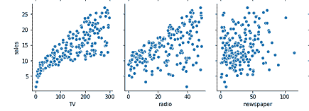
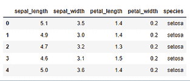
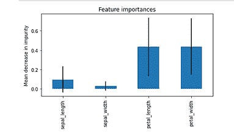

# 特征选择：科学与艺术的交汇点

> 原文：[`www.kdnuggets.com/2021/12/feature-selection-science-meets-art.html`](https://www.kdnuggets.com/2021/12/feature-selection-science-meets-art.html)

**由 [Mahbubul Alam](https://www.linkedin.com/in/mab-alam/)，数据科学家、经济学家和定量研究员**


图片由 [David Clode](https://unsplash.com/@davidclode?utm_source=medium&utm_medium=referral) 提供，来源于 [Unsplash](https://unsplash.com/?utm_source=medium&utm_medium=referral)

* * *

## 我们的前三个课程推荐

 1\. [Google 网络安全证书](https://www.kdnuggets.com/google-cybersecurity) - 快速进入网络安全职业道路。

 2\. [Google 数据分析专业证书](https://www.kdnuggets.com/google-data-analytics) - 提升你的数据分析技能

 3\. [Google IT 支持专业证书](https://www.kdnuggets.com/google-itsupport) - 支持你的组织进行 IT 管理

* * *

有人说特征选择和工程是数据科学项目中最重要的部分。在许多情况下，不是复杂的算法，而是特征选择在模型性能中起到了决定性作用。

特征过少可能导致模型欠拟合。例如，如果你想预测房价，仅知道卧室数量和楼层面积是不够的。你忽略了买家关心的许多重要变量，例如位置、学区、房产年龄等。

你也可以从另一个角度出发，选择 100 个不同的特征来描述每一个细节，例如物业上的树木名称。与其增加更多信息，这些特征却会增加噪声和复杂性。许多选择的特征可能根本不相关。此外，特征过多还会增加训练模型的计算成本。

那么，要构建一个好的预测模型，应该选择多少特征，如何决定保留哪些特征、丢弃哪些特征以及添加哪些新特征？这是在机器学习项目中管理所谓的[偏差-方差权衡](https://towardsdatascience.com/bias-variance-tradeoff-in-machine-learning-an-intuition-da85228c5074)时的重要考虑因素。

这也是“科学”与“艺术”相遇的地方。

本文的目的是揭示特征选择技术，并进行一些简单的实现。我在下面描述的技术应该在回归和分类问题中同样有效。无监督分类（例如聚类）可能有点棘手，所以我会单独讨论。

## 启发式方法

我们在数据科学中不常谈论启发式方法，但它实际上是相当相关的。我们来看一下定义（来源：[Wikipedia](https://en.wikipedia.org/wiki/Heuristic)）：

> 启发式或启发式技术**….**采用了一种不保证最优、完美或理性的实用方法，但仍足以达到即时的短期目标或近似值。

如果基于直觉进行特征选择，这个定义同样适用。仅通过观察数据集，你会有一种直觉，感觉某些特征是强预测因子，而其他一些与依赖变量无关，你会觉得可以安全地去除它们。

如果你不确定，可以进一步检查特征与依赖变量之间的相关性。

数据集中有太多特征时，仅凭这些启发式方法——直觉和相关性——就可以完成大部分选择合适特征的工作。

例如，假设你的公司正在为不同渠道（电视、广播、报纸）分配广告预算。你想预测哪个渠道作为广告平台最有效，以及预期的回报是什么。

在你建立模型之前，你查看了历史数据，并发现了不同平台上的广告费用与相应销售收入之间的关系。



双变量散点图显示了不同平台上的销售和广告支出之间的关系（图源：作者；数据源：[ISLR](https://rdrr.io/cran/ISLR/)，许可证：GLP 2，公共领域）。

基于散点图，你认为哪些特征最能解释广告收入？显然，报纸广告对结果没有显著影响，因此你可能想从模型中去除它。

## 自动化特征选择

接下来我们将介绍自动化特征选择技术。大多数这些技术都集成在`sklearn`模块中，因此你只需用几行代码就能实现特征选择，格式也很标准。

作为演示，我将使用‘iris’数据集（来源：[Kaggle/UCI 机器学习](https://www.kaggle.com/uciml/iris/metadata)，许可证：CC0 公共领域）。这是一个简单的数据集，只有 5 列，不过你会掌握关键点。

让我们从`seaborn`库加载数据集。

```py
# import seaborn library
**import seaborn as sns**# load iris dataset
**iris = sns.load_dataset('iris')
iris.head(5)**
```



```py
# separate features (X) from the target (y) variable
**X = iris.drop('species', axis=1)
y = iris['species']**
```

在数据集中，“species”是我们想预测的目标，其余的 4 列是预测变量。让我们以编程方式确认特征的数量：

```py
# number of predictors in the current dataset
**X.shape[1]**>> 4
```

现在我们来实现一些特征选择技术。

## 1) 基于卡方的技术

基于卡方的技术根据一些评分选择用户定义的特征数量（k）。这些评分通过计算 X（独立）和 y（依赖）变量之间的卡方统计量来确定。

`sklearn`有内置的卡方特征选择方法。你需要做的就是确定要保留多少个特征（例如，对于鸢尾花数据集，k=3）。

```py
# import modules **from sklearn.feature_selection import SelectKBest, chi2**# select K best features
**X_best = SelectKBest(chi2, k=3).fit_transform(X,y)** 
```

现在让我们确认我们从 4 个特征中选择了 3 个最佳特征。

```py
# number of best features
**X_best.shape[1]**>> 3
```

对于大量特征，你可以指定希望保留或丢弃的特征百分比。这与上述方法类似。假设我们希望保留 75%的特征，丢弃剩余的 25%。

```py
# keep 75% top features 
**X_top = SelectPercentile(chi2, percentile = 75).fit_transform(X,y)**# number of best features
**X_top.shape[1]**>> 3
```

## 2) 基于杂质的特征选择

基于树的算法（例如随机森林分类器）具有内置的`feature_importances_`属性。

决策树会使用减少杂质的特征来划分数据（杂质的度量标准为[基尼杂质](https://en.wikipedia.org/wiki/Decision_tree_learning#Gini_impurity)或[信息增益](https://en.wikipedia.org/wiki/Decision_tree_learning#Information_gain)）。这意味着，找到最佳特征是算法解决分类问题的关键部分。我们可以通过`feature_importances_`属性来访问最佳特征。

首先让我们将“鸢尾花”数据集拟合到具有 200 个估计器的随机森林分类器上。

```py
# import model
**from sklearn.ensemble import RandomForestClassifier**# instantiate model
**model = RandomForestClassifier(n_estimators=200, random_state=0)**# fit model
**model.fit(X,y)**
```

现在让我们通过属性调用来访问特征的重要性。

```py
# importance of features in the model
**importances = model.feature_importances_****print(importances)**>> array([0.0975945 , 0.02960937, 0.43589795, 0.43689817])
```

上述输出显示了每个特征在减少每个节点/分裂的杂质方面的重要性。

由于随机森林分类器有许多估计器（例如，上述 200 棵决策树），我们可以计算相对重要性的估计值及其置信区间。让我们将其可视化。

```py
# calculate standard deviation of feature importances 
**std = np.std([i.feature_importances_ for i in model.estimators_], axis=0)**# visualization**feat_with_importance  = pd.Series(importances, X.columns)****fig, ax = plt.subplots()
feat_with_importance.plot.bar(yerr=std, ax=ax)
ax.set_title("Feature importances")
ax.set_ylabel("Mean decrease in impurity")
fig.tight_layout()**
```



图：特征在杂质度量中的重要性（来源：作者）

现在我们知道了每个特征的重要性，我们可以手动（或通过视觉）确定要保留哪些特征，删除哪些特征。

另外，我们可以利用 Scikit-Learn 的元转换器`SelectFromModel`来为我们完成这项工作。

```py
# import the transformer
**from sklearn.feature_selection import SelectFromModel**# instantiate and select features
**selector = SelectFromModel(estimator = model, prefit=True)
X_new = selector.transform(X)
X_new.shape[1]**>> 2
```

## 3) 正则化

正则化是机器学习中的一个重要概念，用于减少过拟合（详见：[通过正则化避免过拟合](https://towardsdatascience.com/avoid-overfitting-with-regularization-6d459c13a61f)）。如果特征过多，正则化可以控制它们的影响，方法是缩小特征系数（称为 L2 正则化/岭回归）或将某些特征系数设为零（称为 L1 正则化/LASSO 回归）。

一些线性模型具有内置的 L1 正则化作为超参数来惩罚特征。这些特征可以通过元转换器`SelectFromModel`来消除。

让我们实现`LinearSVC`算法，超参数为*penalty = ‘l1’*。然后我们将使用`SelectFromModel`来移除一些特征。

```py
# implement algorithm
**from sklearn.svm import LinearSVC
model = LinearSVC(penalty= 'l1', C = 0.002, dual=False)
model.fit(X,y)**# select features using the meta transformer
**selector = SelectFromModel(estimator = model, prefit=True)
X_new = selector.transform(X)
X_new.shape[1]**>> 2# names of selected features
**feature_names = np.array(X.columns)
feature_names[selector.get_support()]**>> array(['sepal_length', 'petal_length'], dtype=object)
```

## 4) 顺序选择

顺序特征选择是一种古老的统计技术。在这种情况下，你一个接一个地将特征添加到模型中（或从模型中移除），检查模型性能，然后启发式地选择要保留的特征。

顺序选择有两种变体。*前向选择*技术从零特征开始，然后添加一个最小化误差的特征；然后再添加另一个特征，以此类推。*后向选择*则在相反的方向上工作。模型从所有特征开始并计算误差；然后它会删除一个进一步最小化误差的特征，以此类推，直到剩下所需数量的特征。

Scikit-Learn 模块有`SequentialFeatureSelector`元变换器来简化操作。请注意，它适用于`sklearn`v0.24 或更高版本。

```py
# import transformer class
**from sklearn.feature_selection import SequentialFeatureSelector**# instantiate model
**model = RandomForestClassifier(n_estimators=200, random_state=0)**# select features
**selector = SequentialFeatureSelector(estimator=model, n_features_to_select=3, direction='backward')
selector.fit_transform(X,y).shape[1]**>> 3# names of features selected
**feature_names = np.array(X.columns)
feature_names[selector.get_support()]**>> array(['sepal_width', 'petal_length', 'petal_width'], dtype=object)
```

## **替代技术……**

除了我刚才描述的技术，还有一些其他方法可以尝试。其中一些方法并不是专门为特征选择设计的，但如果你深入挖掘，你会发现它们可以被创造性地应用于特征选择。

+   **Beta 系数**：你在进行线性回归后得到的系数（Beta 系数）显示了因变量对每个特征的相对敏感性。从这里你可以选择具有高系数值的特征。

+   **p 值**：如果你在经典统计软件包（例如`statsmodels`）中实现回归，你会发现模型输出包括每个特征的 p 值（[查看此内容](https://www.statsmodels.org/stable/regression.html)）。p 值测试的是系数是否恰好为零的原假设。因此，你可以排除那些与高 p 值相关的特征。

+   [**方差膨胀因子（VIF）**](https://etav.github.io/python/vif_factor_python.html)：VIF 通常用于检测数据集中的多重共线性。统计学家通常会删除具有高 VIF 的变量，以满足线性回归的关键假设。

+   [**赤池信息量准则（AIC/BIC）**](https://en.wikipedia.org/wiki/Akaike_information_criterion)：通常 AIC 和 BIC 用于比较两个模型之间的性能。但你可以利用它们进行特征选择，例如选择某些特征以获得在 AIC/BIC 度量下更好的模型质量。

+   **主成分分析（PCA）**：如果你知道 PCA 是什么，你猜对了。它不完全是特征选择技术，但 PCA 的降维特性可以用于这一效果，而不是完全消除特征。

+   **以及其他许多：** 有相当多的其他特征选择类，这些类随`sklearn`模块一起提供，[查看文档](https://scikit-learn.org/stable/modules/classes.html#module-sklearn.feature_selection)。最近也在一篇[科学论文](https://www.sciencedirect.com/science/article/pii/S2314717218300059)中提出了一种基于聚类的算法。费舍尔评分（Fisher’s Score）也是另一种可用的技术。

## 聚类怎么样？

聚类是一种无监督的机器学习算法，这意味着你将数据输入到聚类算法中，算法会根据某些“属性”来确定如何将数据分成不同的簇。这些属性实际上来自于特征。

聚类是否需要特征选择？当然需要。没有合适的特征，聚类可能会毫无用处。假设你想要对客户进行细分，以便销售高端、中端和低端产品。这意味着你隐含地使用了*客户收入*作为一个因素。你还可以将*教育*因素考虑进去。他们的*年龄*和工作*经验*呢？当然。但随着特征数量的增加，算法可能会对你想要达到的目标感到困惑，因此输出结果可能不会完全符合你的期望。

也就是说，数据科学家在运行聚类算法时并不是在孤立的环境中进行，他们通常有一个假设或问题在心中。因此，特征必须对应于这个需求。

## 摘要

数据科学家非常重视特征选择，因为它对模型性能有很大影响。对于低维数据集，启发式方法和直觉效果很好，但对于高维数据，有自动化技术可以完成这项工作。最有用的技术包括卡方检验和基于杂质的算法以及正则化和序列特征选择。此外，还有其他替代技术，如回归中的贝塔系数、p 值、VIF、AIC/BIC 和降维。

在这篇文章的标题中，我提到“科学遇见艺术”。这是因为特征选择没有对错之分。我们可以使用科学工具，但最终，可能是由数据科学家做出的主观决策。

感谢阅读。欢迎 [订阅](https://mab-datasc.medium.com/subscribe) 以接收我即将发布的文章，或通过 [Twitter](https://twitter.com/DataEnthus) 或 [LinkedIn](https://www.linkedin.com/in/mab-alam/) 与我联系。

**简历：[Mahbubul Alam](https://www.linkedin.com/in/mab-alam/)** 拥有超过 8 年的数据科学工作经验，主要应用于政策和商业决策，并与政府和非政府组织的利益相关者密切合作，帮助通过数据驱动的解决方案做出更好的决策。Mab 对统计建模和数据科学的各个方面充满热情——从调查设计和数据收集到构建先进的预测模型。Mab 还教授/指导了一门数据科学和商业分析课程，专为早期到中期职业分析师、团队负责人以及转型为数据科学的 IT 专业人员或在其组织内构建数据科学能力的人员设计。

[原文](https://towardsdatascience.com/feature-selection-where-science-meets-art-639757d91293)。经许可转载。

**相关：**

+   警惕自动特征选择 — 卡方独立性检验示例

+   特征选择 – 你想了解的一切

+   从头开始：ML 可解释性的排列特征重要性

### 更多相关内容

+   [机器学习中的替代特征选择方法](https://www.kdnuggets.com/2021/12/alternative-feature-selection-methods-machine-learning.html)

+   [机器学习模型的高级特征选择技术](https://www.kdnuggets.com/2023/06/advanced-feature-selection-techniques-machine-learning-models.html)

+   [特征存储峰会 2022：关于特征工程的免费会议](https://www.kdnuggets.com/2022/10/hopsworks-feature-store-summit-2022-free-conference-feature-engineering.html)

+   [检索增强生成：信息检索与文本生成的结合](https://www.kdnuggets.com/retrieval-augmented-generation-where-information-retrieval-meets-text-generation)

+   [线性回归模型选择：平衡简洁性与复杂性](https://www.kdnuggets.com/2023/02/linear-regression-model-selection-balancing-simplicity-complexity.html)

+   [确保 LLMs 的可靠少量样本提示选择](https://www.kdnuggets.com/2023/07/ensuring-reliable-fewshot-prompt-selection-llms.html)
