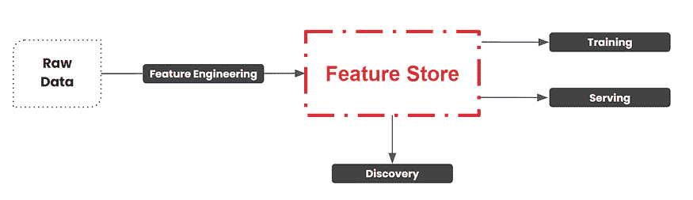
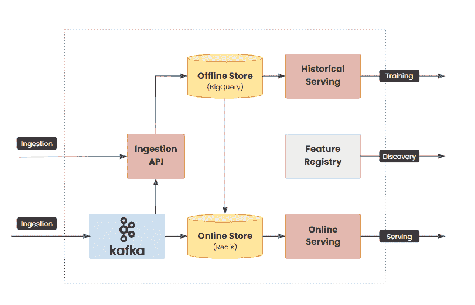
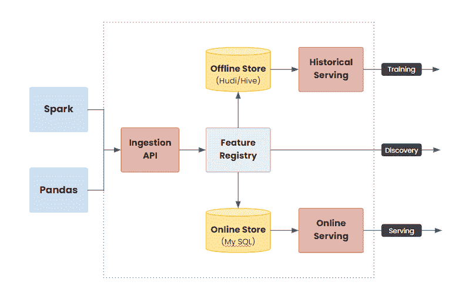
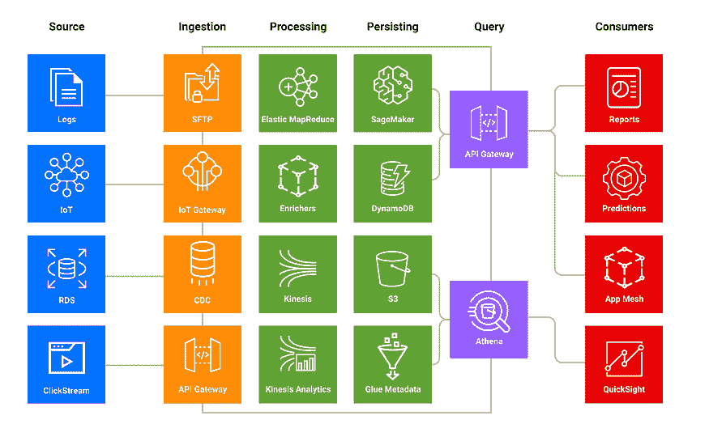
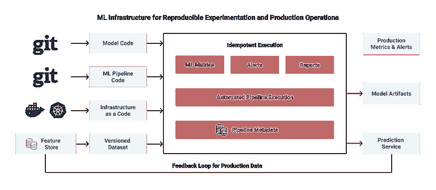
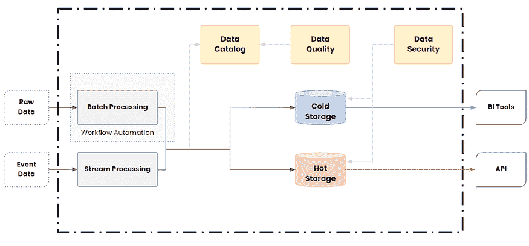
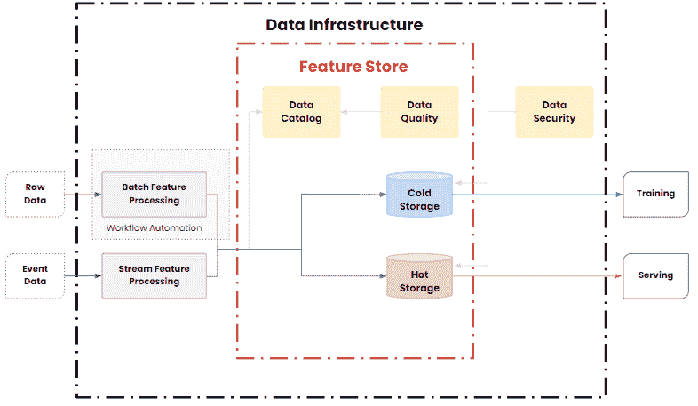
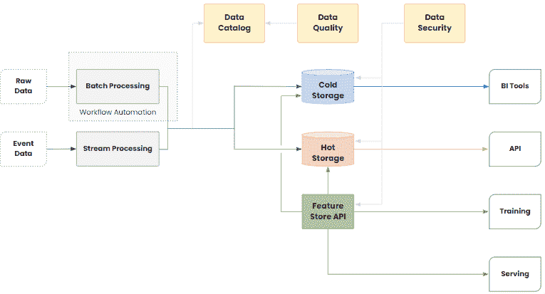
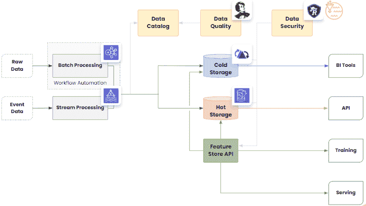
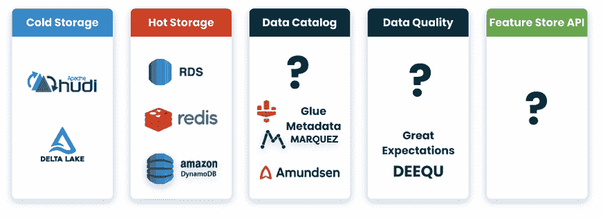

# 特征存储作为机器学习的基础

> 原文：[`www.kdnuggets.com/2021/02/feature-store-foundation-machine-learning.html`](https://www.kdnuggets.com/2021/02/feature-store-foundation-machine-learning.html)

评论

**由 [German Osin](https://medium.com/@gosin)，Provectus 的高级解决方案架构师**。

* * *

## 我们的前三大课程推荐

 1\. [谷歌网络安全证书](https://www.kdnuggets.com/google-cybersecurity) - 快速进入网络安全职业生涯。

 2\. [谷歌数据分析专业证书](https://www.kdnuggets.com/google-data-analytics) - 提升你的数据分析技能

 3\. [谷歌 IT 支持专业证书](https://www.kdnuggets.com/google-itsupport) - 支持你在 IT 领域的组织

* * *

*图像由 [Yurchanka Siarhei](https://www.shutterstock.com/ru/g/Yurchanka+Siarhey) 提供，来源于 [shutterstock](https://www.shutterstock.com/ru/image-illustration/artificial-digital-neural-network-blockchain-technology-1046678647)。*

人工智能和机器学习已达到一个转折点。在 2020 年，各种规模的组织开始将他们的机器学习项目从实验阶段发展到工业规模的生产阶段。在这个过程中，他们意识到自己在特征定义和提取上浪费了大量时间和精力。

特征存储是机器学习栈和任何强大数据基础设施的一个基本组件，因为它使得特征工程和管理变得高效。它还允许特征的简单重用、公司内部的特征标准化，以及离线和在线模型之间的特征一致性。一个集中的、可扩展的特征存储可以使组织更快地创新，并在大规模上推动机器学习过程。

[Provectus](https://provectus.com/) 的团队已经构建了多个特征存储，我们希望分享我们的经验和经验教训。在这篇文章中，我们将探讨特征存储如何帮助消除返工，并在团队之间强制执行从源头到模型的数据可追溯性。我们将深入了解构建可扩展特征存储的具体细节，并讨论如何在实时和训练特征之间实现一致性，以及如何通过时间旅行改善数据的可重复性。

### 什么是特征存储？

特征存储是机器学习特征的数据管理层。机器学习特征是被观察现象的可测量属性，如原始词汇、像素、传感器值、数据存储中的数据行、CSV 文件中的字段、聚合（最小值、最大值、总和、均值）或衍生表示（嵌入或聚类）。

从业务角度来看，特征存储提供了两个主要好处：

1.  **通过降低每个模型的成本，从特征工程中获得更好的投资回报率**，这促进了特征的协作、共享和重用。

1.  **通过提高 ML 工程师的生产力，加快新模型的市场投放时间**。这使组织能够将存储实现和特征服务 API 从 ML 工程师中解耦，解放他们去专注于模型，而不是延迟问题，从而更高效地进行在线服务。

一些使用场景不需要集中式、可扩展的特征存储。特征存储适用于那些模型需要有状态、不断变化的系统表示的项目。这些使用场景的例子包括需求预测、个性化和推荐引擎、动态定价优化、供应链优化、物流和运输优化、欺诈检测以及预测性维护。

### 特征存储的概念

标准化的特征存储具有围绕它的一些关键概念。这些概念包括：

1.  **在线特征存储**。在线应用程序查找一个特征向量，该向量被发送到 ML 模型进行预测。

1.  **ML 特定元数据**。支持特征的发现和重用。

1.  **ML 特定 API 和 SDK**。用于获取训练特征集和在线访问的高级操作。

1.  **物化版本化数据集**。维护用于训练 ML 模型的特征集的版本。

*图片来源：作者。*

上述所有概念都在图像中表示。分析数据从数据湖中获取，并通过特征工程管道推送，输出结果存储在特征存储中。从那里，ML 工程师可以发现特征，使用它们来训练新模型，然后重用这些特征进行服务。

这四个概念得到了多个产品的支持。市场上的领导者包括 Feast、Tecton、Hopsworks 和 [AWS SageMaker 特征存储](https://aws.amazon.com/ru/sagemaker/feature-store/)。我们将重点关注开源产品：Feast 和 Hopsworks。

**#1 Feast**

[Feast](https://feast.dev/) 是一个 ML 服务，帮助团队弥合数据与机器学习模型之间的差距。它允许团队在生产环境中注册、摄取、服务和监控特征。

该服务处于积极开发阶段，但已在 GoJek、Farfetch、Postmates 和 Zulily 中经过实际测试。它可以与 Kubeflow 集成，并且得到 Kubeflow 强大社区的支持。

截至 2020 年，Feast 仅支持 GCP。它在基础设施上要求较高，缺乏可组合性，也不提供数据版本控制。请注意，公司计划在 2021 年的路线图中解决这些挑战。从 2020 年 11 月起，Feast 作为 [Tecton 的开源版本](https://www.tecton.ai/blog/feast-announcement/) 发布。

*图片来源：作者。*

**#2 Hopsworks**

[Hopsworks](https://www.logicalclocks.com/)是一个用于开发和操作 AI 应用的企业平台。它使团队能够快速高效地管理机器学习特性。Hopsworks 背后的团队是特性存储的倡导者，他们提供了许多优秀的教育内容。

Hopsworks 特性存储可以与大多数 Python 库进行集成，用于数据摄取和训练。它还支持具有时间旅行功能的离线存储。最重要的是，它支持 AWS、GCP、Azure 和本地部署。

使 Hopsworks 使用起来具有挑战性的原因在于其对 HopsML 基础设施的高度依赖。此外，Hopsworks 在线存储可能无法满足所有的延迟要求。

*图片来源于作者。*

### 现代数据平台的挑战

在研究构建特性存储的具体细节之前，必须考虑现代数据平台的挑战。特性存储不能孤立于其他数据和[机器学习基础设施](https://provectus.com/machine-learning-infrastructure/)之外进行审视。

传统的标准数据湖架构如下所示：

*图片来源于作者。*

这种高级架构包含了数据源、数据摄取、数据处理、数据持久化、数据查询以及消费者组件。虽然它在大多数任务中表现良好，但并不理想。

**数据访问和发现性** 可能会成为一个问题。数据分散在多个数据源和服务中。这曾经有助于保护数据，但现在仅增加了新的复杂性，并造成数据孤岛。这种架构需要管理 AWS IAM 角色、Amazon S3 策略、API 网关和数据库权限的繁琐过程。在多账户设置中，这个问题变得更加复杂。因此，工程师对数据的存在以及实际可以访问的数据感到困惑，因为元数据默认情况下是不可发现的。这导致由于数据访问问题，数据和机器学习的投资受到限制。

**单体数据团队**是另一个需要考虑的问题。由于数据和机器学习团队非常专业化，他们往往需要在脱离上下文的情况下工作。缺乏所有权和领域背景会导致数据生产者和数据消费者之间出现数据孤岛，使得一个积压的数据团队很难跟上业务需求。在这种情况下，数据和机器学习工程会受到复杂依赖的困扰，无法同步操作。在这种情况下，任何快速的端到端实验都是不可能的。

**机器学习实验基础设施** 是未知领域。传统架构缺乏实验组件，这不仅导致数据发现和数据访问问题，还使得维护数据集、ML 流水线、ML 环境和离线实验的可重复性变得更加复杂。尽管 Amazon SageMaker 和 Kubeflow 在这方面取得了一些进展，但可重复性仍然是一个问题。生产实验框架不成熟，无法完全依赖。因此，从数据到生产 ML 推送一个端到端实验可能需要三到六个月。

**在生产中扩展 ML** 是复杂的，需要大量的时间和精力。虽然机器学习主要讨论的是离线活动（如数据收集、处理、模型训练、结果评估等），但实际应用中模型的使用和服务方式才是关键。使用传统架构时，无法以统一和一致的方式在模型服务期间访问特征，也无法在多个训练流水线和 ML 应用之间重用特征。ML 应用的监控和维护也更加复杂。因此，从 1 到 100 个生产模型的扩展所需的时间和成本呈指数增长，这限制了组织按预期速度创新的能力。

### 新兴的架构转变

为了解决这些挑战，出现了几种架构转变：

1.  **从数据湖到 Hudi/Delta 湖**。数据湖不仅仅是 Amazon S3 中的一个文件夹。它是一个功能丰富、完全托管的数据摄取、增量处理和服务的层，具有 ACID 事务和时间点查询。

1.  **从数据湖到数据网格**。数据领域、数据管道、元数据和 API 的所有权正在从集中式团队转移到产品团队。另一个有影响的好处是将数据视为完整的产品而不是没人关心的副产品。

1.  **从数据湖到数据基础设施平台**。如果数据的所有权是分散的，平台组件必须统一并打包成一个可重用的数据平台。

1.  **从端点保护到全球数据治理**。作为向集中式数据平台转变的一部分，组织正在从端点保护转向全球数据治理，这是一个更高级别的控制计划，用于管理跨可用数据源的安全性和数据访问政策。

1.  **从元数据存储到全球数据目录**。像 Hive 元数据存储这样的元数据存储无法聚合多个数据源。行业需要一个全球数据目录，以支持数据发现、数据血缘和版本控制的用户体验。

1.  **特征库**。特征库是 ML 堆栈中新兴的组件，通过为 ML 特征添加独立的数据管理层，实现了 ML 实验和操作的扩展。

所有这些转换都是并行进行的，应该从整体上考虑。你不能在设计功能存储时，却拥有独立的数据目录来处理功能和其他数据应用。在构建功能存储时，你必须依赖数据版本控制功能，这可以轻松成为其他并行项目的一部分。

在继续之前，简要介绍一下驱动上述从离散 ML 作业到 MLOps 转变的四个主要组成部分，以提供功能存储重要性的更广泛背景。

**#1 Delta/Hudi 数据湖**

ACID 数据湖支持管理的摄取、ML 训练的高效数据集版本控制、廉价的“删除”以实现 GDPR/CCPA 合规，以及用于数据摄取的“更新”。它们还提供审计日志来跟踪数据集的变化和 ACID 事务，同时通过模式强制执行数据质量。Delta 和 Hudi 数据湖将流处理引入大数据，比传统的批处理更高效地提供新鲜数据。

**#2 全球数据治理**

由于在用户级别管理 AWS IAM 角色、Amazon S3 策略、API 网关和数据库权限不再是标准，公司应该使用全公司范围的数据治理结构来：

1.  **通过你已有的数据加速隐私操作。** 自动化业务流程、数据映射以及隐私工作流中的 PI 发现和分类。

1.  **在中央位置实现政策操作。** 管理隐私政策以确保政策在整个企业中得到有效管理。定义和记录工作流、可追溯性视图和业务流程登记簿。

1.  **在多个法规中实现合规性。** 使用以隐私为设计和构建的可以轻松扩展以支持新法规的平台。

**#3 全球数据目录**

虽然这里没有单一的市场领导者，但 Marquez、Amundsen、Apache Atlas、Collibra、Alation 和 Data Hub 值得一提。

全球数据目录对于回答以下问题非常有用：这些数据存在吗？它在哪里？这些数据的真实来源是什么？我是否有访问权限？谁是所有者？这些数据的用户是谁？是否有现有的资产可以重复使用？我可以信任这些数据吗？基本上，它充当了一种元数据存储的角色。

**#4 可重复的机器学习管道**

最终的组成部分是可重复的机器学习管道用于实验。

*作者提供的图片。*

上图表示了 MLOps 和可重复实验管道的架构。它以四个输入开始：ML 模型代码、ML 管道代码、基础设施即代码和版本化数据集。版本化数据集——你的机器学习管道的输入——应该来自功能存储。

### 现代数据基础设施

现在让我们来看一下现代数据基础设施。

*作者提供的图片。*

我们对原始数据进行批处理，对事件数据进行流处理。我们将处理后的成果存储在冷存储中用于业务报告，并在近实时、增量更新的热索引中用于我们的 API。相同的数据可以在这两种场景中使用，为了保持一致性，我们使用不同的 pub/sub 系统。

这是数据平台的传统架构。其目标是提供冷存储和热存储之间的一致性，并允许通过数据目录、数据质量和全球安全进行发现，同时在其基础上实现细粒度控制。

*图片来源：作者。*

如果我们查看功能存储设计，我们将看到功能和基础设施组件几乎与数据平台中的内容完全相同。在这种情况下，功能存储不是一个带来另一个摄取系统、存储、目录和质量门控的独立孤岛。它充当数据平台与 ML 工具之间的轻量级 API。它可以很好地与数据基础设施中已完成的内容集成。它应该是可组合和轻量的，并且没有偏向的设计。

*图片来源：作者。*

当你开始设计和构建数据基础设施时，请考虑迄今为止的以下“经验教训”：

1.  在投资功能存储之前，从设计一个一致的 ACID 数据湖开始。

1.  现有开源产品的价值并不足以支持对集成及其带来的依赖的投资。

1.  功能存储不是一种新的基础设施和数据存储解决方案，而是一个集成到现有数据基础设施中的轻量级 API 和 SDK。

1.  数据目录、数据治理和数据质量组件是整个数据基础设施的横向组件，包括功能存储。

1.  目前没有成熟的开源或云解决方案用于全球数据目录和数据质量监控。

### 参考架构

*图片来源：作者。*

这张图展示了我们为客户使用的参考架构。它展示了我们选择使用的服务，但你不应被我们的选择所限制。这里的想法是，你必须根据数据工作负载和业务需求选择冷存储和热存储。

对于热存储，你可以选择 DynamoDB、Cassandra、Hbase 或传统的 RDBMS，如 Mysql、PostgreSQL，甚至 Redis。重要的是你的热存储应该是可组合、可插拔的，并与数据基础设施战略相一致。

对于冷存储，Apache Hudi 和 Delta Lake 是我们的最爱。它们提供如时间旅行、增量摄取和物化视图等功能。

图表中有一些空白区域，我们希望尽快填补。例如，到目前为止，数据目录领域尚无市场领先者。数据质量工具也处于早期阶段。目前，你可以选择 Great Expectations 或 Apache Deequ，这些都是很好的工具，但它们未提供完整解决方案。

*图像由作者提供。*

在上图中，问号占据了你可以从开源社区构建的解决方案、内部自行构建的解决方案或与云服务提供商（例如 AWS 最新的 [Amazon SageMaker 机器学习特征存储](https://aws.amazon.com/ru/sagemaker/feature-store/)）合作的空间。

### 继续推进特征存储

尽管特征存储仍处于早期阶段，但那些不仅仅在实验而是积极将机器学习项目投入生产的组织已经意识到需要一个集中式存储库来存储、更新、检索和共享特征。

在本文中，我们展示了如何设计和构建这样的存储库。尽管这里的一些观点有争议，并且欢迎社区反馈，但很明显：

1.  你的现有数据基础设施应覆盖至少 90% 的特征存储需求，包括流式摄取、一致性、数据目录和版本控制，以实现预期效果。

1.  构建一个轻量级的特征存储 API 以与现有的内部存储解决方案集成是有意义的。

1.  你应该与社区和云供应商合作，以保持与标准和最新生态系统的兼容性。

1.  随着市场的成熟，你应该准备迁移到托管服务或开源替代方案。

[原文](https://towardsdatascience.com/feature-store-as-a-foundation-for-machine-learning-d010fc6eb2f3)。经许可转载。

**相关内容：**

+   [特征存储与数据仓库](https://www.kdnuggets.com/2020/12/feature-store-vs-data-warehouse.html)

+   [机器学习堆栈中的关键缺失部分](https://www.kdnuggets.com/2020/04/missing-part-machine-learning-stack.html)

+   [特征提取的搭车指南](https://www.kdnuggets.com/2019/06/hitchhikers-guide-feature-extraction.html)

### 更多相关话题

+   [特征存储峰会 2022：关于特征工程的免费会议](https://www.kdnuggets.com/2022/10/hopsworks-feature-store-summit-2022-free-conference-feature-engineering.html)

+   [特征存储峰会 2023：部署 ML 的实用策略…](https://www.kdnuggets.com/2023/09/hopsworks-feature-store-summit-2023-practical-strategies-deploying-ml-models-production-environments)

+   [机器学习元数据存储](https://www.kdnuggets.com/2022/08/machine-learning-metadata-store.html)

+   [基础模型是什么？它们如何工作？](https://www.kdnuggets.com/2023/05/foundation-models-work.html)

+   [Segment Anything Model: 图像分割的基础模型](https://www.kdnuggets.com/2023/07/segment-anything-model-foundation-model-image-segmentation.html)

+   [生产环境机器学习的元数据存储！](https://www.kdnuggets.com/2022/05/layer-metadata-store-production-ml.html)
