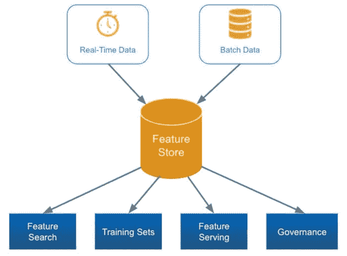
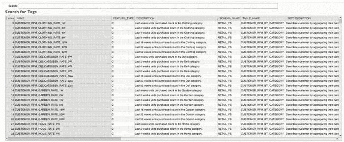
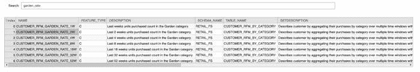
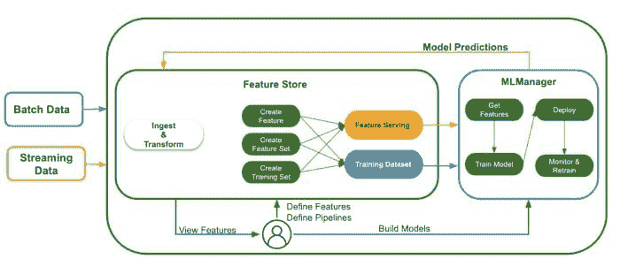
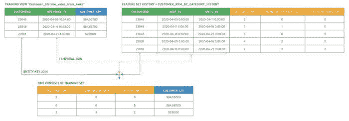

# 特征存储——如何避免感觉每天都是土拨鼠日

> 原文：[`www.kdnuggets.com/2021/05/feature-stores-how-avoid-feeling-every-day-is-groundhog-day.html`](https://www.kdnuggets.com/2021/05/feature-stores-how-avoid-feeling-every-day-is-groundhog-day.html)

评论

**由[Monte Zweben](https://www.linkedin.com/in/mzweben/)，Splice Machine 首席执行官**。

数据科学家的工作遵循一个周期：登录、清理数据、定义特征、测试和构建模型，并确保模型运行顺畅。听起来足够简单，但周期中的所有部分并不相同：数据准备占据了任何数据科学家[80%](https://www.forbes.com/sites/gilpress/2016/03/23/data-preparation-most-time-consuming-least-enjoyable-data-science-task-survey-says/?sh=4c15c90e6f63)的时间。无论你在做什么项目，大多数日子里你都在清理数据并将原始数据转换成机器学习模型可以理解的特征。单调的数据准备工作将小时混合在一起，使每一天的工作感觉与之前的一天相同。

*为什么你不能更有效地完成这一繁琐的过程？*

你可以通过特征存储来实现。一个[特征存储](https://towardsdatascience.com/do-you-need-a-feature-store-35b90c3d8963)是一个可共享的特征库，用于自动化数据输入、跟踪和治理到机器学习模型中。特征存储计算和存储特征，使它们可以在公司内部注册、发现、使用和共享。特征存储确保特征始终为预测保持最新，并以一致的方式维护每个特征值的历史，以便模型可以无缝地进行训练和再训练。

那么，这将如何为你节省时间呢？很高兴你问了。

### 重用特征和 ETL 管道

首先，特征存储允许你为每个创建的模型重用特征和数据管道。无需再等待数据工程师定制的 ETL 管道，也不需要从以前的模型中复制、粘贴和调整特征定义——只需搜索、查找并使用你想要的特征。

### 一致的模型监控

此外，特征存储允许你确保生成特征的代码与已部署模型所见的代码相同。由于特征存储使用相同的管道来获取特征和训练集，它们会自动保持一致。这使得评估和训练模型变得简单，特别是在规模较大时，你开始失去对不同训练集存储位置和更新时间的追踪。

例如，在训练时每周汇总开始于周日，而在部署时开始于周一，这样的做法会导致不一致性。使汇总在两个情况下都在同一天开始，可以更容易地识别模型或特征漂移。此外，如果出现问题，重新训练模型也会更简单，因为可以参考单一位置的真实数据点。

### 避免数据泄露

从历史值创建训练集本身就是复杂的，但当你构建一个需要定期重新训练的模型时，检索不同的时间序列特征集会更加麻烦。编写复杂的 SQL 时间连接是一项繁重的工作，通常超出了大多数数据科学家的技能范围。很容易出现错误，可能会影响模型的效果。

特征存储记录特征被观察到的时间，以及何时被添加到特征存储中，因此你可以在任何时间点识别特征的值。通过记录这些时间戳，特征存储系统自动实现了构建训练集时的时点准确性。这使得在准确数据上训练模型变得非常容易，并且可以自动重新训练模型而无需担心数据泄露。

很多人认为数据科学家大部分时间都在测试和构建模型，但模型的运行离不开对数据的处理。特征存储系统跟踪每个数据管道、特征以及所有相关的元数据，使得构建模型所需的各个部分都可以重用、轻松共享，并完全透明以供审查。通过确保每项任务只需完成一次，你可以节省时间和精力，专注于其他项目。特征存储系统是效率的明智选择；如果你想了解它们对整个业务规模的影响，你可以阅读我的博客文章，"[你需要一个特征存储系统吗](https://towardsdatascience.com/do-you-need-a-feature-store-35b90c3d8963)？"

**个人简介：** [Monte Zweben](https://www.linkedin.com/in/mzweben/) 是 [Splice Machine](https://splicemachine.com/) 的联合创始人兼首席执行官，Splice Machine 是一家实时 AI 公司。作为一位技术行业资深人士，Monte 的早期职业生涯在 NASA 艾姆斯研究中心担任人工智能部门副主任期间，他因在航天飞机项目中的贡献获得了著名的太空行动奖。Monte 随后转向创业领域，创办了业内领先的 Blue Martini 和 Red Pepper Software 初创公司。Monte 曾在《哈佛商业评论》、各种计算机科学期刊和会议论文集中发表文章。他曾担任 Rocket Fuel Inc. 的主席，并在卡内基梅隆大学计算机科学学院的院长咨询委员会任职。

**相关：**

+   [特征存储作为机器学习的基础](https://www.kdnuggets.com/2021/02/feature-store-foundation-machine-learning.html)

+   [特征存储与数据仓库](https://www.kdnuggets.com/2020/12/feature-store-vs-data-warehouse.html)

+   [机器学习栈中的一个关键缺失部分](https://www.kdnuggets.com/2020/04/missing-part-machine-learning-stack.html)

* * *

## 我们的三大课程推荐

 1\. [谷歌网络安全证书](https://www.kdnuggets.com/google-cybersecurity) - 快速进入网络安全职业生涯。

 2\. [谷歌数据分析专业证书](https://www.kdnuggets.com/google-data-analytics) - 提升你的数据分析技能

 3\. [谷歌 IT 支持专业证书](https://www.kdnuggets.com/google-itsupport) - 支持你的组织 IT

* * *

### 更多相关主题

+   [实时 AI 和机器学习中的特征存储](https://www.kdnuggets.com/2022/03/feature-stores-realtime-ai-machine-learning.html)

+   [特征存储峰会 2022：关于特征工程的免费会议](https://www.kdnuggets.com/2022/10/hopsworks-feature-store-summit-2022-free-conference-feature-engineering.html)

+   [避免这 5 个 AI 初学者常犯的错误](https://www.kdnuggets.com/avoid-these-5-common-mistakes-every-novice-in-ai-makes)

+   [我每天使用 ChatGPT 5 个月，这里有一些隐藏的宝藏…](https://www.kdnuggets.com/2023/07/used-chatgpt-every-day-5-months-hidden-gems-change-life.html)

+   [你应该避免数据科学职业的 5 个主要理由](https://www.kdnuggets.com/2022/04/top-5-reasons-avoid-data-science-career.html)

+   [新手数据科学家应避免的错误](https://www.kdnuggets.com/2022/06/mistakes-newbie-data-scientists-avoid.html)
