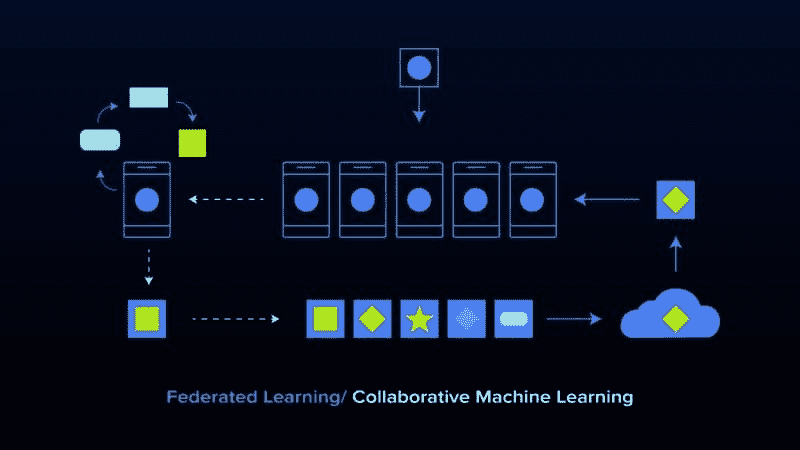
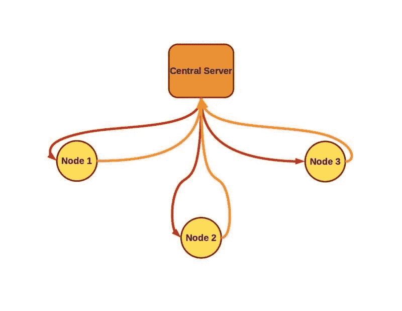
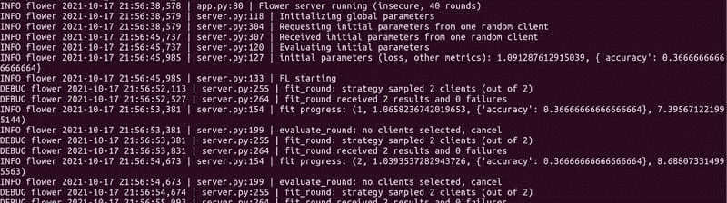
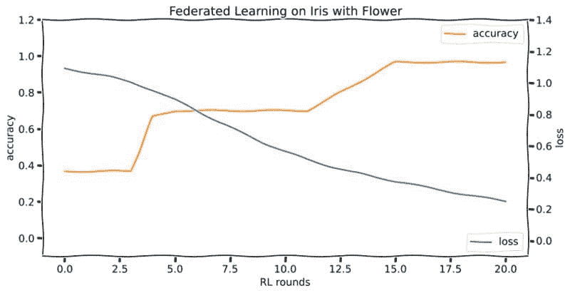

# 联邦学习：协作机器学习及如何入门教程

> 原文：[`www.kdnuggets.com/2021/12/federated-learning-collaborative-machine-learning-tutorial-get-started.html`](https://www.kdnuggets.com/2021/12/federated-learning-collaborative-machine-learning-tutorial-get-started.html)



### **联邦学习：实验室和实际应用中的隐私、安全性和数据主权（附教程）**

* * *

## 我们的前三大课程推荐

 1\. [Google 网络安全证书](https://www.kdnuggets.com/google-cybersecurity) - 快速进入网络安全职业道路。

 2\. [Google 数据分析专业证书](https://www.kdnuggets.com/google-data-analytics) - 提升你的数据分析技能。

 3\. [Google IT 支持专业证书](https://www.kdnuggets.com/google-itsupport) - 为你的组织提供 IT 支持。

* * *

联邦学习，也称为协作学习，允许在保持数据分布在生成数据的设备上的情况下进行大规模的[模型训练](https://www.exxactcorp.com/Deep-Learning-NVIDIA-GPU-Workstations)。敏感数据保留在数据所有者处，训练过程仅通过模型更新让集中训练协调器看到每个客户端的贡献。

联邦学习本身并不能保证隐私（稍后我们将讨论如何破解和修复联邦学习系统中的隐私问题），但它使隐私成为可能。

**联邦学习的应用场景：**

+   移动电话键盘的下一个词预测（*例如* [McMahan *等人* 2017](https://arxiv.org/abs/1811.03604)， [Hard *等人* 2019](https://arxiv.org/abs/1602.05629)）

+   健康研究（*例如* [Kaissis* 等人* 2020](https://www.nature.com/articles/s42256-020-0186-1/)， [Sadilek *等人* 2021](https://www.nature.com/articles/s41746-021-00489-2)）

+   自动驾驶汽车（*例如* [Zeng* 等人* 2021](https://arxiv.org/abs/2102.03401)， [OpenMined 博客文章](https://blog.openmined.org/making-autonomous-vehicles-robust-active-learning-federated-learning-v2x/)）

+   “智能家居”系统（*例如* [Matchi* 等人* 2019](https://ieeexplore.ieee.org/stamp/stamp.jsp?tp=&arnumber=8844592)， [Wu* 等人* 2020](https://arxiv.org/abs/2012.07450)）

+   … 以及其他任何机器学习预测可能有用的地方，但个人宁愿在选择时不放弃他们的个人数据。这几乎涵盖了所有在个体分辨率下进行预测的场景。

随着公众和政策制定者对数据经济的认识不断提高，对隐私保护机器学习的需求也在上升。因此，数据实践受到越来越多的审视，对尊重隐私的工具，如联邦学习的研究也越来越活跃。理想情况下，联邦学习旨在保护个人和机构的隐私，同时在因商业秘密、私人健康信息或数据泄露风险增加而通常不可能的情况下，使数据相关方之间的合作成为可能。

像欧盟的[通用数据保护条例](https://en.wikipedia.org/wiki/GDPR)或[加州消费者隐私法案](https://www.oag.ca.gov/privacy/ccpa)（以及其他法规）这样的政府规章使得像联邦学习这样的隐私保护策略成为企业保持合法运营的有用工具。同时，在保持模型性能和效率的同时实现所需的隐私和安全程度，仍然面临着许多技术挑战。

最后，从普通数据提供者（如很可能的你，亲爱的读者）的日常角度来看，至少在理论上，有一种方法可以在你的私人健康和财务数据与跟踪你在线上所做的所有其他事情的数据经纪人混杂的生态系统之间架起一道屏障，这种生态系统通常*缺乏*道德基础和安全能力，真是令人欣慰。

如果这些问题引起了你的兴趣，那么继续阅读，了解联邦学习的复杂性以及它在敏感数据上的机器学习中能做些什么。

### ****联邦学习概述****

联邦学习旨在从多个数据源训练一个单一模型，前提是数据保持在源头，不被数据源（即节点、客户端或工作者）或协调训练的中央服务器（如果存在的话）交换。



*在典型的联邦学习方案中，中央服务器将模型参数发送到一组节点（也称为客户端或工作者）。这些节点在本地数据上对初始模型进行若干次更新，并将新训练的权重发送回中央服务器，中央服务器对新的模型参数进行平均（通常考虑到每个节点上进行的训练量）。在这种情况下，任何一个节点上的数据都不会被中央服务器或其他节点直接看到，额外的技术，如安全聚合，能够进一步增强隐私。*

在这个框架内有许多变体。例如，本文主要关注由中央服务器管理的联邦学习方案，该服务器协调多个相同类型设备的训练，每个设备训练自己的本地数据并将结果上传到中央服务器。这是[McMahan 等人在 2017 年](https://arxiv.org/abs/1602.05629)描述的基本方案。然而，也可以去掉集中控制的训练，在某些情况下，这可能是值得的。当单个节点分担中央管理的角色时，这就变成了去中心化的联邦学习，这是一种吸引人的方法，用于在[特权医疗数据](https://www.semanticscholar.org/paper/Decentralized-Federated-Learning-for-Electronic-Lu-Zhang/c838937405bce0365b6d4b1dc80f91c22cfa7b31)上[训练](https://www.semanticscholar.org/paper/BrainTorrent%3A-A-Peer-to-Peer-Environment-for-Roy-Siddiqui/aad543a5b7f231f085764ce0258fe8914a15006f)协作模型。

虽然一个典型的联邦学习场景可能涉及到一群移动电话，例如，所有电话具有大致相似的计算能力并训练相同的模型架构，但一些方案，例如 Diao *et al. 2021*提出的[HeteroFL](https://arxiv.org/abs/2010.01264)，*允许在具有截然不同通信和计算能力的各种设备上训练单个推理模型，甚至可以训练具有不同架构和参数数量的本地模型，然后将训练好的参数汇聚到一个全局推理模型中。*

联邦学习的主要优势源于数据保持在生成它的设备上，例如，一个训练数据集通常比正在训练的模型大得多，发送后者而不是前者可以节省带宽。这些优势中最重要的是隐私的可能性，但仅凭模型参数更新仍然可能推测出私人数据集的内容。

McMahan *et al.* 2017 年使用的简单示例来解释漏洞是一个使用“词袋”输入向量训练的语言模型，其中每个输入向量特定对应于大型词汇表中的单个单词。每个非零梯度更新对于相应的单词会给窃听者提供关于该单词在私人数据集中存在（或缺失）的线索。更[复杂的攻击](https://inpher.io/journal-blog/the-privacy-risk-right-under-our-nose-in-federated-learning-part-1/)也已被证明。因此，联邦学习中可以融入各种隐私增强技术，从[安全聚合](https://dl.acm.org/doi/10.1145/3133956.3133982)更新到使用[全同态加密](https://www.usenix.org/conference/atc20/presentation/zhang-chengliang)进行训练。我们将在下一节简要讨论联邦学习中最突出的隐私威胁及其缓解措施。

### ****联邦学习的持续起源故事****

数据隐私的州级监管是一个新兴的政策领域，大约在个人数据收集和分析的全球经济大部分发展之后的 10 到 20 年才获得了动量。最突出的个人数据监管是 2016 年颁布的欧洲[通用数据保护条例](https://en.wikipedia.org/wiki/General_Data_Protection_Regulation)，更常被称为 GDPR。

可能会让人感到惊讶的是，鉴于美国类似的保护措施限制公司监视和数据收集仍处于萌芽阶段或缺失，但美国白宫在 2012 年发布了一份详细的报告，概述了类似的原则（[pdf](https://obamawhitehouse.archives.gov/sites/default/files/privacy-final.pdf)），包括聚焦收集、数据安全和透明度、对收集数据的控制，以及对收集数据用于一个目的而不会用于无关目的的期望。

[加州消费者隐私法](https://www.oag.ca.gov/privacy/ccpa)在 2018 年跟随欧盟的 GDPR 成为法律。作为一项州法律，加州消费者隐私法的地理范围相较于 GDPR 显著有限，尽管该法案有类似的目标，但对个人信息的定义略为狭窄。联邦学习是一种可以用来给隐私带来机会的机器学习工具。

*联邦学习*这一术语在 McMahan *et al.* 2017 年的一篇[论文](https://arxiv.org/abs/1602.05629)中首次提出，用于描述在分散数据上训练模型。作者根据上述 2012 年白宫关于消费者数据隐私的报告，为他们的系统设计策略进行了框架构建。他们提出了联邦学习的两个主要应用场景：图像分类，以及用于语音识别或下一个词/短语预测的语言模型。

不久之后，分布式训练相关的潜在攻击面就被展示出来了。[Phong *et al.* 2017](https://ieeexplore.ieee.org/document/8241854) 和 [Bhowmick et al. 2018](https://arxiv.org/abs/1812.00984)等人的研究表明，即使仅访问来自联邦学习客户端的梯度更新或部分训练模型，也可以推断出描述私有数据的一些细节。有关隐私问题及其缓解的总结可以在[inpher.io 的这篇博客文章](https://inpher.io/journal-blog/the-privacy-risk-right-under-our-nose-in-federated-learning-part-1/)中找到。

联邦学习在隐私、有效性和效率之间的平衡涉及广泛的范围。服务器与客户端之间（或仅在去中心化客户端之间）的通信可以在传输和静态状态下加密，但还有一种更强大的选项，即数据和模型在训练期间也保持加密。[同态加密](https://en.wikipedia.org/wiki/Homomorphic_encryption)可以用于对加密数据进行计算，因此（理想情况下）只有持有密钥的利益相关者才能解密结果。像 OpenMined 的[PySyft](https://github.com/OpenMined/PySyft)、微软的[SEAL](https://github.com/Microsoft/SEAL)或[TensorFlow Encrypted](https://github.com/tf-encrypted/tf-encrypted)这样的库提供了可应用于联邦学习系统的加密深度学习工具。

关于联邦学习的讨论到此为止，接下来我们将在教程部分设置一个简单的联邦学习演示。

### ****联邦 ML 教程：使用 Flower 库在鸢尾花数据集上进行联邦学习****

***如果你在运行此教程代码时遇到任何问题，并希望查看一个有效的示例，可以尝试通过浏览器运行[这个 mybinder 链接](https://mybinder.org/v2/gh/riveSunder/fed_ml_flower_demo/201057130524d2e2770afe297faf9fc7a961ab98)并按照[readme](https://github.com/riveSunder/fed_ml_flower_demo/commit/201057130524d2e2770afe297faf9fc7a961ab98)中的说明启动联邦学习演示。***

现在我们对使用联邦学习的场景和原因有了了解，让我们实际看看如何操作。

可供选择的联邦学习库有很多，从更主流的[Tensorflow Federated](https://www.tensorflow.org/federated)（在 GitHub 上有超过 1700 个星标）到流行且注重隐私的[PySyft](https://github.com/OpenMined/PySyft)，再到面向研究的[FedJAX](https://github.com/google/fedjax)。表 1 包含了流行联邦学习库的参考列表。

| **名称** | **仓库** | **许可证/星标** | **重点** |
| --- | --- | --- | --- |
| TF Federated | [`github.com/tensorflow/federated`](https://github.com/tensorflow/federated) | [Apache 2.0](https://github.com/tensorflow/federated)/ 1.7k | 研发 |
| FedJAX | [`github.com/google/fedjax`](https://github.com/google/fedjax) | [Apache 2.0](https://github.com/tensorflow/federated/blob/main/LICENSE) / 130 | 研究 |
| Flower | [`github.com/adap/flower`](https://github.com/adap/flower) | [Apache 2.0](https://github.com/adap/flower/blob/main/LICENSE) / 529 | 可用性 |
| FedML | [`github.com/FedML-AI/FedML`](https://github.com/FedML-AI/FedML) | [Apache 2.0](https://github.com/FedML-AI/FedML/blob/master/LICENSE) / 839 | 研究 |
| PySyft | [`github.com/openmined/pysyft`](https://github.com/openmined/pysyft) | [Apache 2.0](https://github.com/OpenMined/PySyft/blob/main/packages/syft/LICENSE) / 7.7k | 隐私 / 研发 |
| IBM federated-learning-lib | [`github.com/IBM/federated-learning-lib`](https://github.com/IBM/federated-learning-lib) | [Custom](https://github.com/IBM/federated-learning-lib/blob/main/LICENSE) / 244 | 企业 |

***表 1: **联邦学习的库。*

对于我们的教程，我们将使用[ Flower 库](https://github.com/adap/flower)。我们选择这个库部分是因为它以一种易于理解的方式展示了基本的联邦学习概念，并且它是框架不可知的，部分原因是我们将使用包含在 SciKit-Learn 中的“iris”数据集（名称也匹配）。

由于 Flower 对用于构建模型的深度学习工具包是不可知的（他们在文档中提供了[ TensorFlow](https://flower.dev/docs/quickstart_tensorflow.html)、[ PyTorch](https://flower.dev/docs/quickstart_pytorch.html)、[ MXNet](https://flower.dev/docs/quickstart_mxnet.html) 和[ SciKit-Learn](https://github.com/adap/flower/tree/main/examples/sklearn-logreg-mnist) 的示例），我们将使用 PyTorch。从高层次来看，我们需要设置一个服务器和一个客户端，后者我们将用不同的训练数据集调用两次。设置服务器无疑是手头任务中最简单的，因此我们将从这里开始。

要设置我们的服务器，我们需要做的只是定义一个评估策略，并将其传递给 Flower 中的默认配置服务器。但首先，让我们确保我们已经设置了一个虚拟环境，其中包含所有我们需要的依赖项。在 Unix 命令行中：

```py
virtualenv flower_env python==python3
source flower_env/bin/activate
pip install flwr==0.17.0

# I'm running this example on a laptop (no gpu)
# so I am installing the cpu only version of PyTorch
# follow the instructions at https://pytorch.org/get-started/locally/
# if you want the gpu option

pip install torch==1.9.1+cpu torchvision==0.10.1+cpu \
    -f https://download.pytorch.org/whl/torch_stable.html

pip install scikit-learn==0.24.0
```

在我们的虚拟环境启动并运行后，我们可以编写一个模块来启动一个 Flower 服务器以处理联邦学习。在下面的代码中，我们包含了 argparse，以便在从命令行调用服务器模块时更容易尝试不同的训练轮数。我们还定义了一个生成评估函数的函数，这是我们对 Flower 服务器默认配置策略的唯一补充。

我们的服务器模块文件的内容：

```py
import argparse

import flwr as fl
import torch

from pt_client import get_data, PTMLPClient

def get_eval_fn(model):

# This `evaluate` function will be called after every round
def evaluate(parameters: fl.common.Weights):

loss, _, accuracy_dict = model.evaluate(parameters)

return loss, accuracy_dict

return evaluate
if __name__ == "__main__":

parser = argparse.ArgumentParser()
parser.add_argument("-r", "--rounds", type=int, default=3,\
        help="number of rounds to train")

args = parser.parse_args()

torch.random.manual_seed(42)

model = PTMLPClient(split="val")

strategy = fl.server.strategy.FedAvg( \
        eval_fn=get_eval_fn(model),\
        )

fl.server.start_server("[::]:8080", strategy=strategy, \
            config={"num_rounds": args.rounds})
```

注意上面代码中调用的`PTMLPClient`。这是服务器模块用来定义评估函数的，同时这个类也是用于训练的模型类，并且还充当联邦学习客户端。接下来我们将定义`PTMLPClient`，它从 Flower 的`NumPyClient`类和你在使用 PyTorch 时已经熟悉的`torch.nn.Module`类中子类化。

`NumPyClient`类处理与服务器的通信，并要求我们实现抽象函数`set_parameters`、`get_parameters`、`fit`和`evaluate`。`torch.nn.Module`类为我们提供了 PyTorch 模型的所有便捷功能，主要是使用 PyTorch Adam 优化器进行训练的能力。我们的`PTMLPClient`类将略超过 100 行代码，所以我们将逐一讲解每个类函数，从`__init__`开始。

请注意，我们从两个祖先类中继承。继承自`nn.Module`意味着我们必须确保通过 super 命令调用`__init__`，但如果你忘记这样做，Python 会立即提醒你。除此之外，我们初始化了三个密集层作为矩阵（`torch.tensor`数据类型），并将一些关于训练拆分和模型维度的信息存储为类变量。

```py
class PTMLPClient(fl.client.NumPyClient, nn.Module):

    def __init__(self, dim_in=4, dim_h=32, \
            num_classes=3, lr=3e-4, split="alice"):

        super(PTMLPClient, self).__init__()

        self.dim_in = dim_in
        self.dim_h = dim_h
        self.num_classes = num_classes
        self.split = split

        self.w_xh = nn.Parameter(torch.tensor(\
            torch.randn(self.dim_in, self.dim_h) \
            / np.sqrt(self.dim_in * self.dim_h))\
            )
        self.w_hh = nn.Parameter(torch.tensor(\
            torch.randn(self.dim_h, self.dim_h) \
            / np.sqrt(self.dim_h * self.dim_h))\
            )
        self.w_hy = nn.Parameter(torch.tensor(\
            torch.randn(self.dim_h, self.num_classes) \
            / np.sqrt(self.dim_h * self.num_classes))\
            )

        self.lr = lr
```

接下来，我们将定义`PTMLPClient`类的`get_parameters`和`set_parameters`函数。这些函数将所有模型参数连接为一个扁平化的 numpy 数组，这是 Flower 的 NumPyClient 类预期返回和接收的数据类型。这适应了联邦学习方案，因为服务器将初始参数发送到每个客户端（使用`set_parameters`），并期望返回一组部分训练的权重（来自`get_parameters`）。这种模式每轮出现一次。我们还在`set_parameters`中初始化优化器和损失函数。

```py
 def get_parameters(self):

        my_parameters = np.append(\
            self.w_xh.reshape(-1).detach().numpy(), \
            self.w_hh.reshape(-1).detach().numpy() \
            )
        my_parameters = np.append(\
        my_parameters, \
            self.w_hy.reshape(-1).detach().numpy() \
            )

        return my_parameters

    def set_parameters(self, parameters):

        parameters = np.array(parameters)

        total_params = reduce(lambda a,b: a*b,\
            np.array(parameters).shape)
        expected_params = self.dim_in * self.dim_h \
            + self.dim_h**2 \
            + self.dim_h * self.num_classes

        assert total_params == expected_params, \
            f"expected {expected_params} params," \
            f" got {total_params} params"

        start = 0
        stop = self.dim_in * self.dim_h
        self.w_xh = nn.Parameter(torch.tensor(\
                parameters[start:stop])\
                .reshape(self.dim_in, self.dim_h).float() \
                )

        start = stop
        stop += self.dim_h**2
        self.w_hh = nn.Parameter(torch.tensor(\
                parameters[start:stop])\
                .reshape(self.dim_h, self.dim_h).float() \
                )

        start = stop
        stop += self.dim_h * self.num_classes
        self.w_hy = nn.Parameter(torch.tensor(\
                parameters[start:stop])\
                .reshape(self.dim_h, self.num_classes).float()\
                )

        self.act = torch.relu

        self.optimizer = torch.optim.Adam(self.parameters())
        self.loss_fn = nn.CrossEntropyLoss()
```

接下来，我们将定义前向传播和一个用于获取损失标量的便捷函数。

```py
 def forward(self, x):
        x = self.act(torch.matmul(x, self.w_xh))
        x = self.act(torch.matmul(x, self.w_hh))
        x = torch.matmul(x, self.w_hy)

        return x

    def get_loss(self, x, y):

        prediction = self.forward(x)
        loss = self.loss_fn(prediction, y)

        return loss
```

我们客户端所需的最后几个函数是`fit`和`evaluate`。在每一轮中，每个客户端都会用 fit 方法提供的参数初始化其参数，然后进行几轮训练（在这种情况下默认是 10 轮）。`evaluate`函数还会在计算训练数据验证拆分上的损失和准确性之前设置其参数。

```py
 def fit(self, parameters, config=None, epochs=10):

        self.set_parameters(parameters)

        x, y = get_data(split=self.split)
        x, y = torch.tensor(x).float(), torch.tensor(y).long()

        self.train()
        for ii in range(epochs):
            self.optimizer.zero_grad()
            loss = self.get_loss(x, y)

            loss.backward()
            self.optimizer.step()

        loss, _, accuracy_dict = self.evaluate(self.get_parameters())

        return self.get_parameters(), len(y), \
                {"loss": loss, "accuracy": \
                accuracy_dict["accuracy"]}

    def evaluate(self, parameters, config=None):

        self.set_parameters(parameters)

        val_x, val_y = get_data(split="val")
        val_x = torch.tensor(val_x).float()
        val_y = torch.tensor(val_y).long()

        self.eval()

        prediction = self.forward(val_x)

        loss = self.loss_fn(prediction, val_y).detach().numpy()

        prediction_class = np.argmax(\
            prediction.detach().numpy(), axis=-1)
        accuracy = sklearn.metrics.accuracy_score(\
            val_y.numpy(), prediction_class)

        return float(loss), len(val_y), \
            {"accuracy":float(accuracy)}
```

我们客户端类中的`fit`和`evaluate`都调用了一个名为 get_data 的函数，它只是 SciKit-Learn 鸢尾花数据集的一个包装器。它还将数据拆分为训练集和验证集，并进一步将训练数据集拆分成两个部分（我们称之为‘alice’和‘bob’），以模拟具有各自数据的客户端的联邦学习。

```py
def get_data(split="all"):

    x, y = sklearn.datasets.load_iris(return_X_y=True)

    np.random.seed(42); np.random.shuffle(x)
    np.random.seed(42); np.random.shuffle(y)

    val_split = int(0.2 * x.shape[0])
    train_split = (x.shape[0] - val_split) // 2

    eval_x, eval_y = x[:val_split], y[:val_split]

    alice_x, alice_y = x[val_split:val_split + train_split], \
    y[val_split:val_split + train_split]
    bob_x, bob_y = x[val_split + train_split:], \
    y[val_split + train_split:]

    train_x, train_y = x[val_split:], y[val_split:]

    if split == "all":
        return train_x, train_y
    elif split == "alice":
        return alice_x, alice_y
    elif split == "bob":
        return bob_x, bob_y
    elif split == "val":
        return eval_x, eval_y
    else:
        print("error: split not recognized.")
        return None
```

现在我们只需在文件底部填充一个`if __name__ == "__main__":`方法，以便我们可以从命令行运行我们的客户端代码作为模块。

```py
if __name__ == "__main__":

    parser = argparse.ArgumentParser()

    parser.add_argument("-s", "--split", type=str, default="alice",\
    help="The training split to use, options are 'alice', 'bob', or 'all'")

    args = parser.parse_args()

    torch.random.manual_seed(42)

    fl.client.start_numpy_client("localhost:8080", \
        client=PTMLPClient(split=args.split))
```

最后，确保在客户端模块的顶部导入所有需要的内容。

```py
import argparse
import numpy as np
import sklearn
import sklearn.datasets
import sklearn.metrics
import torch
import torch.nn as nn
from functools import reduce
import flwr as fl
```

这就是我们需要实现的全部内容，以运行带有 Flower 的联邦训练演示！

要开始联邦训练运行，首先在自己的命令行终端中启动服务器。我们将服务器保存为 pt_server.py，将客户端模块保存为 pt_client.py，均位于我们正在工作的目录的根目录，因此为了启动服务器并指示其进行 40 轮联邦学习，我们使用了以下命令。

```py
python -m pt_server -r 40
```

接下来，打开一个新的终端以启动第一个使用“alice”训练集的客户端：

```py
python -m pt_client -s alice
```

... 再打开一个终端以进行下一个使用“bob”训练集的客户端。

```py
python -m pt_client -s bob
```

如果一切顺利，你应该会看到训练启动并且终端中显示出信息滚动。



在我们的手中，这个演示在 20 轮训练中达到了 96%以上的准确率。训练过程中的损失和准确率曲线如下：



就这样！现在你可以在你的联邦学习简历上添加“Flower library”。

### **展望联邦学习的未来**

现代世界的一个随意观察者可能会被说服相信“[隐私不复存在](https://www.washingtonpost.com/posteverything/wp/2014/07/28/theres-no-such-thing-as-privacy-on-the-internet-anymore/)”。这些声明主要针对互联网（这些声明自[至少 1999 年](https://www.wired.com/1999/01/sun-on-privacy-get-over-it/)就已存在），但随着智能家居设备和好奇的家庭机器人迅速普及，合理的隐私预期，即使在[你自己的家中](https://archive.is/0sDwX)，也可能面临灾难性的侵蚀。

注意谁在做这些声明，你会发现许多人对你数据的轻松盗取有既得经济利益，或者可能依赖于那些有此利益的人。这种“无隐私”的失败主义态度不仅是错误的，而且可能是危险的：隐私的丧失使个人和群体可以被微妙地操控，以至于他们可能没有注意到或承认，而知道自己被监视的人 [行为会有所不同](https://en.wikipedia.org/wiki/Panopticon)。

**简历：[Kevin Vu](https://www.kdnuggets.com/author/kevin-vu)** 管理 Exxact Corp 博客，并与许多撰写关于深度学习不同方面的才华横溢的作者合作。

[原文](https://www.exxactcorp.com/blog/Deep-Learning/federated-learning-training-models)。经许可转载。

### 更多相关主题

+   [如何用医疗数据实施联邦学习项目](https://www.kdnuggets.com/2023/02/implement-federated-learning-project-healthcare-data.html)

+   [协同过滤的直观解释](https://www.kdnuggets.com/2022/09/intuitive-explanation-collaborative-filtering.html)

+   [开放助理：探索开放和协作的可能性……](https://www.kdnuggets.com/2023/04/open-assistant-explore-possibilities-open-collaborative-chatbot-development.html)

+   [7 个适合初学者的 ChatGPT 项目](https://www.kdnuggets.com/2023/08/7-beginnerfriendly-projects-get-started-chatgpt.html)

+   [10 门免费必修的数据科学课程](https://www.kdnuggets.com/10-free-must-take-data-science-courses-to-get-started)

+   [为何提升数据可视化技能很重要（以及如何入门）](https://www.kdnuggets.com/2022/07/sphere-upskilling-data-vis-matters.html)
