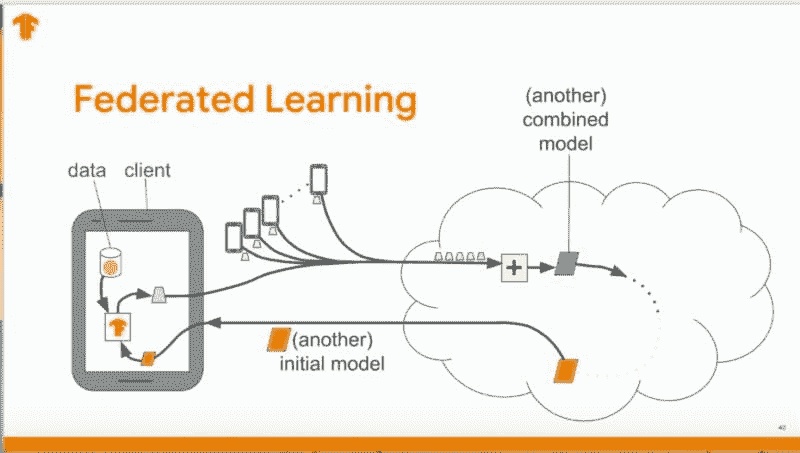
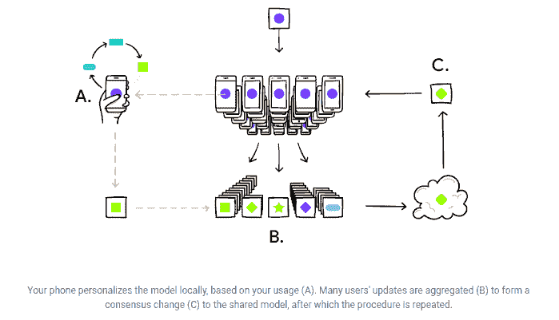
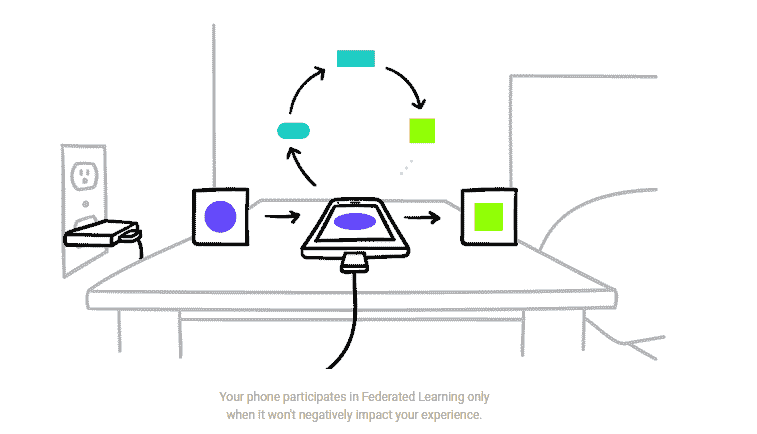
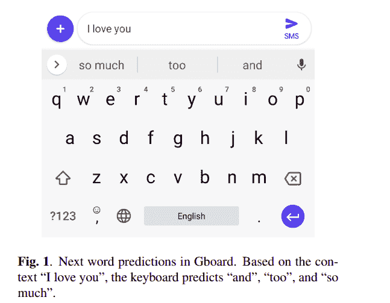

# 联邦学习：简介

> 原文：[`www.kdnuggets.com/2020/04/federated-learning-introduction.html`](https://www.kdnuggets.com/2020/04/federated-learning-introduction.html)

评论

机器学习能力的进步带来了重大的数据隐私问题。尤其是在用从用户与设备（如智能手机）交互中获得的数据来训练机器学习模型时，这一点尤为明显。

所以最大的问题是，我们如何在不共享个人可识别数据的情况下训练和改进这些设备上的机器学习模型？这是我们在探讨一种被称为联邦学习的技术时所要回答的问题。

* * *

## 我们的前三大课程推荐

 1\. [谷歌网络安全证书](https://www.kdnuggets.com/google-cybersecurity) - 快速迈向网络安全职业

 2\. [谷歌数据分析专业证书](https://www.kdnuggets.com/google-data-analytics) - 提升你的数据分析技能

 3\. [谷歌 IT 支持专业证书](https://www.kdnuggets.com/google-itsupport) - 支持你的组织 IT 需求

* * *

### 集中式机器学习

传统的机器学习模型训练过程涉及将数据上传到服务器并使用这些数据训练模型。只要数据隐私不是问题，这种训练方式就很有效。

然而，当涉及到训练包含个人可识别数据的机器学习模型时（例如在设备上，或在如医疗保健等对数据特别敏感的行业中），这种方法就变得不适用了。

在集中式服务器上训练模型也意味着你需要巨大的存储空间，以及一流的安全性以避免数据泄露。但想象一下，如果你能够使用存储在用户设备上的本地数据来训练模型……

### 去中心化数据上的机器学习

引入：**联邦学习**。

联邦学习是一种模型训练技术，使得设备能够通过共享模型进行协作学习。共享模型首先在服务器上使用代理数据进行训练。然后，每个设备下载模型，并使用来自设备的*联邦数据*来改进模型。

设备使用本地可用的数据训练模型。对模型所做的更改会被总结为更新，然后发送到云端。训练数据和个体更新都保留在设备上。为了确保这些更新更快地上传，模型使用随机旋转和量化进行压缩。当设备将其特定的模型发送到服务器时，这些模型会被平均以获得一个综合模型。这个过程会重复多次，直到获得高质量的模型。

[source](https://www.youtube.com/watch?v=1YbPmkChcbo&feature=youtu.be)

与中心化机器学习相比，联邦学习有几个特定的优势：

+   **确保隐私**，因为数据保持在用户的设备上。

+   **更低的延迟**，因为更新后的模型可以在用户的设备上进行预测。

+   **更智能的模型**，由于协作训练过程。

+   **降低能耗**，因为模型是在用户的设备上进行训练的。

为了确保应用程序的用户体验不受影响，模型训练在用户设备连接到空闲 WiFi、处于空闲状态且连接到电源时进行。

### TensorFlow Federated

TensorFlow 通过利用其自己的框架来实现联邦学习。

> [**TensorFlow Federated (TFF)**](https://www.tensorflow.org/federated) 是一个用于在去中心化数据上进行机器学习和其他计算的开源框架。

TFF 有两层：Federated Learning (FL) API 和 Federated Core (FC) API。Federated Learning (FL) API 允许开发者将联邦训练和评估应用到现有的 TensorFlow 模型中。

Federated Core (FC) API 是联邦学习的核心基础。它是用于在强类型功能编程环境中编写联邦算法的低级接口系统，结合了分布式通信操作。

联邦学习的一个示例应用是 Google 的 Gboard 键盘。

[**Federated Learning for Mobile Keyboard Prediction**](https://arxiv.org/abs/1811.03604)

我们使用一种名为联邦的分布式设备学习框架训练递归神经网络语言模型……

在这种情况下，使用去中心化的设备数据集训练递归神经网络语言模型。其目标是在智能手机键盘上预测下一个词。

[source](https://arxiv.org/pdf/1811.03604.pdf)

使用联邦平均算法在客户端设备上训练模型被证明比使用随机梯度下降的服务器训练效果更好。该算法在服务器上用于结合来自客户端的更新并生成新的全球模型。

在这种情况下，使用联邦学习使下一个词预测准确率提高了 24%。Gboard 体验的其他改进包括增强的表情符号和 GIF 预测。这意味着用户在使用 Gboard 时现在能看到更相关的表情符号和 GIF。

我希望这能激发你对联邦学习的兴趣，以及它在推动新的设备训练、应用个性化和增强数据隐私方面的潜力。

如果是这样，请查看下面的资源以了解更多信息：

[**Federated Learning: Strategies for Improving Communication Efficiency**](https://arxiv.org/abs/1610.05492)

联邦学习是一种机器学习设置，其目标是训练一个高质量的集中模型，同时…

[**TensorFlow Federated**](https://www.tensorflow.org/federated)

系统的核心是用于简洁表达新颖联邦算法的一组低级接口…

[**联邦学习：无需集中训练数据的协作机器学习**](https://ai.googleblog.com/2017/04/federated-learning-collaborative.html)

标准机器学习方法要求将训练数据集中到一台机器或数据中心。而…

[**迈向规模化联邦学习：系统设计**](https://arxiv.org/abs/1902.01046)

联邦学习是一种分布式机器学习方法，它使得在大规模语料上进行模型训练成为可能…

**个人简介： [德里克·穆伊提](https://derrickmwiti.com/)** 是数据分析师、作家和导师。他致力于在每项任务中取得出色结果，并且是 Lapid Leaders Africa 的导师。

[原文](https://heartbeat.fritz.ai/federated-learning-an-introduction-a0bedc8a584c)。转载经许可。

**相关内容：**

+   研究指南：机器学习模型的高级损失函数

+   分析 GDPR 罚款 – 谁是最大的违规者？

+   深度学习深度估计研究指南

### 更多相关话题

+   [联邦学习：协作机器学习教程…](https://www.kdnuggets.com/2021/12/federated-learning-collaborative-machine-learning-tutorial-get-started.html)

+   [如何使用医疗数据实施联邦学习项目](https://www.kdnuggets.com/2023/02/implement-federated-learning-project-healthcare-data.html)

+   [回到基础第 3 周：机器学习简介](https://www.kdnuggets.com/back-to-basics-week-3-introduction-to-machine-learning)

+   [KDnuggets 新闻，4 月 27 日：关于 Papers With Code 的简要介绍；…](https://www.kdnuggets.com/2022/n17.html)

+   [统计学习导论，Python 版：免费书籍](https://www.kdnuggets.com/2023/07/introduction-statistical-learning-python-edition-free-book.html)

+   [深度学习库简介：PyTorch 和 Lightning AI](https://www.kdnuggets.com/introduction-to-deep-learning-libraries-pytorch-and-lightning-ai)
