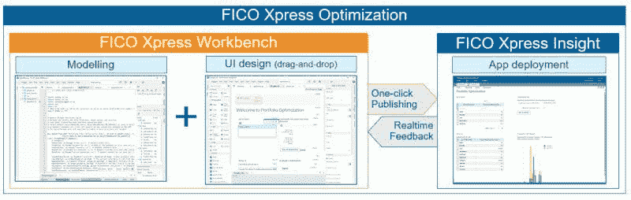
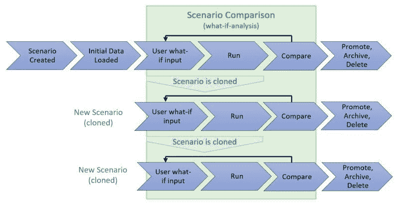

# 利用 FICO Xpress Insight 快速部署 Python 模型

> 原文：[`www.kdnuggets.com/2020/08/fico-xpress-insight-python-deployment.html`](https://www.kdnuggets.com/2020/08/fico-xpress-insight-python-deployment.html)

赞助文章。

在 Gartner 进行的一项研究中，他们发现尽管 AI 和 ML 项目有所进展，大多数分析项目失败的主要原因还是由于无法以业务的速度部署模型。其他几项研究指出，商业用户在分析解决方案开发生命周期中的缺乏参与是核心问题。根据我个人在客户决策过程中利用分析的经验，我观察到类似的模式，并可以证明这些研究的发现。从收集数据中创造业务价值的最大障碍，确实是能够在整个组织中实施分析。

实施分析是一个三重问题。它需要引入（1）业务团队（问题所有者）和（2）数据科学团队（分析主题专家或模型构建者），以及最重要的（3）可以促进这两者之间协作的技术。解决方案开发者在分析项目早期以敏捷方式创建具有丰富可视化的交互式用户界面（应用程序），而不是依赖 IT 在模型开发完成后构建用户界面（应用程序），是形成业务和数据科学团队之间协作的关键。启用这种协作并利用业务团队的实时反馈，还将有助于最终解决方案的采用，同时确保模型得到验证并达到预期。Xpress Insight 旨在减轻 IT 的负担，满足其关键需求，同时赋予业务用户决策和变更管理的所有权。以下是 FICO Xpress Insight 实际客户部署的一些示例：

+   在 4 小时内构建初步原型

+   在 1 个月内与业务用户迭代 57 个应用版本

+   拥有 290+全球活跃用户的协作应用

+   在一个部署的应用程序中每月探索 1,300+商业场景

+   2,500+数据元素输入到每个商业场景中

+   37 种决策逻辑变体已考虑

+   在 9 个月内构建并产品化了 12 个银行优化应用

+   将场景运行时间从 4 天减少到 30 分钟。

数据科学家和运营研究人员现在可以通过拖放功能将他们的 Python 模型部署到 FICO Xpress Insight 中的用户友好、互动性强且可扩展的应用程序中。这些模型可以是任何类型的——统计回归、预测、基于机器学习的、数学规划等——并利用任何优化求解器。用户还可以利用 Python 包生态系统，探索数据，执行和比较模型及其性能。Xpress Insight 是一个可扩展的部署平台，帮助组织以业务的速度构建业务应用程序。它通过将高度复杂的分析或优化模型转化为简单的点击应用程序，来促进数据科学家与业务用户之间的协作，从而帮助做出实际的业务决策。与其让每位数据科学家重复构建最终用户应用程序的常见组件的过程，不如使用 Insight，它在一个可重复的框架中包含了所有核心构建模块，可以与其他数据科学团队成员共享，从而减少开发时间。

FICO Xpress Insight 将以多种方式帮助数据科学团队和业务利益相关者：

+   促进业务用户与数据科学团队之间的协作。

+   帮助数据科学团队通过拖放功能快速构建可扩展的应用程序，无需任何 html/JavaScript 或网页开发知识。

+   使业务用户能够查看最终用户应用程序的早期版本，并提供有关解决方案设计和开发的反馈。

+   帮助数据科学团队使业务用户能够运行模型、执行模拟、比较场景并可视化结果，无需软件足迹。

+   通过内置的用户管理和场景管理减少开发工作量。

+   提供内置的执行负载均衡，数据科学团队可以利用它，而无需额外的开发时间。

+   Xpress Insight 与 IT 无关，不受数据限制的影响，且可用于本地安装和云安装。

FICO Xpress Insight 的最新版本引入了 Insight Python 模型部署能力，数据科学家可以利用这一能力轻松部署他们的 Python 模型，只需对代码进行最小的更改。Python 模型部署过程如图 1 所示。

**图 1\. 使用 FICO Xpress Insight 进行 Python 模型部署 - 工作流**

Xpress Insight 允许数据科学家在构建模型时暴露其模型数据和参数。模型数据和参数可以在 Insight 视图中进行编辑，最终用户可以加载默认数据，改变模型数据和参数的值以进行场景分析——所有这些都不会更改原始数据。详细来说，优化或分析模型定义了一组输入实体，以接收场景数据，以及一组结果实体，用于填充优化/分析解决方案。解决方案是代表优化过程确定的决策的值集或分析模型建议的值以及从这些值综合的其他数据。在 FICO Xpress Insight 应用程序中，场景包含模型的输入数据和结果。业务用户可以修改/调整/微调这些分析模型的输入参数，以运行假设分析，并在多个场景之间运行、克隆和比较假设分析，如图 2 所示。

**图 2\. FICO Xpress Insight 中的场景生命周期**

总结来说，FICO Xpress Insight 在开发和部署过程中促进了协作，将业务用户与数据科学团队紧密联系，使业务用户能够快速评估、理解并建立对解决方案的信任，这些解决方案与他们对工作的思考方式相辅相成。

如果你有兴趣了解更多关于 FICO Xpress Insight Python 功能的信息，请访问[FICO 优化社区小组。](https://community.fico.com/s/optimization?utm_source=KDnuggets&utm_medium=insight-python-blog-post)

[数据科学家需要采取的 5 个步骤来使用 Insight 部署他们的 Python 模型的快速教程可以在这里找到](https://community.fico.com/s/rapid-python-model-deployment-xpress-insight?utm_source=KDnuggets&utm_medium=insight-python-blog-post)。

你可以[**在这里查看 FICO Xpress Insight 的演示**](https://community.fico.com/s/xpress-insight-demo-description?utm_source=KDnuggets&utm_medium=insight-python-blog-post)。

* * *

## 我们的三大课程推荐

 1\. [谷歌网络安全证书](https://www.kdnuggets.com/google-cybersecurity) - 快速进入网络安全职业生涯。

 2\. [谷歌数据分析专业证书](https://www.kdnuggets.com/google-data-analytics) - 提升你的数据分析技能

 3\. [谷歌 IT 支持专业证书](https://www.kdnuggets.com/google-itsupport) - 支持你的组织的 IT 需求

* * *

### 更多相关内容

+   [从数据收集到模型部署：数据科学项目的 6 个阶段…](https://www.kdnuggets.com/2023/01/data-collection-model-deployment-6-stages-data-science-project.html)

+   [排名前 7 的模型部署和服务工具](https://www.kdnuggets.com/top-7-model-deployment-and-serving-tools)

+   [机器学习算法的完整端到端部署到…](https://www.kdnuggets.com/2021/12/deployment-machine-learning-algorithm-live-production-environment.html)

+   [回归基础第 4 周：高级主题和部署](https://www.kdnuggets.com/back-to-basics-week-4-advanced-topics-and-deployment)

+   [Segment Anything Model: 图像分割的基础模型](https://www.kdnuggets.com/2023/07/segment-anything-model-foundation-model-image-segmentation.html)

+   [可解释 AI：解密模型决策的 10 个 Python 库](https://www.kdnuggets.com/2023/01/explainable-ai-10-python-libraries-demystifying-decisions.html)
