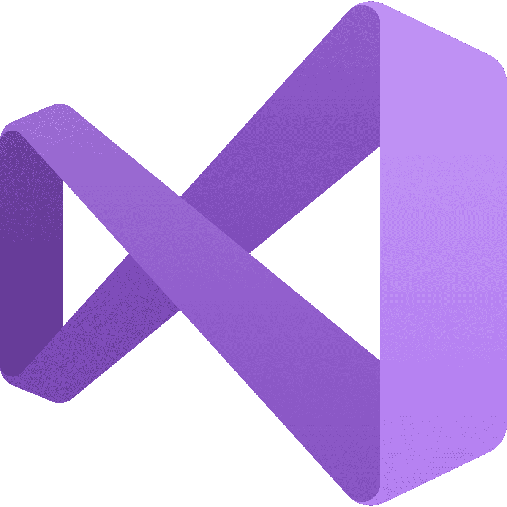
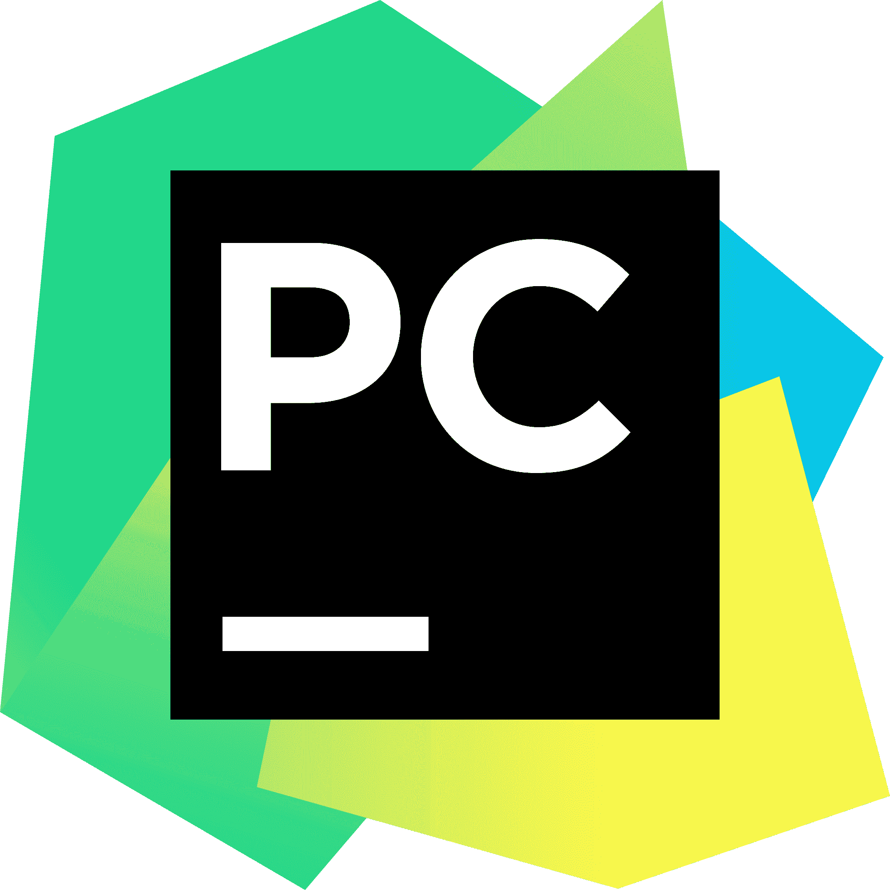
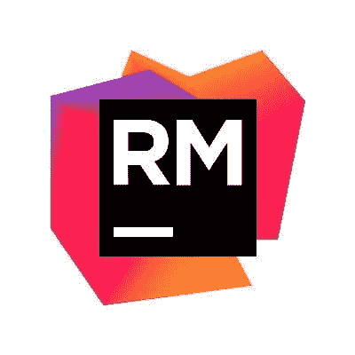
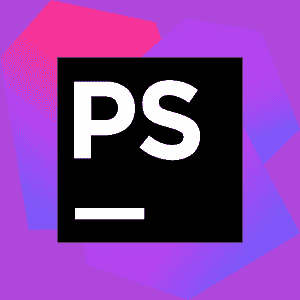

# 寻找最佳 IDE 软件

> 原文：[`www.kdnuggets.com/2022/05/finding-best-ide-software.html`](https://www.kdnuggets.com/2022/05/finding-best-ide-software.html)

[Pakata Goh](https://unsplash.com/@pakata) 通过 Unsplash

开发人员需要一个 IDE - 集成开发环境。它们提供了开发人员进行软件测试和编写所需的基本工具。

* * *

## 我们的三大课程推荐

 1\. [谷歌网络安全证书](https://www.kdnuggets.com/google-cybersecurity) - 快速进入网络安全职业。

 2\. [谷歌数据分析专业证书](https://www.kdnuggets.com/google-data-analytics) - 提升你的数据分析水平

 3\. [谷歌 IT 支持专业证书](https://www.kdnuggets.com/google-itsupport) - 支持你的组织的 IT

* * *

你能想象一个开发人员需要单独选择、使用和管理工具会有多么困难吗？这非常困难且耗时。IDE 通过一个单一的框架整合了所有这些工具，帮助开发人员更快、更有效地工作。

让我们深入探讨一下什么是 IDE。

# 什么是 IDE？

集成开发环境（IDE）是用于帮助软件开发的工具。它们的设计旨在通过提供实现编程目标所需的组件来提高开发人员的生产力。

IDE 的主要功能包括：

+   **文本编辑器**是它们的主要功能

+   一个**编译器**可以将你的代码转换为计算机可读的语言。

+   一个**解释器**可以在不需要先编译的情况下执行代码

+   **构建**或**制作集成**以自动化流程。

+   一个**调试器**可以扫描你的代码中的错误，以便轻松解决。

+   **语法高亮器**可以区分代码的各个部分，如属性、标签、属性等。

+   **图形用户界面**（GUI）是用户互动的部分，如按钮、菜单等。

# 我应该使用哪个 IDE？

在决定何时开始使用某样东西时，总是要考虑你需要它做什么，它是否能帮助你实现目标。

就 IDE 而言，它们有不同的功能。从格式到颜色代码；你可能偏好某个 IDE，而你的员工可能偏好另一个。

到头来，你需要选择一个你觉得使用起来舒适并且能够实现目标的 IDE。

然而，为了帮助你做出决定，请考虑以下功能：

1.  编程语言 - 你正在考虑的 IDE 是否支持你使用的编程语言

1.  源代码库 - 一些 IDE 包含其他 IDE 不提供的特定脚本。

1.  自定义文本编辑器 - 你是否希望能够编辑 GUI？

1.  集成和插件 - 例如，你是否想将你的工作与 GitHub 集成？

1.  错误和报告 - 你是否需要一个能检测错误并为你报告的 IDE？

1.  单元测试 - 你是否想添加模拟对象来改善你的工作流程？

1.  完成你的代码 - 如果一个 IDE 能智能地完成你的代码，会不会更好？对于一些 IDE 来说，这是可能的。

1.  组织你的工作 - 将你的项目、文件和脚本组织成层级图是否能改善你的工作流程？

# 5 款流行 IDE 列表

## [Visual Studio](https://visualstudio.microsoft.com/)

Visual Studio IDE 是迄今为止最受欢迎和最好的开发者 IDE。它足够智能，能够从你的代码中学习，以完成你的代码。

Visual Studio 因用于网站、应用程序和游戏开发而闻名。常用的编程语言包括 Python 和 C++。

## [PyCharm](https://www.jetbrains.com/pycharm/)

PyCharm 被誉为最佳的 Python IDE。然而，它也提供了一个支持其他编程语言的高级版本。

PyCharm 能够在你编写代码时检查错误，并智能地完成你的代码。它会检查代码的质量，以确保其效率足够高。

## [RubyMine](https://www.jetbrains.com/ruby/)

如名称所示，RubyMine 专注于编程语言 Ruby 和 Ruby on Rails 框架。然而，它也可以与 JavaScript、CSS 等一起使用。

RubyMine 具有语法高亮功能，可以突出显示代码中的错误，并能完成你的代码。它还具有高级搜索功能，你可以搜索任何类、文件或符号。

## [Eclipse](https://www.eclipse.org/)

Eclipse 是最受欢迎的 IDE 之一，是一个开源的社区驱动 IDE，主要用于 Javascript 程序员，但也支持 HTML、CSS 等。谷歌、Netflix 和 Facebook 等大型公司都使用过 Eclipse。

Eclipse 的界面是其如此受欢迎的原因，具有拖放功能等。你还可以使用静态分析来帮助分析代码，并具有调试功能。

## [PhpStorm](https://www.jetbrains.com/phpstorm/)

PhpStorm 专注于 PHP，这是一种用于 Web 开发的脚本语言。然而，它也支持 HTML、CSS、JavaScript 等前端编程语言。

由于其前端专注，PhpStorm 还包括创建网站的软件，例如 WordPress 等。

PhpStorm 易于使用，能智能地完成你的代码，帮助调试等。

# 结论

这些只是几个可用的热门 IDE，但如果您查看了这个短名单后，觉得没有一个适合您；还有很多其他的选择。

不断尝试不同的 IDE，直到找到您觉得最舒适和最具生产力的那一个。

**[Nisha Arya](https://www.linkedin.com/in/nisha-arya-ahmed/)** 是一位数据科学家和自由技术作家。她特别关注提供数据科学职业建议或教程，以及围绕数据科学的理论知识。她还希望探索人工智能在延长人类寿命方面的不同方式。作为一个热衷学习者，她寻求拓宽她的技术知识和写作技能，同时帮助指导他人。

### 更多相关主题

+   [软件开发者与软件工程师](https://www.kdnuggets.com/2022/05/software-developer-software-engineer.html)

+   [软件错误和权衡：Tomasz Lelek 的新书…](https://www.kdnuggets.com/2021/12/manning-software-mistakes-tradeoffs-book.html)

+   [开发者准备好的软件堆栈上的设备内 AI](https://www.kdnuggets.com/2022/03/qualcomm-ondevice-ai-developer-ready-software-stacks.html)

+   [决策树软件完全指南](https://www.kdnuggets.com/2022/08/complete-guide-decision-tree-software.html)

+   [AI 和开源软件：一出生就分离？](https://www.kdnuggets.com/ai-and-open-source-software-separated-at-birth)

+   [如何让大型语言模型与您的软件兼容…](https://www.kdnuggets.com/how-to-make-large-language-models-play-nice-with-your-software-using-langchain)
