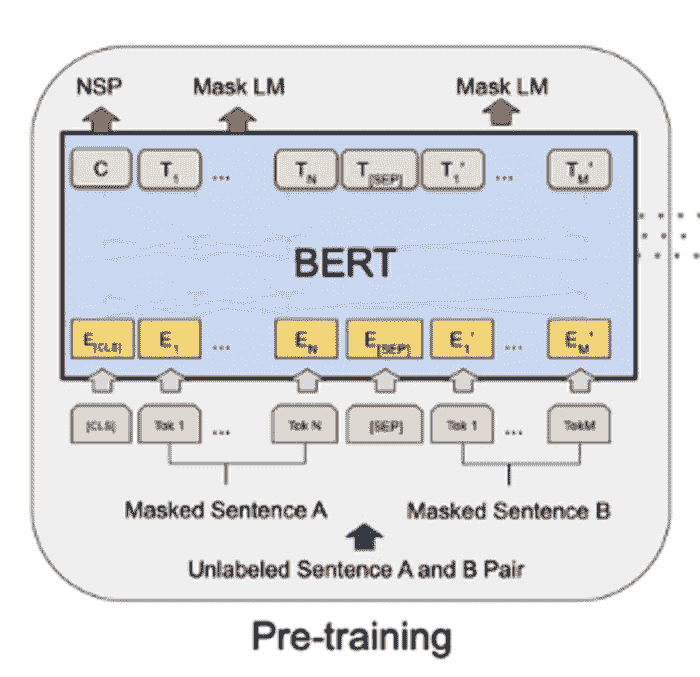
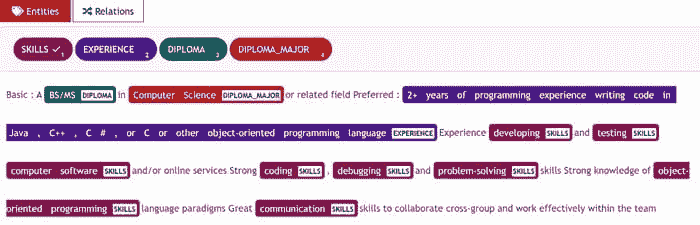
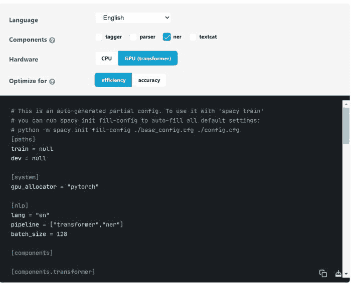
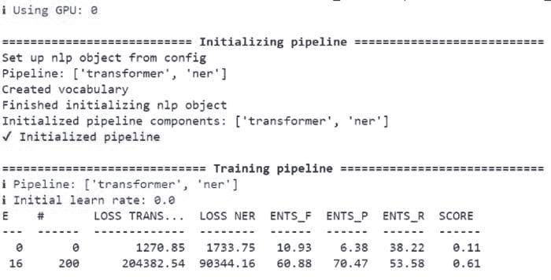

# 如何使用 spaCy 3 微调 BERT Transformer

> 原文：[`www.kdnuggets.com/2021/06/fine-tune-bert-transformer-spacy.html`](https://www.kdnuggets.com/2021/06/fine-tune-bert-transformer-spacy.html)

评论

**作者：[Walid Amamou](https://www.linkedin.com/in/walid-amamou-b65105b9/)，UBIAI 创始人**


图片由[Alina Grubnyak](https://unsplash.com/@alinnnaaaa)提供，拍摄于[Unsplash](https://unsplash.com/photos/ASKeuOZqhYU)

自从 Vaswani 等人发表了开创性论文“[Attention is all you need](https://arxiv.org/abs/1706.03762)”之后，Transformer 模型已成为目前 NLP 技术中的领先技术。其应用范围从命名实体识别（NER）、文本分类、问答系统到文本生成，这项惊人的技术的应用几乎是无限的。

更具体来说，BERT（Bidirectional Encoder Representations from Transformers）以一种新颖的方式利用了 transformer 架构。例如，BERT 通过随机掩蔽的词分析句子的两侧来进行预测。除了预测掩蔽的词外，BERT 通过在第一个句子开头添加分类标记[CLS]来预测句子序列，并尝试通过在两个句子之间添加分隔标记[SEP]来预测第二个句子是否跟随第一个句子。



BERT 架构

在本教程中，我将向你展示如何微调 BERT 模型以预测软件职位描述中的技能、学历、学历专业和经验等实体。如果你有兴趣进一步提取实体之间的关系，请阅读我们的[文章](https://walidamamou.medium.com/how-to-train-a-joint-entities-and-relation-extraction-classifier-using-bert-transformer-with-spacy-49eb08d91b5c)了解如何使用 transformers 进行联合实体和关系提取。

微调 transformers 需要强大的 GPU 和并行处理能力。为此我们使用 Google Colab，因为它提供了免费的带 GPU 的服务器。

在本教程中，我们将使用新发布的[spaCy 3 库](https://spacy.io/usage/v3)来微调我们的 transformer。以下是如何在 spaCy 3 上微调 BERT 模型的逐步指南。

### 数据标注：

要使用 spaCy 3 微调 BERT，我们需要提供符合 spaCy 3 JSON 格式的训练和开发数据（[请见这里](https://spacy.io/api/data-formats)），这些数据将被转换为.spacy 二进制文件。我们将提供以 IOB 格式保存的 TSV 文件中的数据，然后转换为 spaCy JSON 格式。

我仅为训练数据集标注了 120 份职位描述，标注了如*技能*、*学历*、*学历专业*和*经验*等实体，开发数据集则标注了约 70 份职位描述。

在本教程中，我使用了[UBIAI](https://ubiai.tools/)注释工具，因为它具备诸如以下的广泛功能：

+   ML 自动注释

+   字典、正则表达式和规则基础的自动注释

+   团队协作以共享注释任务

+   **直接注释导出为 IOB 格式**

使用 UBIAI 中的正则表达式功能，我已经预注释了所有符合模式“\d.*\+.*”的经验提及，例如“5 + years of experience in C++”。然后我上传了一个包含所有软件语言的 csv 字典并分配了实体技能。预注释节省了大量时间，并将帮助你减少手动注释。



UBIAI 注释界面

有关 [UBIAI](https://ubiai.tools/) 注释工具的更多信息，请访问 [文档](https://ubiai.tools/Docs) 页面以及我之前的文章“[介绍 UBIAI：用于 NLP 应用的易用文本注释](https://chatbotslife.com/introducing-ubiai-easy-to-use-text-annotation-for-nlp-applications-74a2401fa725)”。

导出的注释将如下所示：

```py
MS B-DIPLOMA
in O
electrical B-DIPLOMA_MAJOR
engineering I-DIPLOMA_MAJOR
or O
computer B-DIPLOMA_MAJOR
engineering I-DIPLOMA_MAJOR
. O
5+ B-EXPERIENCE
years I-EXPERIENCE
of I-EXPERIENCE
industry I-EXPERIENCE
experience I-EXPERIENCE
. I-EXPERIENCE
Familiar O
with O
storage B-SKILLS
server I-SKILLS
architectures I-SKILLS
with O
HDD B-SKILLS
```

为了从 IOB 转换为 JSON（请参见文档 [这里](https://spacy.io/api/cli#convert)），我们使用 spaCy 3 命令：

```py
!python -m spacy convert drive/MyDrive/train_set_bert.tsv ./ -t json -n 1 -c iob
!python -m spacy convert drive/MyDrive/dev_set_bert.tsv ./ -t json -n 1 -c iob
```

转换为 spaCy 3 JSON 后，我们需要使用此命令将训练和开发 JSON 文件转换为 .spacy 二进制文件（请更新文件路径为自己的路径）：

```py
!python -m spacy convert drive/MyDrive/train_set_bert.json ./ -t spacy!python -m spacy convert drive/MyDrive/dev_set_bert.json ./ -t spacy
```

### 模型训练：

+   打开一个新的 Google Colab 项目，并确保在笔记本设置中选择 GPU 作为硬件加速器。

+   为了加快训练过程，我们需要在 GPU 上运行并行处理。为此，我们安装 NVIDIA 9.2 cuda 库：

```py
!wget [`developer.nvidia.com/compute/cuda/9.2/Prod/local_installers/cuda-repo-ubuntu1604-9-2-local_9.2.88-1_amd64`](https://developer.nvidia.com/compute/cuda/9.2/Prod/local_installers/cuda-repo-ubuntu1604-9-2-local_9.2.88-1_amd64) -O cuda-repo-ubuntu1604–9–2-local_9.2.88–1_amd64.deb!dpkg -i cuda-repo-ubuntu1604–9–2-local_9.2.88–1_amd64.deb!apt-key add /var/cuda-repo-9–2-local/7fa2af80.pub!apt-get update!apt-get install cuda-9.2
```

要检查是否安装了正确的 cuda 编译器，请运行：`!nvcc --version`

+   安装 spacy 库和 spacy transformer 流水线：

```py
pip install -U spacy
!python -m spacy download en_core_web_trf
```

+   接下来，我们安装为 cuda 9.2 配置的 pytorch 机器学习库：

```py
pip install torch==1.7.1+cu92 torchvision==0.8.2+cu92 torchaudio==0.7.2 -f https://download.pytorch.org/whl/torch_stable.html
```

+   安装 pytorch 后，我们需要安装为 cuda 9.2 调整的 spacy transformers，并按如下更改 CUDA_PATH 和 LD_LIBRARY_PATH。最后，安装 cupy 库，它是 GPU 上的 numpy 库：

```py
!pip install -U spacy[cuda92,transformers]
!export CUDA_PATH=”/usr/local/cuda-9.2"
!export LD_LIBRARY_PATH=$CUDA_PATH/lib64:$LD_LIBRARY_PATH
!pip install cupy
```

+   SpaCy 3 使用一个包含所有模型训练组件的配置文件 config.cfg 来训练模型。在 [spaCy 训练页面](https://spacy.io/usage/training)上，你可以选择模型的语言（本教程中的英语）、组件（NER）和硬件（GPU），并下载配置文件模板。



用于训练的 Spacy 3 配置文件。 [来源](https://spacy.io/usage/training)

我们需要做的唯一事情是填写训练和开发 .spacy 文件的路径。完成后，我们将文件上传到 Google Colab。

+   现在我们需要用 BERT 模型所需的其余参数自动填充配置文件；你只需运行此命令：

```py
!python -m spacy init fill-config drive/MyDrive/config.cfg drive/MyDrive/config_spacy.cfg
```

我建议调试你的配置文件，以防出现错误：

```py
!python -m spacy debug data drive/MyDrive/config.cfg
```

+   我们终于准备好训练 BERT 模型了！只需运行此命令，训练应该会开始：

```py
!python -m spacy train -g 0 drive/MyDrive/config.cfg — output ./
```

附注：如果遇到错误 cupy_backends.cuda.api.driver.CUDADriverError: CUDA_ERROR_INVALID_PTX: PTX JIT 编译失败，只需卸载 cupy 并重新安装即可解决问题。

如果一切正常，你应该开始看到模型的评分和损失正在更新：



在 google colab 上进行 BERT 训练

在训练结束时，模型将保存在 model-best 文件夹下。模型评分位于 model-best 文件夹内的 meta.json 文件中：

```py
“performance”:{
“ents_per_type”:{
“DIPLOMA”:{
“p”:0.5584415584,
“r”:0.6417910448,
“f”:0.5972222222
},
“SKILLS”:{
“p”:0.6796805679,
“r”:0.6742957746,
“f”:0.6769774635
},
“DIPLOMA_MAJOR”:{
“p”:0.8666666667,
“r”:0.7844827586,
“f”:0.8235294118
},
“EXPERIENCE”:{
“p”:0.4831460674,
“r”:0.3233082707,
“f”:0.3873873874
}
},
“ents_f”:0.661754386,
“ents_p”:0.6745350501,
“ents_r”:0.6494490358,
“transformer_loss”:1408.9692438675,
“ner_loss”:1269.1254348834
}
```

由于训练数据集有限，评分远低于生产模型水平，但值得检查其在示例职位描述上的表现。

### 使用变换器进行实体提取

要在示例文本上测试模型，我们需要加载模型并在文本上运行：

```py
nlp = spacy.load(“./model-best”)

text = [
'''Qualifications
- A thorough understanding of C# and .NET Core
- Knowledge of good database design and usage
- An understanding of NoSQL principles
- Excellent problem solving and critical thinking skills
- Curious about new technologies
- Experience building cloud hosted, scalable web services
- Azure experience is a plus
Requirements
- Bachelor's degree in Computer Science or related field
(Equivalent experience can substitute for earned educational qualifications)
- Minimum 4 years experience with C# and .NET
- Minimum 4 years overall experience in developing commercial software
'''
]

for doc in nlp.pipe(text, disable=["tagger", "parser"]):
    print([(ent.text, ent.label_) for ent in doc.ents])
```

以下是从我们的示例职位描述中提取的实体：

```py
[
("C", "SKILLS"),
("#", "SKILLS"),
(".NET Core", "SKILLS"),
("database design", "SKILLS"),
("usage", "SKILLS"),
("NoSQL", "SKILLS"),
("problem solving", "SKILLS"),
("critical thinking", "SKILLS"),
("Azure", "SKILLS"),
("Bachelor", "DIPLOMA"),
("'s", "DIPLOMA"),
("Computer Science", "DIPLOMA_MAJOR"),
("4 years experience with C# and .NET\n-", "EXPERIENCE"),
("4 years overall experience in developing commercial software\n\n", "EXPERIENCE")
]
```

仅使用 120 个训练文档就已经非常令人印象深刻！我们能够正确提取大部分技能、文凭、文凭专业和经验。

通过更多的训练数据，模型肯定会进一步提高并产生更高的评分。

### 结论：

只需几行代码，我们就成功地训练了一个功能齐全的 NER 变换器模型，感谢出色的 spaCy 3 库。请尝试在你的用例中使用，并分享你的结果。注意，你可以使用 [UBIAI](https://ubiai.tools/) 注释工具来标记数据，我们提供免费 14 天试用。

一如既往，如果你有任何意见，请在下面留言或发送邮件至 admin@ubiai.tools！

**简历：[Walid Amamou](https://www.linkedin.com/in/walid-amamou-b65105b9/)** 是 UBIAI 的创始人，UBIAI 是一个用于 NLP 应用的注释工具，他拥有物理学博士学位。

[原文](https://towardsdatascience.com/how-to-fine-tune-bert-transformer-with-spacy-3-6a90bfe57647)。经授权转载。

**相关：**

+   如何通过 API 创建和部署简单的情感分析应用

+   如何将变换器应用于任何长度的文本

+   自然语言处理研究和应用的新资源

* * *

## 我们的前 3 个课程推荐

 1\. [谷歌网络安全证书](https://www.kdnuggets.com/google-cybersecurity) - 快速进入网络安全职业生涯。

 2\. [谷歌数据分析专业证书](https://www.kdnuggets.com/google-data-analytics) - 提升你的数据分析技能

 3\. [谷歌 IT 支持专业证书](https://www.kdnuggets.com/google-itsupport) - 支持你的组织 IT

* * *

### 更多相关主题

+   [如何使用 Hugging Face AutoTrain 微调 Mistral AI 7B LLM](https://www.kdnuggets.com/how-to-finetune-mistral-ai-7b-llm-with-hugging-face-autotrain)

+   [开始使用 spaCy 进行 NLP](https://www.kdnuggets.com/2022/11/getting-started-spacy-nlp.html)

+   [使用 spaCy 进行自然语言处理](https://www.kdnuggets.com/2023/01/natural-language-processing-spacy.html)

+   [使用 HuggingFace 微调 BERT 以进行推文分类](https://www.kdnuggets.com/2022/01/finetuning-bert-tweets-classification-ft-hugging-face.html)

+   [使用 BERT 分类长文本文档](https://www.kdnuggets.com/2022/02/classifying-long-text-documents-bert.html)

+   [BERT 在稀疏性下的速度有多快？](https://www.kdnuggets.com/2022/04/fast-bert-go-sparsity.html)
