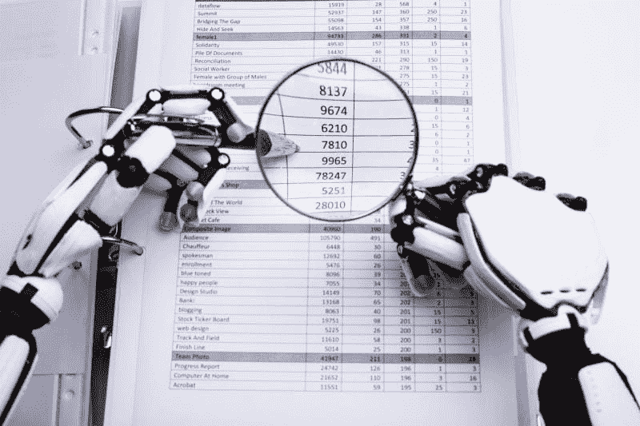
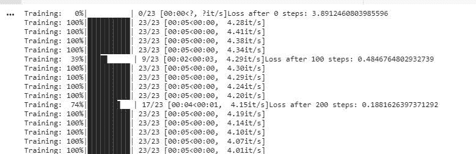
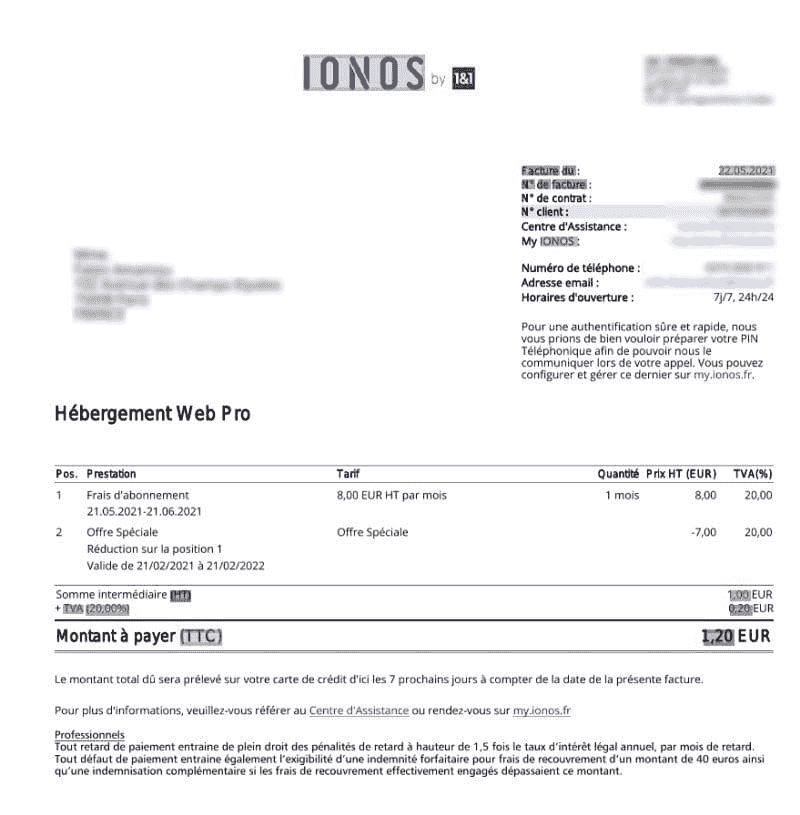
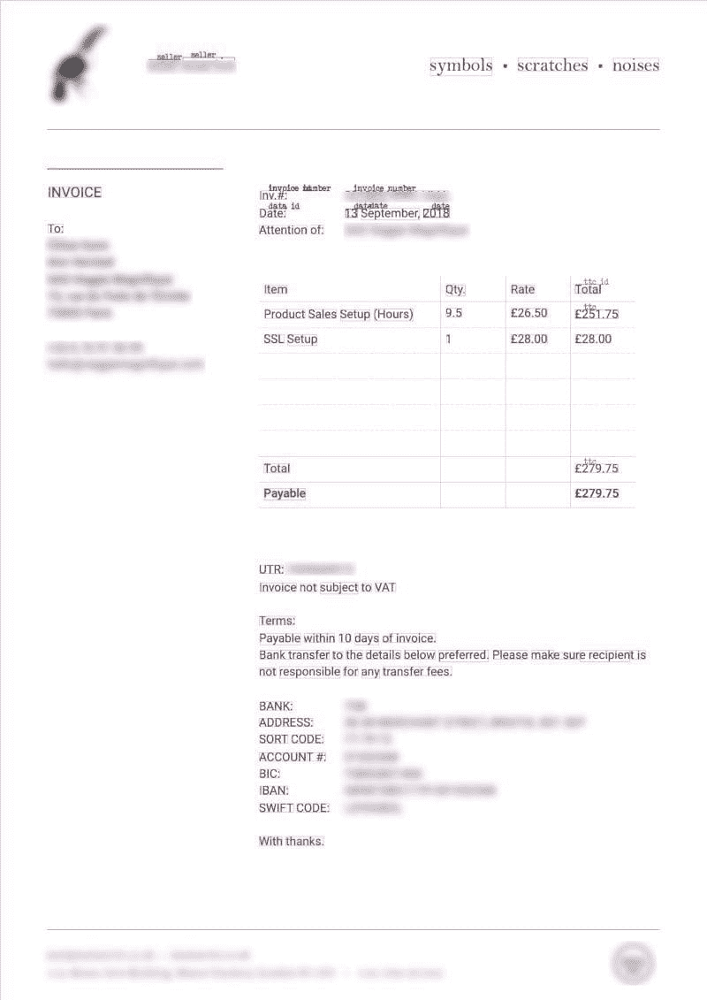
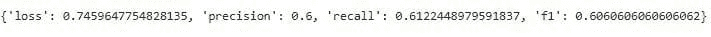

# 微调变换器模型以进行发票识别

> 原文：[`www.kdnuggets.com/2021/06/fine-tuning-transformer-model-invoice-recognition.html`](https://www.kdnuggets.com/2021/06/fine-tuning-transformer-model-invoice-recognition.html)

评论

**作者 [Walid Amamou](https://www.linkedin.com/in/walid-amamou-b65105b9/)，UBIAI 创始人**



发票识别

* * *

## 我们的前三个课程推荐

 1. [谷歌网络安全证书](https://www.kdnuggets.com/google-cybersecurity) - 快速进入网络安全职业生涯。

 2. [谷歌数据分析专业证书](https://www.kdnuggets.com/google-data-analytics) - 提升您的数据分析技能

 3. [谷歌 IT 支持专业证书](https://www.kdnuggets.com/google-itsupport) - 支持您的组织 IT 部门

* * *

### 介绍

基于我最近关于[如何为 NLP 应用标注 PDF 和扫描图像](https://towardsdatascience.com/how-to-annotate-pdfs-and-scanned-images-for-nlp-applications-f7b7b1db5c4a)的教程，我们将尝试对最近发布的微软[Layout LM 模型](https://github.com/microsoft/unilm/tree/master/layoutlm)进行微调，使用包含法语和英语发票的自定义标注数据集。虽然之前的教程集中于使用公开的[FUNSD 数据集](https://guillaumejaume.github.io/FUNSD/)来微调模型，但这里我们将展示从标注和预处理到训练和推断的整个过程。

### LayoutLM 模型

LayoutLM 模型基于 BERT 架构，但增加了两种额外的输入嵌入。第一个是 2-D 位置嵌入，用于表示文档中令牌的相对位置，第二个是用于文档中扫描令牌图像的图像嵌入。该模型在多个下游任务中取得了新的最先进结果，包括表单理解（从 70.72 提升到 79.27）、收据理解（从 94.02 提升到 95.24）和文档图像分类（从 93.07 提升到 94.42）。欲了解更多信息，请参阅[原始文章](https://arxiv.org/abs/1912.13318)。

幸运的是，该模型已开源并在 huggingface 库中提供。感谢微软！

对于本教程，我们将直接从 huggingface 库中克隆模型，并在我们自己的数据集上进行微调。但首先，我们需要创建训练数据。

### 发票标注

使用[UBIAI 文本注释工具](https://ubiai.tools/)，我已经注释了大约 50 份个人发票。我感兴趣的是提取实体的键和值；例如在以下文本“Date: 06/12/2021”中，我们会将“Date”标注为 DATE_ID，将“06/12/2021”标注为 DATE。提取键和值将帮助我们将数值与其属性关联起来。以下是所有已标注的实体：

`DATE_ID, DATE, INVOICE_ID, INVOICE_NUMBER, SELLER_ID, SELLER, MONTANT_HT_ID, MONTANT_HT, TVA_ID, TVA, TTC_ID, TTC`

这里有一些实体定义：

`MONTANT_HT`：税前总价

`TTC`：含税总价

`TVA`：税额

以下是使用[UBIAI](https://ubiai.tools/)的标注发票示例：



在 UBIAI 中的发票注释

注释完成后，我们直接从 UBIAI 以正确格式导出训练和测试文件，无需任何[预处理步骤](https://colab.research.google.com/github/NielsRogge/Transformers-Tutorials/blob/master/LayoutLM/Fine_tuning_LayoutLMForTokenClassification_on_FUNSD.ipynb)。导出将包括每个训练和测试数据集的三个文件以及一个名为 labels.txt 的文本文件，包含所有标签：

```py
Train/Test.txt

2018 O
Sous-total O
en O
EUR O
3,20 O
€ O
TVA S-TVA_ID
(0%) O
0,00 € S-TVA
Total B-TTC_ID
en I-TTC_ID
EUR E-TTC_ID
3,20 S-TTC
€ O
Services O
soumis O
au O
mécanisme O
d'autoliquidation O
- O
```

Train/Test_box.txt（包含每个 token 的边界框）：

```py
€ 912 457 920 466
Services 80 486 133 495
soumis 136 487 182 495
au 185 488 200 495
mécanisme 204 486 276 495
d'autoliquidation 279 486 381 497
- 383 490 388 492
```

Train/Test_image.txt（包含边界框、文档大小和名称）：

```py
€ 912 425 920 434 1653 2339 image1.jpg
TVA 500 441 526 449 1653 2339 image1.jpg
(0%) 529 441 557 451 1653 2339 image1.jpg
0,00 € 882 441 920 451 1653 2339 image1.jpg
Total 500 457 531 466 1653 2339 image1.jpg
en 534 459 549 466 1653 2339 image1.jpg
EUR 553 457 578 466 1653 2339 image1.jpg
3,20 882 457 911 467 1653 2339 image1.jpg
€ 912 457 920 466 1653 2339 image1.jpg
Services 80 486 133 495 1653 2339 image1.jpg
soumis 136 487 182 495 1653 2339 image1.jpg
au 185 488 200 495 1653 2339 image1.jpg
mécanisme 204 486 276 495 1653 2339 image1.jpg
d'autoliquidation 279 486 381 497 1653 2339 image1.jpg
- 383 490 388 492 1653 2339 image1.jpg
```

labels.txt：

```py
B-DATE_ID
B-INVOICE_ID
B-INVOICE_NUMBER
B-MONTANT_HT
B-MONTANT_HT_ID
B-SELLER
B-TTC
B-DATE
B-TTC_ID
B-TVA
B-TVA_ID
E-DATE_ID
E-DATE
E-INVOICE_ID
E-INVOICE_NUMBER
E-MONTANT_HT
E-MONTANT_HT_ID
E-SELLER
E-TTC
E-TTC_ID
E-TVA
E-TVA_ID
I-DATE_ID
I-DATE
I-SELLER
I-INVOICE_ID
I-MONTANT_HT_ID
I-TTC
I-TTC_ID
I-TVA_ID
O
S-DATE_ID
S-DATE
S-INVOICE_ID
S-INVOICE_NUMBER
S-MONTANT_HT_ID
S-MONTANT_HT
S-SELLER
S-TTC
S-TTC_ID
S-TVA
S-TVA_ID
```

### 微调 LayoutLM 模型：

在这里，我们使用带 GPU 的 google colab 来微调模型。下面的代码基于[原始 LayoutLM 论文](https://github.com/microsoft/unilm/tree/master/layoutlm)和[本教程](https://colab.research.google.com/github/NielsRogge/Transformers-Tutorials/blob/master/LayoutLM/Fine_tuning_LayoutLMForTokenClassification_on_FUNSD.ipynb)。

首先，安装 layoutLM 包……

```py
! rm -r unilm
! git clone -b remove_torch_save https://github.com/NielsRogge/unilm.git
! cd unilm/layoutlm
! pip install unilm/layoutlm
```

…以及从中下载模型的 transformer 包：

```py
! rm -r transformers
! git clone https://github.com/huggingface/transformers.git
! cd transformers
! pip install ./transformers
```

接下来，创建一个包含 labels.txt 中唯一标签的列表：

```py
from torch.nn import CrossEntropyLoss
def get_labels(path):
    with open(path, "r") as f:
        labels = f.read().splitlines()
    if "O" not in labels:
        labels = ["O"] + labels
    return labels
labels = get_labels("./labels.txt")
num_labels = len(labels)
label_map = {i: label for i, label in enumerate(labels)}
pad_token_label_id = CrossEntropyLoss().ignore_index
```

然后，创建一个 pytorch 数据集和数据加载器：

```py
from transformers import LayoutLMTokenizer
from layoutlm.data.funsd import FunsdDataset, InputFeatures
from torch.utils.data import DataLoader, RandomSampler, SequentialSampler
args = {'local_rank': -1,
        'overwrite_cache': True,
        'data_dir': '/content/data',
        'model_name_or_path':'microsoft/layoutlm-base-uncased',
        'max_seq_length': 512,
        'model_type': 'layoutlm',}
# class to turn the keys of a dict into attributes
class AttrDict(dict):
    def __init__(self, *args, **kwargs):
        super(AttrDict, self).__init__(*args, **kwargs)
        self.__dict__ = self
args = AttrDict(args)
tokenizer = LayoutLMTokenizer.from_pretrained("microsoft/layoutlm-base-uncased")
# the LayoutLM authors already defined a specific FunsdDataset, so we are going to use this here
train_dataset = FunsdDataset(args, tokenizer, labels, pad_token_label_id, mode="train")
train_sampler = RandomSampler(train_dataset)
train_dataloader = DataLoader(train_dataset,
                              sampler=train_sampler,
                              batch_size=2)
eval_dataset = FunsdDataset(args, tokenizer, labels, pad_token_label_id, mode="test")
eval_sampler = SequentialSampler(eval_dataset)
eval_dataloader = DataLoader(eval_dataset,
                             sampler=eval_sampler,
                            batch_size=2)
batch = next(iter(train_dataloader))
input_ids = batch[0][0]
tokenizer.decode(input_ids)
```

从 huggingface 加载模型。这将根据数据集进行微调。

```py
from transformers import LayoutLMForTokenClassification
import torch
device = torch.device("cuda" if torch.cuda.is_available() else "cpu")
model = LayoutLMForTokenClassification.from_pretrained("microsoft/layoutlm-base-uncased", num_labels=num_labels)
model.to(device)
```

最后，开始训练：

```py
rom transformers import AdamW
from tqdm import tqdm
optimizer = AdamW(model.parameters(), lr=5e-5)
global_step = 0
num_train_epochs = 50
t_total = len(train_dataloader) * num_train_epochs # total number of training steps
#put the model in training mode
model.train()
for epoch in range(num_train_epochs):
  for batch in tqdm(train_dataloader, desc="Training"):
      input_ids = batch[0].to(device)
      bbox = batch[4].to(device)
      attention_mask = batch[1].to(device)
      token_type_ids = batch[2].to(device)
      labels = batch[3].to(device)
# forward pass
      outputs = model(input_ids=input_ids, bbox=bbox, attention_mask=attention_mask, token_type_ids=token_type_ids,
                      labels=labels)
      loss = outputs.loss
# print loss every 100 steps
      if global_step % 100 == 0:
        print(f"Loss after {global_step} steps: {loss.item()}")
# backward pass to get the gradients 
      loss.backward()
#print("Gradients on classification head:")
      #print(model.classifier.weight.grad[6,:].sum())
# update
      optimizer.step()
      optimizer.zero_grad()
      global_step += 1
```

你应该能看到训练进度和损失的实时更新。



Layout LM 训练中

训练后，使用以下函数评估模型性能：

```py
mport numpy as np
from seqeval.metrics import (
    classification_report,
    f1_score,
    precision_score,
    recall_score,
)
eval_loss = 0.0
nb_eval_steps = 0
preds = None
out_label_ids = None
# put model in evaluation mode
model.eval()
for batch in tqdm(eval_dataloader, desc="Evaluating"):
    with torch.no_grad():
        input_ids = batch[0].to(device)
        bbox = batch[4].to(device)
        attention_mask = batch[1].to(device)
        token_type_ids = batch[2].to(device)
        labels = batch[3].to(device)
# forward pass
        outputs = model(input_ids=input_ids, bbox=bbox, attention_mask=attention_mask, token_type_ids=token_type_ids,
                        labels=labels)
        # get the loss and logits
        tmp_eval_loss = outputs.loss
        logits = outputs.logits
eval_loss += tmp_eval_loss.item()
        nb_eval_steps += 1
# compute the predictions
        if preds is None:
            preds = logits.detach().cpu().numpy()
            out_label_ids = labels.detach().cpu().numpy()
        else:
            preds = np.append(preds, logits.detach().cpu().numpy(), axis=0)
            out_label_ids = np.append(
                out_label_ids, labels.detach().cpu().numpy(), axis=0
            )
# compute average evaluation loss
eval_loss = eval_loss / nb_eval_steps
preds = np.argmax(preds, axis=2)
out_label_list = [[] for _ in range(out_label_ids.shape[0])]
preds_list = [[] for _ in range(out_label_ids.shape[0])]
for i in range(out_label_ids.shape[0]):
    for j in range(out_label_ids.shape[1]):
        if out_label_ids[i, j] != pad_token_label_id:
            out_label_list[i].append(label_map[out_label_ids[i][j]])
            preds_list[i].append(label_map[preds[i][j]])
results = {
    "loss": eval_loss,
    "precision": precision_score(out_label_list, preds_list),
    "recall": recall_score(out_label_list, preds_list),
    "f1": f1_score(out_label_list, preds_list),
}
```

仅使用 50 份文档，我们获得了以下分数：



训练后的评估得分

通过更多的注释，我们肯定能获得更高的分数。

最后，保存模型以备将来预测：

```py
PATH='./drive/MyDrive/trained_layoutlm/layoutlm_UBIAI.pt'
torch.save(model.state_dict(), PATH)
```

### 推断：

现在进入有趣的部分，我们来上传发票，进行 OCR 处理，并提取相关实体。此次测试使用的发票不在训练集或测试集中。为了从发票中解析文本，我们使用开源的 Tesseract 包。让我们来安装这个包：

```py
!sudo apt install tesseract-ocr
!pip install pytesseract
```

在运行预测之前，我们需要从图像中解析文本，并将标记和边界框预处理成特征。为此，我创建了一个预处理的 python 文件 [layoutLM_preprocess.py](https://github.com/UBIAI/layout_lm_tutorial.git)，这将使图像的预处理更容易：

```py
mport sys
sys.path.insert(1, './drive/MyDrive/UBIAI_layoutlm')
from layoutlm_preprocess import *
image_path='./content/invoice_test.jpg'
image, words, boxes, actual_boxes = preprocess(image_path)
```

接下来，加载模型并获取单词预测及其边界框：

```py
model_path='./drive/MyDrive/trained_layoutlm/layoutlm_UBIAI.pt'
model=model_load(model_path,num_labels)
word_level_predictions, final_boxes=convert_to_features(image, words, boxes, actual_boxes, model)
```

最后，展示包含预测实体和边界框的图像：

```py
draw = ImageDraw.Draw(image)
font = ImageFont.load_default()
def iob_to_label(label):
  if label != 'O':
    return label[2:]
  else:
    return ""
label2color = {'data_id':'green','date':'green','invoice_id':'blue','invoice_number':'blue','montant_ht_id':'black','montant_ht':'black','seller_id':'red','seller':'red', 'ttc_id':'grey','ttc':'grey','':'violet', 'tva_id':'orange','tva':'orange'}
for prediction, box in zip(word_level_predictions, final_boxes):
    predicted_label = iob_to_label(label_map[prediction]).lower()
    draw.rectangle(box, outline=label2color[predicted_label])
    draw.text((box[0] + 10, box[1] - 10), text=predicted_label, fill=label2color[predicted_label], font=font)

image
```

如此：



使用 LayoutLM 进行发票实体提取

该模型能够正确提取卖家、发票号、日期和 TTC，但在将 TTC 标签分配给购买的物品时出现了错误。考虑到标注文档数量（仅 50 份）较少，结果令人印象深刻，非常有前景！随着标注发票数量的增加，我们将能够达到更高的 F 分数和更准确的预测。

### 结论：

总体而言，LayoutLM 模型的结果非常有前景，展示了 transformers 在分析半结构化文本中的实用性。该模型可以在任何其他半结构化文档上进行微调，例如驾驶执照、合同、政府文件、财务文件等。

如果你有任何问题，请在下方提问或通过邮件发送至 admin@ubiai.tools。

如果你喜欢这篇文章，请点赞、喜欢并分享！

**简介： [Walid Amamou](https://www.linkedin.com/in/walid-amamou-b65105b9/)** 是 UBIAI 的创始人，UBIAI 是一个用于 NLP 应用的标注工具，并拥有物理学博士学位。

**相关：**

+   使用 BERT 构建用于职位搜索的知识图谱

+   如何用 spaCy 3 微调 BERT Transformer

+   学习实用 NLP 的最佳方法？

### 更多相关内容

+   [RAG 与微调：哪个是提升 LLM 应用的最佳工具？](https://www.kdnuggets.com/rag-vs-finetuning-which-is-the-best-tool-to-boost-your-llm-application)

+   [如何从零开始构建和训练 Transformer 模型…](https://www.kdnuggets.com/how-to-build-and-train-a-transformer-model-from-scratch-with-hugging-face-transformers)

+   [图像识别与自然语言处理的迁移学习](https://www.kdnuggets.com/2022/01/transfer-learning-image-recognition-natural-language-processing.html)

+   [语音识别指标的演变](https://www.kdnuggets.com/2022/10/evolution-speech-recognition-metrics.html)

+   [5 个需求高但未获得足够认可的 IT 职位](https://www.kdnuggets.com/5-it-jobs-that-are-high-in-demand-but-dont-get-enough-recognition)

+   [LSTM 的复兴：扩展 LSTM 模型挑战 Transformer 的优势…](https://www.kdnuggets.com/lstms-rise-again-extended-lstm-models-challenge-the-transformer-superiority)
