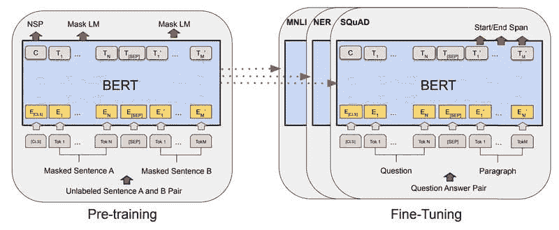
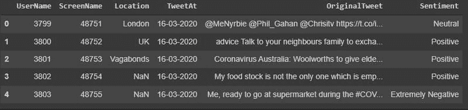

# 使用 HuggingFace 微调 BERT 进行推文分类

> 原文：[`www.kdnuggets.com/2022/01/finetuning-bert-tweets-classification-ft-hugging-face.html`](https://www.kdnuggets.com/2022/01/finetuning-bert-tweets-classification-ft-hugging-face.html)



双向编码器表示模型（BERT）是由谷歌开发的基于变换器的最先进模型。它可以进行预训练，然后针对特定任务进行微调。我们将在本文中看到微调的实际操作。

我们将对 BERT 进行分类任务的微调。任务是对与 COVID 相关的推文进行情感分类。

在这里，我们使用 HuggingFace 库来微调模型。HuggingFace 使整个过程从文本预处理到训练变得简单。

## BERT

BERT 在 BooksCorpus 数据集和英文维基百科上进行了预训练。它在十一项自然语言处理任务上获得了最先进的结果。

BERT 在两个任务上同时进行训练

+   掩蔽语言建模（MLM）——15%的标记被掩蔽，训练以预测掩蔽的单词

+   下一句预测（NSP）——给定两个句子 A 和 B，预测 B 是否跟在 A 后面

BERT 旨在通过在所有层中共同条件化左右上下文，从未标记的文本中预训练深度双向表示。

结果是，预训练的 BERT 模型只需通过一个额外的输出层就可以微调，创建适用于广泛任务的最先进模型，例如问答和语言推理，而无需对任务特定的架构进行 substantial modifications。

## 数据集

我们使用的是[**Kaggle**](https://www.kaggle.com/datatattle/covid-19-nlp-text-classification)上提供的 Coronavirus 推文 NLP——文本分类数据集。

数据集有两个文件：Corona_NLP_test.csv（4 万条记录）和 Corona_NLP_test.csv（4 千条记录）。

这些是训练数据的前五条记录：



如你所见，我们的数据中有 5 个**特征**：UserName，ScreenName Location，TweetAt，OriginalTweet，Sentiment，但我们只对其中的 2 个感兴趣，即**OriginalTweet**包含实际推文，**Sentiment**是我们推文的标签。

这些推文被分为 5 类——‘中性’，‘积极’，‘极端负面’，‘负面’，‘极端积极’。因此，**标签**的数量是 5。

## 数据加载与预处理

我们将使用 HuggingFace 库进行这个项目。我们需要安装两个模块：

```py
pip install transformerspip install datasets
```

+   变换器：HuggingFace 对变换器的实现。我们可以下载各种预训练模型

+   数据集：加载数据集，同时也可以下载 HuggingFace hub 上提供的不同数据集

```py
from datasets import load_dataset
```

在这里，我们使用来自 datasets 库的`load_dataset`。`load_dataset`可以用来从 HuggingFace hub 下载数据集，或者加载我们自定义的数据集。

我们将数据类型指定为 CSV，将文件名作为字典传递给`data_files`。我们将训练和测试文件加载到数据集变量中。

如果我们打印`dataset`变量，这里是输出结果：

## 预处理数据

我们将保持简单，只做两个预处理步骤，即分词和将标签转换为整数。

HuggingFace`AutoTokenizer`负责分词部分。我们可以下载与我们模型（即 BERT）对应的分词器。

BERT 分词器会自动将句子转换为 BERT 模型所期望的形式，包括 tokens、numbers 和 attention_masks。

例如：这是一个通过分词器处理的示例句子

```py
>> tokenizer("Attention is all you need")output:
{
'input_ids': [101, 1335, 5208, 2116, 1110, 1155, 1128, 1444, 102], 'token_type_ids': [0, 0, 0, 0, 0, 0, 0, 0, 0], 
'attention_mask': [1, 1, 1, 1, 1, 1, 1, 1, 1]
}
```

现在作为预处理步骤的一部分，我们将执行两个步骤：

+   将情感转换为整数

+   对推文进行分词

我们将使用`map`函数，它类似于 pandas 数据框的 apply 函数。它将函数作为参数，并应用于整个数据集。

在上述代码中，我们定义了一种将标签转换为整数的方法，并对推文进行了分词，同时删除了不需要的列。

现在我们已经为训练部分做好了准备。

## 训练

有两种方法来训练数据，我们可以自己编写训练循环，也可以使用 HuggingFace 库中的 trainer。

在这种情况下，我们将使用来自库的 trainer。要使用 trainer，首先需要定义训练参数，例如名称、num_epochs、batch_size 等等。

现在让我们下载 BERT 模型，使用 `AutoModelForSequenceClassification` 类，非常简单。

下载的分类模型也需要一个`num_labels`参数，即我们数据中的类别数量。BERT 模型的末尾附加了一个线性层，以使输出等于类别数量。

```py
(classifier): Linear(in_features=768, out_features=5, bias=True)
```

上述线性层会自动添加为最后一层。由于 BERT 输出大小为 768，我们的数据有 5 个类别，因此添加了一个线性层，in_features=768 和 out_features=5。

在开始训练之前，我们将把训练数据拆分为训练集和评估集。我们有 40k 的训练数据和 1k 的评估数据。

如果我们使用 HuggingFace trainer，则需要导入模块`Trainer`并传递模型、数据集和训练参数。

就这样，我们现在准备开始训练。我们需要在 trainer 上调用`train`方法，训练将开始。

```py
trainer.train()
```

训练将进行 3 个周期，这可以通过训练参数进行调整。

一旦训练完成，我们可以运行`trainer.evaluate()`来检查准确率，但在此之前，我们需要导入指标。

datasets 库提供了广泛的指标。我们在这里使用准确率。我们的数据通过训练仅 3 个周期获得了 83% 的准确率。

准确性可以通过多训练一段时间或进一步的数据预处理来提高，例如从推文中删除提及和不必要的杂乱，但这些可以留到其他时间再做。

感谢阅读。

+   [我的 LinkedIn](https://www.linkedin.com/in/codistro/)

+   [Colab 笔记本](https://github.com/codistro/Articles/blob/main/covid_tweet_classification.ipynb)

+   [HuggingFace](https://huggingface.co/)

**[Rajan Choudhary](https://www.linkedin.com/in/codistro/)** 是 Mcafee 的 QA 工程师，拥有 2 年以上的经验。

* * *

## 我们的前三大课程推荐

 1\. [Google 网络安全证书](https://www.kdnuggets.com/google-cybersecurity) - 快速进入网络安全职业生涯。

 2\. [Google 数据分析专业证书](https://www.kdnuggets.com/google-data-analytics) - 提升你的数据分析水平

 3\. [Google IT 支持专业证书](https://www.kdnuggets.com/google-itsupport) - 支持你所在组织的 IT

* * *

### 更多相关话题

+   [RAG 与微调：哪种工具最能提升你的 LLM 应用？](https://www.kdnuggets.com/rag-vs-finetuning-which-is-the-best-tool-to-boost-your-llm-application)

+   [使用 HuggingFace Pipelines 和 Streamlit 回答问题](https://www.kdnuggets.com/2021/10/simple-question-answering-web-app-hugging-face-pipelines.html)

+   [使用 HuggingFace Transformers 的简单 NLP Pipelines](https://www.kdnuggets.com/2023/02/simple-nlp-pipelines-huggingface-transformers.html)

+   [一个简单实现的端到端 HuggingFace 项目](https://www.kdnuggets.com/a-simple-to-implement-end-to-end-project-with-huggingface)

+   [HuggingFace 推出了免费的深度强化学习课程](https://www.kdnuggets.com/2022/05/huggingface-launched-free-deep-reinforcement-learning-course.html)

+   [使用 BERT 分类长文本文档](https://www.kdnuggets.com/2022/02/classifying-long-text-documents-bert.html)
