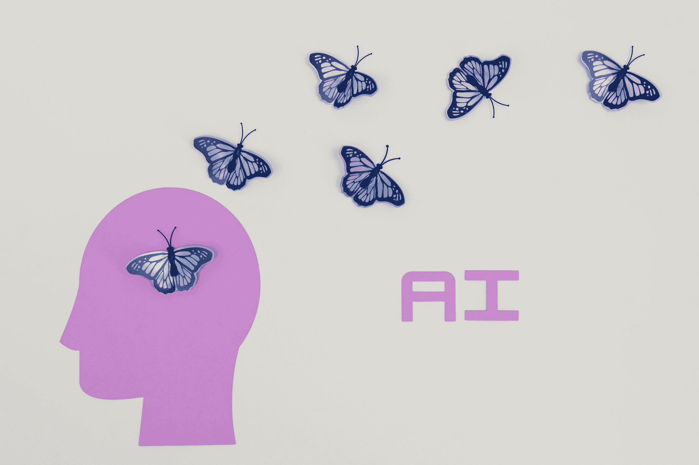

# 2023 年上半年：数据科学和人工智能发展

> 原文：[`www.kdnuggets.com/2023/07/first-half-2023-data-science-ai-developments.html`](https://www.kdnuggets.com/2023/07/first-half-2023-data-science-ai-developments.html)

图片来源：[塔拉·温斯特德](https://www.pexels.com/photo/white-and-blue-butterflies-illustration-8849282/)

2023 年上半年发生了很多事情。数据科学和人工智能领域有了显著进展。进展如此之快，以至于我们很难跟上。我们可以肯定地说，2023 年上半年显示了我们未曾预料到的快速进步。

* * *

## 我们的前三个课程推荐

 1\. [谷歌网络安全证书](https://www.kdnuggets.com/google-cybersecurity) - 快速进入网络安全职业轨道

 2\. [谷歌数据分析专业证书](https://www.kdnuggets.com/google-data-analytics) - 提升你的数据分析技能

 3\. [谷歌 IT 支持专业证书](https://www.kdnuggets.com/google-itsupport) - 支持你的组织的 IT 需求

* * *

所以，与其谈论我们如何被这些创新所吸引，不如直接讨论它们。

# 自然语言处理

我将从最显而易见的开始。自然语言处理（NLP）。这是一个在黑暗中逐步建立的领域，并在 2023 年变得炙手可热。

这些进展在 OpenAI 的 ChatGPT 中得到了验证，它引起了世界的轰动。自今年初正式发布以来，ChatGPT 从 GPT-4 发展到现在我们期待的 GPT-5。它们发布了插件，以改善人们的日常生活，并优化 data scientists 和机器学习工程师的工作流程。

我们都知道，在 ChatGPT 发布之后，谷歌发布了 Bard AI，它在个人、企业等领域取得了成功。Bard AI 与 ChatGPT 竞争最佳聊天机器人位置，提供类似的服务，如提升机器学习工程师的工作。

在这些聊天机器人发布的过程中，我们看到大型语言模型（LLM）突然出现。[大型模型系统组织](https://lmsys.org/)（LMSYS Org）是由加州大学伯克利分校的学生和教职工创立的一个开放研究组织，创建了 ChatBot Arena——一个 LLM 基准测试平台，旨在通过开放数据集、模型、系统和评估工具的共同开发，使模型对每个人都更加可及。

# AutoML

现在人们已经习惯了聊天机器人为他们回答问题，使他们的工作和个人生活变得更加轻松——那么数据分析师和机器学习专家呢？

他们一直在使用 AutoML——这是一个强大的工具，专为数据科学家和机器学习工程师等数据专业人士设计，用于自动化数据预处理、超参数调优，并执行诸如特征工程等复杂任务。随着数据科学和 AI 的进步，自然我们看到了对数据和 AI 专家的高需求。然而，由于进展速度迅猛，我们也看到这些 AI 专业人士的短缺。因此，找到方法以自动化的方式探索、分析和预测数据，将提高许多公司的成功率。

它不仅能为数据专家节省时间，还能让组织有更多时间去扩展和在其他任务上进行更多创新。

# 生成式 AI

如果你见证了聊天机器人的爆发，你会看到“生成式 AI”这个词汇不断被提及。生成式 AI 能够根据用户提示生成文本、图像或其他形式的媒体。就像上述进展一样，生成式 AI 正在帮助各行各业完成任务，使他们的生活更轻松。

生成式 AI 能够生成新内容，替代重复任务，处理定制数据，并几乎生成你想要的任何东西。如果你对生成式 AI 还不熟悉，你会想了解 Stable Diffusion——这是生成式 AI 的基础。如果你是数据科学家或数据分析师，你可能听说过 PandasAI——这是一种生成式 AI Python 库，如果没有，它是一个开源工具包，将生成式 AI 功能集成到 Pandas 中，以简化数据分析。

但随着这些生成式 AI 工具和软件的发布，在生成式 AI 时代，数据科学家是否仍然需要？

# 深度学习

深度学习继续蓬勃发展。随着数据科学和人工智能的最新进展，越来越多的时间和精力被投入到行业研究中。作为机器学习的一个子集，涉及算法和人工神经网络，它在图像分类、物体检测和面部识别等任务中得到广泛应用。

随着我们经历第四次工业革命，深度学习算法正在让我们像人类一样从数据中学习。我们看到越来越多的自动驾驶汽车上路，欺诈检测工具、虚拟助手、医疗预测建模等也在不断增加。

2023 年已经证明了深度学习在自动化过程、机器人技术、区块链和各种其他技术中的应用。

# 边缘计算

看到这些变化，你可能会觉得这些计算机相当疲惫吧？为了适应人工智能和数据科学的进步，公司需要能够支持这些进步的计算机和系统。边缘计算将计算和数据存储更接近数据源。在使用这些先进模型时，边缘计算提供了实时数据处理，并允许所有设备之间的顺畅通信。

例如，当大型语言模型每两秒发布一次时，很明显，组织需要像边缘计算这样的有效系统才能成功。谷歌今年发布了 TPU v4——这些计算资源能够满足机器学习和人工智能的高计算需求。

由于这些进展，我们看到越来越多的组织从云计算转向边缘计算，以适应当前和未来的需求。

# 伦理人工智能和数据科学

发生了很多事情，而且在短时间内发生的。对于像政府这样的组织来说，跟上这些变化变得非常困难。来自世界各地的政府都在提出‘这些人工智能应用如何影响经济和社会，意味着什么？’的问题。

人们对这些人工智能和数据科学应用的偏见和歧视、隐私、透明度和安全性感到担忧。那么，人工智能和数据科学的伦理方面是什么，我们应该对未来有怎样的期待？

我们已经有了欧洲人工智能法案推动一个将人工智能系统分为四个风险领域的框架。OpenAI 的首席执行官萨姆·奥特曼作证了对新技术的担忧和可能的陷阱，在 6 月 16 日的美国参议院委员会上。尽管短时间内发生了许多进展，但仍有很多人感到担忧。在接下来的 6 个月里，我们可以期待更多法律的通过以及相关法规和框架的建立。

# 总结

如果你在过去 6 个月没有跟进人工智能和数据科学，希望这篇文章为你提供了对最近发生的事件的快速概述。接下来 6 个月，这些进展如何被采纳，同时确保这些技术的负责任和道德使用，将会很有趣。

**[Nisha Arya](https://www.linkedin.com/in/nisha-arya-ahmed/)** 是一位数据科学家、自由职业技术作家以及 KDnuggets 的社区经理。她特别感兴趣于提供数据科学职业建议或教程以及数据科学的理论知识。她还希望探索人工智能在延续人类寿命方面的不同益处。她是一位热衷学习者，寻求拓宽自己的技术知识和写作技能，同时帮助指导他人。

### 更多相关主题

+   [人工智能、分析、机器学习、数据科学、深度学习…](https://www.kdnuggets.com/2021/12/developments-predictions-ai-machine-learning-data-science-research.html)

+   [2021 年数据科学与分析行业主要发展及关键…](https://www.kdnuggets.com/2021/12/developments-predictions-data-science-analytics-industry.html)

+   [2021 年的主要发展和 2022 年的关键趋势：人工智能、数据科学…](https://www.kdnuggets.com/2021/12/trends-ai-data-science-ml-technology.html)

+   [2022 年数据科学、机器学习、人工智能和分析的关键发展](https://www.kdnuggets.com/2022/12/key-data-science-machine-learning-ai-analytics-developments-2022.html)

+   [使用 TensorFlow 和 Keras 构建和训练你的第一个神经网络](https://www.kdnuggets.com/2023/05/building-training-first-neural-network-tensorflow-keras.html)

+   [2023 年你必须阅读的 5 本免费数据科学书籍](https://www.kdnuggets.com/2023/01/5-free-data-science-books-must-read-2023.html)
