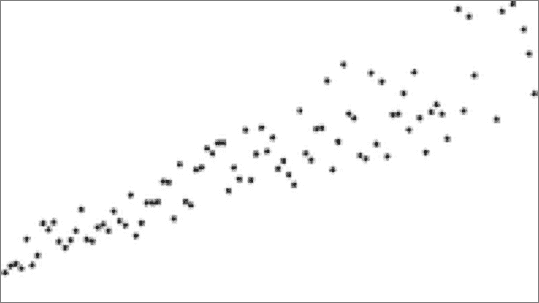
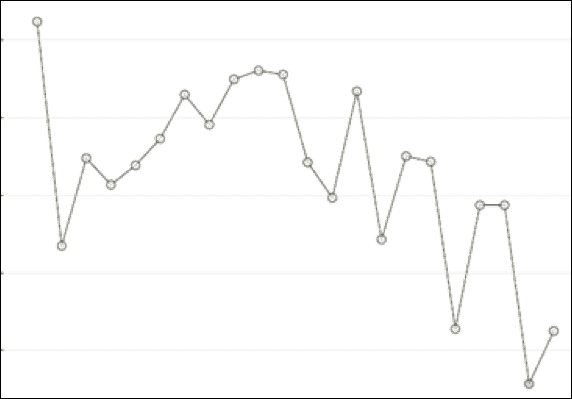

# 你已经创建了你的第一个线性回归模型。你验证了这些假设吗？

> 原文：[`www.kdnuggets.com/2017/11/first-linear-regression-assumptions.html`](https://www.kdnuggets.com/2017/11/first-linear-regression-assumptions.html)

评论

**由 [Sudipto Dasgupta](https://www.linkedin.com/in/dsudipto/)，Flipkart 提供。**

随着数据科学时代的到来，学习和应用算法的兴趣增加了，不仅仅是业务分析师或数据科学家，还有一些核心工作可能不是数据处理或模型构建的其他专业人士。如果有人理解这些出色技术的何时、为什么以及如何应用，这无疑是一个好兆头。

* * *

## 我们的前三个课程推荐

 1\. [Google 网络安全证书](https://www.kdnuggets.com/google-cybersecurity) - 快速进入网络安全职业生涯。

 2\. [Google 数据分析专业证书](https://www.kdnuggets.com/google-data-analytics) - 提升你的数据分析技能

 3\. [Google IT 支持专业证书](https://www.kdnuggets.com/google-itsupport) - 支持你的组织的 IT

* * *

线性回归模型在某些假设下有效，这些假设包括：

**1\. Y（因变量）和 X（自变量）之间的线性关系**。如果你的散点图显示出曲线关系，请记住，高次多项式（2 次及以上）可能更适合建模数据。比较模型、统计数据，并决定哪个模型最好地解释了你的数据。

**2\. 多重共线性** – 没有多重共线性。为了确保线性回归模型的有效性，VIF（方差膨胀因子）不应过高。多少算过高呢？通常，VIF 为 5 被用作阈值。有些人甚至使用 2.5。你可以自行研究这个问题，但几乎总是 VIF 达到 10 就过高了。高 VIF 表明存在多重共线性，即自变量之间的高相关性。你可以通过移除一个或多个相关的自变量并重新运行模型来测试你的模型。你也可以使用其他降维技术，如 PCA（主成分分析）。

**3\. 同方差性** – *Homo* 意为相似，而 *scedasticity* 意为误差项的分布。因此，同方差性意味着误差项的分布是相似的（即随机的）。如果误差项中存在任何非随机行为，如下图中的残差与拟合图，则模型被认为存在称为异方差性的病症。这也可以通过 ncv 测试等方法检测到。使用 Box-Cox 等方法对变量进行变换，或者尝试完全不同的变量可以解决模型中的这个问题。

**4\. 残差正态性** - 误差项也称为残差。这是 DV(y) 的观测值与预测值 (ŷ) 之间的差异。误差项是阻碍我们实现完美预测的因素。请记住，在计算标准差时，我们使用 {x-x̄}，而在卡方检验中，我们使用 {观测值-期望值} 进行计算。残差分析是多种统计方法的一个组成部分，包括 LR。LR 的假设是残差必须独立且随机分布，均值为零，这在技术上意味着残差应该通过正态性测试。这可以通过提取残差并进行正态性测试（如 Anderson-Darling 测试或 Shapiro 测试）来验证，或者通过分位数图或概率图进行图形化验证。非随机行为的存在表明模型需要某些调整。离群值可能是罪魁祸首，或者需要更高阶项。在某些情况下，转换也可能有所帮助。

**5\. 自相关** - 不应存在。在前一点中，我提到过残差必须独立且正态分布。当残差的独立性被破坏时，我们可以看到如下模式，或在残差与顺序图中出现周期性趋势。这也可以通过对数据应用 Durbin-Watson 测试来检测。解决方案也有多种类型，如使用不同的模型或转换某些变量。

简单线性回归，顾名思义，容易理解和应用。我在项目中发现，线性回归在建模数据方面表现良好。因此，线性回归仍然是最常用的数据建模算法之一，这并不令人惊讶。

**个人简介：Sudipto Dasgupta** 目前在 Flipkart India Pvt. Ltd. 担任流程设计专家，该公司是印度最大的电子商务组织。他在软件、市场研究、教育和供应链等领域拥有超过 15 年的业务分析经验。他是一位经验丰富的六西格玛大师黑带和项目管理专业人士（PMP），拥有数学和统计学的教育背景。他对数据科学有着积极的兴趣。

**相关：**

+   初学者的十大机器学习算法

+   使用 R 学习广义线性模型（GLM）

+   回归分析真的属于机器学习吗？

### 更多相关内容

+   [XGBoost 的假设是什么？](https://www.kdnuggets.com/2022/08/assumptions-xgboost.html)

+   [DataLang: 一种面向数据科学家的新编程语言… 创建…](https://www.kdnuggets.com/2023/04/datalang-new-programming-language-data-scientists-chatgpt.html)

+   [我在 3 天内创建了一个 AI 应用](https://www.kdnuggets.com/2023/08/created-ai-app-3-days.html)

+   [线性回归模型选择：平衡简易性与复杂性](https://www.kdnuggets.com/2023/02/linear-regression-model-selection-balancing-simplicity-complexity.html)

+   [为什么你应该使用线性回归模型而不是… 的 3 个理由](https://www.kdnuggets.com/2021/08/3-reasons-linear-regression-instead-neural-networks.html)

+   [线性回归与逻辑回归的比较](https://www.kdnuggets.com/2022/11/comparing-linear-logistic-regression.html)
