# DeepMind 的 AlphaTensor 首次开源实现

> 原文：[`www.kdnuggets.com/2023/03/first-open-source-implementation-deepmind-alphatensor.html`](https://www.kdnuggets.com/2023/03/first-open-source-implementation-deepmind-alphatensor.html)

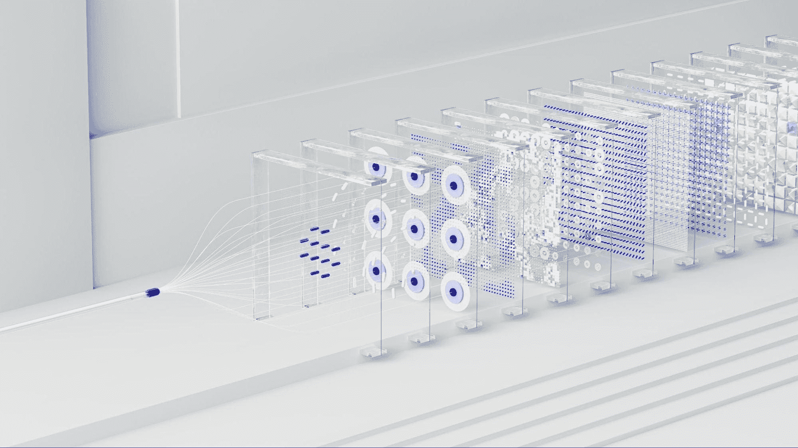

照片由[DeepMind](https://unsplash.com/@deepmind?utm_source=unsplash&utm_medium=referral&utm_content=creditCopyText)提供，来源于[Unsplash](https://unsplash.com/photos/4QVqSh4VvP4)

矩阵乘法是一种在许多系统中使用的基础操作，从神经网络到科学计算例程。寻找高效且可证明正确的矩阵乘法算法可以对加快计算速度和提高效率产生巨大影响，但这是一项非常具有挑战性的任务。可能的算法空间非常庞大，而传统的算法发现方法，如人工设计的启发式方法或组合搜索，往往不够理想。

* * *

## 我们的三大课程推荐

 1\. [谷歌网络安全证书](https://www.kdnuggets.com/google-cybersecurity) - 快速进入网络安全职业生涯。

 2\. [谷歌数据分析专业证书](https://www.kdnuggets.com/google-data-analytics) - 提升您的数据分析技能

 3\. [谷歌 IT 支持专业证书](https://www.kdnuggets.com/google-itsupport) - 支持您的组织的 IT 需求

* * *

[DeepMind](https://www.deepmind.com/)最近提出的基于 AI 的自动化搜索解决方案远超人类直觉。该解决方案由一个称为 AlphaTensor 的深度强化学习代理组成，建立在[AlphaZero](https://www.deepmind.com/blog/alphazero-shedding-new-light-on-chess-shogi-and-go)之上。这个代理被训练来玩一个单人游戏 TensorGame，目标是发现计算高效的矩阵乘法算法。

AlphaTensor 特别擅长处理大矩阵，通过将大型矩阵乘法分解为较小的乘法。此外，一旦针对特定硬件设备进行微调，AlphaTensor 可以实现矩阵乘法的最先进性能。

AlphaTensor 在加速深度学习计算方面具有巨大的潜力。在深度学习中，许多耗时的操作可以映射为矩阵乘法。通过使用 AlphaTensor 优化这些操作，可以显著提高深度学习模型的整体性能。

最近，OpenAlphaTensor，[AlphaTensor 的首个开源实现](https://github.com/nebuly-ai/nebullvm/tree/main/apps/accelerate/open_alpha_tensor)发布了，这可能会彻底改变深度学习模型的计算能力。

## 矩阵乘法张量

对于矩阵乘法优化的非专家来说，理解如何将诸如矩阵乘法这样的操作映射到三维张量中可能并不直观。我将尝试用简单的语言和示例来解释。

让我们考虑乘积 C = A*B，为了简单起见，假设 A 和 B 都是大小为 N 的方阵。乘法操作可以映射到形状为(N², N², N²)的 3D 张量中。第一个张量维度表示展平的矩阵 A，第二个维度表示展平的矩阵 B，第三个维度表示展平的矩阵 C。

张量的每个条目只有二进制值（要么是 1，要么是 0）。请注意，张量表示乘法操作，因此它与矩阵 A 和 B 的值无关。

张量的每个条目对应于操作的系数。例如，要计算 C[1,1]，需要同时乘以 A[1,1]和 B[1,1]。因此，张量条目[0,0,0]，即 A[1,1]、B[1,1]和 C[1,1]，的值将为 1。相反，要计算 C[1,1]，A[2,1]是不需要的。因此，张量行 T[N+1, :, 0]将仅包含零。

下图展示了 N=2 时张量的一个例子。

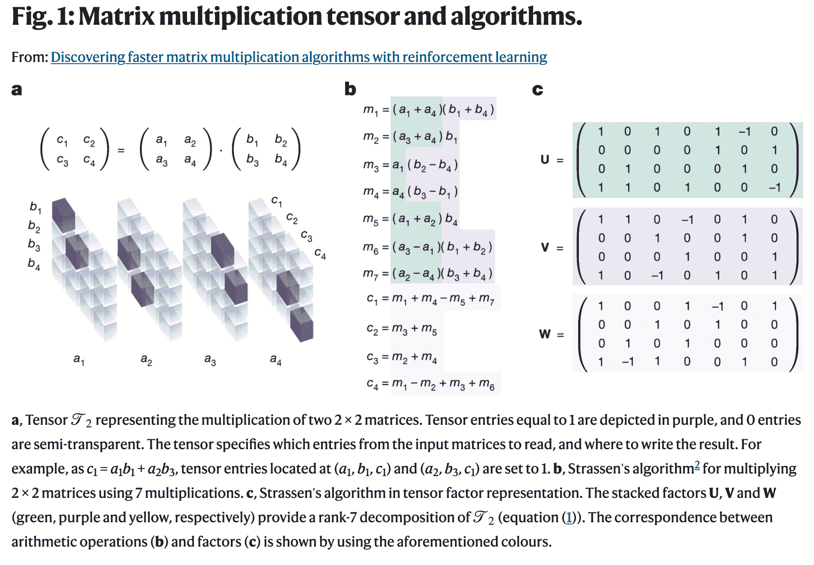

图片来源于 DeepMind 的[论文](https://www.nature.com/articles/s41586-022-05172-4)，该论文发表在[Nature](https://www.nature.com/)上

如上图（b）和（c）所示，可以使用 3D 张量的分解实现计算乘积的算法。更具体地说，下面的算法可以用于将张量分解（矩阵 U、V、W）转换为矩阵乘法算法。

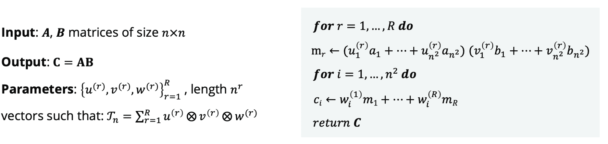

用于计算矩阵乘积 C=AB 的 Meta 算法参数在 DeepMind 的[论文](https://www.nature.com/articles/s41586-022-05172-4)中介绍

## TensorGame

找到高效的矩阵乘法算法是极具挑战性的，因为即使对于小规模的矩阵乘法，考虑的算法数量也远远大于宇宙中的原子数。

DeepMind 将这个问题转化为单人游戏，并称之为 TensorGame。在这个游戏中，玩家选择如何组合矩阵的不同条目以进行乘法运算。根据实现正确乘法结果所需的操作次数来分配分数。当达到零张量或已进行最大移动次数时，游戏结束。最终的分解结果基于残差秩的估计以及某些优化标准，如渐近时间复杂度或实际运行时间。

TensorGame 中的初始位置对应于在某个随机基底上表示的矩阵乘法张量。

在游戏的每一步 t，玩家写下三个向量 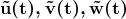，这些向量指定了秩-1 张量 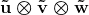。通过减去玩家选择的向量来更新游戏状态：

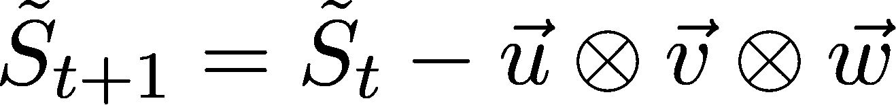

其中 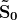 是矩阵乘法张量。

如果游戏在 p 步中结束，这意味着矩阵乘法张量  可以分解为 p 个秩-1 张量 ，即它至少具有秩 p。

TensorGame 可以被解释为一种秩分解算法，AlphaTensor 可以被视为一种估计张量秩的算法。

## AlphaTensor 架构

到目前为止，我们了解了 TensorGame，并澄清了其解决方案如何被视为矩阵乘法算法。现在让我们探讨 AlphaTensor 的主要概念，这是用于游戏的算法。

AlphaTensor 架构基本上是一个编码器-解码器 Transformer 架构，其中：

+   编码器以游戏状态 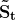 为输入，以及模型采取的 n 个之前的动作（通常 n=7），和当前动作的时间索引 t。信息被堆叠在一个形状为 (n+1, N², N², N²) 的张量中。这个张量随后被重塑并通过三个线性层转换成形状为 (N², N², c) 的张量，其中 c 是模型的内部维度。

+   解码器以自回归方式从编码器给出的嵌入向量生成 n_steps 动作。每个动作对应于三元组的一个标记 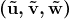，这些三元组表示分解游戏张量（即降低其秩）的其中一个三元组。

模型通过交替进行反向传播和模型行动进行训练。模型行动用于生成数据，然后用于训练模型。在实践中，模型是通过合成生成的数据和模型在行动过程中生成的数据的混合进行训练的。行动步骤是通过对矩阵操作对应的 3D 张量进行 n_actors 游戏来完成的。每个演员要么在标准基底上进行游戏，要么在替代基底上进行游戏（基底变化以给定的概率应用）。然后收集结果，并可以与合成数据一起用于训练步骤。

动作步骤基于 AlphaZero 的蒙特卡洛树搜索（MCTS），经过修改以支持大型动作空间。简而言之，在选择动作之前，从模型输出中探索 n_sims 条路径，最大未来探索步数为 5 步。然后，模型生成的概率会根据生成的路径进行调整。接着选择具有最有前景的未来路径的动作以继续游戏。

在训练模型时，奖励实际上是负奖励（惩罚）。其绝对值随着解决游戏所需的每一步而增加。如果模型需要 m 步才能解决一个 TensorGame，那么与该游戏相关的奖励是 r=-m。如果模型在 max_rank 步数内无法解决 TensorGame，则通过估计剩余张量的秩来计算奖励。秩估计为组成张量的矩阵的秩之和。这个估计是张量真实秩的上界。

在微调模型时，终态的惩罚奖励还应考虑模型所产生的算法的延迟。奖励公式变为 rt'=rt+λbt，其中 rt 是之前描述的奖励方案，bt 是基准奖励（仅在终态为非零），*λ*是用户指定的系数。

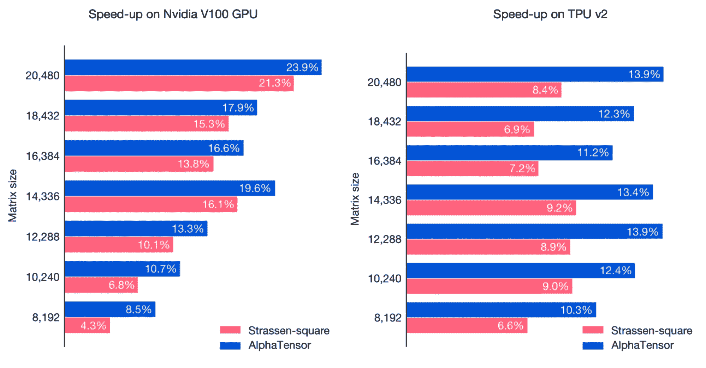

从 DeepMind 的论文中提取的 AlphaTensor 发现的针对 GPU 和 TPU 优化的算法的加速比（%）。加速比是相对于相同硬件上的标准（例如 GPU 上的 cuBLAS）矩阵乘法进行测量的，并与[Strassen 平方算法](https://en.wikipedia.org/wiki/Strassen_algorithm)进行比较。来源：[DeepMind](https://www.deepmind.com/blog/discovering-novel-algorithms-with-alphatensor)。

# 深 Mind 的 AlphaTensor 开源实现

我最近发布了[OpenAlphaTensor](https://github.com/nebuly-ai/nebullvm/tree/main/apps/accelerate/open_alpha_tensor)，这是 AlphaTensor 的第一个开源实现。在这一部分，我将详细介绍实现过程。正如我们之前讨论的，AlphaTensor 的架构非常简单，基于一个标准的带有编码器-解码器架构的 transformer。AlphaTensor 中最有趣的组件是编码器部分的第一层和动作采样的方式。

让我们从第一个编码层开始。

```py
# x.size = (N, T, S, S, S)
# scalars.size = (N, s)
batch_size = x.shape[0]
S = x.shape[-1]
T = x.shape[1]
x1 = x.permute(0, 2, 3, 4, 1).reshape(batch_size, S, S, S * T)
x2 = x.permute(0, 4, 2, 3, 1).reshape(batch_size, S, S, S * T)
x3 = x.permute(0, 3, 4, 2, 1).reshape(batch_size, S, S, S * T)
input_list = [x1, x2, x3]
for i in range(3):
    temp = self.linears_1i.reshape(batch_size, S, S, 1)
    input_list[i] = torch.cat([input_list[i], temp], dim=-1)
    input_list[i] = self.linears_2i
x1, x2, x3 = input_list
```

在上面的代码片段中，我们展示了输入张量如何分解为三个张量，然后将这些张量用作 transformer 层的查询、键和值输入。

1.  在表示展平矩阵 (A, B, C) 的三个张量维度中，输入张量沿每个维度展平，同时与表示先前动作的维度一起。在这种方式下，在每个展平的输入张量副本中，所选维度是最后 T-1 个值和实际值的聚合，对于所选维度的所有 S 个值，其中 S=N²。从哲学上讲，就好像对于每个维度，我们专注于在该维度中先前动作发生的情况。

1.  标量被映射到三个不同的维度为 S² 的空间中，然后重新形状以与先前点获得的张量连接。概念上，标量被映射到维度为 S² 的嵌入空间，然后将嵌入的信息分块成 S 个向量并堆叠在一起，类似于文本被标记化时的情况。

1.  标量标记与重新结构化的输入张量连接在一起，然后作为输入提供给线性层，以将标量+通道历史关注信息映射到模型的内部维度中。

这三步可以解释为一种方法，既向模型提供关于标量的信息（如在 TensorGame 时间步中），又关注每个通道的先前动作。

关于动作产生的方式，值得注意的是 AlphaTensor 输出的三元组 u, v, w 旨在降低张量秩。这三个向量的大小为 S，由于它们被连接在一起，模型必须产生一个大小为 3*S 的向量。AlphaTensor 使用 RL 算法进行训练，因此所有可能的动作必须以概率形式表达在一个枚举空间中，即模型对不同的动作生成一个概率。这意味着 3S 空间中的每个向量都应该映射到一个不同的动作。这导致了一个大小为 |F|^(3S) 的动作空间，其中 |F| 是 u、v、w 元素可以取的不同值的数量。通常，这些值限制在 (-2, -1, 0, 1, 2)，结果是 5 个元素的基数。

这里出现了一个重大挑战：为了生成大小为 5 的矩阵乘法的动作概率，我们需要 5⁷⁵ * 4 字节的内存，这意味着大约 10⁴⁴ GB 的内存。显然，我们无法管理如此大的动作空间。

我们如何解决这个问题？为了减少动作概率的内存占用，我们可以将三元组拆分成更小的块，“标记化”它们，并将这些块作为生成的标记输入到变换器架构中，即这些标记以自回归方式作为输入提供给解码器。在上面的例子中，我们可以将三元组拆分成 15 个块，将内存消耗减少到 15 * 5^(75/15) * 4，即 187.5 KB。

```py
def _eval_forward(self, e: torch.Tensor):
    bs = e.shape[0]
    future_g = (
        torch.zeros((bs, self.n_samples, self.n_steps)).long().to(e.device)
    )
    ps = torch.ones((bs, self.n_samples)).to(e.device)
    e = e.unsqueeze(1).repeat(1, self.n_samples, 1, 1)

    future_g = future_g.view(-1, self.n_steps)
    ps = ps.view(-1)
    e = e.view(-1, e.shape[-2], e.shape[-1])
    for i in range(self.n_steps):
        o_s, z_s = self.core(future_g[:, : i + 1], e)
        future_g[:, i], p_i = sample_from_logits(o_s[:, i])
        ps *= p_i
    future_g = future_g.view(bs, self.n_samples, self.n_steps)
    ps = ps.view(bs, self.n_samples)
    return (
        future_g,
        ps,
        z_s[:, 0].view(bs, self.n_samples, *z_s.shape[2:]).mean(1),
    )
```

上面展示了生成完整动作的代码片段。在代码中，self.core 包含解码层，而张量 e 表示编码层的输出。Zero 可以被视为 NLP 模型中的<eos>标记，而表示 n_steps 块的 n_steps 动作是逐步生成的。

模型返回三个量：

1.  生成的动作

1.  与完整动作相关的概率

1.  生成第一个动作（第一个块）的 logits，这将用于计算模型值。

值得花几句话说明 n_samples 参数。该参数用于行动步骤，允许模型生成不同版本的三元组，这些三元组将用于探索蒙特卡罗树搜索算法中的动作空间。n_samples 个不同的动作是根据模型生成的策略进行抽样的。

## 行动步骤

整个算法中最棘手的部分可能是用于解决 TensorGame 的行动步骤。该算法在 AlphaTensor 论文中没有深入解释，因为它基于几篇 DeepMind 的先前论文，这些论文只是被引用并作为已知。在这里，我将重建所有缺失的部分，并逐步解释我们的实现。

我们可以将行动步骤组织为三个不同的组件：

+   蒙特卡罗树搜索

+   游戏模拟

+   改进的策略计算

让我们逐一分析它们。

## 蒙特卡罗树搜索（MCTS）

蒙特卡罗树搜索（MCTS）是一种广泛使用的人工智能技术，主要用于游戏，特别是棋盘游戏和视频游戏。该算法创建一个游戏树，模拟潜在的移动和结果，并使用随机抽样来评估每个动作的预期奖励。然后，算法反复选择预期奖励最高的动作，并模拟结果直到达到终止状态或指定的停止条件。这些模拟用于估算每个动作的获胜概率，并指导决策过程。MCTS 已被证明在可能的动作和结果数量庞大的复杂游戏中有效，并且已被成功应用于游戏 AI 系统，如 AlphaGo。

在 AlphaTensor 中，使用了原始 MCTS 的修改版本。特别是，与从整个动作空间随机选择动作不同，该动作是从模型直接生成的子集（通过前面提到的 n_samples）中选择的。然后在改进的策略计算步骤中应用对策略升级的修正。

在我们的实现中，我们决定将关于蒙特卡洛树的所有信息保存在一个字典中，该字典的键是 TensorGame 状态的哈希版本，值是与状态本身相关的信息。每个蒙特卡洛步骤从一个节点开始，并模拟`n_sim`个迷你游戏，探索未来 5 步的范围。如果节点在先前的模拟中已经被探索过，则`n_sim`会根据之前的探索次数进行调整。每个节点的访问次数存储在`N_s_a`张量中，因为该张量包含每个节点子动作的访问次数（在模型抽样的动作中）。

```py
def monte_carlo_tree_search(
    model: torch.nn.Module,
    state: torch.Tensor,
    n_sim: int,
    t_time: int,
    n_steps: int,
    game_tree: Dict,
    state_dict: Dict,
):
"""Runs the monte carlo tree search algorithm.

    Args:
        model (torch.nn.Module): The model to use for the simulation.
        state (torch.Tensor): The initial state.
        n_sim (int): The number of simulations to run.
        t_time (int): The current time step.
        n_steps (int): The maximum number of steps to simulate.
        game_tree (Dict): The game tree.
        state_dict (Dict): The dictionary containing the states.
    """
    state_hash = to_hash(extract_present_state(state))
    if state_hash in state_dict:
        with torch.no_grad():
            N_s_a = state_dict[state_hash][3]
            n_sim -= int(N_s_a.sum())
            n_sim = max(n_sim, 0)

    for _ in range(n_sim):
        simulate_game(model, state, t_time, n_steps, game_tree, state_dict)
    # return next state
    possible_states_dict, _, repetitions, N_s_a, q_values, _ = state_dict[
        state_hash
    ]
    possible_states = _recompose_possible_states(possible_states_dict)
    next_state_idx = select_future_state(
        possible_states, q_values, N_s_a, repetitions, return_idx=True
    )
    next_state = possible_states[next_state_idx]
    return next_state
```

上面的代码展示了我们对算法的实现。为了代码的简洁性，策略修正是在`simulate_game`函数中完成的。

## 游戏模拟

`simulate_game`函数负责探索由代表 TensorGame 某一特定状态的节点组成的树。当遇到叶子节点时，它还会运行模型，并将所有节点信息存储在`state_dict`字典中。让我们深入了解它的实现：

```py
@torch.no_grad()
def simulate_game(
    model,
    state: torch.Tensor,
    t_time: int,
    max_steps: int,
    game_tree: Dict,
    states_dict: Dict,
    horizon: int = 5,
):
"""Simulates a game from a given state.

  Args:
      model: The model to use for the simulation.
      state (torch.Tensor): The initial state.
      t_time (int): The current time step.
      max_steps (int): The maximum number of steps to simulate.
      game_tree (Dict): The game tree.
      states_dict (Dict): The states dictionary.
      horizon (int): The horizon to use for the simulation.
  """
  idx = t_time
  max_steps = min(max_steps, t_time + horizon)
  state_hash = to_hash(extract_present_state(state))
  trajectory = []
  # selection
  while state_hash in game_tree:
      (
          possible_states_dict,
          old_idx_to_new_idx,
          repetition_map,
          N_s_a,
          q_values,
          actions,
      ) = states_dict[state_hash]
      possible_states = _recompose_possible_states(possible_states_dict)
      state_idx = select_future_state(
          possible_states, q_values, N_s_a, repetition_map, return_idx=True
      )
      trajectory.append((state_hash, state_idx))  # state_hash, action_idx
      future_state = extract_present_state(possible_states[state_idx])
      state = possible_states[state_idx]
      state_hash = to_hash(future_state)
      idx += 1

  # expansion
  if idx <= max_steps:
      trajectory.append((state_hash, None))
      if not game_is_finished(extract_present_state(state)):
          state = state.to(model.device)
          scalars = get_scalars(state, idx).to(state.device)
          actions, probs, q_values = model(state, scalars)
          (
              possible_states,
              cloned_idx_to_idx,
              repetitions,
              not_dupl_indexes,
          ) = extract_children_states_from_actions(
              state,
              actions,
          )
          not_dupl_actions = actions[:, not_dupl_indexes].to("cpu")
          not_dupl_q_values = torch.zeros(not_dupl_actions.shape[:-1]).to(
              "cpu"
          )
          N_s_a = torch.zeros_like(not_dupl_q_values).to("cpu")
          present_state = extract_present_state(state)
          states_dict[to_hash(present_state)] = (
              _reduce_memory_consumption_before_storing(possible_states),
              cloned_idx_to_idx,
              repetitions,
              N_s_a,
              not_dupl_q_values,
              not_dupl_actions,
          )
          game_tree[to_hash(present_state)] = [
              to_hash(extract_present_state(fut_state))
              for fut_state in possible_states
          ]
          leaf_q_value = q_values
  else:
      leaf_q_value = -int(torch.linalg.matrix_rank(state).sum())
  # backup
  backward_pass(trajectory, states_dict, leaf_q_value=leaf_q_value)
```

每次模拟被分成三部分：

+   选择

+   扩展

+   备份

在选择部分，模拟在已生成的树节点上运行，使用以下函数选择下一个节点：

```py
def select_future_state(
    possible_states: List[torch.Tensor],
    q_values: torch.Tensor,
    N_s_a: torch.Tensor,
    repetitions: Dict[int, list],
    c_1: float = 1.25,
    c_2: float = 19652,
    return_idx: bool = False,
) -> torch.Tensor:
"""Select the future state maximizing the upper confidence bound."""
# q_values (1, K, 1)
    pi = torch.tensor(
        [
            len(repetitions[i])
            for i in range(len(possible_states))
            if i in repetitions
        ]
    ).to(q_values.device)
    ucb = q_values.reshape(-1) + pi * torch.sqrt(
        torch.sum(N_s_a) / (1 + N_s_a)
    ) * (c_1 + torch.log((torch.sum(N_s_a) + c_2 + 1) / c_2))
    if return_idx:
        return ucb.argmax()
    return possible_states[ucb.argmax()]
```

实际上，最大化 ucb 函数的动作：

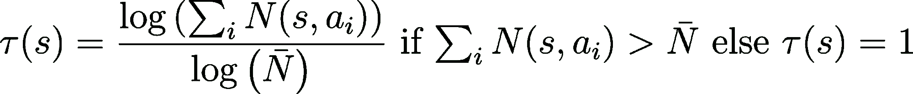

对于给定状态选择的。这里 Q 表示模型生成的 Q 值，π表示基于模型策略抽样的动作上的随机分布。N(s, a)表示从节点 s 到动作 a 的节点访问次数。

一旦选择阶段达到叶子节点，如果模拟没有达到终止条件（无论是最大探索，即未来范围，还是游戏结束），则使用模型选择`n_samples`个替代节点（它们将在后续迭代中成为叶子节点）。这称为扩展阶段，因为新节点被添加到树中。然后，在当前模拟中不再探索更多节点，但叶子 q_value 会被传递到下一模拟步骤：备份。

备份是每次模拟的最终阶段。在备份过程中，如果叶子节点是终止状态，则计算最终奖励；否则使用叶子 q 值作为估计奖励。然后将奖励在模拟轨迹上反向传播，更新状态的 q_values 并更新访问计数器 N(s, a)。在下面的代码片段中，我们展示了奖励反向传播的代码。

```py
def backward_pass(trajectory, states_dict, leaf_q_value: torch.Tensor):
"""Backward pass of the montecarlo algorithm"""
reward = 0
    for idx, (state, action_idx) in enumerate(reversed(trajectory)):
        if action_idx is None:  # leaf node
            reward += leaf_q_value
        else:
            (
                _,
                old_idx_to_new_idx,
                _,
                N_s_a,
                q_values,
                _,
            ) = states_dict[state]
            if isinstance(reward, torch.Tensor):
                reward = reward.to(q_values.device)
            action_idx = int(action_idx)
            if action_idx in old_idx_to_new_idx:
                not_dupl_index = old_idx_to_new_idx[int(action_idx)]
            else:
                not_dupl_index = action_idx
            reward -= 1
            q_values[:, not_dupl_index] = (
                N_s_a[:, not_dupl_index] * q_values[:, not_dupl_index] + reward
            ) / (N_s_a[:, not_dupl_index] + 1)
            N_s_a[:, not_dupl_index] += 1
```

## 改进的策略计算

一旦所有模拟运行完毕，并且 MCTS 提供了对近期未来的有趣快照，就该更新与预测节点相关联的策略并返回这些节点，以便在训练过程中使用。改进的策略，遵循[Hubert et al](https://arxiv.org/pdf/2104.06303.pdf)中描述的方法，用于管理大型动作空间。实际上，对于小型搜索空间，在 MCTS 过程中，可以从动作空间中随机采样一个动作并评估其影响。在更大动作空间中采用类似的方法会导致所有轨迹在不同路径上分歧，并且需要无限量的轨迹来获取有意义的统计数据，然后更新策略。由于我们这里使用的是采样-MCTS 来避免分散，即 n_samples 动作根据模型策略进行采样，然后 MCTS 在探索树时只选择采样的一个动作，因此在计算最终更新策略时需要考虑样本修正，以便在训练模型时使用。

实际上，改进的策略计算如下

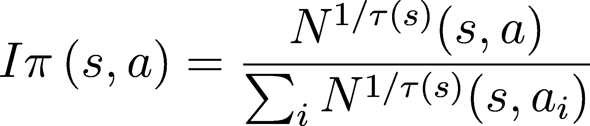

其中


```py
def compute_improved_policy(
    state_dict: Dict,
    states: List[str],
    model_n_steps: int,
    model_n_logits: int,
    N_bar: int,
):
    """Compute the improved policy given the state_dict, the list of states.
    The improved policy is computed as (N_s_a / N_s_a.sum())^(1/tau) where tau
    is (log(N_s_a.sum()) / log(N_bar)) if N_s_a.sum() > N_bar else 1.
    """
    policies = torch.zeros(len(states), model_n_steps, model_n_logits)
    N_bar = torch.tensor(N_bar)
    for idx, state in enumerate(states):
        N_s_a = state_dict[state][3]
        actions = state_dict[state][5]
        if N_s_a.sum() > N_bar:
            tau = (torch.log(N_s_a.sum()) / torch.log(N_bar)).item()
        else:
            tau = 1
	 N_s_a = N_s_a ** (1 / tau)
        improved_policy = N_s_a / N_s_a.sum()
        for sample_id in range(actions.shape[1]):
            action_ids = actions[0, sample_id]
            for step_id, action_id in enumerate(action_ids):
                policies[idx, step_id, action_id] += improved_policy[
                    0, sample_id
                ]
    return policies
```

请注意，在我们的实现中，计算完来自 N_s_a 张量的策略后，我们必须将其映射回原始的动作张量。事实上，N_s_a 只考虑了模型采样的动作，而最终的策略必须包含未探索动作的概率。

### 与 ChatGPT 训练算法的区别

AlphaTensor 是 DeepMind 最新的 AlphaGo/AlphaZero 系列人工智能方法中的成员。这些方法基于蒙特卡罗树搜索（MCTS）算法，DeepMind 已经对其进行了改进和增强，以应对越来越复杂的任务。另一种引起广泛关注的 AI 系统，OpenAI 的 ChatGPT，其表现非常出色，采用了不同的方法，即带有人类反馈的强化学习（RLHF）。

RLHF 是一种微调技术，用于调整语言模型以遵循一组书面指令。它使用人类偏好作为奖励信号来微调模型，从而使语言模型的行为与特定人群的声明偏好对齐，而不是某种更广泛的“人类价值观”。

相比之下，MCTS 是一种基于树的搜索算法，用于确定游戏中的最佳动作。它模拟潜在的动作，并根据这些动作的结果更新每个动作的值，从而指导最佳动作的选择。

RLHF 收集来自人工编写的演示和人工标记的 AI 模型之间的比较的数据，并训练一个奖励模型来预测特定人群的偏好。然后，奖励模型用于微调 AI 模型。另一方面，MCTS 则使用模拟和评估来确定最佳决策。

尽管它们是不同的方法，RLHF 和 MCTS 也有相似之处。两者都是人工智能技术，采用决策制定和问题解决的方法，并且都使用试错法来探索不同的选项，并基于现有信息做出决策。它们也是迭代过程，随着更多信息和经验的积累而不断改进。

在 RLHF 和 MCTS 之间的选择取决于手头的任务。当没有明确的度量标准来评估模型性能时，RLHF 是理想的选择，而 MCTS 在游戏类任务中表现有效，其中知识和对未来的探索为模型提供了显著的优势。

## AlphaTensor 训练的代码优化

实现 AlphaTensor 训练算法需要在训练速度和内存消耗之间找到完美的平衡。如模型部分所示，仅考虑行动标记化就能节省大量内存，但过于激进的行动空间减少可能会导致准确性下降和性能变慢。后者发生的原因是所有标记都由模型解码器以自回归方式顺序生成。因此，一旦行动空间上的 softmax 不再成为瓶颈，推理时间就会随着每个行动的标记数量线性增长。

在设置 AlphaTensor 训练时，主要的困难在于处理行动过程。如果张量没有以正确的格式存储，MCTS 可能会导致无法控制的内存使用增长。另一方面，如果每次模拟中存储的张量数量减少得过多，MCTS 可能会花费无限时间重新计算所需的状态。

让我们以游戏模拟步骤为例，其中游戏通过观察可能的未来场景来进行探索。对于每个状态，如果我们不保存模型生成的动作，而只决定保存用于从策略中采样动作的随机种子，那么每次我们探索一个树节点时，都必须重新计算策略，然后再采样动作。显然，我们决定存储采样的动作以节省时间，并避免在 MCTS 探索并行化的情况下管理不同进程之间的模型共享。然而，仅仅保存动作还不足以获得足够高效的执行步骤。实际上，将 n_steps 动作转换为(u, v, w)三元组、缩减游戏张量状态并从 n_samples 动作中创建新的 3D 张量的时间很容易成为整个训练的瓶颈。其次，我们不想为每个采样动作存储所有可能的未来状态，因为这会对算法使用的内存产生巨大影响。假设我们设置 n_samples=32，n=7，N=5，并且记住 N 是我们想要缩减的方阵积的大小，而 n 是模型记住的前一个动作的数量。在这种情况下，每个状态张量的形式为(8, 25, 25, 25)，乘以 32 会导致每个图节点需要 32*8*25*25*25*4 字节。现在，考虑到每次扩展阶段的模拟都会生成一个新节点（且 n_sim=200），我们会得到仅第一个 MCTS 节点的最终内存消耗为 200*32*8*25*25*25*4 = 3.2GB。在最坏的情况下，在探索 acting max_rank 节点（其中 max_rank=150）时，这将导致总内存消耗为 150 * 3.2GB = 480GB 的 RAM 内存（或如果所有张量都存储在 GPU 上，则为 GPU 内存）。我们在拥有 128GB RAM 和 48GB GPU 内存的工作站上运行训练，因此我们必须减少内存消耗。

由于我们不想增加执行时间，我们采用了一种优化方法，利用了生成的状态张量中的冗余。实际上，这些张量具有 n-1 个共同的前动作，这些动作可以被存储一次，而不是为每个存储的张量重复存储。这导致内存减少了 2/7~28%，意味着在最坏情况下可以存储 137GB。此时，通过简单地修剪树的未使用部分（例如未选择的轨迹）并将张量存储在 CPU 内存中，我们能够在训练过程中避免任何内存错误。

# 下一步

随着 OpenAlphaTensor 现在成为开源，许多令人兴奋的进一步发展途径正在打开。

一个自然的进展是对 OpenAlphaTensor 在目标硬件设备上的微调。这预计将带来非常有竞争力的计算性能。我将在 [GitHub](https://github.com/nebuly-ai/nebullvm/tree/main/apps/accelerate/open_alpha_tensor) 上发布更多关于 OpenAlphaTensor 在各种硬件上表现的内容。在撰写本文时，OpenAlphaTensor 正在进行训练。

另一个重要的进展是支持远程编译，使用户能够为边缘设备构建优化的算法。这可以通过将 OpenAlphaTensor 模型存储在服务器上来实现，而矩阵乘法算法则在不同的硬件上进行评估。

扩展对不同编译器的支持以计算基于延迟的奖励修正可能也很重要。不同的编译器可能会在给定的硬件上导致不同的优化算法。例如，DeepMind 的论文显示，使用 JAX 和 XLA 编译器在 TPU 和 Nvidia GPU 上取得了很有前景的结果。使用 Nvidia 上的 NCCL 或 CPUs 上的 LLVM 来评估这种情况将会很有趣。

最后，将模型和训练算法扩展以支持更大的矩阵尺寸仍然是一个主要的开放挑战。目前，OpenAlphaTensor 支持的最大矩阵尺寸为 5，但可以通过将较大的矩阵乘法拆分为多个尺寸小于 5 的小矩阵来应用。这种方法是次优的，直接对对应于完整矩阵乘法的大张量进行归约理论上可能会取得更好的结果。

**[Diego Fiori](https://www.linkedin.com/in/diego-fiori-/)** 是 Nebuly AI 的首席技术官，该公司致力于将 AI 优化纳入每个开发者的工具包中。

### 更多相关内容

+   [闭源 VS 开源图像注释](https://www.kdnuggets.com/closed-source-vs-open-source-image-annotation)

+   [深入了解 DeepMind 在利用深度学习推动数学发展的新努力](https://www.kdnuggets.com/2021/12/inside-deepmind-new-efforts-deep-learning-advance-mathematics.html)

+   [DeepMind 的 AlphaCode 会取代程序员吗？](https://www.kdnuggets.com/2022/04/deepmind-alphacode-replace-programmers.html)

+   [通过集成 Jupyter 和 KNIME 缩短实现时间](https://www.kdnuggets.com/2021/12/cutting-implementation-time-integrating-jupyter-knime.html)

+   [宣布 PyCaret 3.0：开源、低代码的 Python 机器学习](https://www.kdnuggets.com/2023/03/announcing-pycaret-30-opensource-lowcode-machine-learning-python.html)

+   [使用开源工具生成合成时间序列数据](https://www.kdnuggets.com/2022/06/generate-synthetic-timeseries-data-opensource-tools.html)
