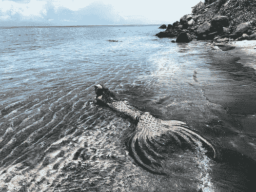

# 我作为数据科学家的前六个月

> 原文：[`www.kdnuggets.com/2021/12/first-six-months-data-scientist.html`](https://www.kdnuggets.com/2021/12/first-six-months-data-scientist.html)

评论

**由 [Amanda Christine West](https://www.linkedin.com/in/amawest/)，数据科学家和作家**

由 [Nigel Tadyanehondo](https://unsplash.com/@nxvision?utm_source=unsplash&utm_medium=referral&utm_content=creditCopyText) 拍摄于 [Unsplash](https://unsplash.com/s/photos/confusion?utm_source=unsplash&utm_medium=referral&utm_content=creditCopyText)

* * *

## 我们的前三大课程推荐

 1\. [Google 网络安全证书](https://www.kdnuggets.com/google-cybersecurity) - 快速进入网络安全职业轨道。

 2\. [Google 数据分析专业证书](https://www.kdnuggets.com/google-data-analytics) - 提升你的数据分析能力

 3\. [Google IT 支持专业证书](https://www.kdnuggets.com/google-itsupport) - 支持你的组织的 IT

* * *

数据科学很酷，但我不认为 2000 年代或更早的人有谁梦想着长大后从事这份工作。对我来说，我最初想成为一名兽医，然后是公园管理员、狗训导师、作家，最后是经济学家。我仍然有点希望能像一些孩子梦想成为律师-医生-宇航员（或者律师-医生-美人鱼，不过我们还是现实一点，美人鱼太迷人了，学法律这样枯燥的东西不太可能）。

当然，目标会随着时间的推移而改变，我于 5 月在弗吉尼亚大学获得了数据科学硕士学位。毕业几个月后，我找到了第一份全职的数据科学家职位。我非常兴奋能够运用我的技能并向新同事证明自己。在过去的 135 天里，我也觉得自己大约有 426 次陷入困境。

这是我从课堂跳入数据科学领域以来学到的技术和非技术课程的简要清单。作为免责声明，这当然只是我的个人经验，每个人的经历会有所不同。

## 1\. 你将使用不到 <20% 的学校里学到的工具 ✂️

我非常喜欢用 R 编程。甚至在面试时我选择了用 R 进行编码。然而，在工作中，我使用 Python 和终端（在 VS Code 中）的比例占到了 95%，SQL 大约 5%，而 R 自开始以来完全没有用过。因此，我在 R 上上的课程（大约是课程的一半）对我来说变得极其无用，而 Python 上的课程则变得更加有用。许多作业，如网页抓取、自然语言处理、Apache Spark 或 Tableau，我都没有用到过。这只是常见的情况，因为很难预测你将来在工作中具体会做什么。

如果你非常致力于特定语言的编码，我建议你提前向招聘人员询问团队使用的语言。即使你“理论上”可以用你选择的语言编码，但如果团队使用其他语言，那么代码审查和集成会变得更加困难。对我来说，我确实喜欢在 Python 上提高技能，但如果使用的是 Scala 这样的其他语言，我觉得我可能不会那么喜欢。

## 2\. AWS（& 云服务）是王者 🤷‍♂️🤷‍♀️

我开始时与 AWS 的关系仅限于一个坚定的握手，但现在我每天都在使用它。AWS 也因提供了成千上万种服务而臭名昭著，这让人很难知道在特定任务中需要哪种服务。更糟糕的是，在 AWS 中搜索如何做某事时，通常会指向 5 种服务，这些服务的名称听起来基本相同。

为了应对这一点，我一直在使用 [ExamPro](https://www.exampro.co/)随意学习 AWS 云从业员认证。要学的东西实在太多了，但随着学习的深入，我发现自己能够建立联系，了解一些将来可能对工作有用的服务。最终我也会参加考试，希望这也能成为简历上的一个亮点。我不认为我会成为 AWS 的专家，但如果能成为一个相对称职的 AWS 骑士，我也能接受。

AWS 被我加冕。GIF 来自 [GIPHY](https://giphy.com/gifs/theoffice-okLCopqw6ElCDnIhuS)

Google Cloud 和 Azure 等服务也很受欢迎，但如果你不确定可能使用哪一个，我还是会诚实地推荐 AWS；TechJury.net 发现 AWS 在 2020 年的新企业云采用中占据了 [76%的份额](https://techjury.net/blog/how-many-companies-use-cloud-computing/#gref)。尽管如此，大多数公司在某种程度上都使用云服务，了解它们的基本工作原理和提供的服务是很好的。

## 3\. 理解硬件对于有效排除软件故障至关重要 🤓🔧

在学校里，我们经常会被给出干净的、玩具般的示例，以便集中解决特定的高级问题。在数据科学团队较小的公司，你往往需要自己处理真实、混乱、丑陋的数据。如果是大数据，试图将其调整以在你的管道中运行，就像试图把一头犀牛塞进你母亲的旧舞会礼服一样。

理解你的计算机在后台做了什么会带来很大的不同。对于那些处理困难的数据，我使用如 `watch -d -n 0.5 nvidia-smi` 和 `htop` 等命令来跟踪 GPU/CPU 使用率和内存，以及 `df -h` 来监控给定目录中文件的大小，以防我空间超出。我还使用 tmux 会话以同时打开多个终端窗口，并在通过 ssh 连接到远程计算机时保持工作不断线。最后，当我找到一个有效的解决方案时，我仍然会在线寻找更好的*O(n)*复杂度的替代方案，这可以在处理大数据集时节省从几分钟到几天的处理时间。

这些只是我对付那些测试我计算机极限的数据的一些方法——我很想听听你自己的小窍门！

## 4\. 搜索一切，随时随地 ????

作为一个刚刚入门的数据科学新手，学习曲线是持续而无情的。你将被要求做的任务往往会让你感到完全意料之外，这意味着你需要在当下拼命找出解决方案，并解决那些你甚至不知道存在的错误。你会每天学习如何应对最随机的复杂问题，虽然你可能不会再进行 A → C → Q 的映射，但你*会*在编程方面变得更好，每次迭代后代码库也会变得更有意义。

总的来说，“数据科学家”、“问题解决者”和“专业谷歌搜索者”基本上是一样的。至少对我来说，我感觉在第一份工作中学到的东西不比在大学时少，这让我有点惊讶（毕竟，我*在付钱*让人教我这些东西）。

使用流行的数据科学编程语言的公司很棒，因为这些使用频繁的语言也恰好有最好的 Stack Overflow 文章（这些文章在无数次情况下救了我）。

## 5\. 你的坏习惯不会在学校结束时突然消失 ????

这并非特指数据科学，但我在学校时给自己施加了很大压力，并且没有像同龄人那样经常放松（虽然我住在兄弟会街区，所以这也可能是原因之一 ????）。我会在期中考试前整周（有时整月——微积分很难）都在学习，几乎不离开房间，除了打印更多的练习题或补充咖啡。在非期中周，我会推自己学习到很晚，然后把自己弄醒，穿上运动裤、凉鞋和旧的套头衫，赶到当天的 8 点或 9 点课。从我*没能*出去的次数来看，我很惊讶我没有在毕业典礼上看起来像个瘦弱、苍白的吸血鬼吓到大家。

我一直以为一旦拿到学位，我就会像正常人一样生活；首先，我每天早晨都会睡满 8 小时以上（哈哈）。我会写日记、读书、冥想、锻炼，可能在时钟打到 7:30 之前就会吃上 acai-kombucha-avocado 碗。而且，因为我爱编程，工作也不会感觉像工作，因此我的生活将永远精彩——*完结*。

是的，所以……那件事没有发生。

虽然工作确实增加了一些结构，但我有个坏消息；如果你在大学里是个工作狂，你可能在工作后也会是个工作狂……如果你远程工作（像我一样）并且不需要经常开摄像头，那么运动裤、破旧的运动衫和睡过的头发也是可以的。所以基本上是大学生活……没有朋友或在你窗外播放的*Mr. Brightside*。

GIF 来源于 [GIPHY](https://giphy.com/gifs/Friends-season-5-friends-tv-s05e02-hrk8ehR4lCZ27FtjPA)

本质上，你可能会有一点额外的可支配收入，但当你工作到凌晨 1 点，除了“我觉得我快修好这个 bug 了！”没有其他理由时，可能会感觉像是在生活在黄昏地带。第二天醒来几分钟前赶上会议，然后又重复一遍循环。对自己好一点——倦怠很糟糕，平衡是关键，这是我仍在学习的事情。

## 6\. 健康生活同时改变世界 ????

我不认同那些认为数据科学将在 10 年内消失的悲观者，因为公司总是希望通过信息来增加利润——即数据——以及需要有人定量分析这些数据——即数据科学家（或工程师，或分析师，名字并不重要）。在我的工作中，我已经能够直接影响重大项目，并通过我的数据科学取得积极的成果，这些项目将在我离开后许多年仍将继续存在。

我也非常关注财务，并希望努力达到一个可以启动自己项目或提前退休的点。通过数据科学，做有影响力的事情*并且*财务状况良好并不是典型的权衡；**你可以两者兼得**。再加上编程的乐趣，数据科学确实是完美的三重奏。

## 结论 ❄️

显然我有点偏颇，但我很高兴成为一名数据科学家，并且仍然相信我所经历的不足感和自我怀疑是值得的，为了更大的目标。对于那些在大学里的，你们对成为专业人士最担心什么？对于那些现在已经工作的，你们在过渡过程中最大的文化冲击是什么？

一如既往，感谢阅读！如果你们原谅我，我要去做兼职工作，为一些寄居蟹的机器学习算法提供咨询……

由 [Naja Bertolt Jensen](https://unsplash.com/@naja_bertolt_jensen?utm_source=unsplash&utm_medium=referral&utm_content=creditCopyText) 提供的照片，发布于 [Unsplash](https://unsplash.com/s/photos/mermaid?utm_source=unsplash&utm_medium=referral&utm_content=creditCopyText)

**简介: [Amanda Christine West](https://www.linkedin.com/in/amawest/)** 是一位数据科学家和作家，居住在科罗拉多州博尔德。她于 2021 年 5 月获得弗吉尼亚大学的数据科学硕士学位。在数据科学领域，Amanda 最感兴趣的是数据可视化、自然语言处理、机器学习以及以既激动人心又易于新受众理解的方式传达技术概念。

[原文](https://towardsdatascience.com/my-first-six-months-as-a-data-scientist-69f6697c9ec3)。转载经许可。

**相关:**

+   数据科学家和数据分析师的区别是什么？

+   停止学习数据科学以寻找目的，并寻找目的以学习数据科学

+   数据科学家做什么？

### 相关话题

+   [我的数据科学六个月成功故事](https://www.kdnuggets.com/2023/04/data-science-six-months-success-story.html)

+   [我如何在 2 个月内获得 4 个数据科学职位并使收入翻倍…](https://www.kdnuggets.com/2021/01/data-science-offers-doubled-income-2-months.html)

+   [我如何在 18 个月内通过数据科学将收入提高三倍](https://www.kdnuggets.com/2021/10/tripled-my-income-data-science-18-months.html)

+   [过去 12 个月必读的 NLP 论文](https://www.kdnuggets.com/2023/03/must-read-nlp-papers-last-12-months.html)

+   [我每天使用 ChatGPT 五个月。这些是一些隐藏的宝石…](https://www.kdnuggets.com/2023/07/used-chatgpt-every-day-5-months-hidden-gems-change-life.html)

+   [在不到 6 个月的时间内成为商业智能分析师](https://www.kdnuggets.com/become-a-business-intelligence-analyst-in-less-than-6-months)
