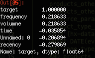

# 数据科学的五个命令行工具

> 原文：[`www.kdnuggets.com/2019/07/five-command-line-tools-data-science.html`](https://www.kdnuggets.com/2019/07/five-command-line-tools-data-science.html)

 评论

**由 [Rebecca Vickery](https://www.linkedin.com/in/rebecca-vickery-20b94133/)，数据科学家**


图片由 [Toa Heftiba](https://unsplash.com/@heftiba?utm_source=unsplash&utm_medium=referral&utm_content=creditCopyText&source=post_page---------------------------) 提供，来源于 [Unsplash](https://unsplash.com/search/photos/five?utm_source=unsplash&utm_medium=referral&utm_content=creditCopyText&source=post_page---------------------------)

* * *

## 我们的前三名课程推荐

 1\. [Google 网络安全证书](https://www.kdnuggets.com/google-cybersecurity) - 快速进入网络安全职业的快车道。

 2\. [Google 数据分析专业证书](https://www.kdnuggets.com/google-data-analytics) - 提升你的数据分析技能

 3\. [Google IT 支持专业证书](https://www.kdnuggets.com/google-itsupport) - 支持你的组织在 IT 方面

* * *

*数据科学中最令人沮丧的方面之一是不断在不同工具之间切换。你可能在 Jupyter Notebook 中编辑代码，同时需要在命令行中安装一个新工具，或者在 IDE 中编辑一个函数，同时进行相同的任务。有时，找到在同一软件中完成更多工作的方式是很好的。*

在接下来的帖子中，我将列出一些我发现的在命令行上进行数据科学的最佳工具。事实证明，有很多任务可以通过简单的终端命令完成，比我最初想到的要多，我想在这里分享其中的一些。

### [cURL](https://curl.haxx.se/?source=post_page---------------------------)

这是一个通过包括 HTTP 在内的各种协议从任何服务器获取数据的有用工具。

我将提供几个获取公开数据集的使用案例。  [UCI 机器学习库](https://archive.ics.uci.edu/ml/index.php?source=post_page---------------------------) 是获取机器学习项目数据集的优秀资源。我将使用一个简单的 `curl` 命令下载一个来自台湾新竹市血液转输中心的数据集。如果我们简单地运行 `curl [url]`，在我们的例子中就是 `curl [`archive.ics.uci.edu/ml/machine-learning-databases/blood-transfusion/transfusion.data`](https://archive.ics.uci.edu/ml/machine-learning-databases/blood-transfusion/transfusion.data?source=post_page---------------------------)`，这将把数据打印到终端。

添加一些额外的参数将使用指定的文件名下载并保存数据。文件现在将保存在你当前的工作目录中。

```py
curl -o data_dl.csv https://archive.ics.uci.edu/ml/machine-learning-databases/blood-transfusion/transfusion.data
```

获取数据科学项目数据的另一种常见方法是通过 API。这个工具还支持`GET`和`POST`请求以与 API 进行交互。运行以下命令将从[OpenWeatherMap](https://openweathermap.org/api?source=post_page---------------------------) API 获取单条记录并保存为名为`weather.json`的 JSON 文件。有关 cURL 的更全面教程，请参见 Zaiste 的这篇优秀[文章](https://zaiste.net/introduction_to_curl/?source=post_page---------------------------)。

```py
curl -o weather.json -X GET \'https://api.openweathermap.org/data/2.5/weather?lat=37.3565982&lon=-121.9689848&units=imperial&appid=fd4698c940c6d1da602a70ac34f0b147' \-H 'Postman-Token: dcf3c17f-ef3f-4711-85e1-c2d928e1ea1a' \-H 'cache-control: no-cache'
```

### [csvkit](https://csvkit.readthedocs.io/en/latest/tutorial/1_getting_started.html?source=post_page---------------------------#about-this-tutorial)

csvkit 是一组用于处理 CSV 文件的命令行工具。它可以执行的任务可以分为三个领域：输入、处理和输出。让我们看看一个快速的现实世界示例，说明如何使用它。

首先让我们使用 pip 安装这个工具。

```py
pip install csvkit
```

作为这个示例的目的，我将使用通过上面的 curl 命令从 UCI 机器学习库创建的相同 CSV 文件。

首先，让我们使用`csvclean`确保我们的 CSV 文件格式正确。这个函数将自动修复常见的 CSV 错误并移除任何坏行。这个函数的一个有用方面是，它会自动输出一个新的清理版本的 CSV 文件，以便保留原始数据。新文件始终遵循以下命名规则`[filename]_out.csv`。如果你希望覆盖原始文件，可以添加可选的`-n`参数。

```py
csvclean data_dl.csv
```

在我拥有的示例文件中，没有错误，但这可以是进一步减少处理 CSV 文件时错误的非常有用的方法。

现在假设我们想快速检查文件。我们可以使用`csvcut`和`csvgrep`来完成这项工作。

首先让我们打印出列名。

```py
csvcut -n data_dl_out.csv | cut -c6-Recency (months)Frequency (times)Monetary (c.c. blood)Time (months)whether he/she donated blood in March 2007
```

现在我们来确定目标列`whether he/she donated blood in March 2007`中有多少个类别。

```py
csvcut -c "whether he/she donated blood in March 2007" data_dl_out.csv | sed 1d | sort | uniq01
```

`csvgrep`函数允许你基于正则表达式匹配来过滤 CSV 文件。

我们使用这个函数提取仅匹配类别 1 的行。

```py
csvgrep -c "whether he/she donated blood in March 2007" -m 1 data_dl_out.csv
```

你还可以使用`csvkit`通过`csvstat`函数执行简单的数据分析。

只需运行`csvstat data_dl_out.csv`即可将整个文件的描述性统计信息打印到命令行。你也可以只请求一个统计信息的结果，使用可选命令。

```py
csvstat --mean data_dl_out.csv1\. a: 373.52\. Recency (months): 9.5073\. Frequency (times): 5.5154\. Monetary (c.c. blood): 1,378.6765\. Time (months): 34.2826\. whether he/she donated blood in March 2007: None
```

### IPython

IPython 提供了从 shell 访问增强的交互式 python。实际上，这意味着你可以从命令行完成大多数在 Jupyter Notebook 中可以做的事情。

如果你尚未在终端中安装它，你可以按照这些[步骤](https://ipython.org/ipython-doc/3/install/install.html?source=post_page---------------------------)进行安装。

要启动 IPython，只需在命令行中输入`ipython`。现在你已经进入了交互式 shell。在这里，你可以导入已安装的 Python 库，我发现这个工具在命令行上快速数据分析中最为有用。

让我们对已使用的数据集执行一些基本任务。首先，我将导入 pandas，读取文件并检查前几行数据。

```py
import pandas as pddata = pd.read_csv('data_dl_out.csv')data.head()
```

文件列名较长，所以接下来我将使用 pandas 重命名这些列，然后将结果数据框导出到新的 CSV 文件中以供以后使用。

```py
data = data.rename(columns={'Recency (months)': 'recency',
             'Frequency (times)': 'frequency',
             'Monetary (c.c. blood)': 'volumne',
             'Time (months)': 'time',
             'whether he/she donated blood in March 2007': 'target'})data.to_csv('data_clean.csv')
```

作为最后一个练习，让我们使用 pandas 的`corr()`函数检查特征与目标变量之间的相关性。

```py
corr_matrix = data.corr()
corr_matrix['target'].sort_values(ascending=False)
```



要退出 IPython，只需输入`exit`。

### [csvsql](https://csvkit.readthedocs.io/en/1.0.2/scripts/csvsql.html?source=post_page---------------------------)

有时你可能还希望通过 SQL 查询从数据库获取数据集。csvsql 工具，它也是 csvkit 工具的一部分，支持在数据库上直接查询、写入和创建表。它还支持对 CSV 文件的 SQL 查询。让我们对清理过的数据集运行一个示例查询。

```py
csvsql --query  "select frequency, count(*) as rows from data_clean where target = 1 group by frequency order by 2 desc" data_clean.csv
```

### [SciKit-Learn 实验室](https://scikit-learn-laboratory.readthedocs.io/en/latest/?source=post_page---------------------------)

是的，你可以在命令行上执行机器学习！虽然有一些工具可以做到这一点，但 SciKit-Learn 实验室可能是最易于访问的。让我们使用我们的血液捐赠数据集构建一个模型。

SciKit-Learn 实验室依赖于将正确的文件放置在一致命名的目录中。所以首先我们将创建一个名为`train`的目录，并将数据文件复制、移动并重命名为`features.csv`。

```py
mkdir train
cp data_clean.csv train/features.csv
```

接下来，我们需要创建一个名为`predict-donations.cfg`的配置文件，并将其放置在我们的`data`目录中。

```py
[General]
experiment_name = Blood_Donations
task = cross_validate[Input]
train_directory = train
featuresets = [["features.csv"]]
learners = ["RandomForestClassifier", "DecisionTreeClassifier", "SVC", "MultinomialNB"]
label_col = target[Tuning]
grid_search = false
objective = accuracy[Output]
log = output
results = output
predictions = output
```

然后我们只需运行这个命令`run_experiment -l predict-donations.cfg`。

这会自动运行实验并创建一个包含结果的输出文件夹。

我们可以运行 SQL 查询来总结`Blood_Donations_summary.tsv`文件中的结果。

```py
cd output< Blood_Donations_summary.tsv csvsql --query "SELECT learner_name, accuracy FROM stdin "\
> "WHERE fold = 'average' ORDER BY accuracy DESC" | csvlook
```

还有许多其他对数据科学有用的命令行工具，但我想在这里突出那些我在工作中发现有用的工具。对于命令行上的数据科学的全面了解，我发现《Data Science at the Command Line》一书非常有用，该书可以在[在线](https://www.datascienceatthecommandline.com/?source=post_page---------------------------)免费获取。

**个人简介：[Rebecca Vickery](https://www.linkedin.com/in/rebecca-vickery-20b94133/)** 通过自学学习数据科学。数据科学家 @ Holiday Extras。alGo 的联合创始人。

[原文](https://towardsdatascience.com/five-command-line-tools-for-data-science-29f04e5b9c16)。经许可转载。

**相关：**

+   数据科学家的 12 个必备命令行工具

+   命令行数据科学：数据探索

+   Python 中的探索性数据分析

### 更多相关主题

+   [数据科学的 5 个额外命令行工具](https://www.kdnuggets.com/2023/03/5-command-line-tools-data-science.html)

+   [命令行数据科学：免费电子书](https://www.kdnuggets.com/2022/03/data-science-command-line-free-ebook.html)

+   [ChatGPT CLI：将你的命令行界面转变为 ChatGPT](https://www.kdnuggets.com/2023/07/chatgpt-cli-transform-commandline-interface-chatgpt.html)

+   [通过这个 GitHub 库掌握命令行的艺术](https://www.kdnuggets.com/master-the-art-of-command-line-with-this-github-repository)

+   [用 Python 在 7 个简单步骤中构建命令行应用程序](https://www.kdnuggets.com/build-a-command-line-app-with-python-in-7-easy-steps)

+   [KDnuggets™ 新闻 22:n03, 1 月 19 日：深入了解 13 个数据…](https://www.kdnuggets.com/2022/n03.html)
