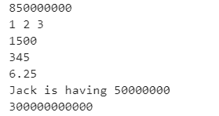
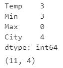
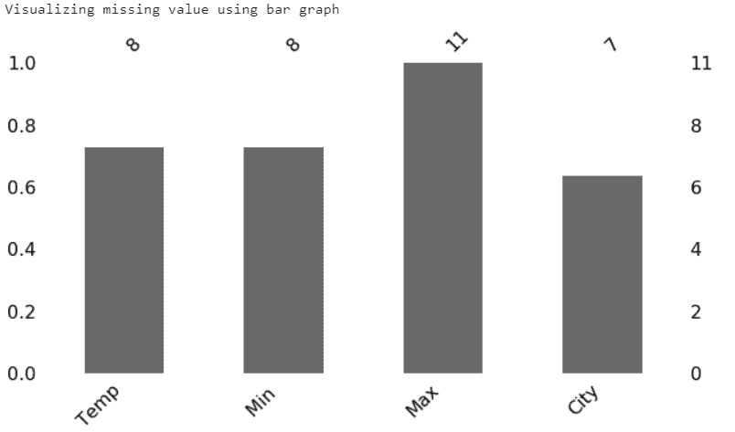
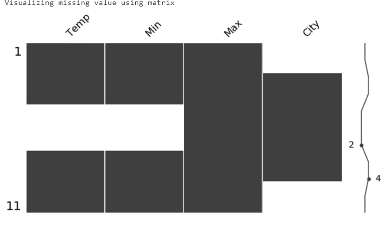
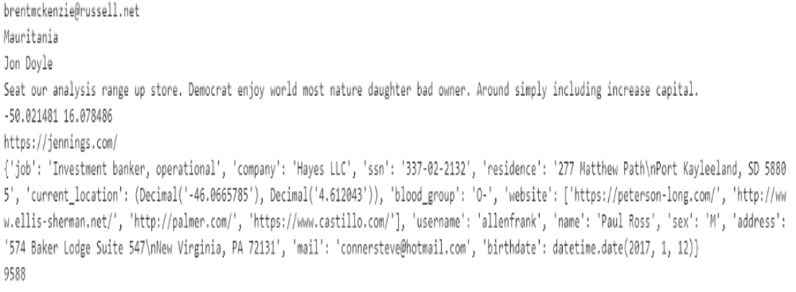
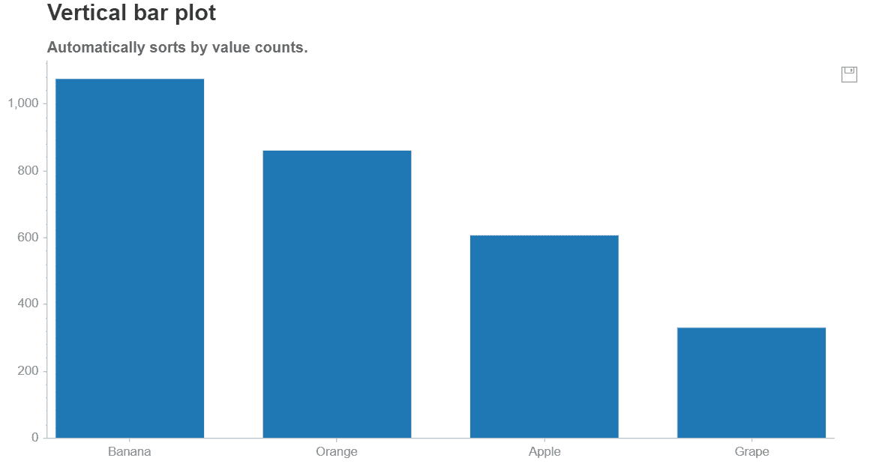

# 五个酷炫的 Python 数据科学库

> 原文：[`www.kdnuggets.com/2020/04/five-cool-python-libraries-data-science.html`](https://www.kdnuggets.com/2020/04/five-cool-python-libraries-data-science.html)

评论

**作者 [Dhilip Subramanian](https://medium.com/@sdhilip)，数据科学家和人工智能爱好者**

对大多数数据科学家来说，Python 是最好的朋友。库使他们的生活变得更简单。我在从事 NLP 项目时遇到了五个酷炫的 [Python 数据科学库](https://www.kdnuggets.com/2020/11/top-python-libraries-data-science-data-visualization-machine-learning.html)。这对我帮助很大，我希望在这篇文章中分享这些库。

* * *

## 我们的前三大课程推荐

 1\. [Google Cybersecurity Certificate](https://www.kdnuggets.com/google-cybersecurity) - 快速进入网络安全职业的快车道。

 2\. [Google Data Analytics Professional Certificate](https://www.kdnuggets.com/google-data-analytics) - 提升您的数据分析技能

 3\. [Google IT Support Professional Certificate](https://www.kdnuggets.com/google-itsupport) - 支持您的组织进行 IT 支持

* * *

### 1\. Numerizer

一个令人惊叹的库，用于将文本数字转换为整数和浮点数。对 NLP 项目非常有用。有关更多详细信息，请查看 PyPI 和这个 [github 仓库](https://github.com/jaidevd/numerizer)。

**安装**

```py
!pip install numerizer
```

**示例**

```py
#importing numerize library
from numerizer import numerize#examplesprint(numerize(‘Eight fifty million’))
print(numerize(‘one two three’))
print(numerize(‘Fifteen hundred’))
print(numerize(‘Three hundred and Forty five’))
print(numerize(‘Six and one quarter’))
print(numerize(‘Jack is having fifty million’))
print(numerize(‘Three hundred billion’))
```

**输出**



### 2\. Missingo

在现实世界的数据集中发现缺失值是很常见的。我们需要在插补之前理解这些缺失值。Missingo 提供了一种快速且有用的方式来可视化缺失值。

**安装**

```py
!pip install missingno
```

**使用**

```py
# importing necessary libraries
import pandas as pd 
import missingno as mi
# reading the dummy dataset
data = pd.read_excel(“dummy.xlsx”)
# checking missing values
data.isnull().sum() 
```



虚拟数据集包含 11 行和 4 列。缺失值出现在 Min、Temp 和 city 变量中。我们可以使用条形图和矩阵进行可视化。它还支持热图、树状图。有关更多细节，请查看这个 [Github 仓库](https://github.com/ResidentMario/missingno)。

```py
 #Visualizing using missingno
print(“Visualizing missing value using bar graph”)
mi.bar(data, figsize = (10,5))
print(“Visualizing missing value using matrix”)
mi.matrix(data, figsize = (10,5)) 
```

**输出**





我们可以从上面的条形图和矩阵中看到 temp、min 和 city 的缺失值。

### 3\. Faker

我们可能会遇到需要生成一些测试数据或在分析中使用一些虚拟数据的情况。获取虚拟数据的一种方法是使用 Faker 库。当您需要时，它会非常快速地为您生成虚拟数据。

**安装**

```py
 !pip install faker
```

**示例**

```py
 **# Generating fake email**
print (fake.email()) 
**# Generating fake country name**
print(fake.country()) 
**# Generating fake name**
print(fake.name()) 
**# Generating fake text**
print(fake.text()) 
**# Generating fake lat and lon**
print(fake.latitude(), fake.longitude())
**# Generating fake url**
print(fake.url()) 
**# Generating fake profile**
print(fake.profile())
**# Generating random number**
print(fake.random_number()) 
```

**输出**



它为各种类别生成虚拟数据，请查看此链接以获取更多 [详细信息](https://faker.readthedocs.io/en/latest/providers/faker.providers.geo.html)。

### 4\. EMOT

收集和分析表情符号以及表情符号可以提供有用的见解，尤其是在情感分析中。**表情符号** 是一种足够小的图像，可以插入文本中以表达情感或思想。**表情符号** 是使用仅限键盘字符（如字母、数字和标点符号）表示人脸表情的方式。

**emot** 帮助我们将表情符号和表情符号转换为文字。有关此库的更多详细信息，请查看这个 [Github 仓库](https://github.com/NeelShah18/emot)。它包含了一个好的表情符号和表情符号及其对应单词的集合。

**安装**

```py
!pip install emot
```

**使用**

```py
 **#Importing libraries**
import re
from emot.emo_unicode import UNICODE_EMO, EMOTICONS**# Function for converting emojis into word**
def convert_emojis(text):
    for emot in UNICODE_EMO:
        text = text.replace(emot, "_".join(UNICODE_EMO[emot].replace(",","").replace(":","").split()))
    return text**# Example**
text1 = "Hilarious ????. The feeling of making a sale ????, The feeling of actually fulfilling orders ????"
convert_emojis(text1) 
```

**输出**

```py
‘Hilarious **face_with_tears_of_joy**. The feeling of making a sale **smiling_face_with_sunglasses**, The feeling of actually fulfilling orders **unamused_face**’
```

**表情符号转换为文字形式**

**使用**

```py
**# Function for converting emoticons into word**
def convert_emoticons(text):
    for emot in EMOTICONS:
        text = re.sub(u'('+emot+')', "_".join(EMOTICONS[emot].replace(",","").split()), text)
    return text**# Example**
text = "Hello :-) :-)"
convert_emoticons(text) 
```

**输出**

```py
'Hello **Happy_face_smiley** **Happy_face_smiley'**
```

### 5\. Chartify

Chartify 是一个可视化库，旨在尽可能简化数据科学家创建图表的过程。与其他工具相比，它具有用户友好的语法和一致的数据格式。创建美观且快速的图表所需时间更少。这是由 Spotify 实验室开发的。

在这里，我只展示了柱状图。**有关更多细节和图表，请查看这个** [**文档**](https://chartify.readthedocs.io/en/latest/) **和** [**笔记本**](https://github.com/spotify/chartify/blob/master/examples/Examples.ipynb)

**安装**

```py
!pip install chartify
```

**使用**

```py
# importing necessary libraryimport numpy as np
import pandas as pd
import chartify
#loading example dataset from chartify
data = chartify.examples.example_data()
data.head()
```


```py
# Calculating total quanity for each fruits
quantity_by_fruit = (data.groupby(‘fruit’)[‘quantity’].sum().reset_index())
ch = chartify.Chart(blank_labels=True, x_axis_type=’categorical’)
ch.set_title(“Vertical bar plot”)
ch.set_subtitle(“Automatically sorts by value counts.”)
ch.plot.bar(
 data_frame=quantity_by_fruit,
 categorical_columns=’fruit’,
 numeric_column=’quantity’)
ch.show()
```

**输出**



你可以通过点击图表右上角的保存图标来保存图表。

感谢阅读。如果你有任何补充，请随时留言！

**简介： [Dhilip Subramanian](https://medium.com/@sdhilip)** 是一名机械工程师，已完成分析学硕士学位。他拥有 9 年的经验，专注于数据相关的各个领域，包括 IT、营销、银行、能源和制造业。他对自然语言处理和机器学习充满热情。他是 [SAS 社区](https://communities.sas.com/t5/user/viewprofilepage/user-id/271305) 的贡献者，并喜欢在 Medium 平台上撰写有关数据科学各个方面的技术文章。

[原文](https://medium.com/towards-artificial-intelligence/five-cool-python-libraries-for-data-science-7f1fce402b90)。经许可转载。

**相关：**

+   宣布 PyCaret 1.0.0

+   停止伤害你的 Pandas!

+   深度学习的四大最佳 Jupyter Notebook 环境

### 更多相关主题

+   [每个数据科学家都应该知道的三个 R 库（即使你使用 Python）](https://www.kdnuggets.com/2021/12/three-r-libraries-every-data-scientist-know-even-python.html)

+   [成为一名伟大的数据科学家所需的五项关键技能](https://www.kdnuggets.com/2021/12/5-key-skills-needed-become-great-data-scientist.html)

+   [每个初学者数据科学家都应该掌握的六种预测模型](https://www.kdnuggets.com/2021/12/6-predictive-models-every-beginner-data-scientist-master.html)

+   [2021 年最佳 ETL 工具](https://www.kdnuggets.com/2021/12/mozart-best-etl-tools-2021.html)

+   [停止学习数据科学，寻找目标，再找到目标去……](https://www.kdnuggets.com/2021/12/stop-learning-data-science-find-purpose.html)

+   [使用管道编写干净的 Python 代码](https://www.kdnuggets.com/2021/12/write-clean-python-code-pipes.html)
