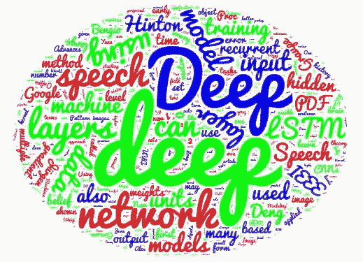

# 5 个你不能再忽视的深度学习项目

> 原文：[`www.kdnuggets.com/2016/07/five-deep-learning-projects-cant-overlook.html`](https://www.kdnuggets.com/2016/07/five-deep-learning-projects-cant-overlook.html)

深度学习库和框架 如 Theano、Keras、Caffe 和 TensorFlow 近年来获得了巨大的流行。事实上，谷歌的 TensorFlow 是 Github 上星标最多的机器学习仓库。数量差距很大。尽管 TensorFlow 出现的时间还不到 6 个月，但它已经占据了如此巨大的市场份额，以至于可以说它已经成为了许多经验丰富的神经网络专家和新手的默认深度学习库。

显然，这不是唯一需要考虑的库。还有许多其他库，其中一些在上面提到过。但还有许多更小的项目，从完全重新实现的库，到建立在现有深度学习项目之上的高级构建模块，以适应特定的利基市场。以下你可以找到这些项目类型的混合，它们因各种原因而被提及，这些原因是在在线时间中遇到的。



也许你会在这份不能再忽视的 5 个深度学习项目列表中找到满足你需求的东西。项目的排序没有特别的顺序，但我喜欢给事物编号，所以我就这样做了。

**1\. [Leaf](https://github.com/autumnai/leaf)**

Leaf 是一个神经网络框架，在其 Github 仓库 README 中描述为：

> 开放机器智能框架（GPU/CPU）

*有些* 有趣的是，Leaf 是一个相对较新的项目，但已经获得了超过 4000 个仓库星标，它是用 [Rust](https://www.rust-lang.org/) 编写的。Rust 自身只有大约 6 年的历史，开发由 Mozilla 赞助。对于不熟悉 Rust 的人来说，它是一个系统编程语言，与 C 和 C++ 有相似之处，自我描述为：

> Rust 是一种系统编程语言，运行速度极快，防止段错误，并保证线程安全。


一本书，[Leaf Machine Learning for Hackers](http://autumnai.com/leaf/book/)，可以在线免费获得，很可能是那些想尝试 Leaf 的人不错的首选。我猜测即使 Leaf 声称和定量支持其比其他类似框架更快（见上图），它也不会从 Rust 生态系统外获得大量转化。然而，Rust 用户的数量持续增长，毫无疑问其中一些人会对构建神经网络感兴趣。知道他们有一个高质量的本地框架可以用于这个目标是很好的。

**2\. [tiny-cnn](https://github.com/nyanp/tiny-cnn)**

来自 tiny-cnn 的 GitHub 仓库：

> tiny-cnn 是一个用 C++11 实现的深度学习库。它适合在计算资源有限的环境、嵌入式系统和 IoT 设备上进行深度学习。

tiny-cnn 在没有 GPU 的情况下运行相对较快；在 CPU 上训练 13 分钟，MNIST 数据集的准确率达到了 98.8%。它的使用也很简单。由于它是一个仅包含头文件的库，你只需包含 tiny_cnn.h 头文件并编写你的 C++ 代码，无需安装其他东西。tiny-cnn 支持多种网络架构、激活函数和优化算法。

这里有一个构建多层感知器的快速示例：

```py
#include "tiny_cnn/tiny_cnn.h"
using namespace tiny_cnn;
using namespace tiny_cnn::activation;

void construct_mlp() {
    auto mynet = make_mlp<tan_h>({ 32 * 32, 300, 10 });

    assert(mynet.in_data_size() == 32 * 32);
    assert(mynet.out_data_size() == 10);
}

```

查看 [文档](https://github.com/nyanp/tiny-cnn/blob/master/doc/readme.md)，以及 [这个项目](https://github.com/zhangqianhui/CnnForAndroid)，它使用 tiny-cnn 实现了一个 Android 上的卷积神经网络。如果你决定在 C++ 中实现神经网络，这个值得一看。

**3\. [Layered](https://github.com/danijar/layered)**

Layered 的作者是独立的机器学习研究员 Danijar Hafner，他最近向 KDnuggets 贡献了一篇文章 "Introduction to Recurrent Networks in TensorFlow"。

Layered 是：

> 前馈神经网络的干净实现。

Hafner 用 Python 3 编写了 Layered，作为一种“干净和模块化的前馈神经网络实现”。他表示，自己启动了这个项目，以便更好地理解深度学习概念，并推荐如果你对深入了解深度神经网络的实际功能感兴趣的话，也这样做。

下面是一个在 Layered 中实现简单神经网络的示例：

```py
from layered.network import Network
from layered.activation import Identity, Relu, Softmax

num_inputs = 784
num_outputs = 10

network = Network([
    Layer(num_inputs, Identity),
    Layer(700, Relu),
    Layer(500, Relu),
    Layer(300, Relu),
    Layer(num_outputs, Softmax),
])

```

该项目目前支持身份、修正器、sigmoid 和 softmax 激活函数，以及平方误差和交叉熵损失函数。因此，如果你想查看一个从头开始实现神经网络功能的无废话代码，Layered 将是一个很好的起点。这个项目的实际有效性和积极开发的状态也是值得更多关注的原因。

Hafner 还提供了许多关于实用的 [TensorFlow 深度学习教程](https://danijar.com/)，我建议你去看看。

**4\. [Brain](https://github.com/harthur-org/brain.js)**

我最近分享了一些相关的 Javascript 机器学习库，其中包括了 3 个神经网络库（总共 5 个）。Brain 本可以出现在这个列表中，但为了提供一些多样性，它被单独添加在这里。

Brain 是一个用 Javascript 编写的神经网络库，适用于浏览器或 Node。该项目正在积极开发中，源于一个较早的、不够成熟的 [同名项目](https://github.com/harthur/brain)。

这是一个使用 Brain 近似[异或（XOR）](https://en.wikipedia.org/wiki/Exclusive_or)函数的示例：

```py
var net = new brain.NeuralNetwork();

net.train([{input: [0, 0], output: [0]},
{input: [0, 1], output: [1]},
{input: [1, 0], output: [1]},
{input: [1, 1], output: [0]}]);

var output = net.run([1, 0]); // [0.987]

```

Brain 支持隐藏层，默认使用一个（除非另有说明）。训练一个网络很简单（如上所示），选项可以轻松设置并作为哈希传递：

```py
net.train(data, {
  errorThresh: 0.005,  // error threshold to reach
  iterations: 20000,   // maximum training iterations
  log: true,           // console.log() progress periodically
  logPeriod: 10,       // number of iterations between logging
  learningRate: 0.3    // learning rate
})

```

Train 还会返回一个包含训练结果的哈希。网络可以通过 JSON 序列化。

如果你是一个希望实现神经网络的 Javascript 开发者，Brain 可能是你需要的库。你还可以查看上述文章，其中包含一些通用的机器学习库以及一些额外的神经网络库。

**5\. [neon](https://github.com/NervanaSystems/neon)**

> 由 Nervana 开发的快速、可扩展、易于使用的基于 Python 的深度学习框架。

[neon 无疑是最快的](https://github.com/soumith/convnet-benchmarks)： “为了快速迭代和模型探索，neon 在深度学习库中具有最快的性能。” 如果你还不熟悉这个库，这绝对是值得一看的理由。


neon 由[Nervana Systems](https://www.nervanasys.com/)开发，支持卷积、RNN、LSTM、GRUs 等。neon 还有许多其他优点：它有一个很棒的[工作流概述](http://neon.nervanasys.com/docs/latest/overview.html)，[文档](http://neon.nervanasys.com/docs/latest/api.html)非常详尽，并且有一些[有用的教程](http://neon.nervanasys.com/docs/latest/tutorials.html)。

你还可以查看来自 neon 深度学习聚会的多个[Jupyter notebook 版本](https://github.com/NervanaSystems/meetup)，这很不错。如果训练神经网络的速度对你很重要，并且你在 Python 生态系统中，可以查看 neon。

**相关**：

+   5 个你不能再忽视的机器学习项目

+   5 个你不能再忽视的机器学习项目

+   Javascript 的顶级机器学习库

* * *

## 我们的前三个课程推荐

 1\. [Google 网络安全证书](https://www.kdnuggets.com/google-cybersecurity) - 快速进入网络安全职业。

 2\. [Google 数据分析专业证书](https://www.kdnuggets.com/google-data-analytics) - 提升你的数据分析技能

 3\. [Google IT 支持专业证书](https://www.kdnuggets.com/google-itsupport) - 支持你的组织的 IT

* * *

### 更多关于此主题的信息

+   [数据科学项目，帮助你解决现实世界问题](https://www.kdnuggets.com/2022/11/data-science-projects-help-solve-real-world-problems.html)

+   [9 个职业证书可以让你获得学位…如果…](https://www.kdnuggets.com/9-professional-certificates-that-can-take-you-onto-a-degree-if-you-really-want-to)

+   [如何使用机器学习自动标记数据](https://www.kdnuggets.com/2022/02/machine-learning-automatically-label-data.html)

+   [7 个你不能错过的机器学习算法](https://www.kdnuggets.com/7-machine-learning-algorithms-you-cant-miss)

+   [2024 年你可以参加的 5 个顶级机器学习课程](https://www.kdnuggets.com/5-top-machine-learning-courses-you-can-take-in-2024)

+   [2022 年通过构建 15 个神经网络项目学习深度学习](https://www.kdnuggets.com/2022/01/15-neural-network-projects-build-2022.html)
