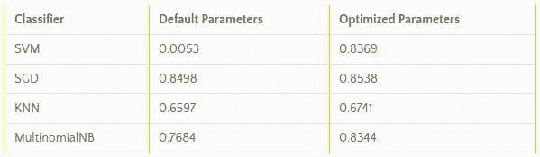

# 5 个你不能再忽视的机器学习项目，1 月

> 原文：[`www.kdnuggets.com/2017/01/five-machine-learning-projects-cant-overlook-january.html`](https://www.kdnuggets.com/2017/01/five-machine-learning-projects-cant-overlook-january.html)

"5 个你不能再忽视的机器学习项目"的前几篇文章揭示了许多鲜为人知的机器学习项目，包括通用和专用的机器学习库以及深度学习库，还有辅助支持、数据清理和自动化工具。经过一段时间的停歇，我们认为这个话题值得再次关注。

本文将展示 5 个你可能尚未听说过的机器学习项目，包括来自多个不同生态系统和编程语言的项目。即使你对这些特定工具没有需求，检查它们的广泛实现细节或具体代码也可能帮助你产生一些自己的想法。与之前的版本一样，除了我在网上花时间时发现的有趣项目外，没有其他正式的纳入标准，所有项目都有 GitHub 仓库。确实是主观的。

不再废话，这里是它们：你应该考虑查看的另外 5 个机器学习项目。它们没有特定的顺序排列，但为了方便起见，标了编号，因为编号让我有一种内心的平静，这种平静我至今仍不完全理解。

**1\. [Hyperopt-sklearn](https://github.com/hyperopt/hyperopt-sklearn)**

Hyperopt-sklearn 是基于 Hyperopt 的模型选择工具，用于 [scikit-learn](http://scikit-learn.org/) 项目中的机器学习算法。直接来自该项目的 [文档](http://hyperopt.github.io/hyperopt-sklearn/)：

> 为你的数据找到合适的分类器可能很困难。一旦你选择了一个分类器，调整所有参数以获得最佳结果是繁琐且耗时的。即使在你辛苦工作之后，你可能一开始就选择了错误的分类器。Hyperopt-sklearn 提供了一个解决方案。

Hyperopt-sklearn 使用多种搜索算法，可以搜索所有（支持的）分类器或仅在给定分类器的参数空间内搜索，并支持如 PCA、TfidfVectorizer、Normalizer 和 OneHotEncoder 等多种预处理步骤。

它有效吗？

> 下表展示了在 20 个新闻组数据集上，使用 scikit-learn 默认参数和 hyperopt-sklearn 优化参数的分类器获得的 [F1 分数](https://en.wikipedia.org/wiki/F1_score)。hyperopt-sklearn 的结果来自于一次运行中的 25 次评估。



Hyperopt-sklearn 需要非常少的额外代码就能运行，并且有一些方便的 [快速启动代码](https://github.com/hyperopt/hyperopt-sklearn/blob/master/notebooks/skdata_quick_intro.ipynb) 来帮助入门。

**2\. [Dlib](https://github.com/davisking/dlib)**

Dlib 是一个通用工具包，用于在 C++ 中创建机器学习和数据分析应用程序。也就是说，它是用 C++ 编写的。不过不用担心，它也有一个 [Python API](http://dlib.net/python/index.html)。


来自 [官方网站](http://dlib.net/)：

> Dlib 是一个现代 C++ 工具包，包含机器学习算法和工具，用于在 C++ 中创建复杂的软件以解决实际问题。它被广泛应用于工业和学术界，涵盖包括机器人技术、嵌入式设备、手机以及大型高性能计算环境等多个领域。

文档达到标准，API 解释得很好，项目还附带一个 [简明介绍](http://dlib.net/intro.html)。此外，还有一个 [博客](http://blog.dlib.net/)，概述了一些使用该库的有趣项目。Dlib 也不是新项目；它自 2002 年以来一直在开发。

鉴于它提供的广泛算法，我很感兴趣看到与 scikit-learn 的执行时间对比。有兴趣吗？有人吗？

**3\. [NN++](https://github.com/stagadish/NNplusplus)**

继续使用 C++，NN++ 是一个小巧且易于使用的神经网络实现。无需安装，只需下载并 #include。

来自其代码库：

> 一个简短、自包含且易于使用的 C++ 神经网络实现。它包括神经网络实现和一个用于基本线性代数操作的 Matrix 类。这个项目主要用于学习目的，但在 MNIST 数据集上的初步测试结果显示出一些潜力。

它的文档比较稀疏，但对附带的 Matrix 类的使用有一些额外的解释。一些代码片段解释了如何设置和查询神经网络。代码很简洁，因此对于那些希望了解简单神经网络的内部机制或希望从其他语言直接迁移到 C++ 实现网络的人来说，这个项目是一个不错的选择。

**4\. [LightGBM](https://github.com/Microsoft/LightGBM)**

LightGBM 是微软实现的梯度提升树算法。来自代码库的描述：

> 一个快速、分布式、高性能的梯度提升 (GBDT, GBRT, GBM 或 MART) 框架，基于决策树算法，用于排名、分类以及许多其他机器学习任务。它属于微软的 DMTK ([`github.com/microsoft/dmtk`](https://github.com/microsoft/dmtk)) 项目。

LightGBM 使用 C++ 和 [Python](https://github.com/Microsoft/LightGBM/tree/master/examples/python-guide) 编写，提供了 [快速入门指南](https://github.com/Microsoft/LightGBM/tree/master/examples/python-guide)、[并行学习指南](https://github.com/Microsoft/LightGBM/wiki/Parallel-Learning-Guide) 和质量 [功能概述](https://github.com/Microsoft/LightGBM/wiki/Features)。


但它的表现如何？

> [实验](https://github.com/Microsoft/LightGBM/wiki/Experiments#comparison-experiment) 在公共数据集上显示，LightGBM 在效率和准确性方面可以超越其他现有的提升框架，并且显著降低了内存消耗。此外， [实验](https://github.com/Microsoft/LightGBM/wiki/Experiments#parallel-experiment) 显示，LightGBM 可以通过在特定设置下使用多台机器进行训练，实现线性加速。

LightGBM 和微软分布式机器学习工具包的其他组件一样，具有许多看似值得关注的特性。

**5\. [Sklearn-pandas](https://github.com/paulgb/sklearn-pandas)**

到目前为止，这些项目都是通用的机器学习工具包或特定算法的实现。这个项目稍有不同，它在机器学习任务中扮演支持角色。

Sklearn-pandas 是一个积极开发的模块，它“提供了一个 Scikit-Learn 的机器学习方法和 pandas 风格的数据框之间的桥梁。”

更多来自仓库的信息：

> 特别是，它提供：
> 
> 1.  一种将 DataFrame 列映射到转换的方法，这些转换随后重新组合成特征。
> 1.  
> 1.  为旧版 scikit-learn 提供的兼容性适配层，用于交叉验证一个以 pandas DataFrame 为输入的管道。这仅在 scikit-learn<0.16.0 时需要（详细信息见 [#11](https://github.com/paulgb/sklearn-pandas/issues/11)）。该功能已被弃用，并可能在 skearn-pandas==2.0 中删除。

实际使用中，它的作用是将列映射到转换。以下是 Gitub 仓库中的一段代码示例：

```py

array([[ 1\.  ,  0\.  ,  0\.  ,  0.21],
       [ 0\.  ,  1\.  ,  0\.  ,  1.88],
       [ 0\.  ,  1\.  ,  0\.  , -0.63],
       [ 0\.  ,  0\.  ,  1\.  , -0.63],
       [ 1\.  ,  0\.  ,  0\.  , -1.46],
       [ 0\.  ,  1\.  ,  0\.  , -0.63],
       [ 1\.  ,  0\.  ,  0\.  ,  1.04],
       [ 0\.  ,  0\.  ,  1\.  ,  0.21]])
```

> 请注意，前三列是 LabelBinarizer 的输出（分别对应 _cat_、_dog_ 和 _fish_），第四列是子女数量的标准化值。通常，列的顺序按照构造 DataFrameMapper 时给定的顺序排列。

希望你在这些项目中找到了感兴趣的内容。祝你机器学习愉快！

**相关**：

+   5 个你不能再忽视的机器学习项目

+   5 个你不能再忽视的机器学习项目

+   5 个你不能再忽视的深度学习项目

* * *

## 我们的前三大课程推荐

 1\. [谷歌网络安全证书](https://www.kdnuggets.com/google-cybersecurity) - 快速进入网络安全职业的捷径

 2\. [谷歌数据分析专业证书](https://www.kdnuggets.com/google-data-analytics) - 提升你的数据分析水平

 3\. [谷歌 IT 支持专业证书](https://www.kdnuggets.com/google-itsupport) - 支持你的组织进行 IT 方面的工作

* * *

### 更多相关主题

+   [成为一名优秀数据科学家所需的 5 个关键技能](https://www.kdnuggets.com/2021/12/5-key-skills-needed-become-great-data-scientist.html)

+   [每个初学者数据科学家都应掌握的 6 个预测模型](https://www.kdnuggets.com/2021/12/6-predictive-models-every-beginner-data-scientist-master.html)

+   [2021 年最佳 ETL 工具](https://www.kdnuggets.com/2021/12/mozart-best-etl-tools-2021.html)

+   [每个数据科学家都应该知道的三个 R 库（即使你使用 Python）](https://www.kdnuggets.com/2021/12/three-r-libraries-every-data-scientist-know-even-python.html)

+   [停止学习数据科学以寻找目标，并通过寻找目标来……](https://www.kdnuggets.com/2021/12/stop-learning-data-science-find-purpose.html)

+   [学习数据科学统计的最佳资源](https://www.kdnuggets.com/2021/12/springboard-top-resources-learn-data-science-statistics.html)
