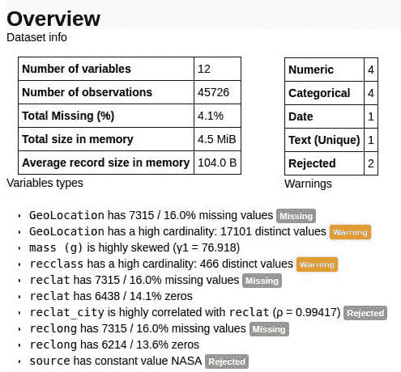
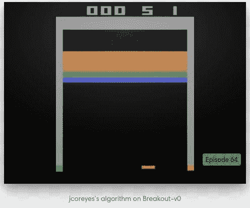
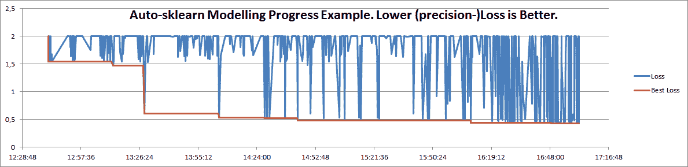
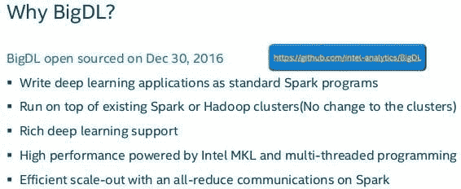

# 5 个你不能再忽视的机器学习项目，五月

> 原文：[`www.kdnuggets.com/2017/05/five-machine-learning-projects-cant-overlook-may.html`](https://www.kdnuggets.com/2017/05/five-machine-learning-projects-cant-overlook-may.html)

更多被忽视的机器学习和/或与机器学习相关的项目？听起来很棒！

这次我们就不做冗长的介绍了，直接说这些项目的选择没有其他标准，除了它们随着时间的推移引起了我的注意；实际上，任何客观的标准都不适用于这种情况。唯一的要求是这些项目是开源的，并且有 Github 仓库。

所以它们来了：再多五个……你知道接下来的事情。你也许还记得，它们的编号不是因为相对顺序的需要，而是因为我的治疗师建议这是应对我对非编号列表的恐惧的最佳方法。

**1\. [pandas-profiling](https://github.com/JosPolfliet/pandas-profiling)**

“从 pandas DataFrame 对象创建 HTML 配置报告”，因为 pandas 的 describe() 函数有点不足。来自仓库自述文件：

> 对于每一列，以下统计数据（如果与列类型相关）会以交互式 HTML 报告的形式呈现：
> 
> +   **基本信息：** 类型、唯一值、缺失值
> +   
> +   **分位数统计数据** 如最小值、Q1、中位数、Q3、最大值、范围、四分位数范围
> +   
> +   **描述性统计数据** 如均值、众数、标准差、总和、中位数绝对偏差、变异系数、峰度、偏度
> +   
> +   **最频繁的值**
> +   
> +   **直方图**

pandas-profiling 易于安装且使用简单，它可能是任何 Python 爱好者数据探索工具箱中的有用补充。可以在 [这里](http://nbviewer.jupyter.org/github/JosPolfliet/pandas-profiling/blob/master/examples/meteorites.ipynb) 找到一个使用 Jupyter notebook 的简单示例。或者，输出可以被导出到 HTML 文件以供保存。

对于那些定期在 Python 生态系统中处理和探索数据并寻求一些快速且简便总结的人来说，绝对值得考虑。

**2\. [Gym](https://github.com/openai/gym)**

你听说过 OpenAI 的 Gym……但它是什么？

> **OpenAI Gym 是一个用于开发和比较强化学习算法的工具包。** 这是 gym 的开源库，它让您可以访问不断增长的各种环境。

如果你对强化学习很认真，你已经知道了。但如果没有：

> `gym` 不对您的代理结构做任何假设，并且与任何数值计算库兼容，例如 TensorFlow 或 Theano。您可以通过 Python 代码使用它，并且很快可以从其他语言中使用。

OpenAI 提供了算法框架。它具有可扩展性和灵活性，可以玩简单的 Flash 和 Atari 游戏到棋盘游戏等各种游戏。了解更多关于 Gym 的信息[这里](https://gym.openai.com/)。它的[文档](https://gym.openai.com/docs)在这里，[FAQ](https://github.com/openai/gym/wiki/FAQ)在这里。你还可以阅读一篇白皮书，[在这里](http://arxiv.org/abs/1606.01540)。

**3\. [autosklearn-zeroconf](https://github.com/paypal/autosklearn-zeroconf)**

如果你不知道——实际上，为什么会知道呢？——我是自动化机器学习的粉丝（AutoML）。这是一个展示巨大未来潜力的机器学习（和数据科学）领域，并且今天已经开始见效。像 TPOT 和 auto-sklearn 这样的项目是入门的好地方，也是自动化自动化的首要步骤之一（尽管 AutoML 已经存在很长时间了）。

Paypal 的 autosklearn-zeroconf 是这个领域的另一个项目（实际上是基于前面提到的 auto-sklearn）：

> autosklearn-zeroconf 是一个完全自动化的二分类器，基于 AutoML 挑战赛获胜者 auto-sklearn。给它一个已知结果（标签）的数据集，它会调整大规模并行的数据科学机器学习管道。因此，你将获得新数据的预测结果列表和一个估计的预测精度。

虽然我还没有玩过这个项目，但我计划在不久的将来进行尝试并分享我的发现。与此同时，我对[听听任何人的看法](https://twitter.com/mattmayo13)感兴趣——除了它看起来是我们都想尝试的东西。

**4\. [Dora](https://github.com/NathanEpstein/Dora)**

多拉。探险者。对吗？

直接来自 Github 的 readme：

> Dora 是一个旨在自动化探索性数据分析中痛苦部分的 Python 库。
> 
> 该库包含用于数据清洗、特征选择与提取、可视化、数据分割以进行模型验证和数据转换版本控制的便利功能。
> 
> 该库使用并旨在成为常见 Python 数据分析工具（如 pandas、scikit-learn 和 matplotlib）的有用补充。

使用起来也很简单。尽管它涵盖了大量的数据准备工作，但其数据转换的版本控制看起来特别新颖。查看 Dora 在[repo 的 readme](https://github.com/NathanEpstein/Dora)中易于跟随的示例代码。

**5\. [BigDL](https://github.com/intel-analytics/BigDL)**

来自 Intel 的另一个深度学习框架，针对 Apache Spark 的分布式优化。从 readme 中：

> BigDL 是一个针对 Apache Spark 的分布式深度学习库；使用 BigDL，用户可以将他们的深度学习应用程序作为标准 Spark 程序编写，这些程序可以直接在现有的 Spark 或 Hadoop 集群上运行。
> 
> +   丰富的深度学习支持
> +   
> +   极高的性能
> +   
> +   高效的扩展能力

需要一些**理由**来说明为什么你可能会选择 BigDL 而不是众多现有的深度学习库吗？这个主题的演示文稿幻灯片可能会有所帮助：

查看 [快速入门指南](https://github.com/intel-analytics/BigDL/wiki/Getting-Started) 以获得简要概述。API 指南可以在 [这里](https://github.com/intel-analytics/BigDL/wiki/Programming-Guide) 找到。

**相关**：

+   你不能再忽视的 5 个机器学习项目，4 月

+   你不能再忽视的 5 个机器学习项目，1 月

+   你不能再忽视的 5 个机器学习项目

* * *

## 我们的前三大课程推荐

 1\. [谷歌网络安全证书](https://www.kdnuggets.com/google-cybersecurity) - 快速进入网络安全职业生涯。

 2\. [谷歌数据分析专业证书](https://www.kdnuggets.com/google-data-analytics) - 提升你的数据分析技能

 3\. [谷歌 IT 支持专业证书](https://www.kdnuggets.com/google-itsupport) - 支持你组织的 IT 需求

* * *

### 更多相关话题

+   [可以帮助你解决实际问题的数据科学项目](https://www.kdnuggets.com/2022/11/data-science-projects-help-solve-real-world-problems.html)

+   [9 个职业证书可以带你进入学位...如果...](https://www.kdnuggets.com/9-professional-certificates-that-can-take-you-onto-a-degree-if-you-really-want-to)

+   [如何使用机器学习自动标记数据](https://www.kdnuggets.com/2022/02/machine-learning-automatically-label-data.html)

+   [你不能错过的 7 种机器学习算法](https://www.kdnuggets.com/7-machine-learning-algorithms-you-cant-miss)

+   [2024 年你可以参加的 5 个顶级机器学习课程](https://www.kdnuggets.com/5-top-machine-learning-courses-you-can-take-in-2024)

+   [2024 年你不能错过的 5 个 AI 播客](https://www.kdnuggets.com/top-5-ai-podcasts-you-cant-miss-in-2024)
