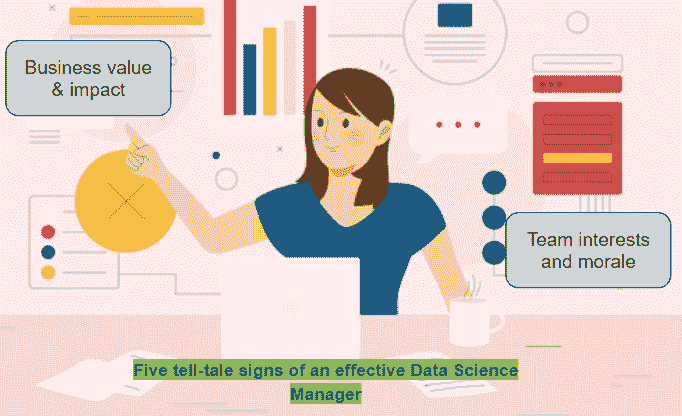

# 有效数据科学经理的五个迹象

> 原文：[`www.kdnuggets.com/2022/06/five-signs-effective-data-science-manager.html`](https://www.kdnuggets.com/2022/06/five-signs-effective-data-science-manager.html)

[由 pikisuperstar 创建的生产力矢量](https://www.freepik.com/free-vector/young-woman-multitasking-concept_6528209.htm?query=multitasking)

时代迅速变化，如今的职位名称和职责并不完全取决于经验年限。只要你理解业务目标并将其与团队的期望和兴趣对齐，你可以在任何年龄领导数据科学团队。

* * *

## 我们的前三大课程推荐

 1\. [谷歌网络安全证书](https://www.kdnuggets.com/google-cybersecurity) - 快速进入网络安全职业生涯。

 2\. [谷歌数据分析专业证书](https://www.kdnuggets.com/google-data-analytics) - 提升你的数据分析能力

 3\. [谷歌 IT 支持专业证书](https://www.kdnuggets.com/google-itsupport) - 支持你的组织的 IT 需求

* * *

我在下面列出了从业务和团队领导两个角度来看，一个有效的数据科学经理的特征。

# 机会主义

我们都应该在职业生涯的某个阶段听说过推拉模型。这个推拉概念的一个类比是，你是否一直在等待有人把工作推给你。

或者，你是否足够机会主义，能够理解业务问题，并主动将高影响的工作拉到自己手中。

你是否是一个先锋，帮助业务理解机器学习解决方案如何以及在何处提供帮助，还是仅仅作为一种装饰品？

# 业务与机器学习指标

使你的利益相关者对机器学习有足够的认知，将使你在职业生涯中走得更远。这表明你能够从长远考虑，并且能够弥合高准确度模型与那些带来实际业务价值的模型之间的差距。让我们诚实地面对，机器学习模型的构建过程是时间和资源密集型的，需要清楚理解机会规模和机器学习模型的影响。

在向领导展示提案时，你应该清楚地列出假设、使用机器学习的利弊、模型的脆弱性等。这可以减轻业务高管的巨大负担，为数据科学团队带来协同效应和信任。

# 满足团队的期望

如果你已经说服管理层接受了你解决方案的价值主张，但数据科学经理的任务还包括感知团队的脉搏。虽然有一种看法认为数据科学团队整天都在使用最先进的前沿模型，但现实中还包括为重复任务构建自动化工作流程，进行 4 个月的概念验证却只看到其被废弃，模型监控和维护，解释模型预测等。

关键是你需要识别并调整团队成员的兴趣 - 有些可能来自核心研究背景，能够思考创新解决方案，而其他人可能对成为全栈数据科学家，即全能型人才感兴趣。

始终记住，团队中某个成员看来像是一项负担的工作（可能是因为他们已经做了很长时间，并渴望接受新的挑战），可能对其他人来说是一个学习和提升技能的好机会。

这全关乎于找到那种常被低估的技能，即了解你的团队。不要与团队保持机械化或交易性的关系，仅仅传达任务而不融入他们的工作期望。

# 维持团队士气

说实话 - 你无法让团队长时间从事他们不感兴趣的任务。但你仍然需要完成这个任务。一个好的数据科学经理会注意到所有团队成员的兴趣，并能够真实地解释现实情况。但是，现实是什么呢？

管理层理解并计划个人的发展和成长蓝图，其中业务目标与团队的目标和兴趣相一致。但目前我们需要完成一个业务交付任务，并且在下一个机会出现时，团队的对齐情况会根据他们在一对一沟通中提出的要求进行调整。

你需要对团队的承诺保持完全的忠诚，因为你正在与行业中的优秀人才合作。你只能通过让他们明白当前任务的成功完成将使他们离自己感兴趣的领域更近一步来吸引他们。

请注意，我们并不生活在一个理想的世界，因此很可能无法一次性满足整个团队的期望。你在明确而清晰地呼唤的约束条件下工作 - 业务优先。那么，你会怎么做呢？

这就是同理领导力概念的来源。你对团队期望的意识和愿意帮助他们实现这些期望的能力已经证明了你的管理技能。朝着正确方向的努力会被团队充分认可。那些尚未得到自己份额的人也理解，只要有合适的时间和机会，经理将会为他们定位并使他们实现目标。

# 你提倡什么：竞争还是个人成长？

个人而言，我不喜欢在团队内部提倡竞争，并以健康竞争的名义包装这种激励。我更愿意尊重每个人的独特性，并挖掘他们的潜力。

**要求一条鱼爬树，我能得到什么额外的好处？**

是的，每个人都应该足够灵活，以便快速学习和交付。但是，这种交付很可能来自他们感兴趣的领域，而不是强迫他们走别人的路。一个好的数据科学经理对团队的学习曲线负责，并推广一些缓冲时间，让他们探索自己感兴趣的工作。哦，但你可能会认为你感兴趣的领域不一定能找到业务成果。

这就是管理的优点所在——你激励他们花 15-20%的时间探索新的算法，学习像编程语言这样的新技能等。实质上，是给他们翅膀，去思考超越纯商业背景的边界。

# 摘要

虽然我们都希望有一本规则手册可以让所有管理者从第一天起就成功，但不幸的是，并没有这样的手册。

每个人都有自己的管理风格，并应该坚持自己轻松自然的方式。你不能在管理团队时长时间伪装自己。因此，最好做真实的自己，并做到一个有效的经理应该做的事情——在保持团队积极的同时实现业务成果。

**[Vidhi Chugh](https://vidhi-chugh.medium.com/)** 是一位获奖的 AI/ML 创新领导者和 AI 伦理学家。她在数据科学、产品和研究的交汇处工作，以提供业务价值和洞察力。她是数据驱动科学的倡导者，并在数据治理领域是一位领先专家，致力于构建可信赖的 AI 解决方案。

### 更多相关话题

+   [KDnuggets™ 新闻 22:n03，1 月 19 日：深入探讨 13 个数据…](https://www.kdnuggets.com/2022/n03.html)

+   [五步成为数据科学专业人士](https://www.kdnuggets.com/2022/03/become-data-science-professional-five-steps.html)

+   [你应该知道的五大 SQL 窗口函数，适用于数据科学面试](https://www.kdnuggets.com/2022/01/top-five-sql-window-functions-know-data-science-interviews.html)

+   [在 Pandas 中进行条件过滤的五种方法](https://www.kdnuggets.com/2022/12/five-ways-conditional-filtering-pandas.html)

+   [为有效的 Tableau 和 Power BI 仪表板准备数据](https://www.kdnuggets.com/2022/06/prepare-data-effective-tableau-power-bi-dashboards.html)

+   [数据可视化最佳实践与有效沟通的资源](https://www.kdnuggets.com/2023/04/data-visualization-best-practices-resources-effective-communication.html)
