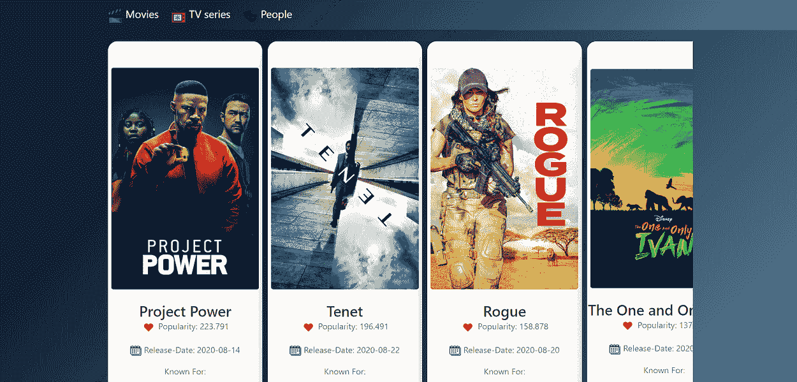
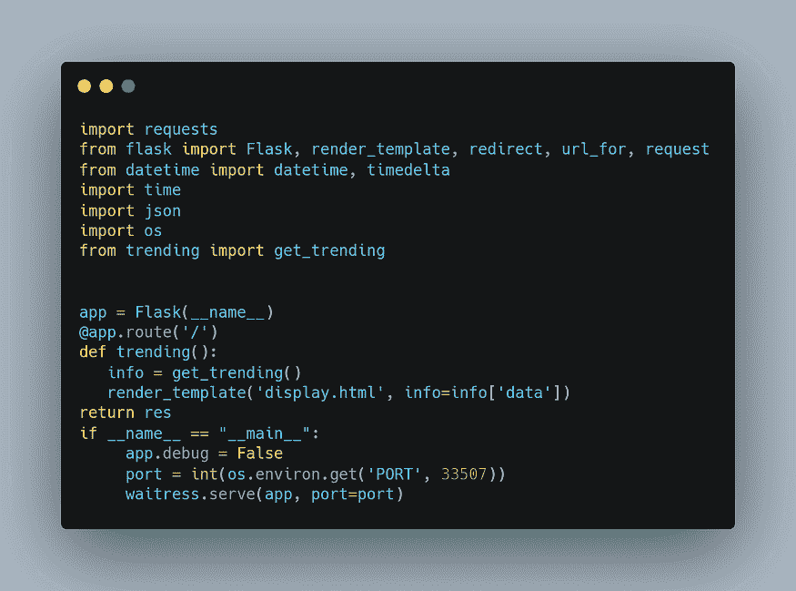
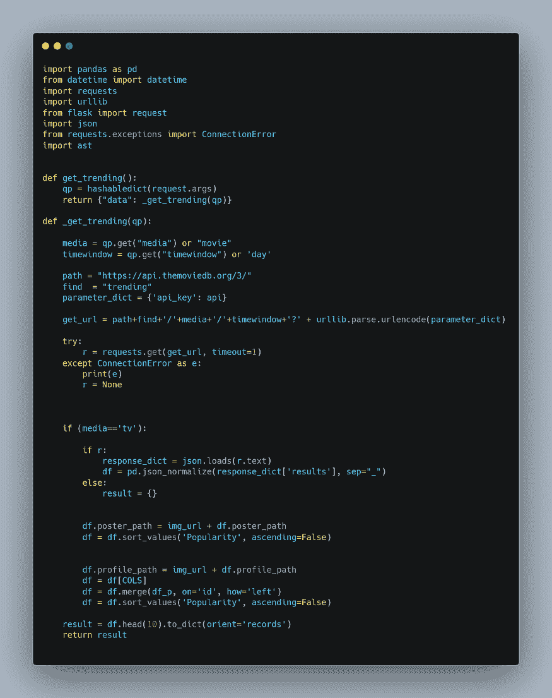
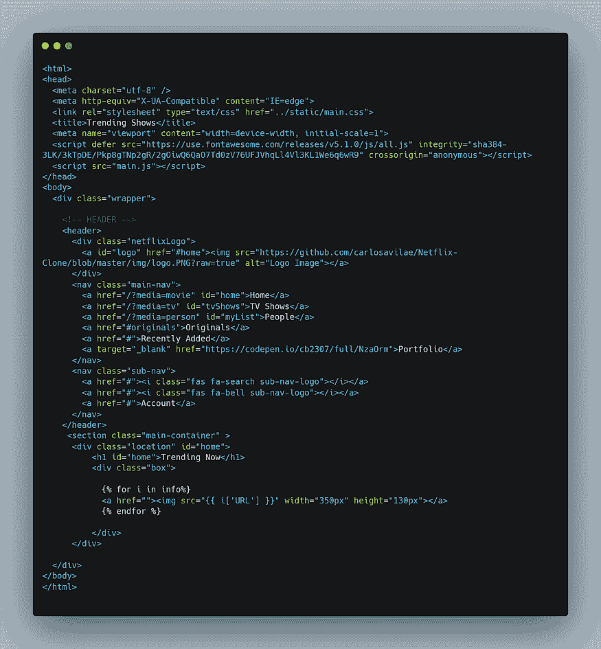

# 使用 Python 和 Heroku 创建并部署你的第一个 Flask 应用程序

> 原文：[`www.kdnuggets.com/2020/09/flask-app-using-python-heroku.html`](https://www.kdnuggets.com/2020/09/flask-app-using-python-heroku.html)

评论

**由 [Divy Shah](https://www.linkedin.com/in/shahdivy/)，数据科学家**。



* * *

## 我们的前三个课程推荐

 1\. [Google 网络安全证书](https://www.kdnuggets.com/google-cybersecurity) - 快速进入网络安全领域的职业生涯。

 2\. [Google 数据分析专业证书](https://www.kdnuggets.com/google-data-analytics) - 提升你的数据分析技能

 3\. [Google IT 支持专业证书](https://www.kdnuggets.com/google-itsupport) - 支持你的组织的 IT

* * *

**前提条件**

+   [Python](https://www.python.org/downloads/)

+   [Flask](https://flask.palletsprojects.com/)

+   [Git](https://git-scm.com/downloads)

+   [Heroku CLI](https://devcenter.heroku.com/articles/heroku-cli#download-and-install)

**安装**

安装 Python 后，安装列出的其他框架和库。你可以使用以下命令轻松安装 flask。

```py
pip install Flask
#pip install 

```

### 定义你的 Web 应用程序的结构

```py
static
    |_main.css
template
    |_display.html
app.py
trending.py
requirements.txt

```

静态目录包含你的 CSS 文件，而模板目录包含 HTML 文件，用于渲染。

你可以为逻辑和其他操作创建一个单独的 .py 文件，或者在同一个 app.py 文件中编写代码。我建议创建一个单独的文件，这样会减少混淆。

### 第一步：

*创建你的 **app.py** 文件*

我使用了 waitress 服务，因为使用这个库意味着它是一个生产级别的纯 Python WSGI 服务器，性能非常可接受。它没有其他依赖，只依赖于 Python 标准库中的依赖项。

**安装 waitress**

```py
pip install waitress

```



*app.py*

```py
import requests
from flask import Flask, render_template, redirect, url_for, request
from datetime import datetime, timedelta
import time
import json
import os
from trending import get_trending

app = Flask(__name__)

@app.route('/')

def trending():
   info = get_trending()
   render_template('display.html', info=info['data'])
   return res

if __name__ == "__main__":
     app.debug = False
     port = int(os.environ.get('PORT', 33507))
     waitress.serve(app, port=port)

```

如上所示，我们使用了 **GET ** 方法从服务器发送数据。

还有其他几种方法可用，包括：

**POST: **用于将用户/form-data 发送到服务器，并且不缓存传输的数据。

**HEAD:** 类似于 GET，但不同之处在于它用于没有响应体的情况。

**PUT: **用于用上传的内容替换当前资源。

**DELETE:** 用于删除 URL 中提供的目标资源。

### 第二步：

创建 trending.py 文件，该文件基本上包含你的业务逻辑。创建后，将主函数导入到 app.py 文件中。

```py
from trending import get_trending

```

下面是我的 trending.py 文件的样子：



*trending.py*

收集数据后，我们可以使用 HTML 文件来呈现输出。

输出数据将在 HTML 页面上显示。

### 第三步：

创建一个 HTML 文件来呈现你从响应对象中收集的数据。

下面是我的 display.html 文件的样子：



*display.html*

你几乎完成了编码部分，现在是时候部署我们的第一个 flask 应用了。

在部署应用之前，首先检查本地的 flask 应用。

### 部署步骤

**1\. 使用 CLI 登录到你的 Heroku 账户**

你可以通过在终端中输入以下命令进行登录：

```py
heroku login

```

**2\. 在 Heroku 上创建一个网页应用**

你可以使用以下命令在 Heroku 上创建一个新应用：

```py
heroku create < your_app_name >

```

**3\. 在相同的项目目录中创建 *requirements.txt* 文件**

要生成 requirements.txt 文件，你可以使用以下命令：

```py
pip freeze > requirements.txt

```

**4\. 创建一个 Procfile**

*Procfile* 是所有 Heroku 应用所需的进程文件。*Procfile* 指定了应用在启动时执行的命令。

[点击这里](https://devcenter.heroku.com/articles/procfile) 以阅读更多有关 *Procfile* 的信息

在 *Procfile* 中输入以下内容：

```py
web: gunicorn app:app

```

这里，app 是你主要的 (.py) 文件的名称。在我的例子中，它是 app.py。

如果你还没有安装 gunicorn 网页服务器，请使用以下命令安装：

```py
pip install gunicorn

```

*注意：你必须创建一个没有任何文件扩展名的 Procfile。*

**5\. 创建 *runtime.txt* 以指定运行时的 Python 版本**

在创建`runtime.txt`之后，添加你的构建 Python 版本，如下所示：

```py
python-3.8.1

```

现在，我们一切就绪！

**6\. 初始化一个空的 git 仓库并推送代码**

```py
git init

```

接下来，使用以下步骤提交你的最终代码：

```py
git add .
git commit -m "My first commit"
git push heroku master

```

你的应用现在已经上线，你可以使用生成的 URL 查看你的网页应用。

*请查看我的演示网页应用：*[`trending-shows.herokuapp.com/`](https://trending-shows.herokuapp.com/)

[原文](https://medium.com/towards-artificial-intelligence/create-and-deploy-your-first-flask-app-using-python-and-heroku-aee04eaddc71)。经许可转载。

**简介：** [Divy Shah](https://www.linkedin.com/in/shahdivy/) 对利用数据科学和机器学习算法解决现实生活和金融科技行业的问题充满热情，且总是渴望学习和探索新的数据科学算法和框架。

**相关：**

+   [使用 Flask 部署机器学习模型](https://www.kdnuggets.com/2019/12/excelr-deployment-machine-learning-flask.html)

+   [构建并部署你的第一个机器学习网页应用](https://www.kdnuggets.com/2020/05/build-deploy-machine-learning-web-app.html)

+   [如何使用 Flask 在 5 分钟内为机器学习模型构建 API](https://www.kdnuggets.com/2019/01/build-api-machine-learning-model-using-flask.html)

### 更多相关话题

+   [用 Heroku 部署机器学习网页应用](https://www.kdnuggets.com/2022/04/deploy-machine-learning-web-app-heroku.html)

+   [将 Streamlit WebApp 部署到 Heroku 使用 DAGsHub](https://www.kdnuggets.com/2022/02/deploying-streamlit-webapp-heroku-dagshub.html)

+   [在 Heroku 云上部署深度学习网页应用的技巧与窍门](https://www.kdnuggets.com/2021/12/tips-tricks-deploying-dl-webapps-heroku.html)

+   [从零到英雄：用 PyTorch 创建你的第一个 ML 模型](https://www.kdnuggets.com/from-zero-to-hero-create-your-first-ml-model-with-pytorch)

+   [用 Python 构建一个命令行应用的 7 个简单步骤](https://www.kdnuggets.com/build-a-command-line-app-with-python-in-7-easy-steps)

+   [使用 Python 和 Dash 创建仪表板](https://www.kdnuggets.com/2023/08/create-dashboard-python-dash.html)
