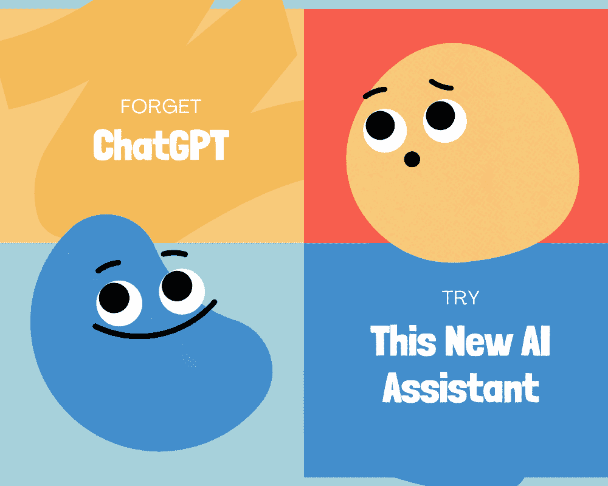
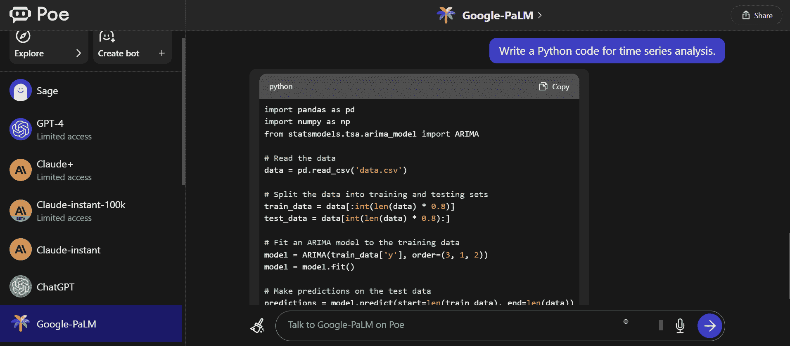
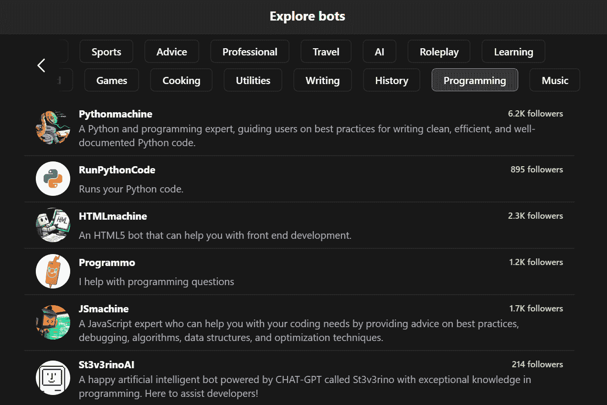

# 忘掉 ChatGPT，这款全新的 AI 助手遥遥领先，将永远改变你的工作方式

> 原文：[`www.kdnuggets.com/2023/08/forget-chatgpt-new-ai-assistant-leagues-ahead-change-way-work-forever.html`](https://www.kdnuggets.com/2023/08/forget-chatgpt-new-ai-assistant-leagues-ahead-change-way-work-forever.html)

作者提供的图像

我使用 ChatGPT 和 Bard 已有一段时间，这些工具已成为我工作流程的重要部分。我依赖它们生成代码、进行统计测试、理解新术语，并制作分析报告和总结。然而，当我切换到 Poe 后，体验显著改善。

* * *

## 我们的三大课程推荐

 1\. [谷歌网络安全证书](https://www.kdnuggets.com/google-cybersecurity) - 快速进入网络安全职业的快车道。

 2\. [谷歌数据分析专业证书](https://www.kdnuggets.com/google-data-analytics) - 提升你的数据分析技能

 3\. [谷歌 IT 支持专业证书](https://www.kdnuggets.com/google-itsupport) - 支持你的组织 IT 需求

* * *

在这篇文章中，我将解释为什么我停止使用 ChatGPT，并且为什么我认为 Poe 是各种数据科学任务的更佳替代方案。

# 什么是 Poe

[Poe](https://poe.com/) 是一个聊天机器人服务，允许你使用最先进的模型，如 Claude +、GPT-3.5-Turbo、GPT-4、LlaMA 2、PaLM 和所有新型 LLM 模型。此外，它将使用户能够使用初始提示创建和共享可定制的聊天机器人。Poe 速度快，易于使用，并提供准确的答案。

来自 Poe 的图像

我更喜欢使用 Poe 而非 ChatGPT 和 Bard，因为 Poe 更快、更准确，并且提供更多功能。Poe 允许我一键清除上下文，而在 ChatGPT 上，我必须开始一个新的聊天会话。Poe 让我可以一键在 Claude+ 和 Sage 等模型之间切换，而 ChatGPT 仅提供 GPT-4 和 GPT-3.5-Turbo。

# Poe 的特点

来自 Poe 的图像

**Poe 的主要特点：**

1.  **速度**: Poe 的加载和响应速度比 ChatGPT 快得多。

1.  **模型范围：** Poe 提供了更多种类的 AI 模型，这些模型提供比 GPT-3.5-Turbo 更准确的答案。

1.  **模型切换的简便性：** 你可以通过单击轻松切换 AI 模型。

1.  **自定义聊天机器人：** 你可以根据个人偏好通过提供初始提示来创建可定制的聊天机器人。

1.  **社区聊天机器人：** 你可以访问和探索其他 Poe 用户为特定任务创建的聊天机器人。

1.  **简洁性：** 注册和开始使用 Poe 非常简单明了。

1.  **高级访问：** 付费订阅可以让你访问更多高级模型，如 GPT-4 和 Claude。

1.  **应用程序：** Poe 既有 Android 版也有 iOS 版。

1.  **稳定性：** 它不会崩溃或出现 bug。

1.  **易用性：** 清除上下文并开始新的聊天非常简单。

# 我如何用于数据科学任务

你需要了解这些生成型 AI 聊天机器人是你的助手。它们可以帮助你完成各种任务，从写文章到构建端到端的数据科学项目。

我通常使用 Poe 来编写和创建内容结构。如果我不喜欢 Claude-Instant 的回答，我会询问 ChatGPT 或 Google PaLM。这使我能够选择最佳回复。此外，我还使用 Poe 来：

+   **代码生成：** 我使用 Poe 生成 Python、R 和 SQL 代码，用于特定任务，如清理数据、执行统计测试和构建机器学习模型。它帮助调试我的代码，甚至生成完整的代码示例来构建网页应用。

+   **内容写作：** Poe 帮助改善我的博客文章和教程的语法和结构。它还总结了长文档，并生成更好的标题和摘录。

+   **技术学习：** 我请 Poe 解释新的数据科学技术和统计测试，帮助我学习新技能。

+   **数据分析和探索：** Poe 生成代码以清理、探索、分析和建模我的数据。它帮助验证数据质量并识别问题。

+   **翻译：** 我利用 Poe 进行代码和文本的翻译。

总的来说，Poe 是一个有用的助手，可以完成许多重复的任务，从而释放出我的时间用于更高层次的工作和决策。它显著提高了我作为数据科学家的生产力。

# 结束语

让我们开始使用它，感受不同。我已经使用 Poe Free 三个月了，并且不打算回到官方的 ChatGPT 或 Bard。如果我想从 ChatGPT 生成回复，我会在 Poe 中切换模型。就是这么简单快捷。

如果你有兴趣了解我如何利用其他 AI 工具来提升我的数据科学和内容创作技能，请在评论中告诉我，我将来会写关于这些工具的文章。

**[Abid Ali Awan](https://www.polywork.com/kingabzpro)** ([@1abidaliawan](https://www.linkedin.com/in/1abidaliawan/)) 是一位认证的数据科学专家，喜欢构建机器学习模型。目前，他专注于内容创作，并撰写有关机器学习和数据科学技术的技术博客。Abid 拥有技术管理硕士学位和电信工程学士学位。他的愿景是利用图神经网络构建一个 AI 产品，帮助那些与心理健康问题斗争的学生。

### 了解更多相关信息

+   [Excel 中的 Python：这将永远改变数据科学](https://www.kdnuggets.com/python-in-excel-this-will-change-data-science-forever)

+   [停止在 ChatGPT 上做这些事，超越 99% 的用户](https://www.kdnuggets.com/2023/05/stop-chatgpt-get-ahead-99-users.html)

+   [忘记 PIP、Conda 和 requirements.txt！使用 Poetry 代替，并…](https://www.kdnuggets.com/2023/07/forget-pip-conda-requirementstxt-poetry-instead-thank-later.html)

+   [我每天使用 ChatGPT 5 个月。以下是一些隐藏的宝藏…](https://www.kdnuggets.com/2023/07/used-chatgpt-every-day-5-months-hidden-gems-change-life.html)

+   [ChatGPT 作为 Python 编程助手](https://www.kdnuggets.com/2023/01/chatgpt-python-programming-assistant.html)

+   [认识 MetaGPT：将文本转化为…的 ChatGPT 驱动 AI 助手](https://www.kdnuggets.com/meet-metagpt-the-chatgptpowered-ai-assistant-that-turns-text-into-web-apps)
