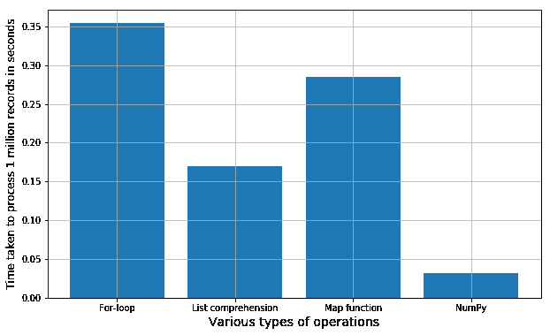

# 为什么你应该忘记数据科学代码中的`for-loop`，而拥抱向量化

> 原文：[`www.kdnuggets.com/2017/11/forget-for-loop-data-science-code-vectorization.html`](https://www.kdnuggets.com/2017/11/forget-for-loop-data-science-code-vectorization.html)

 评论


我们都曾经使用*for-loops*来处理需要遍历长列表元素的大多数任务。我相信几乎所有阅读这篇文章的人，在高中或大学时，都用 for-loop 编写了他们的第一个矩阵或向量乘法代码。for-loop 长久以来一直服务于编程社区。

* * *

## 我们的前三个课程推荐

 1. [Google 网络安全证书](https://www.kdnuggets.com/google-cybersecurity) - 快速进入网络安全职业生涯。

 2. [Google 数据分析专业证书](https://www.kdnuggets.com/google-data-analytics) - 提升你的数据分析技能

 3. [Google IT 支持专业证书](https://www.kdnuggets.com/google-itsupport) - 支持你的组织的 IT 工作

* * *

然而，它也带来了一些问题，当处理大型数据集（如当今大数据时代的数百万条记录）时，执行速度往往较慢。这对于像 Python 这样的解释型语言尤其如此，如果你的循环体很简单，**循环本身的解释器开销可能是相当大的开销**。

幸运的是，在几乎所有主要编程生态系统中都有替代方案。Python 有一个很棒的选择。

Numpy，简写自[Numerical Python](http://numpy.org/)，是 Python 生态系统中进行高性能科学计算和数据分析所需的基础包。它是几乎所有更高级工具如[Pandas](https://pandas.pydata.org/)和[scikit-learn](http://scikit-learn.org/)的基础。[TensorFlow](https://www.tensorflow.org/)使用 NumPy 数组作为基本构建块，在此基础上构建了他们的 Tensor 对象和用于深度学习任务的 graphflow（这在长列表/向量/矩阵数字上的线性代数操作中使用频繁）。

Numpy 提供的两个最重要的优势是：

+   `ndarray`，一个快速且节省空间的多维数组，提供向量化的算术操作和复杂的[*广播*功能](https://towardsdatascience.com/two-cool-features-of-python-numpy-mutating-by-slicing-and-broadcasting-3b0b86e8b4c7)

+   进行快速数据数组操作的标准数学函数*无需编写循环*

> 你会经常听到数据科学、机器学习和 Python 社区中的说法，即由于其向量化实现和许多核心例程用 C 编写，Numpy 的速度要快得多（基于[CPython 框架](https://en.wikipedia.org/wiki/CPython)）。

这确实是事实（[这篇文章是一个很好的演示](http://notes-on-cython.readthedocs.io/en/latest/std_dev.html)，展示了与 Numpy 一起使用的各种选项，甚至使用 Numpy API 编写裸骨的 C 例程）。Numpy 数组是同质类型的紧密打包数组。相比之下，Python 列表是指向对象的指针数组，即使它们都是同一类型。因此，你可以获得[引用局部性](https://en.wikipedia.org/wiki/Locality_of_reference)的好处。许多 Numpy 操作是用 C 实现的，避免了 Python 中循环的通用开销、指针间接访问以及每个元素的[动态类型检查](https://www.sitepoint.com/typing-versus-dynamic-typing/)。速度提升取决于你正在执行的操作。[**对于数据科学和现代机器学习任务，这是一个宝贵的优势**]，因为数据集的大小通常达到百万，甚至亿万记录，你不想使用 for 循环及其相关负担来迭代处理它。

如何通过一个中等大小数据集的例子来明确证明这一点？

这是[***我 Github 代码的链接***](https://github.com/tirthajyoti/PythonMachineLearning/blob/master/How%20fast%20are%20NumPy%20ops.ipynb)（Jupyter notebook），它展示了在几行简易代码中，Numpy 操作与常规 Python 编程构造如*for 循环*、[*map 函数*](https://stackoverflow.com/questions/10973766/understanding-the-map-function)或[*列表推导式*](http://www.pythonforbeginners.com/basics/list-comprehensions-in-python)的速度差异。

我只是概述基本流程：

+   创建一个中等数量的浮点数列表，最好从类似高斯或均匀随机的连续统计分布中抽取。我选择了 100 万个作为演示。

+   从列表中创建一个 `ndarray` 对象，即向量化。

+   编写简短的代码块来遍历列表，并对列表执行数学操作，例如取 10 为底的对数。使用 for 循环、map 函数和列表推导式。每次使用`time.time()`函数来确定处理 100 万条记录所需的总时间。

```py
t1=time.time()
for item in l1:
    l2.append(lg10(item))
t2 = time.time()
print("With for loop and appending it took {} seconds".format(t2-t1))
speed.append(t2-t1)
```

+   使用 Numpy 的内置数学方法 (`np.log10`) 对 `ndarray` 对象执行相同操作。计时。

```py
t1=time.time()
a2=np.log10(a1)
t2 = time.time()
print("With direct Numpy log10 method it took {} seconds".format(t2-t1))
speed.append(t2-t1)
```

+   将执行时间存储在列表中，并绘制一个条形图以显示比较差异。

这是结果。你可以通过运行 Jupyter notebook 中的所有单元格重复整个过程。每次都会生成一组新的随机数字，因此确切的执行时间可能会有些许变化，但总体趋势将始终相同。你可以尝试其他数学函数/字符串操作或其组合，以检查这种情况是否普遍适用。

这是一本由法国神经科学研究员编写的开源在线书籍，涉及这一主题。[在这里查看](https://www.labri.fr/perso/nrougier/from-python-to-numpy/#id7)。



简单数学操作的执行速度比较条形图

如果你有任何问题或想分享的想法，请通过[**tirthajyoti[AT]gmail.com**](mailto:tirthajyoti@gmail.com)联系作者。你也可以查看作者的[**GitHub 仓库**](https://github.com/tirthajyoti)，获取更多有趣的 Python、R 或 MATLAB 代码片段以及机器学习资源。

**个人简介：[Tirthajyoti Sarkar](https://www.linkedin.com/in/tirthajyoti-sarkar-2127aa7/)** 是半导体技术专家、机器学习/数据科学热衷者、电气工程博士、博客作者和作家。

[原文](https://towardsdatascience.com/why-you-should-forget-for-loop-for-data-science-code-and-embrace-vectorization-696632622d5f)。经许可转载。

**相关：**

+   使用 Numpy 矩阵的实用参考

+   科学 Python 简介（及其背后的数学） – NumPy

+   Python 数据准备案例文件：基于组的插补

### 相关阅读

+   [每个初学者数据科学家应掌握的 6 种预测模型](https://www.kdnuggets.com/2021/12/6-predictive-models-every-beginner-data-scientist-master.html)

+   [成为优秀数据科学家所需的 5 项关键技能](https://www.kdnuggets.com/2021/12/5-key-skills-needed-become-great-data-scientist.html)

+   [2021 年最佳 ETL 工具](https://www.kdnuggets.com/2021/12/mozart-best-etl-tools-2021.html)

+   [每个数据科学家都应该了解的三个 R 库（即使你使用 Python）](https://www.kdnuggets.com/2021/12/three-r-libraries-every-data-scientist-know-even-python.html)

+   [使用管道编写清晰的 Python 代码](https://www.kdnuggets.com/2021/12/write-clean-python-code-pipes.html)

+   [停止学习数据科学以寻找目的，并以寻找目的来…](https://www.kdnuggets.com/2021/12/stop-learning-data-science-find-purpose.html)
