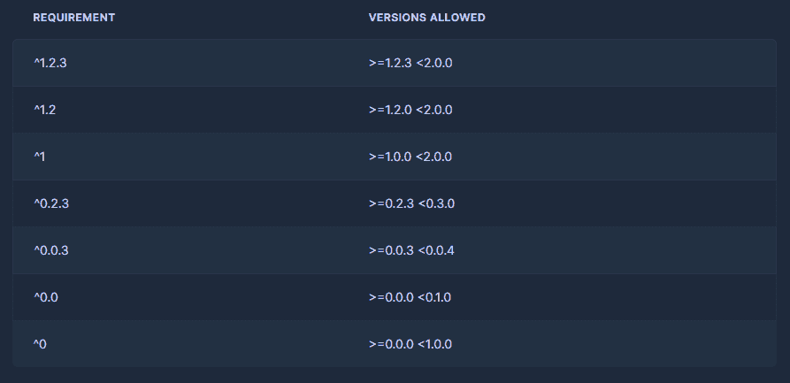
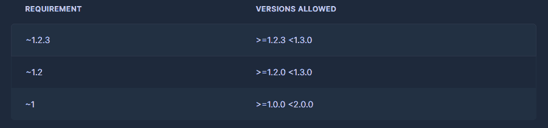
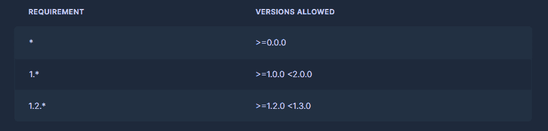

# 忘记 PIP、Conda 和 requirements.txt！改用 Poetry，稍后感谢我

> 原文：[`www.kdnuggets.com/2023/07/forget-pip-conda-requirementstxt-poetry-instead-thank-later.html`](https://www.kdnuggets.com/2023/07/forget-pip-conda-requirementstxt-poetry-instead-thank-later.html)


图片由我使用 Midjourney 制作

库 A 需要 Python 3.6。库 B 依赖于库 A，但需要 Python 3.9，库 C 依赖于库 B，但需要与 Python 3.6 兼容的库 A 的特定版本。

欢迎来到依赖地狱！

由于没有外部数据科学包的原生 Python 很差劲，数据科学家经常发现自己陷入如上所示的两难依赖情况。

像 PIP、Conda 或可笑的 requirements.txt 文件这样的工具无法解决这个问题。实际上，依赖地狱在很大程度上*正是由于它们*的存在。因此，为了结束这些痛苦，Python 开源社区开发了名为 Poetry 的迷人工具。

Poetry 是一个集成的项目和依赖管理框架，在 GitHub 上拥有超过 25k 星标。本文将介绍 Poetry，并列出它为数据科学家解决的问题。

开始吧。

# 安装

虽然 Poetry 可以通过 PIP 安装为库，但建议将其系统范围内安装，以便你可以在任何地方的 CLI 上调用 `poetry`。以下是适用于 Unix 类系统的安装脚本命令，包括 [Windows WSL2](https://towardsdatascience.com/how-to-create-perfect-machine-learning-development-environment-with-wsl2-on-windows-10-11-2c80f8ea1f31)：

```py
curl -sSL https://install.python-poetry.org | python3 -
```

如果因为某些奇怪的原因，你使用 Windows Powershell，以下是适用的命令：

```py
(Invoke-WebRequest -Uri https://install.python-poetry.org -UseBasicParsing).Content | py -
```

要检查 Poetry 是否正确安装，你可以运行：

```py
$ poetry -v

Poetry (version 1.5.1)
```

Poetry 还支持各种 Shell（如 Bash、Fish、Zsh 等）的 Tab 补全。了解更多信息 [在这里](https://python-poetry.org/docs/#enable-tab-completion-for-bash-fish-or-zsh)。

# 1\. 所有项目的结构一致

由于 Poetry 是一款集成工具，你可以从项目开始到结束都使用它。

当开始一个新项目时，你可以运行 `poetry new project_name`。它将创建一个几乎准备好构建和发布到 PyPI 的默认目录结构：

```py
$ poetry new binary_classification
Created package binary_classification in binary_classification

$ ls binary_classification
README.md  binary_classification  pyproject.toml  tests

$ tree binary_classification/

binary_classification
├── pyproject.toml
├── README.md
├── binary_classification
│   └── __init__.py
└── tests
    └── __init__.py
```

但我们数据科学家很少创建 Python 包，因此建议你自己开始项目，并在其中调用 `poetry init`：

```py
$ mkdir binary_classification
$ poetry init
```

CLI 会询问你一系列设置问题，但你可以将大多数留空，因为它们可以稍后更新：


GIF. 由我制作。

`init` 命令会生成 Poetry 的最重要文件 - `pyproject.toml`。该文件包含一些项目元数据，但最重要的是，它列出了依赖项：

```py
$ cat pyproject.toml
[tool.poetry]
name = "binary-classification"
version = "0.1.0"
description = "A binary classification project with scikit-learn."
authors = ["Bex Tuychiev <bex>"]
readme = "README.md"
packages = [{include = "binary_classification"}]

[tool.poetry.dependencies]
python = "³.9"

[build-system]
requires = ["poetry-core"]
build-backend = "poetry.core.masonry.api"</bex>
```

目前，`tool.poetry.dependencies` 下唯一的依赖项是 Python 3.9（我们稍后将了解 `^` 的含义）。让我们添加更多库。

> 如果你想了解 `pyproject.toml` 文件中的所有字段的作用，请跳转到 [这里](https://python-poetry.org/docs/pyproject/)。

# 2\. 依赖项规格说明

要为你的项目安装依赖项，你不再需要直接使用 PIP 或 Conda。相反，你将开始使用 `poetry add library_name` 命令。

这是一个示例：

```py
$ poetry add scikit-learn@latest
```

添加 `@latest` 标志会从 PyPI 安装 Sklearn 的最新版本。也可以在没有任何标志（约束）的情况下添加多个依赖项：

```py
$ poetry add requests pandas numpy plotly seaborn
```

`add` 的美妙之处在于，如果指定的包没有任何版本约束，它会找到所有包的版本，使其能够解决，即在一起安装时不会抛出任何错误。它还会检查 `pyproject.toml` 中已经指定的依赖项。

```py
$ cat pyproject.toml
[tool.poetry]
...

[tool.poetry.dependencies]
python = "³.9"
numpy = "¹.25.0"
scikit-learn = "¹.2.2"
requests = "².31.0"
pandas = "².0.2"
plotly = "⁵.15.0"
seaborn = "⁰.12.2"
```

让我们尝试将 `numpy` 降级到 v1.24，看看会发生什么：

```py
$ poetry add numpy==1.24

...
Because seaborn (0.12.2) depends on numpy (>=1.17,<1.24.0 || >1.24.0) ...
version solving failed.
```

Poetry 不会允许这种情况发生，因为降级版本会与 Seaborn 冲突。如果这是 PIP 或 conda，它们会很乐意安装 Numpy 1.24，然后对我们露出笑容，随着噩梦的开始。

除了标准安装，Poetry 提供了一种多功能的语法来定义版本约束。这种语法允许你指定确切版本，设置版本范围的边界（大于、小于或介于之间），并固定主版本、次版本或补丁版本。以下表格取自 Poetry 文档（MIT 许可证），作为示例。

脚本要求：



波浪号要求：



通配符要求：



欲了解更多高级约束规格说明，请访问 Poetry 文档的 [这个页面](https://python-poetry.org/docs/dependency-specification/)。

# 3\. 环境管理

Poetry 的核心特性之一是以最有效的方式将项目环境与全局命名空间隔离。

当你运行 `poetry add library` 命令时，发生的情况如下：

1.  如果你在已经激活虚拟环境的现有项目中初始化了 Poetry，`library` 将被安装到该环境中（它可以是任何环境管理器，如 Conda、venv 等）。

1.  如果你创建了一个空项目，使用 `poetry new` 或在没有激活虚拟环境时使用 `init` 初始化 Poetry，Poetry 会为你创建一个新的虚拟环境。

当情况 2 发生时，结果环境将位于 `/home/user/.cache/pypoetry/virtualenvs/` 文件夹下。Python 可执行文件也会在某处。

要查看当前激活的 Poetry 创建的环境，你可以运行`poetry env list`：

```py
$ poetry env list

test-O3eWbxRl-py3.6

binary_classification-O3eWbxRl-py3.9 (Activated)
```

要在 Poetry 创建的环境之间切换，你可以运行`poetry env use`命令：

```py
$ poetry env use other_env
```

你可以从[这里](https://python-poetry.org/docs/managing-environments/)了解更多关于环境管理的知识。

# 4. 完全可复现的项目

当你运行`add`命令时，Poetry 会生成一个`poetry.lock`文件。它不会像`1.2.*`那样指定版本约束，而是锁定你使用的库的确切版本，比如`1.2.11`。所有后续的`poetry add`或`poetry update`运行将修改锁定文件以反映变化。

使用这样的锁定文件可以确保使用你项目的人能够在他们的机器上完全复现环境。

人们长期以来使用像`requirements.txt`这样的替代品，但其格式非常松散且容易出错。一个典型的人为创建的`requirements.txt`并不全面，因为开发人员通常不愿意列出他们使用的确切库版本，只是说明版本范围，或者更糟糕的是，简单地写下库名称。

然后，当其他人尝试用`pip install -r requirements.txt`复现环境时，PIP 自身尝试解决版本约束，这就是为什么你最终可能会遇到依赖地狱的原因。

使用 Poetry 和锁定文件时，这种情况不会发生。因此，如果你在一个已经存在`requirements.txt`的项目中初始化 Poetry，你可以通过以下方式将依赖添加进去：

```py
$ poetry add `cat requirements.txt`
```

并删除`requirements.txt`。

但请注意，像 Streamlit 或 Heroku 这样的服务仍然需要旧的`requirements.txt`文件用于部署。在使用这些服务时，你可以通过以下命令将你的`poetry.lock`文件导出为文本格式：

```py
$ poetry export --output requirements.txt
```

# 要遵循的工作流程

我希望留下这篇文章，提供一个将 Poetry 集成到任何数据项目中的逐步工作流程。

步骤 0: [安装 Poetry](https://python-poetry.org/docs/) 以适配你的系统。

步骤 1: 使用`mkdir`创建一个新项目，然后在其中调用`` [poetry init](https://python-poetry.org/docs/cli/#init)来初始化 Poetry。如果你想将项目转换为 Python 包，可以使用`[poetry new project_name](https://python-poetry.org/docs/cli/#new)`创建项目。``

```py` ``` 第 2 步：使用 `poetry add lib_name` 安装并添加依赖项。也可以手动编辑 `pyproject.toml` 文件，将依赖项添加到 `[tool.poetry.dependencies]` 部分。在这种情况下，你需要运行 [`poetry install`](https://python-poetry.org/docs/cli/#install) 来解决版本约束并安装库。``完成这一步后，Poetry 会为项目创建一个虚拟环境，并生成一个 `poetry.lock` 文件。   第 3 步：初始化 Git 和其他工具，如 [DVC](https://medium.com/towards-data-science/data-version-control-for-the-modern-data-scientist-7-dvc-concepts-you-cant-ignore-bb2433ccec88)，并开始跟踪相关文件。将 `pyproject.toml` 和 `poetry.lock` 文件放到 Git 下。   第 4 步：开发你的代码和模型。要运行 Python 脚本，必须使用 `poetry run python script.py`，以便使用 Poetry 的虚拟环境。   第 5 步：测试你的代码并进行必要的调整。对数据分析或机器学习算法进行迭代，尝试不同的技术，并根据需要优化你的代码。   可选步骤：   1. 要更新已安装的依赖项，请使用 `poetry update library` 命令。`update` 仅在 `pyproject.toml` 内的约束条件下工作，因此请查看 [这里的警告](https://python-poetry.org/docs/managing-dependencies/)。 2. 如果你从带有 requirements.txt 的项目开始，可以使用 poetry add cat requirements.txt 来自动添加和安装依赖项。 3. 如果你想导出 `poetry.lock` 文件，可以使用 `poetry export --output requirements.txt`。 4. 如果你为项目选择了包结构 (`poetry add`)，可以使用 `poetry build` 构建包，准备好推送到 PyPI。 5. 使用 `poetry env use other_env` 在虚拟环境之间切换。   通过这些步骤，你将确保不会再次陷入依赖地狱。   感谢阅读！   **[Bex Tuychiev](https://www.linkedin.com/in/bextuychiev/)** 是 Medium 上的前 10 名 AI 作者和 Kaggle 大师，拥有超过 15k 的关注者。他喜欢撰写详细的指南、教程和笔记本，涉及复杂的数据科学和机器学习主题，风格略带讽刺。   [原文](https://medium.com/towards-artificial-intelligence/forget-pip-conda-requirements-txt-use-poetry-instead-and-thank-me-later-226a0bc38a56)。转载许可。   * * *      ## 我们的前 3 个课程推荐       1. [Google 网络安全证书](https://www.kdnuggets.com/google-cybersecurity) - 快速进入网络安全职业的快车道。     2. [Google 数据分析专业证书](https://www.kdnuggets.com/google-data-analytics) - 提升你的数据分析技能     3. [Google IT 支持专业证书](https://www.kdnuggets.com/google-itsupport) - 支持你的组织 IT    * * *      ### 更多相关主题    *   [用 Poetry 与 Conda 和 Pip 管理 Python 依赖项](https://www.kdnuggets.com/managing-python-dependencies-with-poetry-vs-conda-pip) *   [停止在数据科学项目中硬编码 - 改用配置文件](https://www.kdnuggets.com/2023/06/stop-hard-coding-data-science-project-config-files-instead.html) *   [你应该使用线性回归模型的 3 个理由，而不是…](https://www.kdnuggets.com/2021/08/3-reasons-linear-regression-instead-neural-networks.html) *   [忘记 ChatGPT，这个新 AI 助手领先数倍，将…](https://www.kdnuggets.com/2023/08/forget-chatgpt-new-ai-assistant-leagues-ahead-change-way-work-forever.html) *   [Pip 安装 YOU：创建 Python 库的初学者指南](https://www.kdnuggets.com/pip-install-you-a-beginners-guide-to-creating-your-python-library) *   [KDnuggets™ 新闻 22:n06，2 月 9 日：数据科学编程…](https://www.kdnuggets.com/2022/n06.html)`` ```py ```
