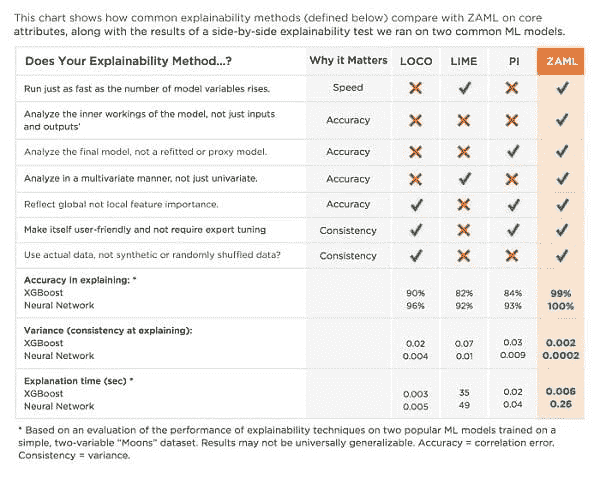
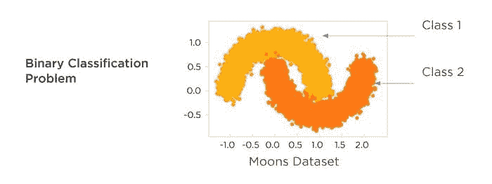
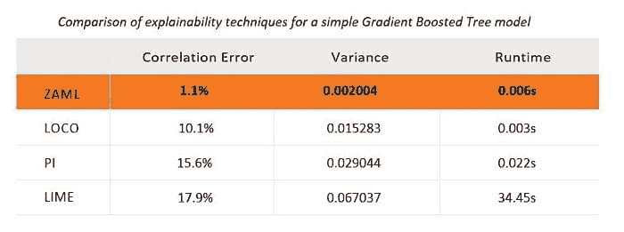
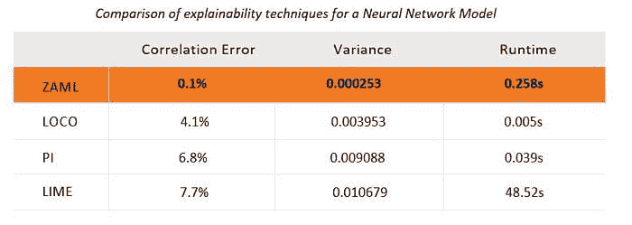

# 解释 AI 和机器学习的四种方法

> 原文：[`www.kdnuggets.com/2018/12/four-approaches-ai-machine-learning.html`](https://www.kdnuggets.com/2018/12/four-approaches-ai-machine-learning.html)

 评论

**作者：[Jay Budzik](https://www.linkedin.com/in/jaybudzik)，首席技术官，ZestFinance**

高级机器学习（ML）是人工智能（AI）的一个子集，使用更多的数据和复杂的数学方法来做出更好的预测和决策。它驱动了自动驾驶汽车、Netflix 推荐系统以及大量的银行欺诈检测。银行和贷款机构可以利用 ML 与传统的信用评分技术结合，找到更好的借款人，并拒绝更多不良借款人，从而赚取更多的钱。但由于技术的“黑箱”特性，ML 的采用受到了阻碍。ML 模型极其复杂。如果无法解释其决策，你无法安全或准确地运行信用模型。

我们真正希望从 AI 可解释性中得到三样东西：一致性、准确性和性能。市场上有一些技术被宣传为解决这种“黑箱”问题。谨防上当。这些技术往往不一致、不准确、计算成本高，和/或未能发现不可接受的结果，例如基于种族和性别的歧视。其中一些技术已经使用了很长时间，对于旧的建模方法，如逻辑回归，非常有效。但它们在 ML 上效果不佳。

在 ZestFinance，我们在 ZAML 软件工具中构建了新的可解释性数学方法，这些方法可以快速地将 ML 模型的内部工作从创建到部署变得透明。你可以使用这些工具实时监控模型健康状况。你可以相信结果是公平和准确的。我们还自动化了报告生成，所以你只需按一下按钮即可生成所有符合规定所需的文档。

在这篇论文中，我们比较了几种流行的可解释性技术（包括我们的 ZAML 技术），描述了它们的相对优缺点，并展示了每种技术在一个简单建模问题上的表现。我们进行的测试显示，ZAML 比这些其他方法更准确、一致和快速。

### 四种可解释性技术的解释

目前推广的三种常见机器学习可解释性技术分别是 LOCO、置换影响和 LIME。LOCO，代表“留一列”的意思，通过将一个变量“遗漏”并重新计算模型的预测值。其思路是，如果分数变化很大，那么被遗漏的变量一定非常重要。置换影响（PI），也称为置换重要性，用一个随机选择的值替代一个变量，并重新计算模型的预测值。与 LOCO 类似，其思路是，如果分数变化很大，那么被扰乱的变量一定非常重要。LIME，代表局部可解释的模型无关解释，拟合一个新的线性模型在给定申请人的真实数据值和真实模型对这些合成值的得分周围的局部邻域内。然后使用这个新的线性近似模型来解释更复杂的模型的行为。本质上，你是将一个非常复杂的模型假装成简单的，以便进行解释。

ZestFinance 的 ZAML 软件使用了一种来自博弈论和多元微积分的专有解释方法，适用于实际的基础模型。ZAML 可解释性通过查看每个变量与其他变量的交互，来确定每个变量对最终得分的相对重要性。下方的清单比较了这四种可解释性技术在七个重要能力上的表现。我们还为每种技术添加了在解释两个常见机器学习模型时的准确性、一致性和速度的测试评分。准确性通过平均排名相关性来衡量，或者说解释与实际基准的偏差有多大。一致性通过方差来衡量，即解释的差异在所有申请人中的变化程度。速度是生成数据集中所有行解释所需的时间。

### 让我们解读一下这个清单

对于高风险业务应用（如信用风险建模），机器学习模型的解释必须满足多种要求，以便其具有可信性，其中最重要的是准确性、一致性和性能，即预测速度。上面的图表总结了你可能听说的四种技术在一个极其简单的模型上的表现。对于现实世界中的可解释性问题，例如信用风险建模中普遍存在的问题，性能差异可能更为明显。我们使用了一个简单的模型来展示这些差异，旨在说明即使是只有两个变量的模型，也无法像 ZAML 可解释性那样准确地用 LOCO、PI 或 LIME 解释。如果一种可解释性技术在解释最简单的“玩具”模型时都很困难，那么在涉及大量资金的现实世界应用中信任它可能是不明智的。

LOCO、LIME 和 PI 在准确性、一致性或速度方面都有缺陷。LOCO 和 PI 通过一次分析一个特征来工作。这意味着随着模型变量数量的增加，算法运行变得更慢、更昂贵。LOCO、LIME 和 PI 只关注模型的输入和输出，这意味着它们获取的信息比像 ZAML 这样查看模型内部结构的解释器少得多。外部探测模型（即输入和输出）是一个不完美的过程，容易导致潜在的错误和不准确性。分析重新拟合和/或代理模型，如 LOCO 和 LIME 所要求的，而不是分析你的最终模型，也存在问题。我们认为分析真实模型非常重要——如果不这样做，你将面临很多风险。

在尝试解释高级机器学习模型时，重要的是你的解释能全面捕捉特征的影响，或与其他特征的关系。单变量分析，如 LOCO 和 PI 通常采用的，将无法正确捕捉这些特征交互和相关效应。准确性再次受到影响。解释器还应从全局而不仅仅是局部角度计算特征解释。假设你建立了一个模型来理解为什么科比·布莱恩特是一位伟大的篮球运动员。仅仅使用局部特征重要性进行解释将表明他的身高并不是问题，因为从模型的角度看，所有与科比接近的 NBA 球员也都很高。但你不能否认科比的 6 英尺 6 英寸的身高与他为何打得这么好有关系。再一次，不准确性出现了。

大多数建模技术也有称为超参数的调节旋钮，可以自动调整以使模型更准确。对于解释器来说，没有实际等同于这种“自动调优”操作的东西。这使得对从解释器如 LIME 获得的结果充满信心变得非常困难，因为无法确定你是否正确设置了像数据区域大小这样的超参数。设置得过小，数据会在模型的高维空间中变得非常稀疏。设置得过宽，你将违反 LIME 的局部线性假设。

一致的解释器使用真实数据。LIME 和 PI 使用非真实数据来探测模型。假设你建立了一个包含收入、债务和债务收入比率的模型。PI 会独立地逐列打乱。这意味着当 PI 通过打乱分析债务收入比率时，它将不再是债务特征除以收入特征。由于训练数据中的所有数据保持了这种关系，因此以这种方式查询模型应该被视为未定义的行为。

即使解释中的轻微不准确也可能导致灾难性的结果，例如发布基于年龄、性别、种族或民族的歧视模型，或发布不稳定且产生高违约率的模型，这可能导致借贷业务的资金流失。一个模型可解释性技术应该在给定相同的输入和模型时提供相同的答案。不准确或不一致的模型可解释性技术可能看似提供了风险管理的一些保证，但如果结果不准确，它们对业务利益相关者和监管机构几乎没有价值或保证。

速度和效率也很重要。在模型构建过程中以及模型应用时，模型可解释性应被频繁使用，以便为每个基于模型的决策生成解释。缓慢和低效的技术限制了可解释性的实用性：如果你需要等待一整夜才能获得结果，你会减少分析的频率，从而获得关于模型运行的见解也会减少。这意味着你在改进模型上投入的时间会减少。

### 对可解释性技术进行测试

我们将对这四种可解释性技术的比较更进一步，并进行了一个实验，评估这些方法在简单建模问题上相对于真实值的表现。在这个测试中，我们使用了一个基于竞争博弈理论计算出的参考值作为真实值。参考值衡量了给定模型输入变量引入的平均边际效益。它通过穷举所有可能的变量组合来实现这一点。计算参考值需要创建指数数量的模型变体，每个变体包含不同的变量组合。通过了解模型的比较表现，我们可以量化模型中每个变量的价值。

在我们的实验中，我们评估了四种技术在解释两个机器学习模型和“月亮”数据集方面的表现。这是一个简单的、包含 100,000 行的双变量数据集，通常用于本科机器学习课程中，以演示线性模型的局限性。

“月亮”分类任务是建立一个模型，使用仅 X 和 Y 坐标将浅橙色数据点与深橙色数据点分开。线性模型无法很好地完成这一任务。要查看这一点，只需在上图中画一条直线，注意到直线两侧都有黄色和绿色数据点。没有一条直线可以分开橙色区域。月亮数据集提供了一个简单的例子，展示了机器学习方法对变量交互的敏感性，并且比只能创建线性模型的旧方法如逻辑回归更好地捕捉数据的真实形状。

我们构建了两个机器学习分类模型，分别使用了 XGBoost，一个流行的树集合诱导算法，以及 Tensorflow，一个流行的神经网络包。在撰写本文时，这两种方法都被认为是最顶尖的机器学习建模技术。随后，我们将各种可解释性方法应用于生成的树和神经网络模型。结果如下所示。

对于梯度提升树，LIME、PI 和 LOCO 在面对非常简单的建模问题时产生的错误率较高且方差更大，甚至与 ZAML 相比。还要注意的是，LIME 的计算速度要慢得多。虽然 PI 和 LOCO 在这种两变量模型测试中看起来更合理，但随着行列数的增加，这些方法的速度很快变得非常慢。对于像我们在信用风险建模工作中每天遇到的大型数据集，它们变得不切实际。我们曾经等待了几个小时甚至几天才获得 LOCO、PI 和 LIME 的解释。根据我们的经验，ZAML 方法在单台笔记本电脑或普通计算机上计算时间不超过几秒，即使是对具有数千个变量的模型也是如此。

对于神经网络，LIME、PI 和 LOCO 也产生了更高的错误率和方差。与在梯度提升树上的表现一致，LIME 的速度非常慢。对感兴趣的人来说，比较每种方法与参考值的散点图已包含在下面的附录中。

### 结论

并非所有可解释性技术都是一样的。即使在像二维“月亮”数据集这样简单的建模问题上，只有 100,000 行数据，我们也展示了 ZAML 的可解释性比其他方法更准确、更一致，且通常更快。在处理如信用风险建模等高风险业务问题时，确保核心可解释性方法正确至关重要，以便你了解模型的工作情况并能够管理其应用所带来的风险。如果你使用的核心可解释性数学产生了错误的答案，可能会让你的业务陷入严重麻烦。

**简介**：[Jay Budzik](https://www.linkedin.com/in/jaybudzik) 是一位产品和技术领导者，有通过应用 AI 和 ML 创建新产品和服务的优秀收入增长记录。

[原文](https://www.zestfinance.com/blog/explainability-snake-oil)。转载已获许可。

**资源：**

+   [在线和基于网络的：分析、数据挖掘、数据科学、机器学习教育](https://www.kdnuggets.com/education/online.html)

+   [分析、数据科学、数据挖掘和机器学习的软件](https://www.kdnuggets.com/software/index.html)

**相关：**

+   [学习机器学习与学习数据科学](https://www.kdnuggets.com/2018/12/learning-machine-learning-data-science.html)

+   [机器学习数学](https://www.kdnuggets.com/2018/12/rhan-math-machine-learning-ebook.html)

+   [可解释性对信任 AI 和机器学习至关重要](https://www.kdnuggets.com/2018/11/interpretability-trust-ai-machine-learning.html)

* * *

## 我们的三大课程推荐

 1\. [谷歌网络安全证书](https://www.kdnuggets.com/google-cybersecurity) - 快速进入网络安全职业的快车道。

 2\. [谷歌数据分析专业证书](https://www.kdnuggets.com/google-data-analytics) - 提升你的数据分析能力。

 3\. [谷歌 IT 支持专业证书](https://www.kdnuggets.com/google-itsupport) - 支持你的组织的 IT 需求。

* * *

### 更多相关话题

+   [数据分析：四种数据分析方法及其有效应用](https://www.kdnuggets.com/2023/04/data-analytics-four-approaches-analyzing-data-effectively.html)

+   [掌握数据分析的力量：四种数据分析方法](https://www.kdnuggets.com/2023/03/master-power-data-analytics-four-approaches-analyzing-data.html)

+   [机器学习的数据标注：市场概况、方法和工具](https://www.kdnuggets.com/2021/12/data-labeling-ml-overview-and-tools.html)

+   [机器学习的甜点：NLP 和文档分析中的纯方法](https://www.kdnuggets.com/2022/05/machine-learning-sweet-spot-pure-approaches-nlp-document-analysis.html)

+   [扩散与去噪：解释文本到图像的生成 AI](https://www.kdnuggets.com/diffusion-and-denoising-explaining-text-to-image-generative-ai)

+   [使用 Python 的自动化机器学习：不同方法的比较…](https://www.kdnuggets.com/2023/03/automated-machine-learning-python-comparison-different-approaches.html)
