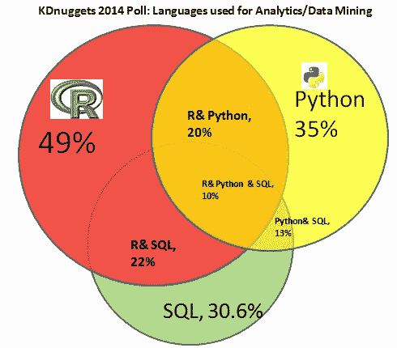
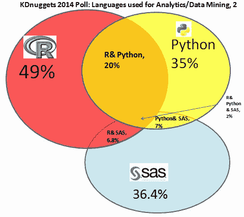

# 分析、数据挖掘、数据科学的四种主要语言

> 原文：[`www.kdnuggets.com/2014/08/four-main-languages-analytics-data-mining-data-science.html`](https://www.kdnuggets.com/2014/08/four-main-languages-analytics-data-mining-data-science.html)

 评论**作者：Gregory Piatetsky，[@kdnuggets](https://twitter.com/kdnuggets)，2014 年 8 月 18 日。**

有时高层次的数据科学平台对于特定的分析任务来说是不够的，数据科学家需要转向更低层次的统计/编程语言。

最后的 KDnuggets 投票调查询问了

**你在 2014 年分析/数据挖掘/数据科学工作中使用了哪些编程/统计语言？**

结果显示，主要的 4 种语言 - R、Python、SAS 和 SQL - 占据了主导地位 - 91% 的受访者使用了其中之一。

与类似的 KDnuggets 投票调查比较

在 2013 年：你在分析/数据挖掘中使用了哪些编程/统计语言，在 2012 年，我们注意到了一些变化和趋势。

**1. 2014 年 SAS 用户参与度大幅增加**，这可能部分受到 KDnuggets 读者组成变化的驱动，也可能由于此调查在 SAS 用户中的知名度提高。SAS 用户中有很高比例的“孤立”投票 - 在 2014 年，58% 的人表示他们仅使用 SAS，而 2013 年这一比例为 26%。2014 年 R 的“孤立”投票比例为 20.5%，Python 为 14%，SQL 仅为 4.5%。

**2. 四大主流语言的整合** - R、SAS、Python 和 SQL。91% 的所有投票者至少使用过其中一种。几乎所有其他语言在数据挖掘任务中的受欢迎程度有所下降，包括 Java、Unix shell、MATLAB、C/C++、Perl、Octave、Ruby、Lisp 和 F#。

这里是一个维恩图，显示了 R、Python 和 SQL 之间的显著重叠。百分比表示选择该选项的投票者比例，例如，20% 的所有投票者使用了 R 和 Python，而 10% 的人使用了 R、Python 和 SQL。圆圈和交集的面积大致对应投票者的比例。

这里是一个类似的维恩图，展示了 R、Python 和 SAS 之间的重叠。我们看到 SAS 与 R 和 Python 的独立性更强，大约 2/3 的 SAS 用户没有使用 R 或 Python。

**3. 2014 年增长最快的语言是**

+   Julia，增长 316%，从 2013 年的 0.7% 增至 2014 年的 2.9%

+   SAS，增长 76%，从 2013 年的 20.8% 增至 2014 年的 36.4%

+   Scala，增长 74%，从 2013 年的 2.2% 增至 2014 年的 3.9%

**4\. 使用比例下降幅度最大的语言** 为：

+   F#，下降 100%，从 2013 年的 1.7%降至 2014 年的零

+   C++/C，下降 60%，从 2013 年的 9.3%降至 2014 年的 3.6%

+   GNU Octave，下降 57%，从 2013 年的 5.6%降至 2014 年的 2.4%

+   MATLAB，下降 50%，从 2013 年的 12.5%降至 2014 年的 6.3%

+   Ruby，下降 44%，从 2013 年的 2.2%降至 2014 年的 1.3%

+   Perl，下降 41%，从 2013 年的 4.5%降至 2014 年的 2.6%

这里是更多详细信息的表格：

| **2014 年你在分析/数据挖掘/数据科学工作中使用了哪些编程/统计语言？** |
| --- |

| **使用语言** |  2014 年选民比例（总计 719 人）  2013 年选民比例（总计 713 人）

 2012 年选民比例（总计 579 人） |

| R（2014 年 352 名选民） |    |
| --- | --- |
| SAS（262） |    |
| Python（252） |    |
| SQL（220） |    |
| Java（89） |    |
| Unix shell/awk/sed（63） |    |
| Pig Latin/ Hive/其他基于 Hadoop 的语言（61） |    |
| SPSS（58） |  未询问 未询问 |
| MATLAB（45） |    |
| Scala（28） |    |
| C/C++（26） |    |
| Julia（21） |    |
| 其他低级语言 (20) |    |
| Perl (19) |    |
| GNU Octave (17) |    |
| Ruby (9) |    |
| Lisp/Clojure (5) |    |
| F# (0) | 0%  2012 年未被提及 |

除了其他编程语言，威廉·德温内尔提到了编译的 BASIC（PowerBASIC）。

地区参与情况为

+   美国/加拿大: 51.6%

+   欧洲: 26.7%

+   亚洲: 13.3%

+   拉丁美洲: 3.7%

+   非洲/中东: 3.5%

+   澳大利亚/新西兰: 2.0%

这与 2013 年类似，但亚洲和非洲/中东（以以色列和土耳其为主）的参与更多，而拉丁美洲的参与则减少（主要是巴西的减少，也许仍因世界杯失利而受到打击）。

### 更多相关话题

+   [掌握数据分析的力量：分析数据的四种方法](https://www.kdnuggets.com/2023/03/master-power-data-analytics-four-approaches-analyzing-data.html)

+   [数据分析：分析数据的四种方法及其应用](https://www.kdnuggets.com/2023/04/data-analytics-four-approaches-analyzing-data-effectively.html)

+   [AI、分析、机器学习、数据科学、深度学习…](https://www.kdnuggets.com/2021/12/developments-predictions-ai-machine-learning-data-science-research.html)

+   [数据科学与分析行业在 2021 年的主要发展及关键…](https://www.kdnuggets.com/2021/12/developments-predictions-data-science-analytics-industry.html)

+   [四周学会 Python：一个学习路线图](https://www.kdnuggets.com/2023/02/learning-python-four-weeks-roadmap.html)

+   [2021 年主要发展和 2022 年关键趋势在 AI、数据科学…](https://www.kdnuggets.com/2021/12/trends-ai-data-science-ml-technology.html)
