# 数据科学家的傅里叶变换

> 原文：[`www.kdnuggets.com/2020/02/fourier-transformation-data-scientist.html`](https://www.kdnuggets.com/2020/02/fourier-transformation-data-scientist.html)

评论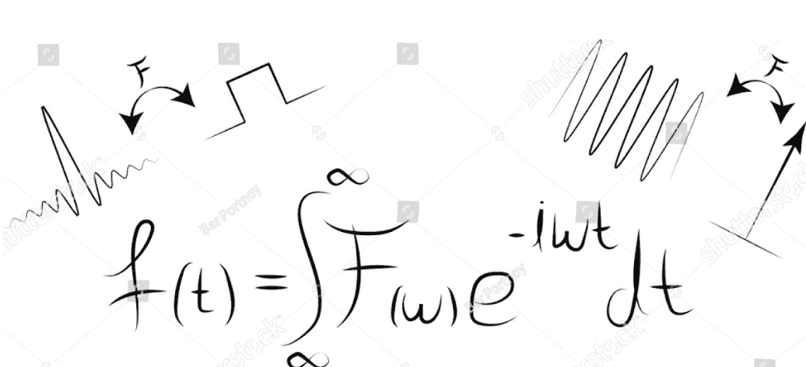

图片来源：[Shutterstock](https://www.shutterstock.com/image-vector/fourier-transform-formula-common-signal-transformations-1143548066)

* * *

## 我们的前三大课程推荐

 1\. [Google 网络安全证书](https://www.kdnuggets.com/google-cybersecurity) - 快速进入网络安全职业道路

 2\. [Google 数据分析专业证书](https://www.kdnuggets.com/google-data-analytics) - 提升你的数据分析技能

 3\. [Google IT 支持专业证书](https://www.kdnuggets.com/google-itsupport) - 支持你的组织 IT

* * *

### 介绍

傅里叶变换是数学中最深刻的见解之一，但不幸的是，其意义深藏在一些荒谬的方程式中。

傅里叶变换是一种将某物拆分为一堆正弦波的方法。像往常一样，名字来自很久以前的一个人，傅里叶。

> 在数学术语中，傅里叶变换是一种将信号转化为其组成成分和频率的技术。

傅里叶变换不仅广泛应用于信号（如无线电、声学等）处理，还用于图像分析，如边缘检测、图像过滤、图像重建和图像压缩。例如：傅里叶变换在透射电子显微镜图像中有助于检查样本的周期性。周期性——意味着模式。傅里叶变换可以扩展有关分析样本的信息。

为了更好地理解，考虑一个信号 x(t)：

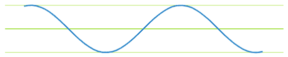

如果我们对另一个信号做同样的处理，并选择相同的时间点进行幅度测量。

另一个信号 y(t)：

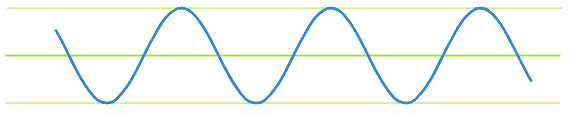

***当我们同时发出这两个信号或将它们加在一起时会发生什么？***

当我们在同一时间发出这两个信号时，我们得到一个新信号，即*这两个信号的幅度之和*。这是因为这两个信号被加在一起。

将两个信号相加：z(t) = x(t) + y(t)

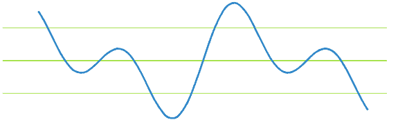

***如果我们只得到一个信号（即信号 x(t)和 y(t)的和），我们能恢复原始信号 x(t)和 y(t)吗？***

是的，这就是傅里叶变换的作用。它接受一个信号并将其分解为组成它的频率。

*在我们的例子中，傅里叶变换会将信号 z(t)分解成其组成频率，就像信号 x(t)和 y(t)一样。*

傅里叶变换的作用是*将我们从时间域移动到频率域。*

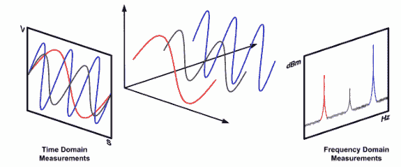

[来源](https://www.eenewsanalog.com/content/signal-chain-basics-56-clock-jitter-demystified%E2%80%94random-jitter-and-phase-noise)

**如果有人想知道，我们如何从频率域返回到时间域？**

我们可以通过使用*逆傅里叶变换（IFT）*来实现这一点。

### 你需要了解的数学知识。

> *“任何**连续信号**在时间域中可以通过**无限**正弦波序列唯一且明确地表示。”*

**这是什么意思？**

这意味着，如果我们有一个由某个函数`x(t)`生成的信号，那么我们可以得到另一个函数`f(t)`，使得：

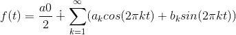

因此，无论信号的强度如何，我们都可以找到一个函数`f(t)`，它是*无限正弦波序列的和*，能够完美地表示信号。

现在，提出的问题是，我们如何在上述方程中找到系数，因为这些值将决定输出的形状，从而决定信号。

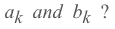

因此，为了获得这些系数，我们使用傅里叶变换，而傅里叶变换的结果是一组系数。因此，我们用`X(w)`表示傅里叶系数，它是频率的函数，通过解积分得到：

傅里叶变换表示为不定积分：

**X(w)：傅里叶变换**

x(t)：逆傅里叶变换

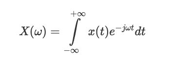

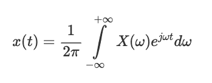

**傅里叶变换和逆傅里叶变换**

此外，当我们实际计算上述积分时，会得到这些复数，其中`a`和`b`对应于我们追求的系数。

连续傅里叶变换将无限持续时间的时间域信号转换为由无限多个正弦波组成的连续谱。在实际应用中，我们处理的是离散采样的信号，通常在固定间隔内采样，并且具有有限持续时间或周期性。为此，经典傅里叶变换算法可以表示为离散傅里叶变换（DFT），它将函数的有限序列等间隔采样转换为离散时间傅里叶变换的等长度序列：

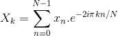

所以，这本质上就是离散傅里叶变换。我们可以进行这种计算，它会产生一个形式为`a + *i*b`的复数，其中包含傅里叶级数的两个系数。

现在，我们知道*如何采样信号*和如何*应用离散傅里叶变换*。最后，我们想做的是，想要摆脱复数 `*i*`，因为它在 `mllib` 或 `systemML` 中不被支持，可以通过一种称为*欧拉公式*的方法来实现，该公式如下：

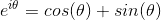

因此，如果我们将欧拉公式代入傅里叶变换方程并进行求解，它将产生实部和虚部。

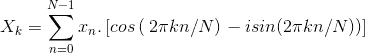

如你所见，X 由格式为 `a+ib` 或 `a-ib` 的复数组成。因此，如果你解上述方程，你将得到傅里叶系数 **a** 和 **b**。

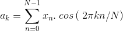

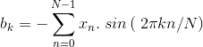

现在，如果你在`f(t)`方程中代入**a**和**b**的值，你可以根据其频率定义一个信号。

在实际操作中，我们使用快速傅里叶变换（FFT）算法，它递归地将离散傅里叶变换（DFT）分解为更小的 DFT，从而显著降低所需的计算时间。DFT 的时间复杂度是`2N²`，而 FFT 的时间复杂度是`2NlogN`。

### 为什么在表示信号时使用余弦和正弦函数？

尽管正弦和余弦函数最初是基于直角三角形定义的，但在当前情况下，考虑那个观点并不是最佳选择。你可能已经被教导识别正弦函数为“对边除以斜边”，但现在是时候换一个稍微不同的视角了。

考虑单位圆：

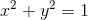

在笛卡尔平面上。假设一条通过原点的直线在逆时针方向上与 ????-轴成角θ，直线与圆的交点为 (cos⁡θ, sin⁡θ)。

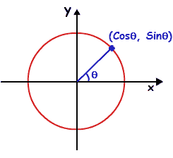

想一想。这个观点与之前的观点相关吗？两种定义是相同的。

假设我们开始旋转这条直线，使θ线性增加。你会得到如下结果：

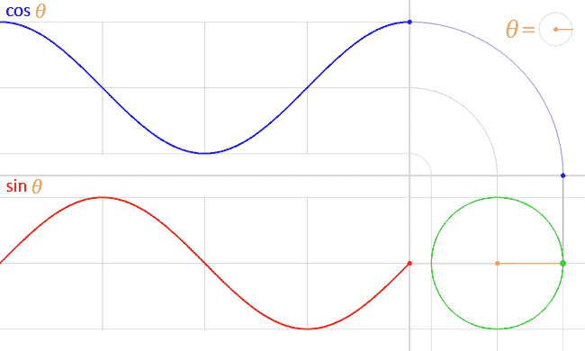

[致谢](https://physics.stackexchange.com/questions/352754/why-are-cosine-and-sine-functions-used-when-representing-a-signal-or-a-sound-wave)

正弦函数和余弦函数在多种情况下可以说是最重要的周期函数：

1.  SHM 振荡器中位移、速度和加速度随时间变化的周期函数是正弦函数。

1.  每个粒子都有波动性，反之亦然。这是德布罗意的波粒二象性。波动总是某些物理量的正弦函数（如电磁波的电场和声波的压力）。

声音本身是通过能够压缩和扩展的材料介质传播的压力扰动。声音波沿点的压力随时间呈正弦变化。

### **傅里叶变换的收敛性**

如果一个点以恒定速度绕圆圈移动，它离地面的高度描绘了一个正弦函数。点移动的速度对应于频率，圆圈的半径对应于振幅。

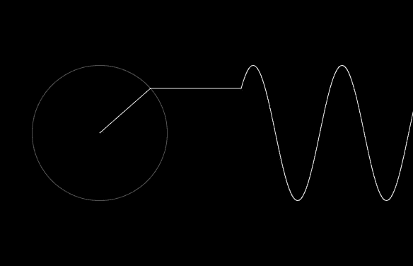

添加 1 个圆圈，

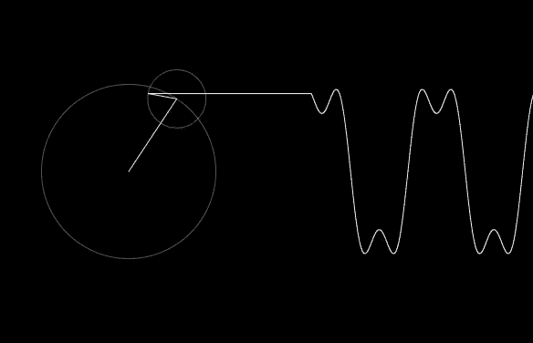

添加 2 个圆圈，

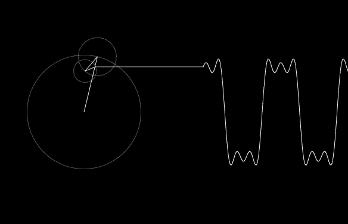

添加 9 个圆圈：

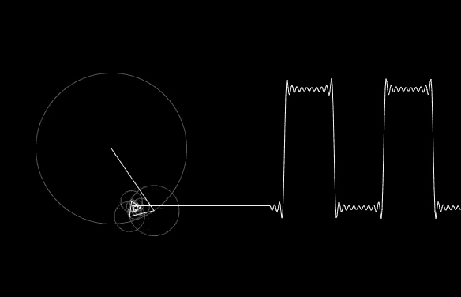

几乎是一个离散波形。

由于傅里叶定理，我们可以用适当频率和半径的圆生成任何信号。

*我使用了 Dan Shiffman 的代码从*[*coding challenge #125*](https://thecodingtrain.com/CodingChallenges/125-fourier-series.html)*制作动画。你可以从他的*[*GitHub*](https://github.com/CodingTrain/website/tree/master/CodingChallenges/CC_125_Fourier_Series/P5)*获取 JavaScript 代码并自行尝试。*

### 人工智能中的傅里叶变换

傅里叶变换是一个线性函数，为了引入非线性，使用了卷积。

> **两个信号的乘积的傅里叶变换是这两个信号的卷积。**

设 x(t) 和 y(t) 为两个具有卷积 X(t)*Y(t) 的函数，F 代表傅里叶变换，那么

**F{x(t).y(t)} = X(t)*Y(t)**

记住，在时间域中的卷积在频域中是乘法。这就是傅里叶变换在机器学习，尤其是深度学习算法中最常用的方式。

我将以**卷积神经网络，CNNs** 为例；

**CNNs 中** 90% 的计算是卷积，并且已经有许多方法来减少这些计算的强度，其中之一就是快速傅里叶变换（FFT）。

替代卷积，输入和滤波矩阵通过 FFT 转换到频域中进行乘法运算。然后，输出通过*反向*FFT (IFFT) 转换回时间域。

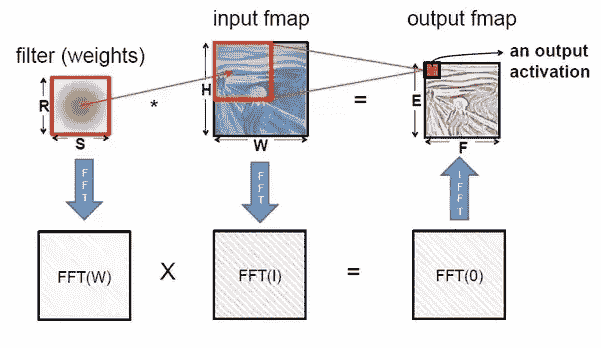

FFT 的另一个用途是可以用于降维或特征提取。

当数据集中每个样本是一个信号（时间序列或图像等）时，它可能包含成千上万的样本。但它们实际上可能只对应傅里叶域中的几个点（尤其是如果有某种周期性）。这大大简化了问题。

或者，有时使用傅里叶域可能提供平移不变性。也就是说，即使信号之间有滞后，这些变异也不会影响它们在傅里叶域中的表现。

### 傅里叶变换的 Python 实现

最简单的 FFT 实现可以使用 numpy 和 scipy python 库完成。

```py
%matplotlib inline
import numpy as np
import matplotlib.pyplot as plt
import scipy.fftpack

# Number of samplepoints
N = 600
# sample spacing
T = 1.0 / 800.0
x = np.linspace(0.0, N*T, N)
y = np.sin(50.0 * 2.0*np.pi*x) + 0.5*np.sin(80.0 * 2.0*np.pi*x)
yf = scipy.fftpack.fft(y)
xf = np.linspace(0.0, 1.0/(2.0*T), N/2)

fig, ax = plt.subplots()
ax.plot(xf, 2.0/N * np.abs(yf[:N//2]))
plt.show()
```


FFT 绘图

### 结论

FFT 用于数字录音、采样、[加法合成](https://en.wikipedia.org/wiki/Additive_synthesis) 和音高校正软件。

FFT 的重要性源于其使在频域工作的计算复杂度与在时间域或空间域工作的计算复杂度相当。一些 FFT 的重要应用包括：

+   快速的大整数和多项式乘法

+   高效的 Toeplitz 矩阵、循环矩阵及其他结构化矩阵的矩阵-向量乘法

+   过滤算法

+   快速的[离散余弦变换](https://en.wikipedia.org/wiki/Discrete_cosine_transform)或[正弦变换](https://en.wikipedia.org/wiki/Discrete_sine_transform)（例如，用于[JPEG](https://en.wikipedia.org/wiki/JPEG)和[MPEG](https://en.wikipedia.org/wiki/MPEG)/[MP3](https://en.wikipedia.org/wiki/MP3)编码和解码的快速离散余弦变换）。

+   快速的[切比雪夫逼近](https://en.wikipedia.org/wiki/Chebyshev_approximation)

+   解差分方程。

+   [同位素分布的计算](https://en.wikipedia.org/wiki/Mass_spectrometry)

好了，本文就到这里，希望你们喜欢阅读，如果文章对你们有帮助我会很高兴。欢迎在评论区分享你的评论/想法/反馈。

感谢阅读！！！

**个人简介：[纳戈什·辛格·乔汉](https://www.linkedin.com/in/nagesh-singh-chauhan-6936bb13b/)** 是一名数据科学爱好者，对大数据、Python 和机器学习感兴趣。

[原文](https://towardsdatascience.com/fourier-transformation-for-a-data-scientist-1f3731115097)。经许可转载。

**相关：**

+   数据科学难题 — 2020 版

+   贝叶斯背后的数学

+   2020 年数据科学的 5 大趋势

### 更多相关内容

+   [成为优秀数据科学家所需的 5 项关键技能](https://www.kdnuggets.com/2021/12/5-key-skills-needed-become-great-data-scientist.html)

+   [每个初学者数据科学家应掌握的 6 种预测模型](https://www.kdnuggets.com/2021/12/6-predictive-models-every-beginner-data-scientist-master.html)

+   [2021 年最佳 ETL 工具](https://www.kdnuggets.com/2021/12/mozart-best-etl-tools-2021.html)

+   [成功数据科学家的 5 个特征](https://www.kdnuggets.com/2021/12/5-characteristics-successful-data-scientist.html)

+   [每个数据科学家都应该知道的三个 R 库（即使你使用 Python）](https://www.kdnuggets.com/2021/12/three-r-libraries-every-data-scientist-know-even-python.html)

+   [停止学习数据科学以寻找目标，并通过寻找目标来……](https://www.kdnuggets.com/2021/12/stop-learning-data-science-find-purpose.html)
