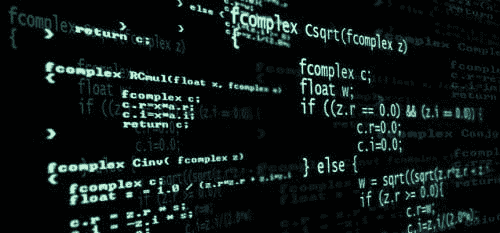
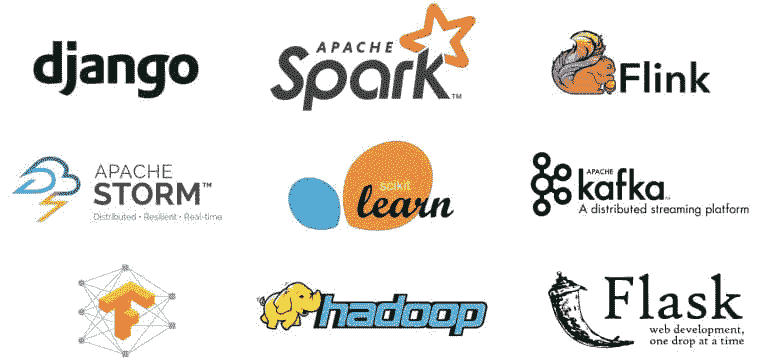

# 框架为数据科学家提供了编程语言所缺乏的什么？

> 原文：[`www.kdnuggets.com/2017/05/frameworks-offer-data-scientists-programming-languages-lack.html`](https://www.kdnuggets.com/2017/05/frameworks-offer-data-scientists-programming-languages-lack.html)

曾几何时，计算机编程全在于使用正确的语言。在 C、Lisp 和 Pascal 等系统之间，程序员可以选择其专长和格式。然而，随着计算能力的提升，使得系统能够理解并轻松切换所有语言，编程语言之间的差异已经大致消失。今天的重点是框架，它们通常更现代和前瞻，能够克服许多编程语言的过时做法。

今天你使用的编程语言不再像以前那样重要。

* * *

## 我们的前三个课程推荐

 1\. [谷歌网络安全证书](https://www.kdnuggets.com/google-cybersecurity) - 快速进入网络安全职业

 2\. [谷歌数据分析专业证书](https://www.kdnuggets.com/google-data-analytics) - 提升你的数据分析技能

 3\. [谷歌 IT 支持专业证书](https://www.kdnuggets.com/google-itsupport) - 支持你的组织的 IT 需求

* * *

框架是一组统一的库代码，它们简化了任何给定语言的编程，而语言则是编写代码的实际语法和语法结构。框架具有许多优势。尽管编程语言永远不会完全过时，但越来越多的程序员更倾向于使用框架，并认为它们是更现代和前沿的选择。这种转向框架的趋势是[IT 转型](http://www.emc.com/en-us/data-center-transformation/index.htm)的一部分，预计在未来几年将会加速发展。

### 框架深入探讨

编程曾经是关于如何从代码中获取最大收益的，但这种做法已经被自动化代码编写系统大大取代了。如今，程序员不再专注于如何编写一个 API，而是更关心这个 API 能做什么。这就像是拼写一个单词的正确与否和真正理解这个单词的意思以及如何在句子中使用它之间的区别。由于大多数编码是[将一组 API 连接在一起](http://www.infoworld.com/article/2902242/application-development/7-reasons-why-frameworks-are-the-new-programming-languages.html)，程序员可以更多地关注系统的框架，而不是担心在代码中间插入什么标点符号。关注 API 的功能使程序员能够突破极限，找到各种编码问题的原因和效果；这让他们更自由地理解发生了什么，以及如何操作以创建最有效的代码。

### 框架关注宏观

多亏了自动化系统和教程，对各种编程语言的深入了解已经不再像以前那样重要了。各种程序可以自动纠正错误，这些程序会不断地查找编码错误。与其花时间处理代码的细节，框架让程序员能够从更宏观的角度思考。通过更好地理解系统和 API 的能力，以及由自动化系统处理更繁琐的细节，程序员可以将更多精力投入到将程序发展成具有更多高级功能和潜力的更大项目中。

### 框架构建强大的算法

使用编程语言最重要的部分之一是理解算法，并确保代码符合这些算法。然而，算法可能会受到语言的限制，因为它们实际上是由框架定义的。将算法作为框架的一部分进行更改和建立，比在语言层面进行调整要安全和有效得多。框架已经[开发多年](http://www.infoworld.com/article/2902242/application-development/7-reasons-why-frameworks-are-the-new-programming-languages.html)，意味着它们经过了多次验证，是来自最佳编程思想的结合体。

### 框架是未来

无论他们专注于哪个语言，许多程序员都同意框架是编程的未来。如果代码是法律，编程语言是确保法律得到实施的执行者，而框架则是实际制定法律的系统。通过专注于框架，程序员可以在未来中拥有更大的发言权，并可以真正设定代码的规则，而不仅仅是实现它们。一旦规则设定完毕，每个人都必须遵循这些规则，因此理解框架为用户提供了设定所有人必须遵循的规则的机会。在一个快速发展且前瞻性的编程世界中，能够制定一些规则为用户提供了改变游戏的权力和机会。

一些可以在数据科学中利用的框架样本。

### 数据科学家的好处

这就引出了框架如何极大地促进数据科学家的工作。上述所有观点都可能对数据科学家有利。例如，专注于框架意味着数据科学家不必始终具有丰富的编码和编程语言经验。他们可以将自己在各自行业的经验带到工作中。框架还帮助数据科学家进行数据挖掘和数据分析，同时也让他们有时间关注更大的目标。

一些框架甚至是以大数据和数据科学为出发点开发的。例如，Hadoop 是第一个被各种企业广泛采纳的大数据处理框架之一。Hadoop 也催生了一个专注于大数据处理的技术生态系统，如 Hive 和 Pig。其他框架如 Spark、Samza 和 Flink 都各有其用处，并帮助数据科学家更好地取得积极成果，从大数据集中提取见解，以及高效管理大数据项目。

尽管编程语言曾经非常重要，但专注于它们细微的区别已逐渐过时且不必要，特别是当自动化程序可用时。相反，专注于框架以及事物为何如此工作的原因将引领计算未来，帮助数据科学家达到新的成功高度。

**相关：**

+   顶级大数据处理框架

+   Python 深度学习框架概述

+   机器学习专家的 15 个顶级框架

### 更多相关主题

+   [处理机器学习中数据不足的 5 种方法](https://www.kdnuggets.com/2019/06/5-ways-lack-data-machine-learning.html)

+   [KDnuggets™ 新闻 22:n04, 1 月 26 日：高薪副业…](https://www.kdnuggets.com/2022/n04.html)

+   [KDnuggets™ 新闻 22:n06, 2 月 9 日: 数据科学编程…](https://www.kdnuggets.com/2022/n06.html)

+   [数据科学编程语言及其使用时机](https://www.kdnuggets.com/2022/02/data-science-programming-languages.html)

+   [针对特定数据角色的编程语言](https://www.kdnuggets.com/2023/06/programming-languages-specific-data-roles.html)

+   [2023 年数据科学学习的 8 种编程语言](https://www.kdnuggets.com/2023/07/8-programming-languages-data-science-learn-2023.html)
