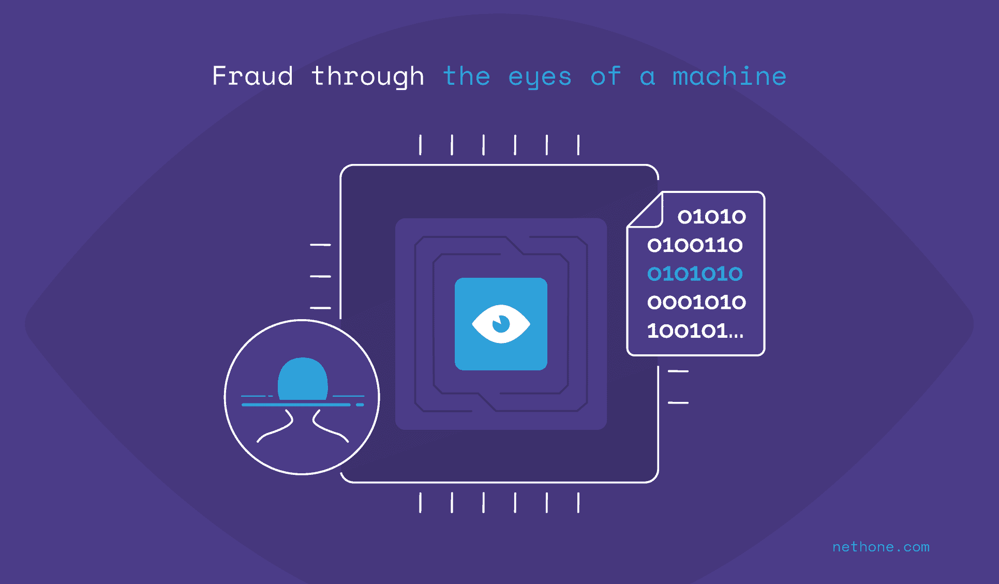
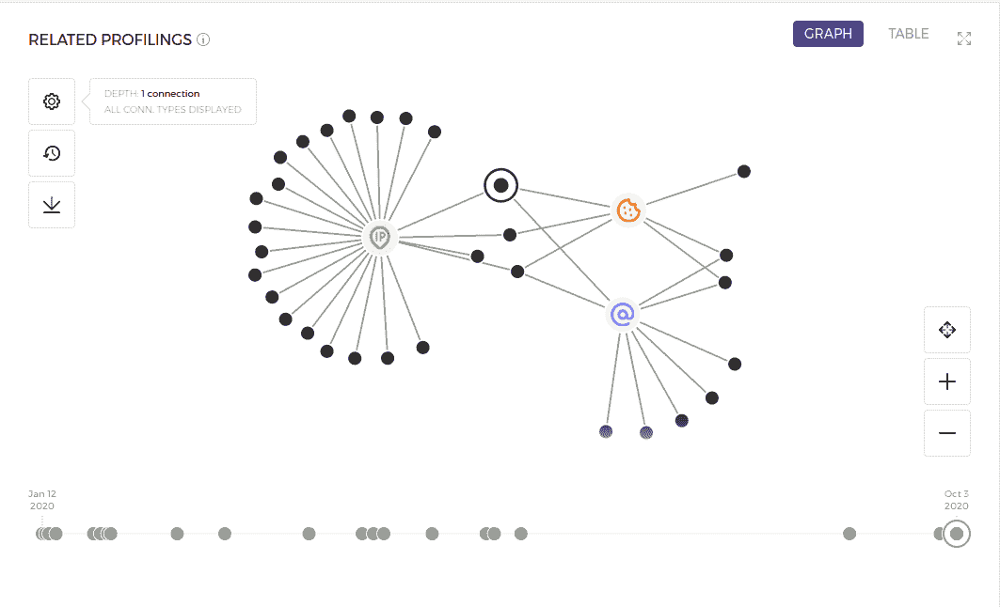
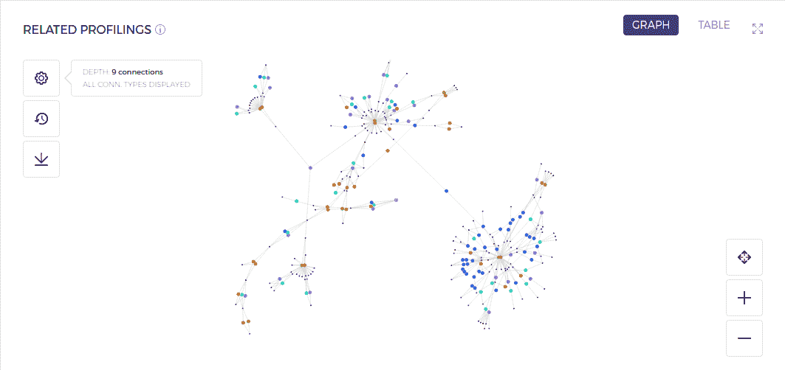
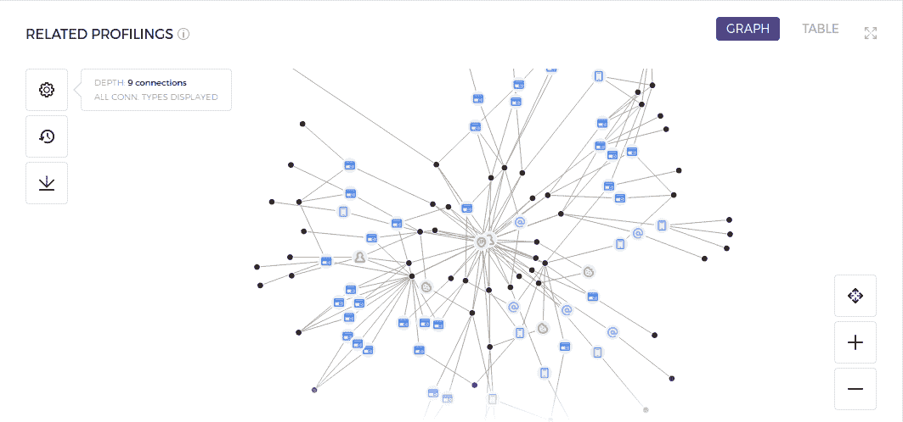

# 从机器的视角看欺诈

> 原文：[`www.kdnuggets.com/2020/11/fraud-eyes-machine.html`](https://www.kdnuggets.com/2020/11/fraud-eyes-machine.html)

评论

**作者 [Jakub Karczewski](https://www.linkedin.com/in/jakub-karczewski-97833b137/)，机器学习工程师**。

### 背景

确定某笔交易是否存在欺诈行为的方法有很多种。从基于规则的系统到机器学习模型——每种方法在特定条件下通常效果最佳。成功的反欺诈系统应当充分利用所有这些方法，并在最适合解决问题的地方加以应用。

在反欺诈系统中，网络和连接分析的概念至关重要，因为它有助于揭示通过其他方式无法获得的交易隐藏特征。在这篇博客文章中，我们将尝试揭示如何创建网络，然后利用它们来检测欺诈交易。

### 欺诈检测中的网络

让我们考虑一个交易——这是在线支付世界中的基本实体之一。每个交易可以通过一组属性来描述。在 Nethone，我们每笔交易收集超过 5000 个数据点，但为了简单起见，我们将重点关注几个常见的属性，例如：

+   支付的特征是什么（金额、卡片令牌），

+   谁发起了交易（姓名、电子邮件），

+   使用了哪种设备（IP 地址、设备操作系统、浏览器 Cookie）

记住这些示例交易属性，我们现在可以进入网络构建阶段。网络（或图）是一组通过边（“线”）连接的节点（“点”）。在在线支付的世界里，节点可以是交易或交易属性的特定值。边可以表示各种关系，但在这种情况下，我们将重点关注最常见的一种：共享属性值。让我们以这个简单的网络为例：

*图 1 - 简单网络。*

我们可以看到，处理过的交易（“带光环的点”）与其他几个交易（黑色节点）共享了 IP 地址（绿色节点）、电子邮件地址（紫色节点）和 Cookie（橙色节点）的值。创建这样一个网络的过程相当简单：

1.  提取处理过的交易的属性值（如 IP 地址、Cookie、电子邮件等）。

1.  查找其他共享某些属性值的交易。

1.  绘制这些数据并通过代表特定属性值的中介节点连接到处理过的交易。

简而言之，这一切都是关于使用某些属性作为匹配键来连接交易。这种方法虽然在原则上简单，却提供了有价值的背景信息。

一旦图形创建完成，我们可以查询其各种属性。我们可以检查最长路径是什么，或者有多少节点连接到某个特定节点，例如 IP 地址。提取网络特征后，我们可以将其输入规则基础系统或机器学习模型中——如开头所述——混合方法效果最佳。

### 欺诈攻击的可视化

*图 2 - 扩展网络 - 卡片诈骗方案。*

该网络是使用不同的种子交易构建的，并通过增加深度参数进行扩展。这意味着我们现在可以连接与处理过的交易相关的交易——借用社交互动的类比，我们可以分析“朋友的朋友的朋友……等”，即与不同相关交易相关的交易。这样，我们可以扩展范围，获取更多洞察。让我们深入观察一些集群。

*图 3 - 通过卡片令牌的可疑连接。*

初看，我们可以看到一个电子邮件和 IP 地址（红色和绿色节点）连接到许多不同的信用卡令牌（蓝色节点）。由于人们拥有大量信用卡的情况相当少见，这种类型的网络可能是卡片诈骗的一个例子。在这种攻击中，欺诈者使用盗取的信用卡凭证执行大量交易。当数据结构化为网络时，我们可以轻松区分正常流量和卡片诈骗模式（少数人，多张卡片和交易）。在查询图形并遇到风险模式后，我们可以将可疑属性值添加到黑名单中。这样，如果系统遇到这些值，交易将自动标记为有风险。

### 连接分析的好处和挑战

我们可以从连接分析中提取大量洞察，但这并非毫无代价——还存在额外的挑战。一方面，从事务性、表格数据构建的网络中研究连接可能有助于揭示在保持数据平铺时难以提取的关系。网络的结构及其随时间变化可以是一个非常丰富的信息来源，以及一个对人类友好的数据界面。

另一方面，对于什么行为属于欺诈行为没有严格的规则。如果我们看到多个交易来自同一个 IP 地址，这可能意味着欺诈攻击，但也可能是员工利用他们的公司代理网络进行购买。重要的是尽可能考虑多个因素——忽视某些因素可能会严重扭曲我们通过网络感知数据的方式。一个关键因素的好例子是**时间**——在同一天进行第 10 次交易并在每次交易后清除浏览器 cookies 的情况与一个合法用户在同一年进行第 10 次购买（其 cookies 在连续交易之间自然过期）的情况看起来完全相同。

背景是关键。

[原文](https://nethone.com/blog/fraud-through-the-eyes-of-a-machine). 经许可转载。

**相关：**

+   [认识你的邻居：图上的机器学习](https://www.kdnuggets.com/2019/08/neighbours-machine-learning-graphs.html)

+   [图是数据科学的下一前沿](https://www.kdnuggets.com/2018/10/graphs-next-frontier-data-science.html)

+   [可扩展图形机器学习：我们能攀登的高峰？](https://www.kdnuggets.com/2019/12/scalable-graph-machine-learning.html)

* * *

## 我们的三大课程推荐

 1\. [谷歌网络安全证书](https://www.kdnuggets.com/google-cybersecurity) - 快速进入网络安全职业生涯。

 2\. [谷歌数据分析专业证书](https://www.kdnuggets.com/google-data-analytics) - 提升你的数据分析技能

 3\. [谷歌 IT 支持专业证书](https://www.kdnuggets.com/google-itsupport) - 支持你的组织进行 IT 支持

* * *

### 更多相关话题

+   [数据科学如何推动欺诈预防](https://www.kdnuggets.com/2022/09/data-science-fuels-fraud-prevention.html)

+   [用 AI 对抗 AI：深度伪造应用的欺诈监测](https://www.kdnuggets.com/2023/05/fighting-ai-ai-fraud-monitoring-deepfake-applications.html)

+   [探索思维树提示：AI 如何学会推理…](https://www.kdnuggets.com/2023/07/exploring-tree-of-thought-prompting-ai-learn-reason-through-search.html)

+   [数据故事讲述——通过数据讲述故事的艺术](https://www.kdnuggets.com/2023/07/manning-data-storytelling-the-art-telling-stories-data.html)

+   [通过 Apache Gobblin 扩展数据管理](https://www.kdnuggets.com/2023/01/scaling-data-management-apache-gobblin.html)

+   [通过验证链解锁可靠生成：一个…](https://www.kdnuggets.com/unlocking-reliable-generations-through-chain-of-verification)
