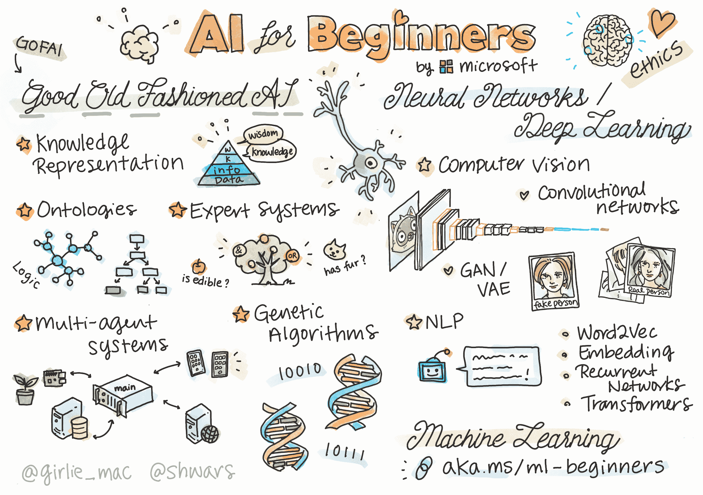

# 免费人工智能入门课程

> 原文：[`www.kdnuggets.com/2022/08/free-ai-beginners-course.html`](https://www.kdnuggets.com/2022/08/free-ai-beginners-course.html)

图片由[@girlie_mac](https://twitter.com/girlie_mac)提供

如果你在寻找免费的入门人工智能课程，微软可以满足你的需求。

* * *

## 我们的三大课程推荐

 1\. [谷歌网络安全证书](https://www.kdnuggets.com/google-cybersecurity) - 快速进入网络安全职业的快车道

 2\. [谷歌数据分析专业证书](https://www.kdnuggets.com/google-data-analytics) - 提升你的数据分析能力

 3\. [谷歌 IT 支持专业证书](https://www.kdnuggets.com/google-itsupport) - 支持你的组织 IT

* * *

名为[初学者的人工智能](https://github.com/microsoft/ai-for-beginners)的课程由 Microsoft Azure Cloud Advocates 精心编制，包括为期 12 周、24 节课的课程，旨在向学习者介绍人工智能的奇妙世界。

该课程将向学习者介绍各种人工智能概念，包括但不限于：

+   “经典”GOFAI（传统人工智能）方法，从符号方法到知识表示和推理

+   现代人工智能方法，其基础是神经网络及其深度学习技术

+   使用 TensorFlow 和 PyTorch 实施现代人工智能主题

+   图像和文本的神经网络架构

+   替代的人工智能方法，包括遗传算法和多智能体系统

你可以查看具体的课程内容，一节课一节课地列出，[点击这里](http://Microsoft Azure Cloud Advocates, and consists of a 12 week, 24 lesson curriculum)。

课程使用各种材料进行讲授。一些常见的资源包括：

+   课程的前阅读材料；这是[知识表示和知识系统](https://github.com/microsoft/AI-For-Beginners/blob/main/lessons/2-Symbolic/README.md)的一个示例

+   特定于 PyTorch 或 TensorFlow 的指导性 Jupyter 笔记本，通常每节课一个框架

+   实验室，作为学习者需要完成的作业，通常是需要完成的 Jupyter 笔记本

+   偶尔会有与相关主题相关的 Microsoft Learn 模块的链接；Microsoft Learn 提供对 GPU 支持环境的访问

你可以在[这里](http://soshnikov.com/courses/ai-for-beginners/mindmap.html)找到课程的思维导图。

如果你有兴趣了解更多，可能想要观看下面的视频以了解课程的讲师。

现如今有许多涵盖各种数据科学、机器学习、人工智能和分析主题的课程，因此你需要认真研究以确保选择符合你目标的课程。我们希望通过这些文章帮助你筛选出优质的免费课程对你有帮助，但不要忘记在报名之前调查每个课程。这门来自微软的课程现在没有变化。然而，如果你是一个想了解当前概念、技术和话题的 AI 初学者，这门课程是一个有前途的选择。

**[Matthew Mayo](https://www.linkedin.com/in/mattmayo13/)** ([**@mattmayo13**](https://twitter.com/mattmayo13)) 是一位数据科学家和 KDnuggets 的总编辑，这是一个开创性的在线数据科学和机器学习资源。他的兴趣包括自然语言处理、算法设计与优化、无监督学习、神经网络以及自动化机器学习方法。Matthew 拥有计算机科学硕士学位和数据挖掘研究生文凭。他可以通过 editor1 at kdnuggets[dot]com 联系。

### 了解更多相关话题

+   [免费的 MLOps 速成课程](https://www.kdnuggets.com/2022/08/free-mlops-crash-course.html)

+   [免费的 Microsoft Excel 入门课程](https://www.kdnuggets.com/2022/09/free-microsoft-excel-beginners-course.html)

+   [免费的数据工程入门课程](https://www.kdnuggets.com/free-data-engineering-course-for-beginners)

+   [KDnuggets 新闻，10 月 5 日：适合初学者的顶级免费 Git GUI 客户端•…](https://www.kdnuggets.com/2022/n39.html)

+   [适合初学者的顶级免费 Git GUI 客户端](https://www.kdnuggets.com/2022/10/top-free-git-gui-clients-beginners.html)

+   [3 个免费的机器学习入门课程](https://www.kdnuggets.com/2022/12/3-free-machine-learning-courses-beginners.html)
