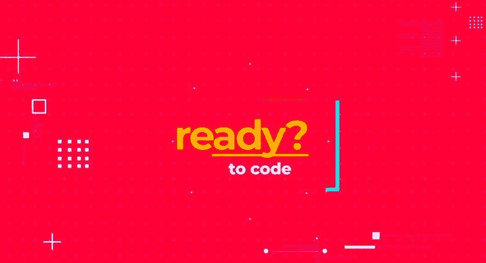

# 免费 Python 算法课程

> 原文：[`www.kdnuggets.com/2022/09/free-algorithms-python-course.html`](https://www.kdnuggets.com/2022/09/free-algorithms-python-course.html)

来自[Python 中的算法](https://www.youtube.com/watch?v=fW_OS3LGB9Q)的截图

随着“算法”这个词越来越深入公众的脑海和词汇中，它也越来越带有神秘的色彩。

人们听到这个词时通常会想到机器学习算法，这可能导致公众误以为是同样误导的术语——人工智能。但你和我知道这不应该是这样。算法是我们为解决特定问题所采取的具体步骤。就是这样，没有更多的东西。没有涉及魔法。

当然，我们可以谈论**机器学习算法**，这些是机器学习概念的实现所采取的具体步骤，但在算法术语中，这些只是另一组步骤，与机器学习或人工智能的神秘性无关。但我跑题了。

回到我们要讨论的主题：在我们的背景下，**算法**是特定计算概念的步骤在编程中的实现。我们到底在数据或某些资源上做了什么，以及**确切**的顺序是什么？如果你来自计算机科学背景，毫无疑问你在“编程导论 101”之后的第一个计算机科学课程之一是算法，或者可能是数据结构与算法，它们结合了数据方面的**什么**和**如何**。如果你不是计算机科学背景，可能是在自学编程、在线学习数据科学或通过其他方法时学到了算法。

总的来说：如果你以某种方式学习了算法，恭喜你！做得好！如果没有，你真的应该学习。让我们看看是否能帮忙。

freeCodeCamp 刚刚发布了[Python 中的算法](https://www.youtube.com/watch?v=fW_OS3LGB9Q)，这是一个免费学习算法的完整课程，使用的是现存的最流行的编程语言之一。该课程由[Joy Brock](https://www.youtube.com/c/PythonLearningChannel)与[realtoughcandy.io](https://realtoughcandy.com/)合作开发，因此一定要查看他们的其他课程。

Python 不仅在作为通用编程语言方面享有广泛的受欢迎程度——意味着你可以用它完成各种编程任务，几乎是任何可以想象的任务（在合理范围内）——Python 也是数据科学和机器学习领域需求最高的语言之一。作为额外的好处，Python 是一个 notoriously 对初学者友好的语言，使得用它来理解算法和其他程序性及计算概念变得更容易。

在这个视频课程中，你将学习算法基础知识，如阶乘、排列、*N* 皇后问题和旅行推销员问题。你将深入探讨程序算法的核心内容：排序！接着你将学习一些数据结构，并了解算法和结构如何通过如哈希表的概念协同工作。你还会学习动态编程、矩阵乘法等话题，以及什么是贪心算法。

Python 已成为数据科学新手和经验丰富的从业者的首选语言（或者，更准确地说，是*首选语言之一*）。将你的算法学习与 Python 配对，迈出进一步提升自己的步伐。祝好运！

**[Matthew Mayo](https://www.linkedin.com/in/mattmayo13/)** ([**@mattmayo13**](https://twitter.com/mattmayo13)) 是数据科学家及 KDnuggets 的主编，KDnuggets 是一个开创性的在线数据科学和机器学习资源。他的兴趣包括自然语言处理、算法设计与优化、无监督学习、神经网络以及自动化机器学习方法。Matthew 拥有计算机科学硕士学位和数据挖掘研究生文凭。你可以通过 editor1 at kdnuggets[dot]com 联系他。

* * *

## 我们的前三大课程推荐

 1\. [谷歌网络安全证书](https://www.kdnuggets.com/google-cybersecurity) - 快速进入网络安全职业的快车道。

 2\. [谷歌数据分析专业证书](https://www.kdnuggets.com/google-data-analytics) - 提升你的数据分析能力

 3\. [谷歌 IT 支持专业证书](https://www.kdnuggets.com/google-itsupport) - 支持你所在组织的 IT

* * *

### 更多相关主题

+   [KDnuggets 新闻，9 月 28 日：免费 Python 算法课程 •…](https://www.kdnuggets.com/2022/n38.html)

+   [免费 Python 短期课程](https://www.kdnuggets.com/2022/07/free-python-crash-course.html)

+   [KDnuggets 新闻，9 月 14 日：免费数据科学 Python 课程 •…](https://www.kdnuggets.com/2022/n36.html)

+   [免费 Python 自动化课程](https://www.kdnuggets.com/2022/07/free-automate-python-course.html)

+   [免费 Python 项目编码课程](https://www.kdnuggets.com/2022/08/free-python-project-coding-course.html)

+   [免费数据科学 Python 课程](https://www.kdnuggets.com/2022/09/free-python-data-science-course.html)
