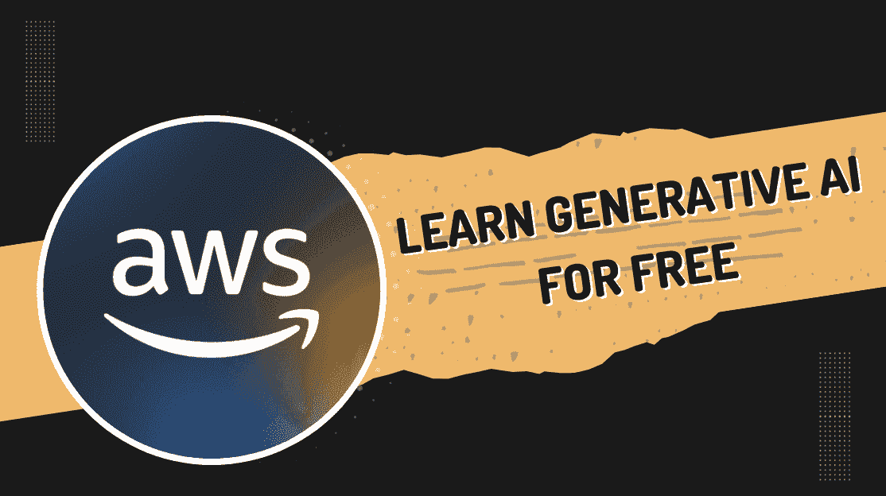

# 免费亚马逊课程以学习生成式 AI：适合所有级别

> 原文：[`www.kdnuggets.com/free-amazon-courses-to-learn-generative-ai-for-all-levels`](https://www.kdnuggets.com/free-amazon-courses-to-learn-generative-ai-for-all-levels)

图片由作者提供

每个人都想分一杯生成式 AI 的蛋糕，从软件开发人员到非技术业务领导者。掌握所有提升你职业或组织中生成式 AI 的信息和技能，就是你所需要的。现在，你可以通过亚马逊的免费课程获取这些信息，这些课程涵盖了生成式 AI 的各个方面、领域以及不同的职位。

# 生成式 AI 基础

链接：[生成式 AI 基础](https://www.youtube.com/playlist?list=PLhr1KZpdzukf-xb0lmiU3G89GJXaDbAIF)

关注亚马逊的生成式 AI 基础 YouTube 播放列表，该列表深入探讨了为已熟悉 AI 建模的人设计的技术细节。你将学习生成式 AI 的概念基础，并获得实用建议，以及如何预训练、微调和部署先进的基础模型，无论是在 AWS 还是其他平台。

# 提示工程基础

链接：[提示工程基础](https://explore.skillbuilder.aws/learn/course/external/view/elearning/17763/foundations-of-prompt-engineering)

这是一个独立的课程，你将在其中学习有效提示工程的原则、技术和最佳实践。从基础知识开始，逐步进阶到更高级的技术。你还将学习如何防范提示滥用以及减轻偏见。

该课程面向中级技术专业人士，完成需时 4 小时。为了充分利用这门课程，建议你对生成式 AI 有良好的理解，知道如何在项目中处理生成式 AI 以及 Amazon Bedrock。

# 生成式 AI 开发者学习计划

链接：[为开发者准备的生成式 AI 学习计划](https://explore.skillbuilder.aws/learn/public/learning_plan/view/2068/generative-ai-learning-plan-for-developers)

从这门免费的亚马逊课程开始你的生成式 AI 学习路径，该课程涉及大规模语言模型、生成式 AI 项目的规划、提示工程的基础知识，以及如何使用 Amazon Bedrock。

包含 5 门课程，总计 11 小时。为了从这门课程中获得最大收益，建议先具备 [AWS 技术基础](https://explore.skillbuilder.aws/learn/course/external/view/elearning/1851/aws-technical-essentials) 和中级 Python 水平。

# 在 AWS 上构建语言模型

链接：[在 AWS 上构建语言模型](https://explore.skillbuilder.aws/learn/course/external/view/elearning/17556/building-language-models-on-aws)

了解如何在 Amazon SageMaker 上构建大型语言模型，这个平台帮助数据科学家构建、训练、部署和监控机器学习模型。数据科学家将负责在平台上构建大型语言模型，学习不同的存储、数据摄取和训练选项，以处理模型所需的大型文本数据。你还将学习在生成式人工智能任务中部署大型语言模型时遇到的挑战。

本课程面向高级技术专业人员，完成需要 5.5 小时。

# 决策者的生成式人工智能学习计划

链接: [决策者的生成式人工智能学习计划](https://explore.skillbuilder.aws/learn/public/learning_plan/view/2068/generative-ai-learning-plan-for-developers)

在成为技术专业人员或处理数据驱动的结果时，做决策可能是最具挑战性的事情之一。在亚马逊提供的这门免费课程中，你将学习生成式人工智能如何在商业方面被使用，以及它如何用于做出技术决策。成为这些决策者之一，学习如何处理生成式人工智能项目，使组织做好生成式人工智能准备。

这条学习路径包括 3 门课程，每门课程需要 1 小时完成。

# 高管的生成式人工智能

链接: [高管的生成式人工智能](https://explore.skillbuilder.aws/learn/course/external/view/elearning/16666/generative-ai-for-executives)

尽管目前关于生成式人工智能的宣传很多，但你可能仍然不了解它的真正能力以及如何实施以提升你的组织。在本课程中，你将获得生成式人工智能的高层次概述，了解它如何解决高管的关注和挑战，以及如何支持业务增长。这将通过各种用例和一个关于如何培训员工使用生成式人工智能的视频来支持。

# 总结

无论你在组织中的位置如何，你都必须了解当前技术领域的现状以及未来的期望。这些课程可以帮助你为组织实施新策略，或提升你作为软件开发人员的技能。

每个人都应该有免费访问今天世界的学习机会。

****[Nisha Arya](https://www.linkedin.com/in/nisha-arya-ahmed/)**** 是一名数据科学家、自由技术写作人，同时也是 KDnuggets 的编辑和社区经理。她特别感兴趣于提供数据科学职业建议或教程及数据科学相关的理论知识。Nisha 涵盖了广泛的主题，并希望探索人工智能如何有利于人类寿命的不同方式。作为一个热衷于学习的人，Nisha 希望拓宽她的技术知识和写作技能，同时帮助指导他人。

### 更多相关内容

+   [来自 NVIDIA 的免费 AI 课程：适用于所有级别](https://www.kdnuggets.com/free-ai-courses-from-nvidia-for-all-levels)

+   [免费的数据科学学习路线图：适用于所有级别，与 IBM 合作](https://www.kdnuggets.com/a-free-data-science-learning-roadmap-for-all-levels-with-ibm)

+   [三种难度级别解释的大型语言模型](https://www.kdnuggets.com/large-language-models-explained-in-3-levels-of-difficulty)

+   [311 呼叫中心绩效：服务水平评级](https://www.kdnuggets.com/2023/03/boxplot-outlier-311-call-center-performance.html)

+   [如果你想精通生成式 AI，忽略所有（但两个）工具](https://www.kdnuggets.com/if-you-want-to-master-generative-ai-ignore-all-but-two-tools)

+   [学习如何设计、衡量和实施可信的 A/B 测试……](https://www.kdnuggets.com/2023/01/sphere-design-measure-implement-trustworthy-ab-tests-ronny-kohavi.html)
