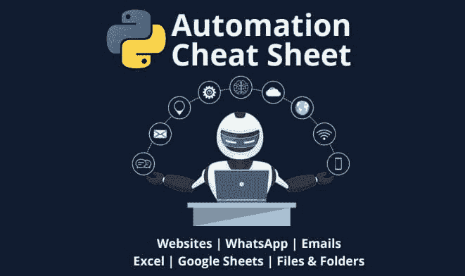

# 免费的 Python 自动化课程

> 原文：[`www.kdnuggets.com/2022/07/free-automate-python-course.html`](https://www.kdnuggets.com/2022/07/free-automate-python-course.html)

来自 Frank Andrade 的自动化备忘单

直白地说，计算机编程就是关于自动化的。如果你不需要自动化某件事，你就不会编写代码。你写的那个处理 CSV 文件的脚本？自动化。你写的那个解析文本输入的程序？自动化。

* * *

## 我们的前三大课程推荐

 1\. [Google 网络安全证书](https://www.kdnuggets.com/google-cybersecurity) - 快速进入网络安全职业道路。

 2\. [Google 数据分析专业证书](https://www.kdnuggets.com/google-data-analytics) - 提升你的数据分析能力

 3\. [Google IT 支持专业证书](https://www.kdnuggets.com/google-itsupport) - 支持你所在组织的 IT

* * *

编程是*自动化*的全部内容，你能自动化的越多，作为程序员的生活就会越轻松（你也能为与你合作的人提供更多价值）。

没有人喜欢机械重复（好吧，也许*有人*喜欢）。[手动做某事 X 次与花时间自动化它](https://www.reddit.com/r/ProgrammerHumor/comments/kwlc4e/ah_yes_the_programmer_move/)之间的平衡有点像艺术，但通常来说，如果你在电脑上反复做同一件事，你不妨自动化它。有什么比用 Python 自动化更好的选择呢？Python 是我们今天可用的最流行、最受支持且易于使用的编程语言之一。

[freeCodeCamp](https://www.freecodecamp.org/news) 最近推出了一个免费的 Python 自动化课程，方便地命名为 [使用 Python 自动化](https://www.youtube.com/watch?v=PXMJ6FS7llk)。课程由 [Frank Andrade](https://frank-andrade.medium.com/) 教授，采用独特的方法来教授 Python 及其在将繁琐任务从重复中解放出来的实用性。该课程是基于项目的，设定了 4 个主要项目，每个部分都建立在完成这些项目所需的 Python 技能上。这里没有一次性代码行；所有内容都相互配合，进展顺利，逻辑清晰。

具体来说，本课程涵盖的四个项目是：

1.  表格提取

1.  网络自动化与网络抓取

1.  自动化 Excel 报告

1.  自动化 WhatsApp

在课程中学习如何具体自动化这些项目任务的同时，你还应该理解如何以自动化的思维方式来思考，磨练你的技能并改变视角，留意未来类似机会。你还将学习一些自动化友好的 Python 库，如 Path、Selenium 和 XPath。你还会沿途掌握一些其他有价值的技能，如基本的 HTML、将 Python 文件转换为 EXE、调度脚本、用 Python 编写 Excel 公式等。

该课程附带代码、数据和由课程作者 Frank Andrade 为其更长但紧密相关的[用 Python 自动化生活](https://www.udemy.com/course/automate-your-life-with-python/?referralCode=7FA8B361D7A92B03A8C3)课程创建的一个（[单独提供](https://frankandrade.ck.page/44559e1ae7)）多页自动化备忘单。

freeCodeCamp 版本的课程时长不到 3 小时，你可以在[YouTube](https://www.youtube.com/watch?v=PXMJ6FS7llk)上找到它，并嵌入在下方。

如果你仍然定期手动执行枯燥的任务，或经常编写临时代码来处理这些工作，那就加入那些酷炫的家伙吧，花时间学习如何用 Python 进行正确的自动化。你未来的自己会感谢你的。

**[Matthew Mayo](https://www.linkedin.com/in/mattmayo13/)**（**[@mattmayo13](https://twitter.com/mattmayo13)**）是数据科学家和 KDnuggets 的主编，KDnuggets 是开创性的在线数据科学和机器学习资源。他的兴趣包括自然语言处理、算法设计与优化、无监督学习、神经网络和自动化机器学习方法。Matthew 拥有计算机科学硕士学位和数据挖掘研究生文凭。他可以通过 editor1 at kdnuggets[dot]com 联系。

### 相关话题

+   [3 个有用的 Python 自动化脚本](https://www.kdnuggets.com/2022/11/3-useful-python-automation-scripts.html)

+   [数据科学工作流程中的自动化](https://www.kdnuggets.com/2023/03/automation-data-science-workflows.html)

+   [免费 Python 速成课程](https://www.kdnuggets.com/2022/07/free-python-crash-course.html)

+   [KDnuggets 新闻，9 月 14 日：免费数据科学 Python 课程•…](https://www.kdnuggets.com/2022/n36.html)

+   [免费 Python 项目编码课程](https://www.kdnuggets.com/2022/08/free-python-project-coding-course.html)

+   [免费数据科学 Python 课程](https://www.kdnuggets.com/2022/09/free-python-data-science-course.html)
