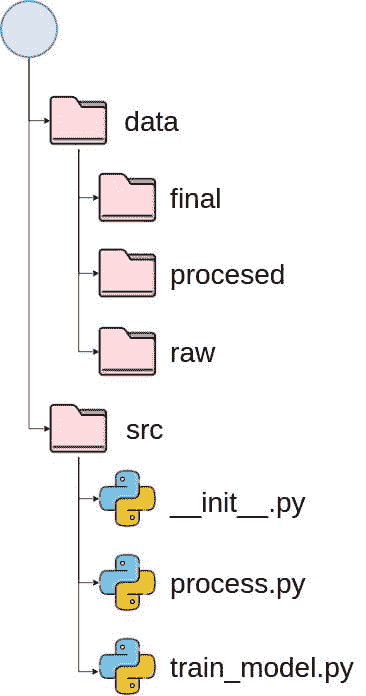
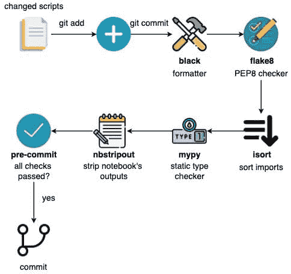

# 构建可重复和可维护的数据科学项目：一本免费在线书籍

> 原文：[`www.kdnuggets.com/2022/08/free-book-build-reproducible-maintainable-data-science-project.html`](https://www.kdnuggets.com/2022/08/free-book-build-reproducible-maintainable-data-science-project.html)

确定如何结构化、管理和维护你的数据科学项目是一系列不简单的任务，如果执行得当，可以在项目展开和成熟的过程中大大简化你的工作。旨在确保可重复性会增加额外的复杂性和难度，但有助于项目的长期性和可信度。

如何找到关于实际确保数据科学项目的可重复性和可维护性的全面资源？

* * *

## 我们的前三大课程推荐

 1\. [谷歌网络安全证书](https://www.kdnuggets.com/google-cybersecurity) - 快速进入网络安全职业。

 2\. [谷歌数据分析专业证书](https://www.kdnuggets.com/google-data-analytics) - 提升你的数据分析技能

 3\. [谷歌 IT 支持专业证书](https://www.kdnuggets.com/google-itsupport) - 支持你的组织 IT

* * *

Python 项目文件结构（来源：[构建可重复和可维护的数据科学项目](https://khuyentran1401.github.io/reproducible-data-science/README.html) 作者：[Khuyen Tran](https://mathdatasimplified.com/)）

Khuyen Tran 编写了一本名为[构建可重复和可维护的数据科学项目](https://khuyentran1401.github.io/reproducible-data-science/README.html)的免费在线书籍，这本书相当贴切地提供了极好的资源。

> 本书介绍了用于开发高效工作流的 Python 工具，以支持可重复和可维护的数据科学项目。我们介绍了最佳实践和工具，使数据科学家能够适应日益增长的复杂性需求，同时确保他们的系统可靠。

听起来都很棒，你可能会想，这到底意味着什么？为了更深入了解本书提供的内容，我建议你快速查看第 2.1 节，[如何构建一个具有可读性和透明度的数据科学项目](https://khuyentran1401.github.io/reproducible-data-science/structure_project/introduction.html)。你将快速了解本书的结构、涵盖的内容、呈现方式以及 Tran 对标准和最佳实践（及其遵循）的重视。你会发现一份易读、结构良好且信息丰富的资源在等着你。

Tran 的书和随附的 [数据科学 Cookie Cutter](https://github.com/khuyentran1401/data-science-template) 模板依赖以下 Python 工具来实现其目标：

+   Cookiecutter

+   Poetry

+   Git

+   DVC

+   Hydra

+   Prefect

+   pre-commit 插件

+   pdoc

+   和更多

我是 Poetry 的忠实粉丝，因此 Tran 在项目中选择使用 Poetry 让我非常高兴（注意：对于那些更喜欢的用户，项目的 pip 版本确实存在）。Poetry 是一个出色的 Python 依赖管理工具，具有比 pip 更多的功能。你可以在 [这里](https://python-poetry.org/) 了解更多关于 Poetry 的信息。

同样重视测试、配置文件管理、项目安装、数据和模型管理，以及代码的合规性和组织。简而言之，无论你应该做什么来确保你的代码是可重复和可维护的，Tran 在本书中都有覆盖。不仅涵盖了概念和实践，随附的 GitHub 存储库还包含一个有助于执行整个任务集的项目。

预提交任务（来源：[构建一个可重复和可维护的数据科学项目](https://khuyentran1401.github.io/reproducible-data-science/README.html) 由 [Khuyen Tran](https://mathdatasimplified.com/) 提供）

确保你的代码符合 PEP-8 风格指南？已覆盖。

版本控制你的数据集并将其存储在线？完成。

提交之前删除笔记本输出？是的。

你在编写代码时记录文档？当然！

Tran 的免费在线书籍对初学者和经验丰富的从业者都是一个有用的资源。采用其中的方法无疑将提高你代码的可靠性、实施的可维护性和项目的可重复性，同时允许更高的复杂性。

不要让你可以完全控制的项目方面——即结构和实施——成为你的绊脚石；按照 Tran 在本书中提供的蓝图来帮助确保你构建一个可重复和可维护的数据科学项目。

**[Matthew Mayo](https://www.linkedin.com/in/mattmayo13/)** ([**@mattmayo13**](https://twitter.com/mattmayo13)) 是数据科学家及 KDnuggets 的主编，KDnuggets 是重要的数据科学和机器学习资源。他的兴趣包括自然语言处理、算法设计与优化、无监督学习、神经网络以及机器学习的自动化方法。Matthew 拥有计算机科学硕士学位和数据挖掘研究生文凭。他可以通过 editor1 at kdnuggets[dot]com 联系。

### 更多相关主题

+   [免费数据科学面试书籍以获得理想工作](https://www.kdnuggets.com/free-data-science-interview-book-to-land-your-dream-job)

+   [《Pydon'ts - 编写优雅 Python 代码：免费书评》](https://www.kdnuggets.com/2022/05/pydonts-write-elegant-python-code-free-book-review.html)

+   [《统计学习简介，Python 版：免费书籍》](https://www.kdnuggets.com/2023/07/introduction-statistical-learning-python-edition-free-book.html)

+   [《软件错误与权衡：Tomasz Lelek 的新书》](https://www.kdnuggets.com/2021/12/manning-software-mistakes-tradeoffs-book.html)

+   [《免费 Python 项目编程课程》](https://www.kdnuggets.com/2022/08/free-python-project-coding-course.html)

+   [《KDnuggets 新闻，4 月 6 日：8 门免费 MIT 数据科学课程》](https://www.kdnuggets.com/2022/n14.html)
