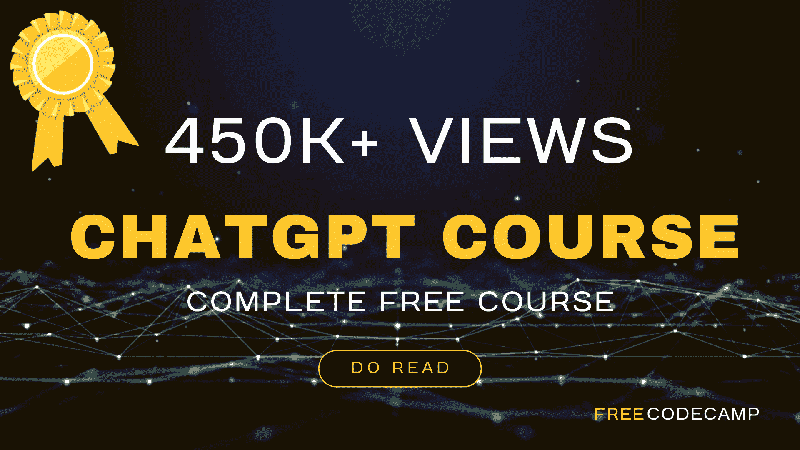

# 免费 ChatGPT 课程：使用 OpenAI API 编写 5 个项目

> 原文：[`www.kdnuggets.com/2023/05/free-chatgpt-course-openai-api-code-5-projects.html`](https://www.kdnuggets.com/2023/05/free-chatgpt-course-openai-api-code-5-projects.html)

图片由作者提供

# 介绍

* * *

## 我们的三大课程推荐

 1\. [谷歌网络安全证书](https://www.kdnuggets.com/google-cybersecurity) - 快速进入网络安全职业。

 2\. [谷歌数据分析专业证书](https://www.kdnuggets.com/google-data-analytics) - 提升你的数据分析技能

 3\. [谷歌 IT 支持专业证书](https://www.kdnuggets.com/google-itsupport) - 支持你的组织 IT

* * *

ChatGPT 完全改变了我们工作和学习的方式。人工智能领域正在快速发展，OpenAI 正在引领这一进程。这个全球趋势不会很快消失，相反，我们期待指数级增长。但这一趋势与我们有何关系？事实上，这项技术正逐渐融入我们的日常生活中。随着周围世界的演变，我们也必须适应。正如 Mark Cuban 所说，我引用：

> *“世界变化非常快。大不再战胜小。将是快速战胜缓慢。”*

因此，开发者和爱好者需要充分理解 OpenAI API 的潜力及其各种应用。无论你的背景或经验水平如何，这个课程将帮助你掌握技能，保持领先，并轻松创建出色的应用程序。

# 课程详情

FreeCodeCamp 最近与 Ania Kubow 合作推出了 [ChatGPT 课程 – 使用 OpenAI API 编写 5 个项目](https://youtu.be/uRQH2CFvedY)。她是一位著名的软件开发者和课程创建者。你也可以在这里找到她的 YouTube 频道：[与 Ania Kubów 一起编程](https://www.youtube.com/@AniaKubow)。这个**5 小时**的课程深入探讨了 OpenAI API 的迷人世界。它提供了对 OpenAI API 的有见地的介绍及其应用，然后转到创建 5 个项目。

课程的详细大纲如下：

## 1\. 介绍

它突出了课程的背景、目标及其受众。你还将概览 OpenAI API 及其实际应用。

## 2\. 认证

讲师详细讲解了 OpenAI API 文档，解释了如何使用 API 密钥进行认证，以及如何生成并安全使用它。

## 3\. 模型

它涵盖了 OpenAI 生态系统中可用模型的列表及其用例，例如 DALL-E、Whisper、GPT-4、GPT-3.5 等。所有支持的模型可以在[这里](https://platform.openai.com/docs/models/overview)找到。

## 4\. 文本完成

生成文本、操作文本和标记化概念的细节被解释，以帮助你掌握文本完成的艺术。

## 5\. 创建有效提示

ChatGPT 极其多才多艺，可以处理各种任务，因此你需要明确你的提示以生成有意义和准确的结果。本节涵盖了有关提示的用词、结构和背景的基本指导，以确保它们引发期望的回应。

## 6\. 聊天完成项目

本节帮助你发现聊天完成的全部潜力，以及如何利用它创建交互式应用程序。为了将新学到的技能付诸实践，本教程将指导你构建两个聊天完成项目。在第一个项目中，你将使用 JavaScript 和 OpenAI API 创建一个简单的聊天完成克隆。在第二个项目中，你将提升到一个新的水平，使用 React 构建前端，Node.js 构建后端，制作一个 ChatGPT 克隆。

## 7\. 图像生成项目

OpenAI 发布了一个 DALL-E 模型，可以根据文本描述生成图像。本节首先讲解使用 DALL-E 生成、编辑和创建图像变体的基础知识。为了巩固你的理解，提供了两个图像生成的实践项目。第一个项目教你如何使用 JavaScript 和 OpenAI API 构建一个图像生成应用。第二个项目是一个使用 React、Node.js、OpenAI npm 库和 OpenAI API 构建的图像生成和变体应用。这些项目将帮助你获得实践经验，使你在这个令人兴奋的领域中更加熟练。

## 8\. SQL 生成器项目

在最后一节，你将创建一个 SQL 查询生成器项目，该项目将英文提示翻译为 SQL 查询。这个项目很好地总结了你到目前为止在课程中学到的所有技能。它使用 Typescript 作为前端，Node.js 作为后端，并在聊天完成端点使用 OpenAI API。

如果你想进一步探索这门课程，请观看下面的视频：

# 结论

如果你对如何使用 OpenAI API 构建实际项目感到好奇，这门课程是一个很好的基础。请观看课程视频，并在评论区告诉我你的想法。

**[Kanwal Mehreen](https://www.linkedin.com/in/kanwal-mehreen1)** 是一位有志的软件开发者，对数据科学和 AI 在医学中的应用充满兴趣。Kanwal 被选为 2022 年 APAC 区域的 Google Generation Scholar。Kanwal 喜欢通过撰写关于热门话题的文章分享技术知识，并热衷于提高女性在科技行业的代表性。

### 更多相关话题

+   [OpenAI 的 Whisper API 用于转录和翻译](https://www.kdnuggets.com/2023/06/openai-whisper-api-transcription-translation.html)

+   [OpenAI API 入门：您的易于跟随的入门指南](https://www.kdnuggets.com/openai-api-for-beginners-your-easy-to-follow-starter-guide)

+   [使用 Python 探索 OpenAI API](https://www.kdnuggets.com/exploring-the-openai-api-with-python)

+   [使用 OpenAI 构建 AI 产品：CoRise 的免费课程](https://www.kdnuggets.com/2023/07/corise-building-ai-products-openai-free-course-corise.html)

+   [提升您的 AI 之旅！加入 Uplimit 的免费 AI 构建课程……](https://www.kdnuggets.com/2024/01/uplimit-supercharge-your-ai-journey-openai-course)

+   [OpenAI 的新 ChatGPT 和 Whisper API](https://www.kdnuggets.com/2023/03/new-chatgpt-whisper-apis-openai.html)
