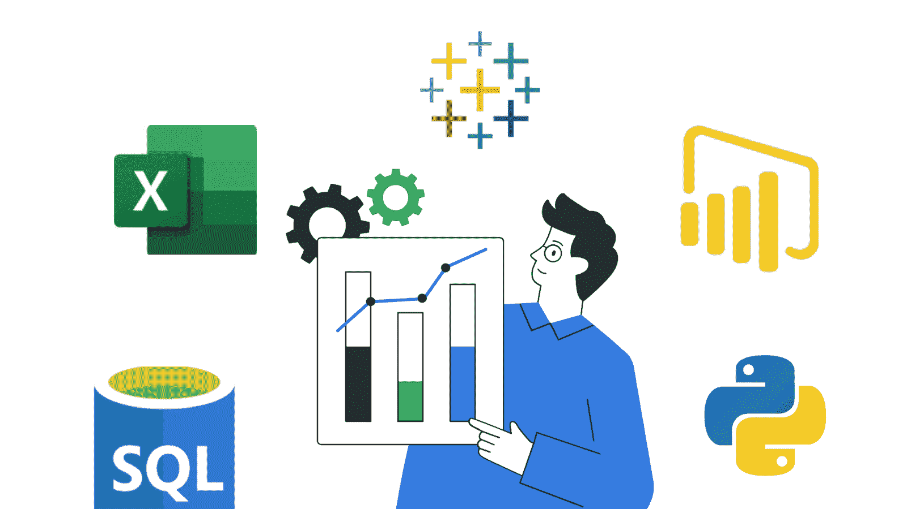

# 免费数据分析师训练营

> 原文：[`www.kdnuggets.com/free-data-analyst-bootcamp-for-beginners`](https://www.kdnuggets.com/free-data-analyst-bootcamp-for-beginners)

作者提供的图片

如果你打算进入数据分析领域，可能已经看过几个数据分析师的职位列表。你也许还见过列出的所需工具和编程语言：SQL、Excel、Power BI、Tableau、Python 等。

* * *

## 我们的三大课程推荐

 1\. [谷歌网络安全证书](https://www.kdnuggets.com/google-cybersecurity) - 快速进入网络安全职业的捷径。

 2\. [谷歌数据分析专业证书](https://www.kdnuggets.com/google-data-analytics) - 提升你的数据分析能力

 3\. [谷歌 IT 支持专业证书](https://www.kdnuggets.com/google-itsupport) - 支持你的组织的 IT 工作

* * *

你可以注册多个课程来学习这些技能。但如果能通过一个全面的训练营来学习所有这些技能，并建立项目组合，不是更好吗？

完全免费的[初学者数据分析师训练营](https://www.youtube.com/watch?v=PSNXoAs2FtQ)由 Alex the Analyst 提供，是启动数据分析师职业的理想选择。除了学习 SQL、Excel、Power BI、Tableau 和 Python，你还将构建项目、学习编写简历等。现在让我们深入了解这个训练营的内容。

链接: [初学者数据分析师训练营（SQL、Tableau、Power BI、Python、Excel、Pandas、项目等）](https://www.youtube.com/watch?v=PSNXoAs2FtQ)

# 1\. SQL

课程首先提供了关于如何成为数据分析师的一般路线图，然后详细介绍了每个所需工具，第一个是 SQL。

本教程的 SQL 部分分为三个部分：基础、初级 SQL 和高级 SQL。

基础 SQL 部分涵盖：

+   Select + From 语句

+   Where 语句

+   Group by 和 Order by

中级 SQL 教程部分涵盖以下内容：

+   内连接和外连接

+   联合

+   Case 语句

+   Having 子句

+   更新和删除数据

+   别名

+   Partition by

高级 SQL 部分将教你：

+   公共表表达式（CTEs）

+   临时表

+   字符串函数

+   存储过程

+   子查询

该模块通过几个关于数据探索和数据清洗的项目来结束，使用 SQL。

# 2\. Excel

作为数据分析师，如果你发现整个工作都涉及在电子表格中处理数字，也不要感到惊讶。在掌握 SQL 基础知识后，你可以通过练习进一步提升，接下来学习 Excel。

几乎所有组织都使用 Excel 或类似的电子表格工具，因此学习如何使用这些工具非常有帮助。

Excel 部分涵盖以下主题：

+   数据透视表

+   公式

+   XLOOKUP

+   条件格式

+   图表

+   清洗数据

与 SQL 部分一样，你将进行一个关于使用 Excel 进行数据分析的完整项目。

# 3\. Tableau

现在你已经很好地掌握了 SQL 和 Excel，这对于几乎所有基本的数据分析都足够了，是时候转向学习 BI 工具。

Tableau 教程部分从安装 Tableau 开始，并涵盖以下主题：

+   创建你的第一个可视化

+   使用计算字段和分箱

+   使用连接

接下来，你将从一个初学者友好的项目开始工作。

# 4\. Power BI

Power BI 部分将指导你使用 Microsoft Power BI 进行数据分析和可视化，从安装 Power BI 开始。

下面是这一部分涵盖内容的概述：

+   创建你的第一个可视化

+   使用 Power Query

+   创建和管理关系

+   在 Power BI 中使用 DAX

+   使用钻取功能

+   条件格式和列表

+   Power BI 中的流行可视化

与之前的部分一样，你将在 Power BI 部分进行一个指导项目。

# 5\. Python

现在你对数据分析中使用的大多数工具已经熟悉，是时候学习数据中最广泛使用的编程语言了。那就是 Python。

本部分涵盖了 Python 和 Pandas 数据分析，有机会进行简单项目。涉及的主题包括：Python 基础，包括 Python 基础知识和一些项目以应用所学内容。然后你将学习使用 Python 进行网页抓取。

pandas 教程涵盖以下主题：

+   读取文件

+   过滤列和行

+   索引

+   Groupby 和聚合函数

+   合并数据框

+   使用 pandas 创建可视化

+   数据清洗

+   探索性数据分析 (EDA)

然后你可以在两个投资组合项目中进行 API 和网页抓取的工作。

# 6\. 职业建议

到此为止，你已经掌握了成为数据分析师所需的所有技能，并且还完成了项目以充实你的投资组合。那么接下来是什么呢？就是申请工作、面试并获得职位。

数据分析师训练营的最后一部分包含有用的职业建议，以指导你进行求职过程：

+   如何创建投资组合网站

+   如何创建优秀的数据分析师简历

+   使用 LinkedIn 找工作的技巧

这非常有帮助，因为很少有课程涵盖你在学习所需技能并建立项目后应该做的事情*之后*。

# 总结

希望你发现这个关于这次训练营的全面回顾对你有帮助。那么你还在等什么？现在就开始学习吧。

祝学习愉快和编程顺利！

****[Bala Priya C](https://www.kdnuggets.com/wp-content/uploads/bala-priya-author-image-update-230821.jpg)** 是来自印度的开发者和技术作家。她喜欢在数学、编程、数据科学和内容创作的交叉点上工作。她的兴趣和专长领域包括 DevOps、数据科学和自然语言处理。她喜欢阅读、写作、编程和喝咖啡！目前，她正在通过撰写教程、操作指南、观点文章等方式学习并与开发者社区分享她的知识。Bala 还创建了引人入胜的资源概述和编码教程。**

### 更多相关话题

+   [免费的全栈 LLM 训练营](https://www.kdnuggets.com/2023/06/free-full-stack-llm-bootcamp.html)

+   [最佳数据科学资源、训练营和课程，助你学习…](https://www.kdnuggets.com/2023/12/springboard-best-data-science-resources-bootcamp-courses-learn-data-science-new-year)

+   [哪种最佳：数据科学训练营 vs 学位 vs 在线课程](https://www.kdnuggets.com/2022/09/best-data-science-bootcamp-degree-online-course.html)

+   [KDnuggets 新闻，10 月 5 日：初学者的顶级免费 Git GUI 客户端 •…](https://www.kdnuggets.com/2022/n39.html)

+   [免费的数据工程入门课程](https://www.kdnuggets.com/free-data-engineering-course-for-beginners)

+   [7 个免费的 Kaggle 微课程，适合数据科学初学者](https://www.kdnuggets.com/7-free-kaggle-micro-courses-for-data-science-beginners)
