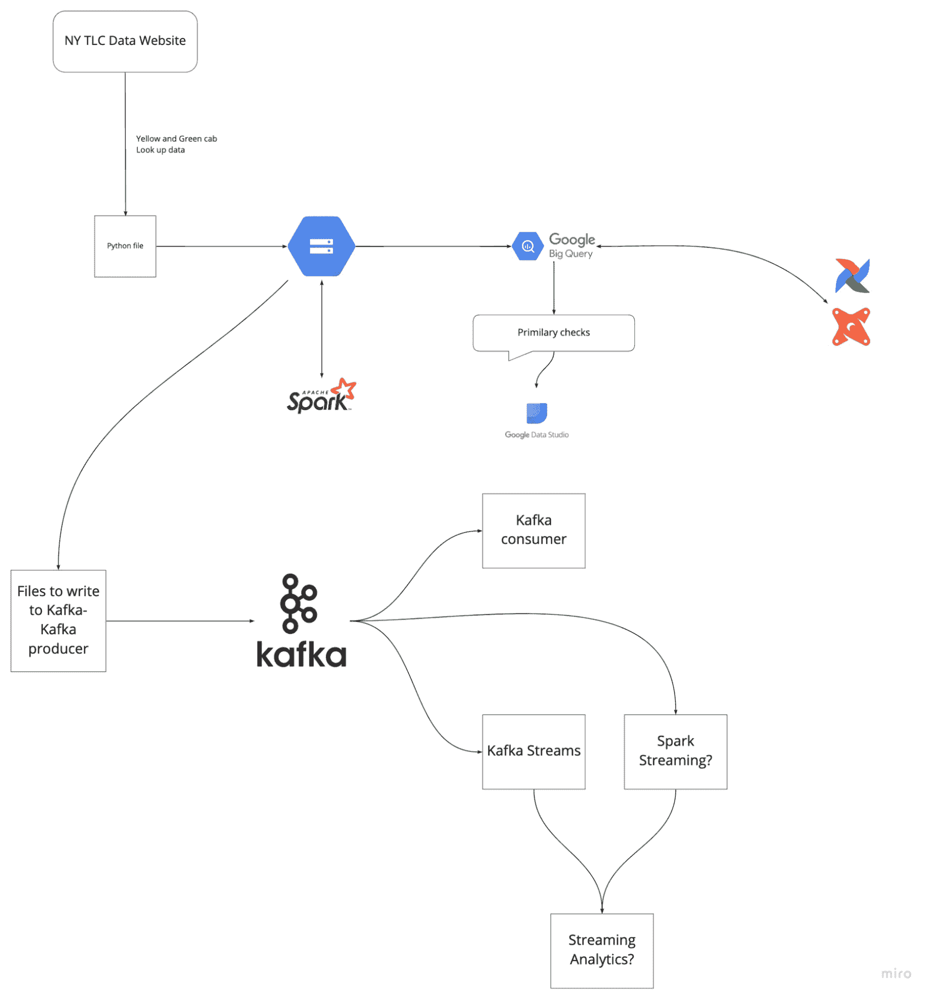

# 免费数据工程课程

> 原文：[`www.kdnuggets.com/2022/05/free-data-engineering-courses.html`](https://www.kdnuggets.com/2022/05/free-data-engineering-courses.html)

图片来源于 [freepik](https://www.freepik.com/vectors/technical-service)

在这篇博客中，你将学习适合初学者和专业人士的 3 门最佳免费数据工程课程。这些课程将教你数据摄取、数据管道、SQL、ETL/ELT、分析工程、批处理、数据流以及自动化。

* * *

## 我们的三大课程推荐

 1\. [谷歌网络安全证书](https://www.kdnuggets.com/google-cybersecurity) - 快速进入网络安全职业生涯。

 2\. [谷歌数据分析专业证书](https://www.kdnuggets.com/google-data-analytics) - 提升你的数据分析技能

 3\. [谷歌 IT 支持专业证书](https://www.kdnuggets.com/google-itsupport) - 支持你所在组织的 IT

* * *

**免费课程：**

1.  适合所有人的数据工程

1.  数据工程 Zoomcamp

1.  AWS 数据工程入门教程

# 1\. 适合所有人的数据工程

[适合所有人的数据工程课程](https://www.datacamp.com/courses/data-engineering-for-everyone)由 DataCamp 提供，是一个无代码的可视化数据工程入门课程。没有先决条件，任何人都可以免费参加此课程，即使是纯管理专业人士。

你将了解数据工程师的工作以及他们为何如此受欢迎。你还将概述 SQL 数据库、数据仓库和数据湖、数据处理、并行计算、任务调度以及云计算。

课程时长为 2 小时，包含互动练习和视频教程。它将为你准备数据工程职业生涯的[路线](https://www.datacamp.com/tracks/data-engineer-with-python)。

# 2\. 数据工程 Zoomcamp

[数据工程 Zoomcamp](https://github.com/DataTalksClub/data-engineering-zoomcamp)由 DataTalks.Club 提供，是最全面的数据工程课程之一。课程的所有材料都是免费的，包括项目文件、视频教程和工具。

在第一周，你将学习数据工程及环境搭建。第二周，你将学习数据摄取、数据湖、工作流编排，以及在本地和云上创建数据管道。第三周专注于数据仓库、BigQuery 和 Airflow。第四周，你将深入研究使用 dbt 的分析工程。在接下来的几周中，你将学习使用 Spark 进行批处理和使用 Kafka 进行数据流处理。最后三周将集中在使用你所学工具进行端到端项目的实践。项目将由你的同事进行评审。

你还将学习流行的数据工程工具，如 Airflow、PostgreSQL、BigQuery、Terraform、Docker、dbt（数据构建工具）、Spark 和 Kafka。

该课程为期 9 周，包括实际项目和视频教程。

图片来自 [DataTalksClub/data-engineering-zoomcamp](https://github.com/DataTalksClub/data-engineering-zoomcamp)

# 3. AWS 数据工程初学者教程

[AWS 数据工程初学者教程](https://www.youtube.com/watch?v=ckQ7d6ca2J0)是一个 90 分钟的 YouTube 课程，将教你如何使用 Amazon Web Services 进行数据工程。该课程适合初学者和经验丰富的专业人士。

你将学习 AWS 工具，如 Kinesis、DMS 和 Glue，并结合理论和实际案例。你将使用这些工具学习流数据分析、数据摄取、转换、查询和可视化，以及自动化。

如果你想了解 AWS 数据工程生态系统，我建议你参加这个课程。

# 常见问题解答

## 数据工程师的薪资范围是多少？

平均而言，美国的数据工程师年薪为 114,832 美元。如果你是高级工程师，年薪可以达到 390K 美元以上。Meta 和思科系统在技术行业提供更高的薪资 - [Glassdoor](https://www.glassdoor.com/Salaries/data-engineer-salary-SRCH_KO0,13.htm)。

## 什么是数据工程？

数据工程的核心是清理、处理和准备数据以供分析、数据科学和机器学习任务使用。你将创建用于机器学习和数据质量检查的 ETL 或 ELT 数据管道。你将学习 SQL、数据库管理、Apache Kafka、Apache Airflow、Apache Hadoop、Apache Spark 和 Apache Hive。

## 最好的数据工程课程有哪些？

**付费**

1.  [IBM 数据工程专业证书](https://www.coursera.org/professional-certificates/ibm-data-engineer)

1.  [使用 Python 的数据工程师](https://www.datacamp.com/tracks/data-engineer-with-python)

1.  [成为数据工程师](https://www.udacity.com/course/data-engineer-nanodegree--nd027)

**免费**

1.  [数据工程 Zoomcamp](https://github.com/DataTalksClub/data-engineering-zoomcamp)

1.  [面向所有人的数据工程课程](https://www.datacamp.com/courses/data-engineering-for-everyone)

1.  [AWS 数据工程初学者教程](https://www.youtube.com/watch?v=ckQ7d6ca2J0)

## 如何成为数据工程师？

成为数据工程师所需的技能：

1.  SQL 和数据库管理。

1.  构建、测试和维护数据管道。

1.  确保数据管道符合业务需求。

1.  收集和整理各种数据源到一个地方。

1.  开发算法以分析和提取数据中的信息。

1.  自动化重复任务。

## 如何获得数据工程师认证？

掌握数据工程技能和工具后，你可以报名参加专业认证项目：

+   [专业数据工程师认证 | 谷歌云](https://cloud.google.com/certification/data-engineer)

+   [微软认证：Azure 数据工程师助理 - 学习 | Microsoft Docs](https://docs.microsoft.com/en-us/learn/certifications/azure-data-engineer/)

这两项认证将帮助你获得数据工程相关职位。

**[Abid Ali Awan](https://www.polywork.com/kingabzpro)** ([@1abidaliawan](https://twitter.com/1abidaliawan)) 是一位认证数据科学专家，热衷于构建机器学习模型。目前，他专注于内容创作，并撰写有关机器学习和数据科学技术的技术博客。Abid 拥有技术管理硕士学位和电信工程学士学位。他的愿景是使用图神经网络构建一个 AI 产品，帮助那些面临心理健康问题的学生。

### 更多相关话题

+   [25 门免费课程掌握数据科学、数据工程、机器学习…](https://www.kdnuggets.com/25-free-courses-to-master-data-science-data-engineering-machine-learning-mlops-and-generative-ai)

+   [免费课程合集：学习数据科学、数据工程…](https://www.kdnuggets.com/collection-of-free-courses-to-learn-data-science-data-engineering-machine-learning-mlops-and-llmops)

+   [5 门免费课程掌握数据工程](https://www.kdnuggets.com/5-free-courses-to-master-data-engineering)

+   [5 门免费在线课程学习数据工程基础](https://www.kdnuggets.com/5-free-online-courses-to-learn-data-engineering-fundamentals)

+   [有效的提示工程艺术：免费课程和…](https://www.kdnuggets.com/the-art-of-effective-prompt-engineering-with-free-courses-and-certifications)

+   [实际上免费的免费课程：AI 与 ML 版](https://www.kdnuggets.com/free-courses-that-are-actually-free-ai-ml-edition)
