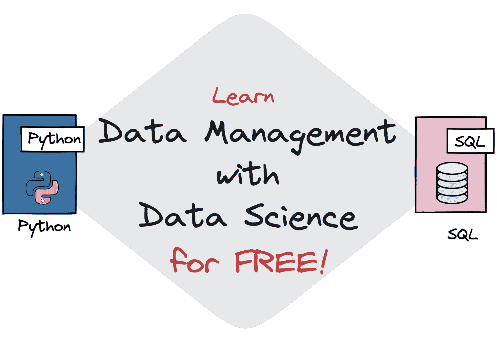

# 免费数据管理与数据科学学习 CS639

> 原文：[`www.kdnuggets.com/2023/01/free-data-management-data-science-learning-cs639.html`](https://www.kdnuggets.com/2023/01/free-data-management-data-science-learning-cs639.html)

作者提供的图片

数据科学有许多要学习的内容，具体取决于你希望深入了解哪些领域。尤其是数据管理。威斯康星大学麦迪逊分校有一门课程叫做：数据管理

* * *

## 我们的三大课程推荐

 1\. [谷歌网络安全证书](https://www.kdnuggets.com/google-cybersecurity) - 快速进入网络安全职业生涯。

 2\. [谷歌数据分析专业证书](https://www.kdnuggets.com/google-data-analytics) - 提升你的数据分析技能

 3\. [谷歌 IT 支持专业证书](https://www.kdnuggets.com/google-itsupport) - 支持你的组织 IT

* * *

数据科学。

课程分为 6 个部分，并有若干讲座。你可以下载讲座的 PDF，也建议你阅读额外的资料来帮助学习。

如果你对此感兴趣，请继续阅读！

# CS639 先决条件

**课程先决条件**

为了从数据管理与数据科学课程中获得最大收益，CS 300 对你的学习至关重要。CS 400 也将有所帮助。

熟练掌握 Python 也是必要的。如果你还不熟练，大学建议你使用[这里](https://docs.python-guide.org/intro/learning/)描述的资源。

**教材**

本课程没有指定教材，但推荐以下书籍：

+   [Python 数据分析](http://proquest.safaribooksonline.com/book/programming/python/9781449323592)，Wes McKinney，2012

+   [数据科学实战](http://proquest.safaribooksonline.com/book/databases/9781449363871)，Cathy O'Neil 和 Rachel Schutt，2013

# CS639 讲座计划

课程分为 6 个部分，期末有一次考试。

## 数据科学简介

+   [讲座 1](https://thodrek.github.io/cs639_spring19/lectures/lecture-1/Lecture_1_Intro.pptx)：数据科学简介与课程概述

+   [讲座 2](https://thodrek.github.io/cs639_spring19/lectures/lecture-2/Lecture_2_Stats.pptx)：统计推断与探索性数据分析

+   课堂演示：数据分析入门

## 关系数据库与关系代数

+   [讲座 3](https://thodrek.github.io/cs639_spring19/lectures/lecture-3/Lecture_3_PDM.pptx)：数据管理原理

+   [讲座 4](https://thodrek.github.io/cs639_spring19/lectures/lecture-4/Lecture_4_RA.pptx)：关系代数

+   [讲座 5](https://thodrek.github.io/cs639_spring19/lectures/lecture-5/Lecture_5_SQL.pptx)：数据科学中的 SQL

+   [讲座 6](https://thodrek.github.io/cs639_spring19/lectures/lecture-6-7/Lecture_6_Princ.pptx)：关系型数据库管理系统的关键原则

+   讲座 7：总结 SQL 和数据库

## MapReduce 模型与 No SQL 系统

+   [讲座 8](https://thodrek.github.io/cs639_spring19/lectures/lecture-8/Lecture_8_MR.pptx)：关于规模的推理与 MapReduce 抽象

+   [讲座 9](https://thodrek.github.io/cs639_spring19/lectures/lecture-9/Lecture_9_MR_Algs1.pptx)：MapReduce 算法 1

+   [讲座 10](https://thodrek.github.io/cs639_spring19/lectures/lecture-10/Lecture_10_MR_Algs2.pptx)：MapReduce 算法 2

+   [讲座 11](https://thodrek.github.io/cs639_spring19/lectures/lecture-11/Lecture_11_Spark.pptx)：Spark

+   [讲座 12](https://thodrek.github.io/cs639_spring19/lectures/lecture-12/Lecture_12_KV.pptx)：NoSQL 系统：键值存储与文档存储

在此主题后，你将进行 2 次期中考试。

## 预测分析

+   [讲座 13](https://thodrek.github.io/cs639_spring19/lectures/lecture-13/Lecture_13_SI.pptx)：统计推断

+   [讲座 14](https://thodrek.github.io/cs639_spring19/lectures/lecture-14/Lecture_14_S.pptx)：采样

+   [讲座 15](https://thodrek.github.io/cs639_spring19/lectures/lecture-15/Lecture_15_BM.pptx)：贝叶斯方法

+   [讲座 16](https://thodrek.github.io/cs639_spring19/lectures/lecture-16/Lecture_16_ML_DT.pptx)：机器学习与决策树入门

+   [讲座 17](https://thodrek.github.io/cs639_spring19/lectures/lecture-17/Lecture_17_ML_supp.pptx)：第 16 讲的总结及线性分类器与支持向量机

+   [讲座 18](https://thodrek.github.io/cs639_spring19/lectures/lecture-18/Lecture_18_Eval_ML.pptx)：机器学习模型评估

+   [讲座 19](https://thodrek.github.io/cs639_spring19/lectures/lecture-19/Lecture_19_UN_EN.pptx)：其他学习方法：无监督学习与集成学习

+   [讲座 20](https://thodrek.github.io/cs639_spring19/lectures/lecture-20/Lecture_20_opt.pptx)：优化/梯度下降

## 信息提取与数据集成

+   [讲座 21](https://thodrek.github.io/cs639_spring19/lectures/lecture-21/Lecture_21_IE.pptx)：信息提取

+   [讲座 22](https://thodrek.github.io/cs639_spring19/lectures/lecture-22/Lecture_22_ER.pptx)：数据集成与实体解析

+   [讲座 23](https://thodrek.github.io/cs639_spring19/lectures/lecture-23/Lecture_23_cleaning.pptx)：数据清理

## 传达洞察

+   [讲座 24](https://thodrek.github.io/cs639_spring19/lectures/lecture-24/Lecture_24_viz.pptx)：可视化简介

+   [讲座 25](https://thodrek.github.io/cs639_spring19/lectures/lecture-25/Lecture_25_EDA.pptx)：数据可视化/EDA

+   [讲座 26](https://thodrek.github.io/cs639_spring19/lectures/lecture-26/Lecture_26_DP.pptx)：数据隐私

## 期末考试

你已经完成了所有关于数据管理与数据科学的内容学习。接下来你将进行一个三部分的最终复习。这里有一些[样题](https://thodrek.github.io/cs639_spring19/lectures/final-review/CS639%E2%80%93Final_Practice_Questions.docx)以及[答案](https://thodrek.github.io/cs639_spring19/lectures/final-review/CS639%E2%80%93Final_Practice_Questions_sol.docx)。

在此之后，你将有一个附加项目，该项目开放式要求你使用密尔沃基市的数据创建酷炫的可视化图表。

# 结论

结构化的课程总是对你的学习有帮助。借助威斯康星大学的这些资源，你将能够获得结构化的课程以及大学级别的资源——完全免费！

如果你想了解更多关于成为数据科学家的信息，我建议阅读：完整的数据科学学习路线图

**[尼莎·阿亚](https://www.linkedin.com/in/nisha-arya-ahmed/)** 是一名数据科学家和自由职业技术作家。她特别感兴趣于提供数据科学职业建议或教程，并围绕数据科学进行理论知识的讲解。她还希望探索人工智能在延续人类生命方面的不同益处。作为一个热衷学习者，她寻求拓宽自己的技术知识和写作技能，同时帮助指导他人。

### 更多相关话题

+   [KDnuggets 新闻，5 月 18 日：5 个免费机器学习平台](https://www.kdnuggets.com/2022/n20.html)

+   [免费的 4 周数据科学课程：人工智能质量管理](https://www.kdnuggets.com/2022/02/truera-free-4-week-data-science-course-ai-quality-management.html)

+   [数据管理对数据科学为何如此重要？](https://www.kdnuggets.com/2022/08/data-management-important-data-science.html)

+   [数据科学的数据管理原则](https://www.kdnuggets.com/data-management-principles-for-data-science)

+   [数据科学项目管理方法指南](https://www.kdnuggets.com/2023/07/guide-data-science-project-management-methodologies.html)

+   [掌握数据科学项目管理的 7 个步骤与敏捷方法](https://www.kdnuggets.com/2023/07/7-steps-mastering-data-science-project-management-agile.html)
