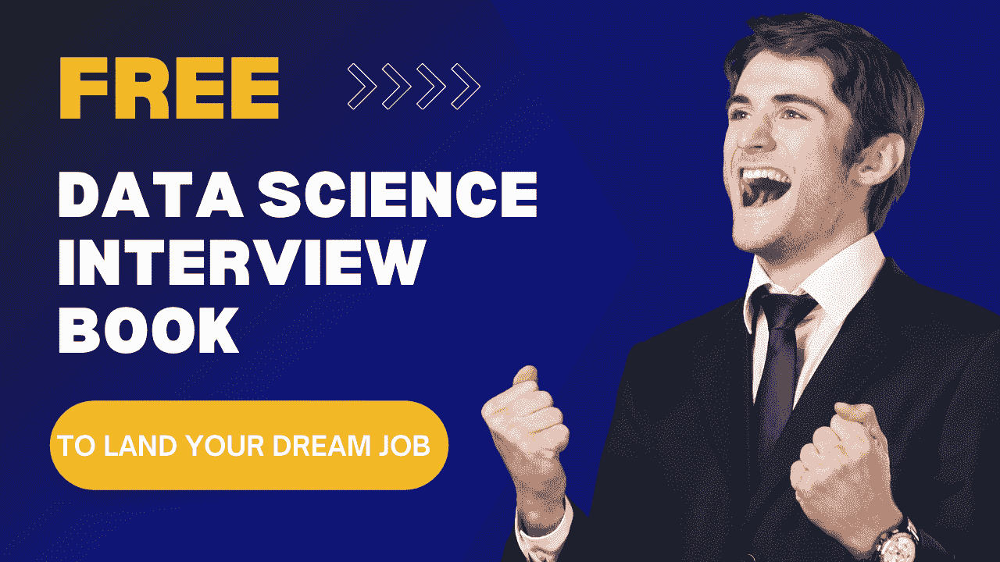

# 免费数据科学面试书，助你获得理想工作

> 原文：[`www.kdnuggets.com/free-data-science-interview-book-to-land-your-dream-job`](https://www.kdnuggets.com/free-data-science-interview-book-to-land-your-dream-job)

作者提供的图片

如果你正在准备数据科学面试，你知道浏览所有可用资源可能有多么令人不知所措。很容易迷失在细节中。这就是为什么我很高兴向你介绍一个隐藏的宝藏资源：“[数据科学面试书](https://book.thedatascienceinterviewproject.com/)”由[Dip Ranjan Chatterjee](https://www.linkedin.com/in/dip-chatterjee-13231417/)编写。

* * *

## 我们的前三大课程推荐

 1\. [Google 网络安全证书](https://www.kdnuggets.com/google-cybersecurity) - 快速进入网络安全职业生涯。

 2\. [Google 数据分析专业证书](https://www.kdnuggets.com/google-data-analytics) - 提升你的数据分析技能

 3\. [Google IT 支持专业证书](https://www.kdnuggets.com/google-itsupport) - 支持你所在组织的 IT 工作

* * *

这本免费提供的在线书籍涵盖了你在数据科学面试中需要了解的所有基本主题，从统计学和模型构建到算法、神经网络和商业智能。但与其他资源不同的是，它专注于提供仅有的相关信息，以帮助你为面试做好准备。这使得它成为忙碌的数据科学家快速复习广泛概念的完美资源。我认为这本书的独特之处在于：

1.  **实际面试问题：** 本书包括来自 Google、DoorDash 和 Airbnb 等公司的实际面试问题，并附有详细的解决方案和案例研究。

1.  **更新内容：** 这本书会不断更新，增加新章节、问题和更丰富的内容。

1.  **备忘单和参考资料：** 书中包含了各种主题的备忘单和快速参考指南，以及对那些想深入研究主题的额外参考资料。

# 内容概览

如果遇到一个⚠️符号的部分，不要惊慌。这只是表示这些部分仍在处理过程中，并可能会有所更改。以下是本书涵盖的主要部分：

## 1\. 统计学

本节涵盖了统计学基础，这对于数据分析和模型构建至关重要。主题包括概率基础、概率分布、中心极限定理、贝叶斯与频率论推理、假设检验和 A/B 测试。

## 2\. 模型构建

本书的这一部分将指导你完成创建成功模型的过程，从数据收集到模型选择。它还教你数据预处理技术，这对任何数据科学家都是必需的，包括特征缩放、处理异常值、处理缺失值和编码分类变量。它还包括一个超参数优化的小节以及一些用于超参数优化的著名开源工具。

## 3\. 算法

算法是数据科学的基础，理解它们对于在数据科学面试中取得成功至关重要。本节涵盖了各种机器学习算法，并为你提供了选择适合你用例的算法的实际建议。本节从偏差-方差权衡和生成模型与判别模型的基础知识开始，然后深入到回归、分类、聚类、决策树、随机森林、集成学习和提升方法等高级概念。此外，本节还讨论了时间序列分析和异常检测。最后，本节以一张关于 Big O 分析的综合表格作为结束，其中涵盖了不同机器学习算法的时间和空间复杂度。

## 4\. Python

Python 是一种多功能语言，用于数据科学中的各种任务。本节包含以下子部分：

1.  **理论：** 它涵盖了 Python 中的一些基本概念，例如网格、统计方法、range 与 xrange、switch case 和 lambda 函数。

1.  **基础：** 有一些常见的编程技巧，你必须熟悉它们以解决面试中的 Python 问题，比如列表、元组和字典，并理解使用循环和条件语句的控制流程。

1.  **从零开始编码算法：** 通常，公司会要求候选人在编码演示环节中从零开始编码算法。这里讨论了从零开始编码算法的一般步骤。

1.  **问题：** 它涵盖了一些与统计、数据处理和自然语言处理相关的示例问题。

## 5\. SQL

在数据科学面试中，SQL 查询通常用于评估候选人处理数据和解决复杂问题的能力。本节涵盖了 SQL 的基础知识，包括连接、临时表与表变量与 CTE、窗口函数、时间函数、存储过程、索引和性能优化。临时表与表变量与 CTE 部分解释了这三种临时数据结构之间的区别以及何时使用每一种。你还将学习如何创建和使用存储过程。性能优化部分涵盖了优化 SQL 查询的各种技巧。总体来说，它将为你提供 SQL 的坚实基础。

## 6\. 分析思维

虽然这本书包含了多个持续更新的部分，如 Excel、神经网络、自然语言处理、机器学习框架、商业智能等，但我特别想突出这一部分。我认为它很独特，因为它涉及了商业场景和行为管理相关的问题，这在数据科学面试中越来越重要。公司不仅仅寻找技术专长，还希望找到能够战略性思考和有效沟通的候选人。

例如，这是 Salesforce 在其一次面试中提出的一个问题：

*“作为 Salesforce 的数据科学家，你在与一位产品经理交谈，他想了解 Salesforce 的用户基础。你的方法是什么？”*

通过审视这些基于场景的问题，你将为面试做好充分准备。

## 7\. 备忘单

与其花费数小时在线搜索备忘单，你可以在一个地方找到关于 Numpy、Pandas、SQL、统计学、RegEx、Git、PowerBI、Python 基础、Keras 和 R 基础的快速而全面的指南。这些指南非常适合在面试前快速复习或在编码挑战中参考。

# 结论

我完全理解拥有一个可靠且全面的资源以准备面试的重要性，我相信这本书正符合这一要求。我相信它将帮助你成功。祝你在数据科学准备之旅中一切顺利！如有任何问题，请随时与我联系。

****[Kanwal Mehreen](https://www.linkedin.com/in/kanwal-mehreen1/)**** Kanwal 是一位机器学习工程师和技术作家，对数据科学以及人工智能与医学的交汇处充满深厚的热情。她合著了电子书《利用 ChatGPT 最大化生产力》。作为 2022 年 APAC 地区的 Google Generation 学者，她倡导多样性和学术卓越。她还被认可为 Teradata 多样性技术学者、Mitacs Globalink 研究学者和 Harvard WeCode 学者。Kanwal 是变革的积极倡导者，创立了 FEMCodes 以赋能女性在 STEM 领域的发展。

### 更多相关话题

+   [5 个免费的认证课程，助你获得首个开发者职位](https://www.kdnuggets.com/5-free-certifications-to-land-your-first-developer-job)

+   [2024 年数据分析师面试问题的 10 个关键](https://www.kdnuggets.com/10-data-analyst-interview-questions-to-land-a-job-in-2024)

+   [无法获得数据科学工作？这就是原因](https://www.kdnuggets.com/2022/01/unable-land-data-science-job.html)

+   [KDnuggets™ 新闻 22:n05, 2 月 2 日: 7 个掌握机器学习的步骤…](https://www.kdnuggets.com/2022/n05.html)

+   [2022 年让你获得工作的数据科学项目](https://www.kdnuggets.com/2022/05/data-science-projects-land-job-2022.html)

+   [2022 年让你获得工作的数据科学投资组合](https://www.kdnuggets.com/2022/10/data-science-portfolio-land-job-2022.html)
