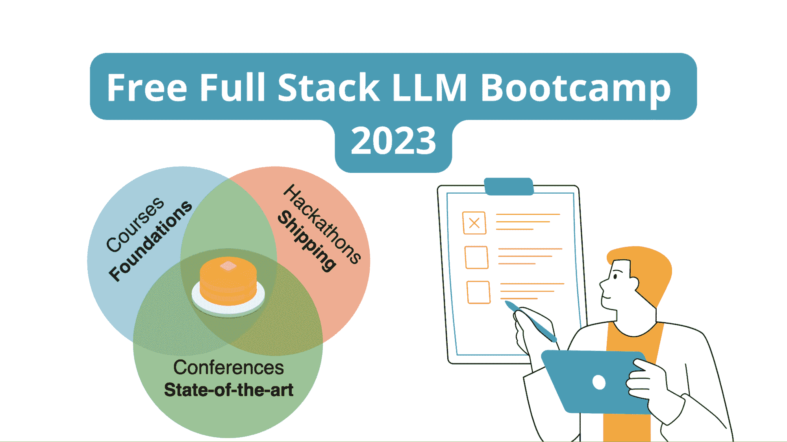
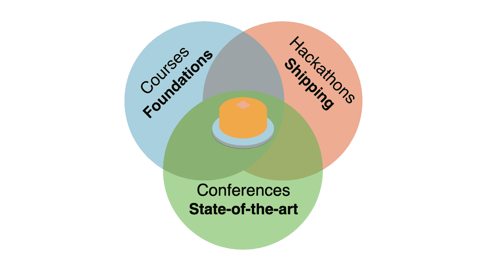

# 免费全栈 LLM 训练营

> 原文：[`www.kdnuggets.com/2023/06/free-full-stack-llm-bootcamp.html`](https://www.kdnuggets.com/2023/06/free-full-stack-llm-bootcamp.html)

图片由作者提供

大型语言模型（LLMs）及其应用正是当前的热门话题！无论你是想将它们用于个人项目、在工作中提高生产力，还是快速总结搜索结果和研究论文——LLMs 为每个人提供了*一些*东西。

* * *

## 我们的前三大课程推荐

 1\. [谷歌网络安全证书](https://www.kdnuggets.com/google-cybersecurity) - 快速进入网络安全职业生涯。

 2\. [谷歌数据分析专业证书](https://www.kdnuggets.com/google-data-analytics) - 提升你的数据分析技能

 3\. [谷歌 IT 支持专业证书](https://www.kdnuggets.com/google-itsupport) - 支持你的组织进行 IT 工作

* * *

这很棒！但是，如果你想更好地使用 LLMs，超越仅仅*使用*这些应用程序，开始构建自己的应用，那么来自全栈团队的免费**LLM 训练营**适合你。

从有效使用 LLMs 的提示工程到构建自己的应用程序和设计 LLM 应用的最佳用户界面，本次训练营涵盖了所有内容。让我们了解更多关于训练营提供的内容。

# 什么是全栈 LLM 训练营？

[全栈 LLM 训练营](https://fullstackdeeplearning.com/llm-bootcamp/)最初作为 2023 年 4 月在旧金山的现场活动进行授课。现在，训练营的所有材料——讲座、幻灯片、项目源代码——都可以免费获取。

LLM 训练营 | [图片来源](https://fullstackdeeplearning.com/llm-bootcamp/)

LLM 训练营旨在提供全面的学习方法。它涵盖了提示工程技术、LLM 基础知识，以及构建和发布 LLM 应用程序到生产环境。

本次训练营由以下讲师授课：查尔斯·弗莱、乔希·托宾和谢尔盖·卡拉耶夫——他们都是加州大学伯克利分校的校友。他们的目标是让每个人掌握 LLM 的最新进展：

> “我们的目标是使你 100%跟上最新的技术，并准备好构建和部署 LLM 应用程序，无论你对机器学习的经验如何。” – 全栈团队

# 更深入了解全栈 LLM 训练营

现在我们知道 LLM 训练营的内容了，让我们*深入探讨*课程内容。

## 先决条件

尽管没有强制性的先决条件——除了对学习 LLMs 的真正兴趣，相关的编程经验可以使你的学习过程更为顺畅。以下是一些这样的先决条件：

+   具有 Python 编程经验

+   了解机器学习、前端或后端开发将会有所帮助

## 学习拼写：提示工程

为了让语言模型产生理想的结果，提高提示的能力非常重要。

*学习拼写：提示工程*模块涵盖了以下内容：

+   对 LLM 输出进行概率思考

+   在预训练模型如 GPT-3 和 LLaMa、指令调整模型如 ChatGPT 以及模拟角色的代理中提示的基础知识

+   提示工程技巧和最佳实践，如分解、整合不同 LLM 的输出、使用随机性等

## LLMOps

即使是简单的机器学习应用，构建模型也只是冰山一角。真正的挑战在于将模型部署到生产环境，并持续监控和维护其性能。

*LLMOps*模块涵盖了：

+   通过考虑速度、成本、自定义能力以及开源和限制性许可证的可用性，为你的应用选择最佳 LLM

+   通过将提示跟踪整合到工作流程中（使用 Git 或其他版本控制系统）来更好地管理提示

+   测试 LLM

+   在 LLM 应用中实施测试驱动开发（TDD）的挑战

+   LLM 的评估指标

+   监控性能指标、收集用户反馈并进行必要的更新

## 语言用户界面 UX

除了考虑基础设施和模型选择，应用的成功还依赖于用户体验。

*语言用户界面 UX*模块涵盖：

+   人本和同理设计的设计原则及产品接口

+   考虑如自动补全、低延迟等便利因素

+   案例研究以深入探讨有效的方法（以及无效的方法）

+   UX 研究的重要性

## 增强型语言模型

增强型语言模型是所有 LLM 驱动应用的核心。我们通常需要语言模型具备更好的推理能力，能够处理自定义数据集，并使用最新信息来回答查询。

*增强型语言模型*模块涵盖了以下概念：

+   AI 驱动的信息检索

+   嵌入的全部内容

+   将 LLM 调用链式连接到多个语言模型

+   有效使用 LangChain 等工具

## 一小时内启动 LLM 应用

本模块教你如何快速构建 LLM 应用，包括：

+   进行原型制作、迭代和部署的过程，以构建 MVP 应用

+   使用不同的技术栈构建有用的产品：从 OpenAI 的语言模型到利用无服务器基础设施

## LLM 基础

如果你有兴趣了解大型语言模型的基础及多年来的突破，*LLM 基础*模块将帮助你理解以下内容：

+   机器学习基础

+   Transformers 和注意力机制

+   重要的 LLM，如 GPT-3 系列和 LLaMA 的重要突破元素

## 项目演示：askFSDL

该训练营还专门设置了一个部分，带你逐步了解项目[askFSDL](https://github.com/the-full-stack/ask-fsdl)，这是一个基于 Full Stack Deep Learning 课程语料库构建的 LLM 驱动应用程序。

该团队的[全栈深度学习课程](https://fullstackdeeplearning.com/course/)是学习最佳实践以构建和部署深度学习模型的另一个优秀资源。

从数据收集和清理、ETL 和数据处理步骤，到构建前端和后端、部署和设置模型监控——这是一个完整的项目，你可以尝试复制并在过程中学到很多东西。

这是项目所使用的（不完全）概述：

+   OpenAI 的 LLM

+   使用 MongoDB 存储清理后的文档语料库

+   [FAISS 索引](https://engineering.fb.com/2017/03/29/data-infrastructure/faiss-a-library-for-efficient-similarity-search/)以更快地搜索语料库

+   [LangChain](https://python.langchain.com/en/latest/index.html)用于链式调用 LLM 和管理提示

+   在[Modal](https://modal.com/)上托管应用程序的后台

+   使用 Gantry 进行模型监控

# 总结

希望你对通过 LLM 训练营学习更多关于 LLM 的内容感到兴奋。祝学习愉快！

你还可以通过加入[这个 Discord 服务器](https://fsdl.me/join-discord)与其他学习者和社区成员互动。这里有来自行业专家（如 OpenAI 和 Repl.it）的邀请讲座，以及 LLM 领域工具的创造者。这些讲座也将很快上传到训练营的网站。

想了解更多关于 LLM 的课程吗？这里有一个 LLM 顶级免费课程列表。

**[Bala Priya C](https://www.linkedin.com/in/bala-priya/)** 是来自印度的开发者和技术作家。她喜欢在数学、编程、数据科学和内容创作的交叉点上工作。她的兴趣和专业领域包括 DevOps、数据科学和自然语言处理。她喜欢阅读、写作、编码和喝咖啡！目前，她正在通过撰写教程、操作指南、意见文章等来学习和分享知识。

### 更多相关主题

+   [全栈一切？数据科学、开发和技术之间的组织交集](https://www.kdnuggets.com/2022/08/full-stack-everything-organizational-intersections-data-science-dev-tech.html)

+   [Web LLM：将 LLM 聊天机器人带到浏览器](https://www.kdnuggets.com/2023/05/webllm-bring-llm-chatbots-browser.html)

+   [初学者免费数据分析师训练营](https://www.kdnuggets.com/free-data-analyst-bootcamp-for-beginners)

+   [将机器学习算法完整部署到…](https://www.kdnuggets.com/2021/12/deployment-machine-learning-algorithm-live-production-environment.html)

+   [弹性 ML 堆栈是模块化的](https://www.kdnuggets.com/2022/06/comet-resilient-ml-stack-modular.html)

+   [本周人工智能动态，8 月 7 日：生成式 AI 进入 Jupyter & Stack…](https://www.kdnuggets.com/2023/mm/this-week-ai-2023-08-07.html)
