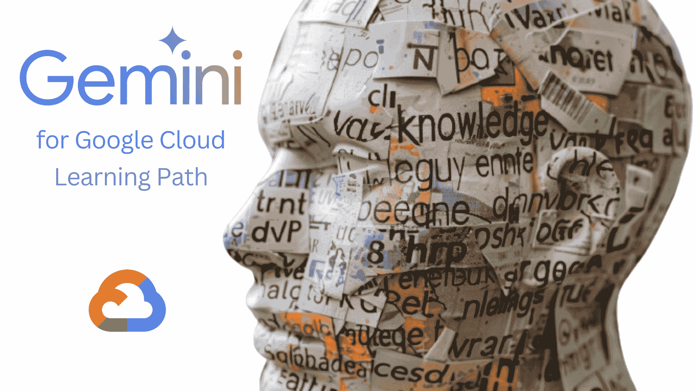
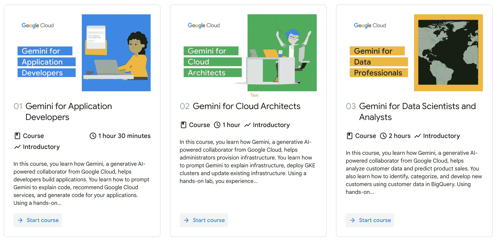
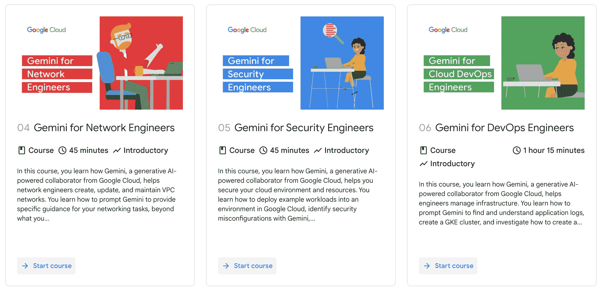
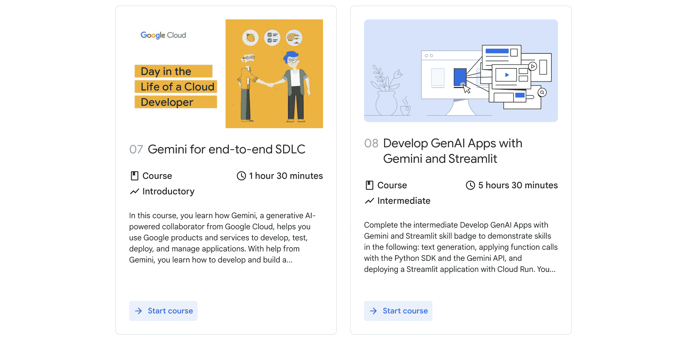

# 免费 Google Cloud Gemini 学习路径

> 原文：[`www.kdnuggets.com/free-google-cloud-learning-path-for-gemini`](https://www.kdnuggets.com/free-google-cloud-learning-path-for-gemini)

图片由作者创建

## Gemini 简介

* * *

## 我们的前三个课程推荐

 1\. [Google 网络安全证书](https://www.kdnuggets.com/google-cybersecurity) - 快速开启网络安全职业之路。

 2\. [Google 数据分析专业证书](https://www.kdnuggets.com/google-data-analytics) - 提升你的数据分析能力

 3\. [Google IT 支持专业证书](https://www.kdnuggets.com/google-itsupport) - 支持你的组织的 IT

* * *

现在是语言模型的时代，[Gemini](https://blog.google/technology/ai/google-gemini-ai/)是谷歌迄今为止最新和最强大的模型。

> Gemini 是谷歌各团队的大规模协作成果，包括谷歌研究部门的同事。它从头开始构建，具备多模态功能，这意味着它能够泛化并无缝理解、操作并结合不同类型的信息，包括文本、代码、音频、图像和视频。

如果你对了解 Gemini、语言模型以及如何利用它们感兴趣，谷歌推出了一条新的中级语言模型学习路径——[Google Cloud Gemini 学习路径](https://www.cloudskillsboost.google/paths/236)。请查看下方的学习路径信息。

## 学习路径

Google Cloud Gemini 学习路径展示了 Gemini 如何为多种不同角色提供助力。凭借其对话自然语言聊天界面，Gemini 可以快速处理与云相关的问题或提供最佳实践建议。它通过在你输入时提供代码补全或代码生成，或偶尔根据所做评论来帮助编码任务。这条学习路径可以促进开发者、数据分析师、云工程师、架构师和安全工程师等各种角色的工作。

在第一门课程中，Gemini for Application Developers，学习 Gemini 如何帮助你构建应用程序。了解所有关于提示、解释代码，甚至生成代码的内容。

在第二门课程中，Gemini for Cloud Architects，了解 Gemini 如何帮助配置基础设施。查看 Gemini 如何解释基础设施、更新基础设施，并部署 Google Kubernetes Engine 集群。该课程使用实践实验室来帮助巩固学习。

第三门课程**“面向数据科学家和分析师的 Gemini”**，探讨如何利用 Gemini 分析数据和进行预测。重点关注客户数据，学习如何在 Google BigQuery 的帮助下识别、分类和开发新客户。

下一门课程**“面向网络工程师的 Gemini”**，演示 Gemini 如何帮助网络工程师创建和管理虚拟私有云网络。学习提示策略，让 Gemini 协助你的网络任务。

第五门课程名为**“安全工程师的 Gemini”**，旨在展示如何将 Gemini 作为协作者来保护你的云环境和资源。你将看到 Gemini 如何帮助将示例工作负载部署到 Google Cloud 环境中，并识别安全配置错误。

第六门课程**“面向 DevOps 工程师的 Gemini”**，介绍 Gemini 如何帮助工程师管理基础设施。使用 Gemini 了解和管理应用日志，创建 Google Kubernetes Engine 集群等。

第七门课程**“面向端到端 SDLC 的 Gemini”**，展示如何与其他 Google 产品和服务一起使用 Gemini，从创建到部署，开发、测试、部署和管理自己的应用程序。

在学习路径的最后一门课程**“使用 Gemini 和 Streamlit 开发 GenAI 应用程序”**中，学习有关文本生成、使用函数调用以及创建和部署带有 Cloud Run 的 Streamlit 应用程序的全部内容。

## 总结

了解如何利用 Gemini 执行 Google Cloud 最新学习路径中的各种工程任务，查看 [Google Cloud 的 Gemini 学习路径](https://www.cloudskillsboost.google/paths/236) 的详细信息，看看这是否能对你的职业生涯有所帮助。

****[马修·梅奥](https://www.kdnuggets.com/wp-content/uploads/./profile-pic.jpg)**** ([**@mattmayo13**](https://twitter.com/mattmayo13)) 拥有计算机科学硕士学位和数据挖掘研究生文凭。作为 [KDnuggets](https://www.kdnuggets.com/) 和 [Statology](https://www.statology.org/) 的主编，以及 [Machine Learning Mastery](https://machinelearningmastery.com/) 的贡献编辑，马修致力于使复杂的数据科学概念易于理解。他的职业兴趣包括自然语言处理、语言模型、机器学习算法和探索新兴 AI。他的使命是让数据科学社区的知识民主化。马修从 6 岁开始编程。

### 更多相关内容

+   [谷歌免费提供：生成 AI 学习路径](https://www.kdnuggets.com/2023/07/free-google-generative-ai-learning-path.html)

+   [ChatGPT 的新对手：Google 的 Gemini](https://www.kdnuggets.com/chatgpts-new-rival-googles-gemini)

+   [如何免费访问和使用 Gemini API](https://www.kdnuggets.com/how-to-access-and-use-gemini-api-for-free)

+   [迁移到 AWS 云的 11 个最佳实践](https://www.kdnuggets.com/2023/04/11-best-practices-cloud-data-migration-aws-cloud.html)

+   [开始使用摧毁了 GPT-4 和 Gemini 的 Claude 3 Opus](https://www.kdnuggets.com/getting-started-with-claude-3-opus-that-just-destroyed-gpt-4-and-gemini)

+   [5 个步骤开始使用 Google Cloud Platform](https://www.kdnuggets.com/5-steps-google-cloud-platform)
