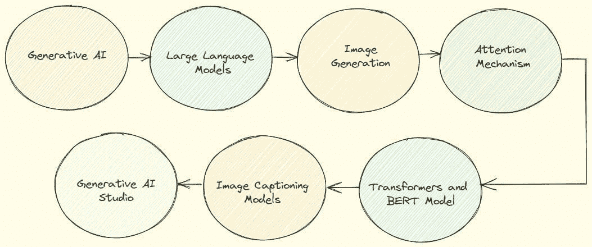

# 来自谷歌的免费：生成式 AI 学习路径

> 原文：[`www.kdnuggets.com/2023/07/free-google-generative-ai-learning-path.html`](https://www.kdnuggets.com/2023/07/free-google-generative-ai-learning-path.html)

作者插图

你是否有兴趣了解生成式 AI 模型及其应用的潜力？幸运的是，谷歌云发布了生成式 AI 学习路径，这是一个很棒的免费课程集合，涵盖了从解释生成式 AI 的基本概念到更复杂的工具，比如生成式 AI 工作室，以构建自定义生成式 AI 模型。

* * *

## 我们的前三名课程推荐

 1\. [谷歌网络安全证书](https://www.kdnuggets.com/google-cybersecurity) - 快速进入网络安全职业之路。

 2\. [谷歌数据分析专业证书](https://www.kdnuggets.com/google-data-analytics) - 提升你的数据分析技能

 3\. [谷歌 IT 支持专业证书](https://www.kdnuggets.com/google-itsupport) - 支持你的组织 IT

* * *

本文将探讨七门现有课程，让你了解我们每天接触的大型语言模型背后的概念，并创建新的 AI 解决方案。让我们开始吧！

# 1\. 生成式 AI 简介

课程链接：[生成式 AI 简介](https://www.cloudskillsboost.google/course_templates/536)

这第一门课程是由谷歌云的 AI 技术课程开发者 Dr. Gwendolyn Stripling 主讲的生成式 AI 入门课程。它将帮助你了解生成式 AI 是什么以及它的应用。课程从数据科学的基本概念（AI、机器学习、深度学习）开始，并介绍生成式 AI 与这些学科的不同之处。此外，它通过非常直观的插图解释了围绕生成式 AI 的关键概念，如变换器、幻觉和大型语言模型。

**视频时长：** 22 分钟

**讲师：** Gwendolyn Stripling

**推荐阅读：**

+   [问专家：什么是生成式 AI？](https://blog.google/inside-google/googlers/ask-a-techspert/what-is-generative-ai/)

+   [使用 Gen App Builder 构建新的生成式 AI 驱动的搜索和对话体验](https://cloud.google.com/blog/products/ai-machine-learning/create-generative-apps-in-minutes-with-gen-app-builder)

+   [生成式 AI 对企业的影响](https://www2.deloitte.com/us/en/pages/consulting/articles/generative-artificial-intelligence.html)

# 2\. 大型语言模型简介

课程链接：[大型语言模型简介](https://www.cloudskillsboost.google/course_templates/539)

第二个课程旨在从高层次介绍语言模型是什么。特别是，它给出了 LLM 应用的例子，如文本分类、问题回答和文档摘要。最后，它展示了 Google 生成 AI 开发工具的潜力，可以在无需代码的情况下构建你的应用程序。

**视频时长：** 15 分钟

**讲师：** John Ewald

**建议阅读：**

+   [NLP 的 ImageNet 时刻已到](https://thegradient.pub/nlp-imagenet/)

+   [Google Cloud 通过大型语言模型强化 NLP](https://cloud.google.com/blog/products/ai-machine-learning/google-cloud-supercharges-nlp-with-large-language-models)

+   [LaMDA: 我们突破性的对话技术](https://blog.google/technology/ai/lamda/)

# 3\. 图像生成简介

课程链接：[图像生成简介](https://www.cloudskillsboost.google/course_templates/541)

第三个课程专注于解释最重要的扩散模型，这是一类生成图像的模型。最有前途的一些方法包括变分自编码器、生成对抗模型和自回归模型。

它还展示了可以分为两种类型的使用案例：无条件生成和有条件生成。前者包括人脸合成和超分辨率作为应用，而有条件生成的例子包括从文本提示生成图像、图像修复和文本引导的图像到图像。

**视频时长：** 9 分钟

**讲师：** Kyle Steckler

# 4\. 注意力机制

课程链接：[注意力机制](https://www.cloudskillsboost.google/course_templates/537)

在这个简短的课程中，你将深入了解注意力机制，这是变换器和大型语言模型背后的一个非常重要的概念。它使得诸如机器翻译、文本摘要和问题回答等任务得以改进。特别是，它展示了注意力机制如何在解决机器翻译时发挥作用。

**视频时长：** 5 分钟

**讲师：** Sanjana Reddy

# 5\. 变换器模型和 BERT 模型

课程链接：[变换器模型和 BERT 模型](https://www.cloudskillsboost.google/course_templates/538)

该课程涵盖了变换器架构，这是 BERT 模型背后的基本概念。在解释了变换器之后，它概述了 BERT 以及如何应用于解决不同任务，如单句分类和问题回答。

与之前的课程不同，这个理论课程配有一个实验室，需要具备 Python 和 TensorFlow 的基础知识。

**视频时长：** 22 分钟

**讲师：** Sanjana Reddy

**建议阅读：**

+   [注意力机制即一切](https://arxiv.org/abs/1706.03762)

+   [变换器：一种新型的语言理解神经网络架构](https://ai.googleblog.com/2017/08/transformer-novel-neural-network.html)

# 6\. 创建图像字幕生成模型

课程链接：[创建图像字幕模型](https://www.cloudskillsboost.google/course_templates/542)

本课程旨在讲解图像字幕模型，这些生成模型通过输入图像来生成文本字幕。它利用编码器-解码器结构、注意力机制和变换器来解决为给定图像预测字幕的任务。与之前的课程一样，本课程也包括一个实验室，以将理论付诸实践。它同样面向具有 Python 和 Tensorflow 先验知识的数据专业人士。

**视频时长：** 29 分钟

**讲师：** Takumi Ohyama

# 7\. 生成式 AI 工作室简介

课程链接：[生成式 AI 工作室简介](https://www.cloudskillsboost.google/course_templates/552)

这门课程介绍并探索生成式 AI 工作室。它首先重新解释什么是生成式 AI 及其用例，如代码生成、信息提取和虚拟助手。在概述这些核心概念后，Google Cloud 展示了即使没有 AI 背景也能解决生成式 AI 任务的工具。其中之一是 Vertex AI，这是一个管理机器学习生命周期的平台，从模型构建到部署。这个端到端平台包括两个产品：生成式 AI 工作室和模型花园。课程主要集中在解释生成式 AI 工作室，它允许轻松构建无需代码或少量代码的生成模型。

视频时长：15 分钟

**推荐阅读：**

+   [生成式 AI 工作室](https://cloud.google.com/generative-ai-studio)

+   [文本提示设计概述](https://cloud.google.com/vertex-ai/docs/generative-ai/text/text-overview)

+   [实验室：开始使用生成式 AI 工作室](https://www.cloudskillsboost.google/focuses/63564?parent=catalog)

# 最后的思考

希望你觉得这次对 Google Cloud 提供的生成式 AI 课程的快速概述有所帮助。如果你不知道从哪里开始理解生成式 AI 的核心概念，这条学习路径涵盖了各个方面。如果你已有机器学习背景，肯定能从这些课程中发现模型和用例。你知道其他关于生成式 AI 的免费课程吗？如果有有见地的建议，请在评论中分享。

**[尤金妮亚·安内洛](https://www.linkedin.com/in/eugenia-anello/)** 目前是意大利帕多瓦大学信息工程系的研究员。她的研究项目集中在结合异常检测的持续学习上。

### 更多主题

+   [Gemini 的免费 Google Cloud 学习路径](https://www.kdnuggets.com/free-google-cloud-learning-path-for-gemini)

+   [Google 的免费生成式 AI 课程](https://www.kdnuggets.com/2023/07/free-generative-ai-courses-google.html)

+   [谷歌通过在 Docs 和 Gmail 中添加生成性 AI 回应 ChatGPT](https://www.kdnuggets.com/2023/03/google-answer-chatgpt-adding-generative-ai-docs-gmail.html)

+   [作为数据科学家，你的职业路径可以期待什么](https://www.kdnuggets.com/2022/01/expect-career-path-data-scientist.html)

+   [数据科学面试中的 21 个必备备忘单：解锁…](https://www.kdnuggets.com/2022/06/21-cheat-sheets-data-science-interviews.html)

+   [从数据分析师到数据战略师：影响力职业路径](https://www.kdnuggets.com/2023/05/data-analyst-data-strategist-career-path-making-impact.html)
