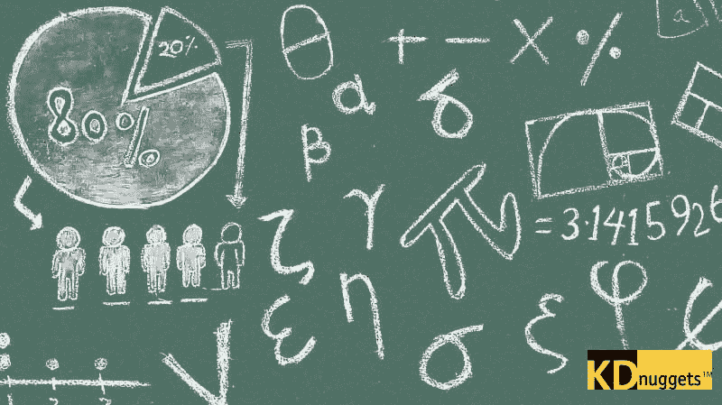

# 数据科学与机器学习的免费数学课程

> 原文：[`www.kdnuggets.com/2020/02/free-mathematics-courses-data-science-machine-learning.html`](https://www.kdnuggets.com/2020/02/free-mathematics-courses-data-science-machine-learning.html)

评论

你是否有兴趣学习成功数据科学职业的基础知识？或者你是否希望复习数学知识，或者通过扩展基础来加深理解？

这是一个数学课程的精选合集，包括各种课程和专业化内容，这些内容都可以在网上免费获得，帮助你实现数据科学数学目标。它们被分为数学基础、代数、微积分、统计学与概率论，以及那些与数据科学和机器学习特别相关的主题。

* * *

## 我们的前三个课程推荐

 1\. [谷歌网络安全证书](https://www.kdnuggets.com/google-cybersecurity) - 快速进入网络安全职业轨道。

 2\. [谷歌数据分析专业证书](https://www.kdnuggets.com/google-data-analytics) - 提升你的数据分析技能

 3\. [谷歌 IT 支持专业证书](https://www.kdnuggets.com/google-itsupport) - 支持你所在组织的 IT 工作

* * *

查看一下列表，并仔细检查那些可能对你感兴趣的课程。希望你能找到有用的东西。

原图来自 [Chuk Yong](https://pixabay.com/users/Pixapopz-2873171/?utm_source=link-attribution&utm_medium=referral&utm_campaign=image&utm_content=1500720) [Pixabay](https://pixabay.com/?utm_source=link-attribution&utm_medium=referral&utm_campaign=image&utm_content=1500720)

**数学基础**

这些课程旨在帮助打下学习更高级数学的基础，同时促进数学思维的发展。课程描述直接来自各自的课程网站。

+   **[逻辑导论，斯坦福大学](https://www.coursera.org/learn/logic-introduction)**（课程）

    这门课程从计算的角度介绍了逻辑学。它展示了如何以逻辑句子的形式编码信息；如何用这种形式的信息进行推理；并提供了逻辑技术及其在数学、科学、工程、商业、法律等领域应用的概述。

+   **[数学思维导论，斯坦福大学](https://www.coursera.org/learn/mathematical-thinking)**（课程）

    职业数学家以某种方式解决实际问题，这些问题可能来自日常世界、科学或数学本身。学校数学成功的关键是学会在框框内思考。相反，数学思维的一个关键特征是跳出框框思考——这是今天世界中宝贵的能力。本课程有助于培养这种至关重要的思维方式。

+   **[高中数学，麻省理工学院](https://ocw.mit.edu/high-school/mathematics/)**（课程集合）

    在本节中，我们提供了来自麻省理工学院的数学课程和资源集合。有些是用于教授麻省理工学院本科生的材料，而其他则专门为高中生设计。

**代数**

这些代数课程涵盖了从入门代数到线性模型和矩阵代数的范围。代数在计算和数据科学中很有帮助，并包含一些在推动某些机器学习算法（包括神经网络）中的主要概念。描述直接来源于各自课程的网站。

+   **[代数 I，可汗学院](https://www.khanacademy.org/math/algebra)**（课程）

    课程涵盖代数基础、解方程和不等式、单位操作、线性方程和图形、线性方程的形式、方程组、不等式（系统与图形）、函数、序列、绝对值和分段函数、指数和根、指数增长与衰减、二次方程（乘法与因式分解）、二次函数和方程、无理数。

+   **[代数 II，可汗学院](https://www.khanacademy.org/math/algebra2)**（课程）

    课程涵盖多项式算术、复数、多项式因式分解、多项式除法、多项式图形、理性指数和根、指数模型、对数、函数变换、方程、三角学、建模、理性函数。

+   **[线性代数，麻省理工学院](https://ocw.mit.edu/courses/mathematics/18-06-linear-algebra-spring-2010/)**（课程）

    这是一个关于矩阵理论和线性代数的基础课程。重点关注在其他学科中有用的主题，包括方程组、向量空间、行列式、特征值、相似性和正定矩阵。

+   **[线性代数 - 基础到前沿，德克萨斯大学奥斯汀分校](https://www.edx.org/course/linear-algebra-foundations-to-frontiers)**（课程）

    通过短视频、练习、可视化和编程作业，你将学习向量和矩阵运算、线性变换、解方程组、向量空间、线性最小二乘法以及特征值和特征向量。此外，你还将瞥见线性代数库开发的前沿研究，这些库在计算科学中广泛使用。

+   **[线性模型与矩阵代数入门，哈佛大学](https://www.edx.org/course/introduction-to-linear-models-and-matrix-algebra)**（课程）

    在这门数据分析的入门在线课程中，我们将使用矩阵代数来表示常用来模拟实验单位之间差异的线性模型。我们对这些差异进行统计推断。在整个课程中，我们将使用 R 编程语言来执行矩阵操作。

**微积分**

这些微积分课程涵盖了从预备微积分到微分、积分，再到多变量微积分和微分方程的主题。微积分有广泛的应用，一般来说，它包含了驱动神经网络工作的核心概念。描述直接来自各自的课程网站。

+   **[预备微积分，Khan Academy](https://www.khanacademy.org/math/precalculus)**（课程）

    课程涵盖了复数、多项式、复合函数、三角学、向量、矩阵、级数、圆锥曲线、概率和组合数学。

+   **[微积分 1，Khan Academy](https://www.khanacademy.org/math/calculus-1)**（课程）

    课程涵盖了极限与连续性、导数：定义和基本规则、导数：链式法则和其他高级主题、导数的应用、函数分析、积分、微分方程、积分的应用。

+   **[微积分 2，Khan Academy](https://www.khanacademy.org/math/calculus-2)**（课程）

    课程涵盖积分复习、积分技巧、微分方程、积分的应用、参数方程、极坐标和向量值函数、级数。

+   **[多变量微积分，Khan Academy](https://www.khanacademy.org/math/multivariable-calculus)**（课程）

    课程涵盖了多变量函数的思考、多变量函数的导数、多变量导数的应用、多变量函数的积分、格林定理、斯托克斯定理和散度定理。

+   **[微分方程，Khan Academy](https://www.khanacademy.org/math/differential-equations)**（课程）

    课程涵盖了一阶微分方程、二阶微分方程、拉普拉斯变换。

+   **[微积分入门，悉尼大学](https://www.coursera.org/learn/introduction-to-calculus)**（课程）

    《微积分入门》课程的重点和主题涉及数学在科学、工程和商业应用中的最重要基础。课程强调微积分的关键概念和历史动机，同时在理论和应用之间取得平衡，从而掌握基础数学中的关键阈值概念。

**统计与概率**

统计学和概率是数据科学的基础，比任何其他数学概念家族都重要。这些课程将帮助你从统计的角度和批判性的概率视角来观察数据。描述直接来自各自的课程网站。

+   **[统计学与概率，汗学院](https://www.khanacademy.org/math/statistics-probability)**（课程）

    课程涵盖分析分类数据、显示和比较定量数据、总结定量数据、建模数据分布、探索双变量数值数据、研究设计、概率、计数、排列与组合、随机变量、抽样分布、置信区间、显著性测试、两样本推断组间差异、分类数据推断、高级回归、方差分析

+   **[统计学基础，麻省理工学院](https://www.edx.org/course/fundamentals-of-statistics)**（课程）

    统计学是将数据转化为洞见和**最终**决策的科学。机器学习、数据科学和人工智能的最新进展背后是基本的统计原则。本课程的目的是在坚实的数学基础上发展和理解这些核心理念，从构造估计量和测试开始，以及对其渐近表现的分析。

+   **[数据科学：概率，哈佛大学](https://www.edx.org/course/data-science-probability)**（课程）

    我们将介绍重要概念，如随机变量、独立性、蒙特卡罗模拟、期望值、标准误差和中心极限定理。这些统计学概念是进行数据统计测试的基础，有助于理解你所分析的数据是否由于实验方法或偶然性发生。

+   **[概率 - 不确定性与数据科学，麻省理工学院](https://www.edx.org/course/probability-the-science-of-uncertainty-and-data)**（课程）

    课程涵盖所有基本概率概念，包括：多个离散或连续随机变量、期望值和条件分布、大数法则、贝叶斯推断方法的主要工具、随机过程简介（泊松过程和马尔可夫链）

+   **[提升你的统计推断能力，埃因霍温理工大学](https://www.coursera.org/learn/statistical-inferences)**（课程）

    首先，我们将讨论如何正确解读 p 值、效应量、置信区间、贝叶斯因子和似然比，以及这些统计数据如何回答你可能感兴趣的不同问题。然后，你将学习如何设计实验以控制假阳性率，以及如何确定研究的样本量，例如为了实现高统计效能。随后，你将学习如何在科学文献中解读证据，考虑到广泛存在的发表偏倚，例如通过学习 p 曲线分析。最后，我们将讨论如何进行科学哲学、理论构建和累积科学，包括如何进行重复性研究，为什么以及如何预注册你的实验，以及如何按照开放科学原则分享你的结果。

+   **[概率与数据介绍，杜克大学](https://www.coursera.org/learn/probability-intro)**（课程）

    本课程介绍了数据采样与探索的基本知识，以及基本的概率理论和贝叶斯规则。你将研究各种采样方法，并讨论这些方法如何影响推断的范围。课程将涵盖多种探索性数据分析技术，包括数值汇总统计和基本数据可视化。你将被指导安装和使用 R 及 RStudio（免费的统计软件），并将使用这些软件进行实验练习和最终项目。本课程中的概念和技术将作为专业课程中推断和建模课程的基础。

+   **[概率论与数理统计，宾州州立大学](https://online.stat.psu.edu/stat414/)**（课程）

    相关课程的教材涵盖了概率介绍、离散分布、连续分布、双变量分布、随机变量函数的分布、估计、假设检验、非参数方法、贝叶斯方法等内容。

**数据科学与机器学习的数学基础**

这些是与数据科学和机器学习直接相关的数学主题。它们可能包括上述课程的内容，也可能比上述内容更基础。然而，它们对于复习你可能已经有一段时间未学过的内容尤其有用，特别是对数据科学实践具有重要意义。描述直接来源于各自课程的网站。

+   **[数据科学数学技能，杜克大学](https://www.coursera.org/learn/datasciencemathskills)**（课程）

    数据科学课程包含数学——这是无法避免的！本课程旨在教授学员在几乎所有数据科学数学课程中成功所需的基本数学知识，并专为具有基础数学技能但可能没有学习代数或预备微积分的学员设计。《数据科学数学技能》介绍了数据科学所依赖的核心数学，没有额外的复杂性，一次介绍一个陌生的概念和数学符号。

+   **[机器学习的基础数学：Python 版，微软](https://www.edx.org/course/essential-math-for-machine-learning-python-editi-2)**（课程）

    本课程不是完整的数学课程；它并不是为了替代学校或大学的数学教育。相反，它专注于你在机器学习学习中会遇到的关键数学概念。它旨在填补学生在正规教育中错过的这些关键概念的空白，或者在长时间未学习数学后需要刷新记忆的学生。

+   **[机器学习的数学，帝国理工学院](https://www.coursera.org/specializations/mathematics-machine-learning)**（专业化）

    对于许多高级机器学习和数据科学课程，你会发现需要重新温习数学基础——这些是你可能在学校或大学学习过的内容，但以不同的上下文或不太直观的方式教授，使你难以将其与计算机科学中的应用联系起来。本专业旨在弥合这一差距，使你掌握基础数学，建立直观理解，并将其与机器学习和数据科学相关联。

**相关：**

+   [15 个数据科学数学 MOOC](https://www.kdnuggets.com/2015/09/15-math-mooc-data-science.html)

+   基于高中知识的机器学习和人工智能简介

+   贝叶斯背后的数学

### 更多相关内容

+   [建立一个坚实的数据团队](https://www.kdnuggets.com/2021/12/build-solid-data-team.html)

+   [使用管道编写干净的 Python 代码](https://www.kdnuggets.com/2021/12/write-clean-python-code-pipes.html)

+   [成为伟大的数据科学家所需的 5 种关键技能](https://www.kdnuggets.com/2021/12/5-key-skills-needed-become-great-data-scientist.html)

+   [每个初学者数据科学家应掌握的 6 种预测模型](https://www.kdnuggets.com/2021/12/6-predictive-models-every-beginner-data-scientist-master.html)

+   [2021 年最佳 ETL 工具](https://www.kdnuggets.com/2021/12/mozart-best-etl-tools-2021.html)

+   [机器学习的数学：免费电子书](https://www.kdnuggets.com/2020/04/mathematics-machine-learning-book.html)
