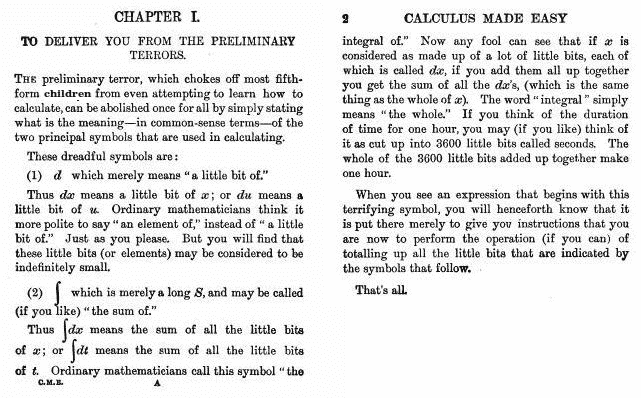
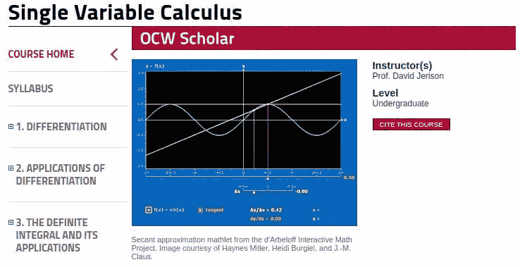
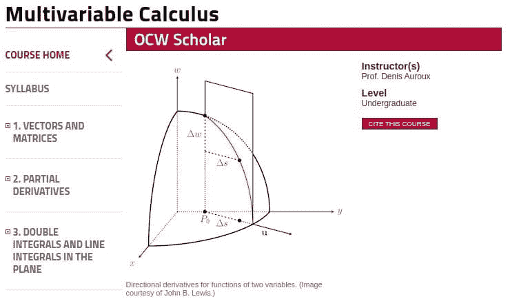
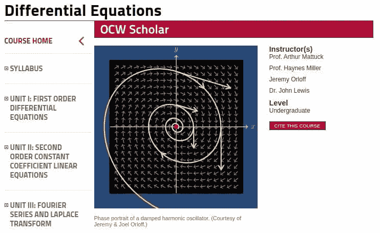
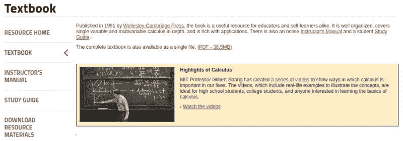

# 免费的 MIT 微积分课程：理解深度学习的关键

> 原文：[`www.kdnuggets.com/2020/07/free-mit-courses-calculus-key-deep-learning.html`](https://www.kdnuggets.com/2020/07/free-mit-courses-calculus-key-deep-learning.html)

数学无疑是机器学习的语言。统计学是机器学习建立的基础。线性代数也是一个核心贡献者。然而，为了全面理解神经网络和深度学习，必须对微积分有一定的知识。

就像生活中的所有事物一样，对微积分的理解有不同的层次，这些层次可以被认为对于理解不同深度的神经网络是足够的。例如，如果你仅仅使用流行的库来实现经过验证的策略来处理非新颖的使用案例，你可能会觉得拥有基本的导数直觉以及了解如何通过反向传播来更新神经元权重是合理的。翻译：你并不需要对微积分有深入的理解就能使用 Keras 的 ResNet 来进行图像分类。

* * *

## 我们的前三个课程推荐

 1\. [谷歌网络安全证书](https://www.kdnuggets.com/google-cybersecurity) - 快速进入网络安全职业生涯。

 2\. [谷歌数据分析专业证书](https://www.kdnuggets.com/google-data-analytics) - 提升你的数据分析技能

 3\. [谷歌 IT 支持专业证书](https://www.kdnuggets.com/google-itsupport) - 支持你的组织的 IT

* * *

作为一个简单但有效的微积分解释的例子，这里是我遇到过的最好的单页微积分介绍，这个总结在几年前本来可以为我省去很多麻烦：

微积分简明版，第 2 版，1914 年，第一章（由文章作者编辑以去除不包容的语言）。

将其与神经网络联系起来可能有些困难，但可以获得微积分的基本直觉。如果你想要更全面地了解这一数学分支，你将需要寻找一些更为全面的学习工具。这里有 3 个课程和一本教科书可以帮助你，全部来自 [MIT 的开放课程](https://ocw.mit.edu/index.htm) 计划，它们将涵盖你理解深度学习所需的所有微积分知识——以及远远超出这些内容。

来自 MIT Open Courseware 课程页面：

> 这个微积分课程涵盖了一元函数的微分和积分，并以对无限级数的简要讨论结束。微积分是许多科学学科的基础，包括物理学、工程学和经济学。

本课程提供了你对异步在线课程资源的所有期望：

> +   **讲座视频**及支持性书面笔记
> +   
> +   **解题视频**，提供解决问题的技巧
> +   
> +   **带详细解答的例题**
> +   
> +   **习题集**及解答
> +   
> +   **考试**及解答
> +   
> +   **互动 Java 小程序**（"Mathlets"），以强化关键概念

更重要的是，这些（以及此处涵盖的其他课程）是[OCW Scholar](https://ocw.mit.edu/courses/ocw-scholar/)课程。这意味着什么？OCW Scholar 课程以提供独立学习所需的完整资源而著称，并且拥有与 MIT 学生在课堂上使用的相同材料。

来自课程的 MIT 开放课程网页：

> 本课程涵盖了多变量函数的微分、积分和矢量微积分。这些数学工具和方法在物理科学、工程、经济学和计算机图形学中被广泛使用。

这也是一门 OCW Scholar 课程，拥有与之前课程相同的完整课程资源类型。

来自课程的 MIT 开放课程网页：

> 自然法则以微分方程的形式表达。科学家和工程师必须知道如何将世界建模为微分方程，如何解这些方程并解释解答。本课程专注于在科学和工程中最有用的方程和技术。

这也是一门 OCW Scholar 课程，具有与前述课程相同的完整材料。

由麻省理工学院的吉尔伯特·斯特朗编写的关于单变量和多变量微积分的完整本科教材。可以作为上述课程的补充，也可以作为独立使用的文本学习资源。

书的目录：

1.  微积分简介

1.  导数

1.  导数的应用

1.  链式法则

1.  积分

1.  指数和对数

1.  积分技巧

1.  积分的应用

1.  极坐标和复数

1.  无限级数

1.  向量和矩阵

1.  曲线上的运动

1.  偏导数

1.  多重积分

1.  矢量微积分

1.  微积分后的数学

这本书的完整 PDF 可以直接访问[这里](http://ocw.mit.edu/ans7870/resources/Strang/Edited/Calculus/Calculus.pdf)。

一系列配套的短视频《微积分亮点》，展示了微积分在我们生活中的重要性，可以在[这里](https://ocw.mit.edu/resources/res-18-005-highlights-of-calculus-spring-2010)找到。

确实，这比理解深度学习所需的微积分要多得多，但一旦开始，你可能不想停下来。

[**马修·梅奥**](https://www.linkedin.com/in/mattmayo13/) ([**@mattmayo13**](https://twitter.com/mattmayo13)) 是一位数据科学家，并且是 KDnuggets 的主编，这是一项开创性的在线数据科学和机器学习资源。他的兴趣包括自然语言处理、算法设计与优化、无监督学习、神经网络以及机器学习的自动化方法。马修拥有计算机科学硕士学位和数据挖掘研究生文凭。他可以通过 editor1 at kdnuggets[dot]com 联系到。

### 了解更多相关话题

+   [5 门免费课程掌握微积分](https://www.kdnuggets.com/2022/10/5-free-courses-master-calculus.html)

+   [微积分：机器学习的隐藏基石](https://www.kdnuggets.com/2022/02/mlm-hidden-building-block-machine-learning.html)

+   [数据科学中的微积分](https://www.kdnuggets.com/2022/07/calculus-data-science.html)

+   [免费 MIT 课程：TinyML 和高效深度学习计算](https://www.kdnuggets.com/free-mit-course-tinyml-and-efficient-deep-learning-computing)

+   [5 门免费 MIT 课程，学习数据科学数学](https://www.kdnuggets.com/5-free-mit-courses-to-learn-math-for-data-science)

+   [8 门免费 MIT 课程，在线学习数据科学](https://www.kdnuggets.com/2022/03/8-free-mit-courses-learn-data-science-online.html)
